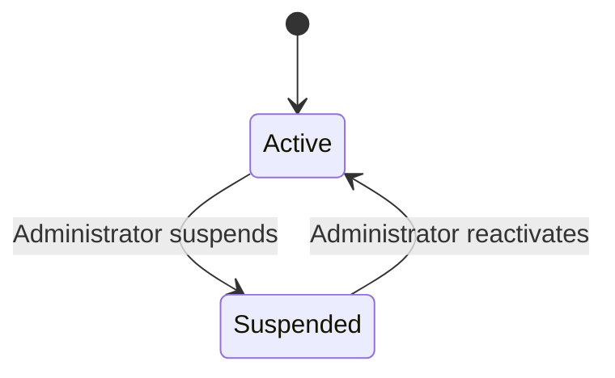
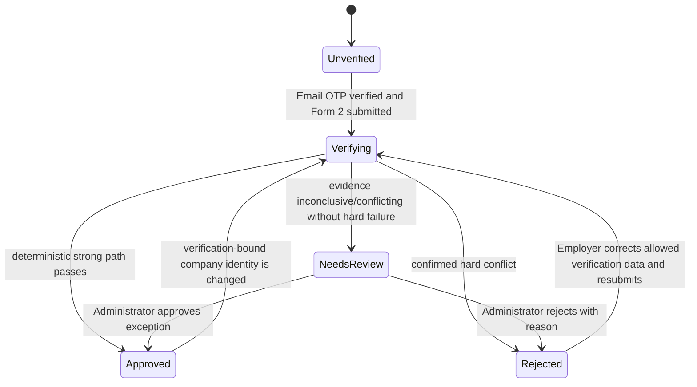
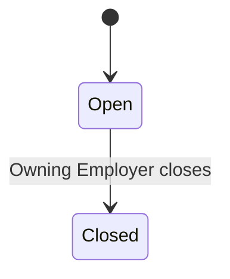
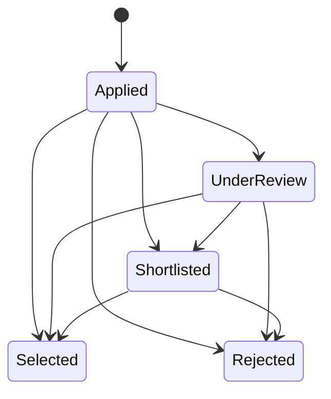
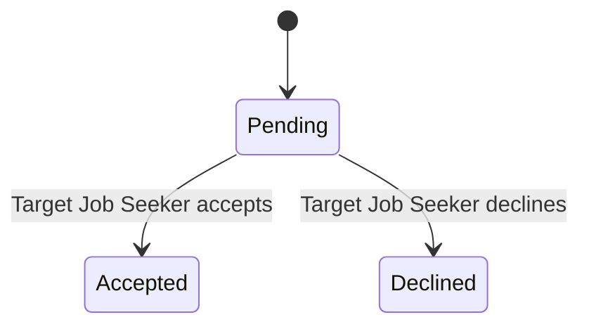
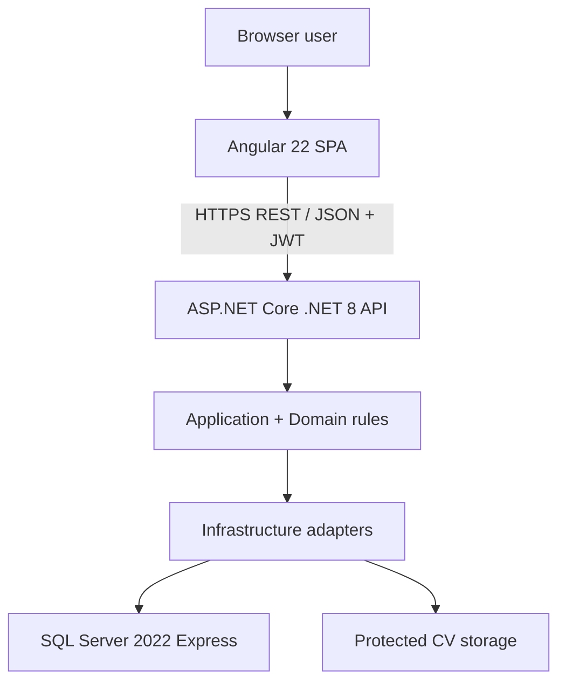
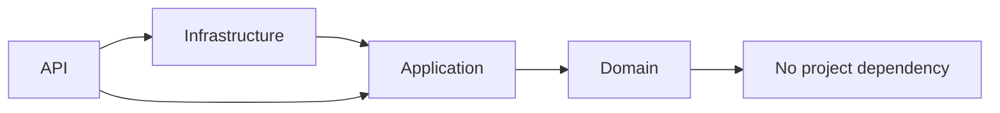
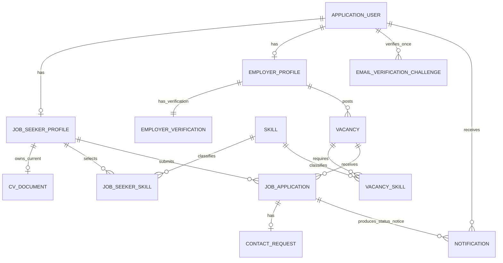
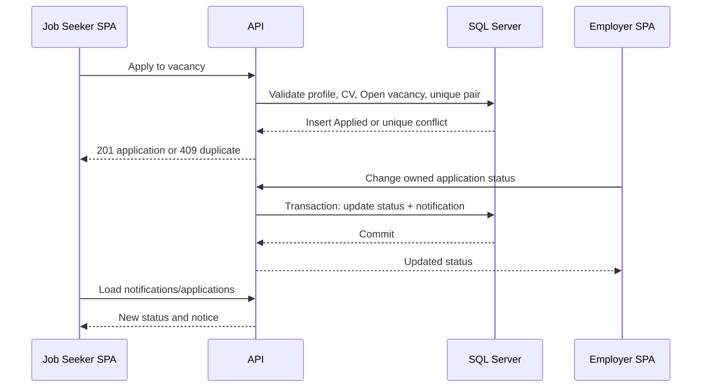
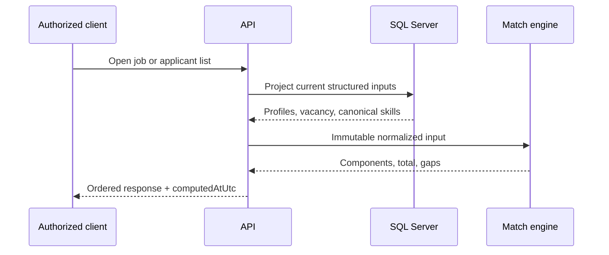

# HireSync - Smart Recruitment Matching Platform

## Canonical Project Second Brain and Engineering Blueprint

**Status: v1.2 FROZEN CANONICAL BASELINE — approved for implementation**

| Document field | Value |
|---|---|
| Project | HireSync - Smart Recruitment Matching Platform |
| Document purpose | Single implementation blueprint from project initialization through final submission and viva |
| Status | v1.2 FROZEN CANONICAL BASELINE — approved for implementation |
| Project start | 29 August 2026 |
| Deadline | 10 September 2026 |
| Demonstration | Localhost |
| Viva | Group viva, approximately 30-40 minutes |
| Final submission | GitHub repository URL required |
| Team | Munshif (Team Leader / Main Coordinator), Vimaltan, Rasadh, Abisegha |
| Authoritative requirement source | `SmartRecruitmentMatchingPlatform-BRD.pdf`, 5 pages |
| Structural reference | Uploaded three-part Second Brain reference image only |
| Last audit state | v1.2 controlled change integration completed 2 September 2026; supervisor-approved ACR-01 incorporated; Section 53 re-audited for the changed auth/Employer-verification boundary; implementation evidence remains separate |

> **Canonical rule:** This frozen Second Brain is the implementation source of truth below the official BRD and approved HireSync decisions. If code, an issue, a pull request, a test, a diagram, or an older document conflicts with it, stop and resolve the conflict using the source-priority rules before continuing.

## Document Map

- [How to use, source labels, and change control](#0-how-to-use-this-document)
- [BRD audit, gaps, and decision registers](#brd-audit-gap-analysis-and-decision-control)
- [Part 1 - Discovery and solution definition](#part-1---discovery-and-solution-definition)
- [Part 2 - Requirements and user experience](#part-2---requirements-and-user-experience-definition)
- [Part 3 - Architecture and engineering](#part-3---solution-architecture-and-engineering)
- [Database and ERD-ready model](#27-database-architecture-and-erd-ready-data-model)
- [REST API blueprint](#28-rest-api-blueprint)
- [Deterministic matching specification](#29-deterministic-matching-engine-specification)
- [Security and protected CV storage](#30-authentication-and-security-architecture)
- [Team/GitHub/CI workflow](#38-four-member-engineering-and-github-workflow)
- [Testing and traceability](#42-testing-and-quality-strategy)
- [Localhost setup](#44-localhost-initialization-setup-and-runbook)
- [Final QA, demo, and viva](#47-final-qa-and-release-readiness-checklist)
- [Limitations, future work, and OPEN DECISIONS](#50-known-limitations)
- [Final consistency audit](#53-final-consistency-audit)

---

## 0. How to Use This Document

### 0.1 Provenance labels

Every important statement is classified using one of the following labels.

| Label | Meaning | Authority |
|---|---|---|
| **[A - BRD]** | Explicitly stated or directly required by the uploaded BRD | Highest |
| **[B - Approved]** | Implementation or business decision explicitly approved in the project prompt | Below BRD |
| **[C - Derived]** | Engineering detail required to implement A or B consistently; not claimed to be in the BRD | Below approved decisions |
| **[D - Future]** | Intentionally excluded from the current implementation | Not a current requirement |
| **[OPEN DECISION]** | A genuine unresolved point that must not be guessed silently | Blocks only the named area |

### 0.2 Source priority

1. Original Smart Recruitment Matching Platform BRD, except only where an explicit supervisor-approved change record names a controlled amendment.
2. `HireSync-Supervisor-Approved-Change-Record-2026-09-02.md` (ACR-01), which amends only the one-time email-OTP and Employer-company-verification boundary described in that record.
3. Approved HireSync technical baseline.
4. The 12 approved business and matching rules dated 29 August 2026 plus the ACR-01 approved rules dated 2 September 2026.
5. Other previously approved HireSync business decisions.
6. Safe, clearly labelled derived engineering decisions in this document.
7. The v1.1/v1.0 Second Brain artifacts as historical implementation context.
8. The forensic audit as a defect checklist, not a requirements authority.
9. The reference Second Brain image as a structure and quality guide only.
10. Future enhancement ideas.

### 0.3 Non-negotiable baseline

- **[A - BRD][B - Approved]** HireSync is a secure web application for Job Seekers, Employers, and Administrators.
- **[B - Approved]** Frontend: Angular 22, TypeScript, Tailwind CSS 4, selective Angular Material, Lucide Angular, Reactive Forms, Signals, and Services.
- **[B - Approved]** Backend: ASP.NET Core Web API on .NET 8 and C# using Pragmatic Clean Architecture.
- **[B - Approved]** Database: SQL Server 2022 Express with Entity Framework Core 8 and SSMS.
- **[B - Approved]** Security: ASP.NET Core Identity, JWT bearer authentication, role authorization, and secure password hashing.
- **[B - Approved]** API: REST/JSON under `/api/v1/...`, documented by OpenAPI and Swagger UI.
- **[B - Approved]** Matching is deterministic and rule based: Skills: 50%, Experience: 25%, Education: 15%, Location: 10%.
- **[B - Approved]** Skills, experience, education, location, rounding, current-data matching, application transitions, contact lifecycle, status-only contact acceptance, JobSeeker-only CV access, and application-status-only notifications follow the approved rules in Section 3.1.
- **[B - Approved]** CV files are uploaded and protected; CV text/metadata never enters matching, and Employers/Administrators have no baseline CV access.
- **[A - BRD][B - Approved]** The Administrator cannot alter match inputs on behalf of users or manually modify match scores/results.
- **[B - Approved]** The baseline must not introduce microservices, CQRS, MediatR, event buses, Kafka, RabbitMQ, OCR, NLP, embeddings, LLM matching, or machine learning.
- **[B - Approved]** All four members must make real, visible contributions. No contribution history, commit, review, or authorship may be fabricated or backdated.
- **[B - Approved][ACR-01]** Employer registration requires one-time email OTP verification before company verification; OTP is not required on later normal logins. The securely seeded Administrator also completes one-time email OTP verification during first activation/sign-in; Job Seeker registration remains unchanged.
- **[B - Approved][ACR-01]** Employer company verification is a separate deterministic workflow with `Unverified`, `Verifying`, `Approved`, `NeedsReview`, and `Rejected` states. Only Approved Employers receive hiring/business privileges; Administrator reviews only `NeedsReview` exceptions.
- **[B - Approved][ACR-01]** Transactional email sending is permitted only for these OTP messages. Recruitment/status/contact email/SMS notifications remain excluded; stored in-app notifications remain `ApplicationStatusChanged` only.

### 0.4 Change control

This frozen canonical file should live at `docs/HireSync-Project-Second-Brain.md` in the monorepo, with the versioned frozen artifact retained as the reviewed freeze record. Every change requires a `docs/*` or relevant feature branch, a pull request, one peer review, and an update to the decision register or traceability matrix when behavior changes. A requirement change that contradicts the BRD requires explicit supervisor/product approval and a reviewed amendment record or BRD revision before code is changed. ACR-01 is the approved controlled amendment for the OTP/Employer-verification boundary and must be preserved with the v1.2 freeze.

---

# BRD AUDIT, GAP ANALYSIS, AND DECISION CONTROL

## 1. Source Audit Result

The two uploaded BRD copies were compared and are byte-identical. The document contains five A4 pages and the following sections: project overview/basic flow, stakeholders, roles, proposed technology, scope, 12 functional requirements, five non-functional requirements, and conclusion.

### 1.1 BRD stakeholders

| Stakeholder | BRD responsibility | System actor? | Source |
|---|---|---:|---|
| Project Supervisor / Assessor | Guides the project and evaluates the final work | No | BRD p.1 |
| Development Team | Designs, builds, and tests the application | No | BRD p.1 |
| Job Seeker | Creates a profile, uploads a CV, views matches/gaps, and applies | Yes | BRD pp.1-2 |
| Employer | Manages a company profile and vacancies; reviews ranked applicants, statuses, and contacts | Yes | BRD pp.1-2 |
| System Administrator | Manages accounts, basic settings, and a simple dashboard; cannot change match results | Yes | BRD pp.1-2 |

### 1.2 BRD functional requirement ledger

| ID | Audited requirement | Source |
|---|---|---|
| BRD-FR-01 | Job Seeker or Employer registers/logs in; valid credentials produce a JWT | BRD p.4, row 1 |
| BRD-FR-02 | Job Seeker creates/updates skills, experience, and education profile data used for matching | BRD p.4, row 2 |
| BRD-FR-03 | Job Seeker uploads a validated CV; file is protected and metadata is stored | BRD p.4, row 3 |
| BRD-FR-04 | Employer posts, updates, or closes a vacancy with required skills and experience | BRD p.4, row 4 |
| BRD-FR-05 | Opening a job/applicant list calculates a match against requirements | BRD p.4, row 5 |
| BRD-FR-06 | Employer applicant list is ordered by match score, highest first | BRD p.4, row 6 |
| BRD-FR-07 | Job detail shows the Job Seeker's score and missing required skills | BRD p.4, row 7 |
| BRD-FR-08 | Job Seeker searches and applies basic filters to vacancies | BRD p.4, row 8 |
| BRD-FR-09 | Job Seeker applies; a second application by the same person to the same vacancy is blocked | BRD p.4, row 9 |
| BRD-FR-10 | Employer changes an application status; the Job Seeker receives an in-application notification | BRD p.4, row 10 |
| BRD-FR-11 | Employer creates a contact request; the target Job Seeker accepts or declines | BRD p.4, row 11 |
| BRD-FR-12 | Administrator manages accounts and sees simple totals for users, vacancies, and applications | BRD p.4, row 12 |

### 1.3 BRD non-functional requirement ledger

| ID | Audited requirement | Source |
|---|---|---|
| BRD-NFR-SEC | Passwords are hashed, access is JWT-protected, and CVs are outside the public web folder | BRD p.5 |
| BRD-NFR-REL | Normal use is stable and errors do not cause data loss | BRD p.5 |
| BRD-NFR-PERF | Login, job search, and match scoring finish within a few seconds | BRD p.5 |
| BRD-NFR-USE | A new user can complete important tasks without training | BRD p.5 |
| BRD-NFR-MATCH | Identical profile/vacancy data always produces the same score | BRD p.5 |

### 1.4 BRD scope ledger

| ID | In-scope statement | Primary FR coverage |
|---|---|---|
| BRD-SC-01 | Registration, login, logout | FR-01 plus scope |
| BRD-SC-02 | JWT-secured access | FR-01, NFR-SEC |
| BRD-SC-03 | Job Seeker profile and CV | FR-02, FR-03 |
| BRD-SC-04 | Employer company profile | Scope/role; no separate numbered FR |
| BRD-SC-05 | Post, update, and close vacancies | FR-04 |
| BRD-SC-06 | Skill matching | FR-05 |
| BRD-SC-07 | Score generation and candidate ranking | FR-05, FR-06 |
| BRD-SC-08 | Skill-gap identification | FR-07 |
| BRD-SC-09 | Job search/basic filtering | FR-08 |
| BRD-SC-10 | Apply and track status | FR-09, FR-10 |
| BRD-SC-11 | Duplicate prevention | FR-09 |
| BRD-SC-12 | Contact request accept/decline | FR-11 |
| BRD-SC-13 | In-application status notifications | FR-10 |
| BRD-SC-14 | Basic Administrator account management and usage dashboard | FR-12 |

### 1.5 Explicit out-of-scope ledger

| ID | Excluded from baseline | Enforcement boundary |
|---|---|---|
| BRD-OS-01 | Real-time chat/instant messaging | No chat room, hub, WebSocket, SignalR, or messaging UI/API |
| BRD-OS-02 | Email/SMS notifications | Recruitment/status/contact email/SMS remains excluded. **ACR-01 narrow exception:** a transactional email sender may send one-time Employer registration OTPs and seeded-Administrator first-activation OTPs only; no SMS, notification queue, marketing, application-status email, or contact email. |
| BRD-OS-03 | Payments/paid job posts | No pricing, checkout, subscription, or payment data |
| BRD-OS-04 | ML/AI CV analysis | No parsing, OCR, NLP, embeddings, LLM, or inferred skills |
| BRD-OS-05 | Video interviews/online assessments | No video, scheduling, question bank, exam, or score module |
| BRD-OS-06 | Mobile application | Responsive web only; no Android/iOS package |
| BRD-OS-07 | External job-board integration | No import/export connector or external publishing |

## 2. Ambiguity and Gap Register

| ID | Gap or ambiguity | Classification and canonical resolution |
|---|---|---|
| GAP-01 | Overview says profile and CV skills are compared; FR-02 says profile data is used; AI/ML CV analysis is excluded | **[B - Approved] Resolved:** only structured profile fields are matching inputs. CV is a protected document. No CV-derived skill exists. |
| GAP-02 | BRD proposes weights/categories but does not define exact component formulas | **[B - Approved] Resolved:** approved Rules 3-7 define the four formulas, total, and deterministic rounding; Section 29 is normative. |
| GAP-03 | Profile/vacancy field schemas and limits are absent | **[C - Derived] Resolved:** Sections 22 and 27 define minimal fields and validation limits. |
| GAP-04 | “Basic filtering” does not name filters | **[C - Derived] Resolved:** keyword, location, and newest/match ordering only; no advanced recommendation filters. |
| GAP-05 | Application statuses and transitions are absent | **[B - Approved] Resolved:** approved Rule 10 defines every allowed transition, terminal state, ownership rule, same-state no-op, and atomic status notification; Section 14.3 is canonical. |
| GAP-06 | Contact acceptance has no stated outcome | **[B - Approved] Resolved:** approved Rule 1 makes acceptance status-only. No email, phone, message, or other contact data is disclosed. |
| GAP-07 | BRD does not expressly say an Employer may download an applicant's CV | **[B - Approved] Resolved:** approved Rule 2 denies Employer and Administrator CV access. CV remains a Job Seeker-owned protected document. |
| GAP-08 | Vacancy reopen/delete and post-closure behavior are absent | **[B - Approved] Resolved:** Open may move to Closed; Closed is terminal and cannot be edited/reopened/deleted. Existing applications remain visible and valid status work may continue. |
| GAP-09 | CV replacement/history behavior is absent | **[B - Approved][C - Derived] Resolved:** one Job Seeker-owned current CV is retained; successful replacement changes only that protected document. No application CV snapshot/history exists, and CV is irrelevant to matching. |
| GAP-10 | Administrator “basic settings” is mentioned in role text but no setting or workflow is defined; FR-12 omits settings | **[OPEN DECISION OD-01]:** do not invent a settings screen/API/table. Baseline implements accounts and dashboard only unless the supervisor names specific settings. |
| GAP-11 | Registration verification, password reset, account deletion, and email verification are absent | **[B - Approved][ACR-01] Partially resolved:** Employer registration email ownership and seeded-Administrator first activation use one-time email OTP verification. Job Seeker email verification, password reset, account deletion, recurring MFA, and all other verification flows remain **[D - Future]**. |
| GAP-12 | Data retention/privacy duration is absent | **[C - Derived]** localhost baseline retains data until an authorized reset; replacement deletes the superseded CV. Formal retention policy remains a future production concern. |
| GAP-13 | Repository URL does not yet exist in the source pack | **[OPEN DECISION OD-02]:** record the actual repository URL immediately after creation; never insert a guessed URL. |

## 3. Approved Implementation Decision Register

| ID | Approved decision |
|---|---|
| AID-01 | Angular 22 + TypeScript frontend |
| AID-02 | Tailwind CSS 4, selective Angular Material, Lucide Angular |
| AID-03 | Reactive Forms, Angular Signals + Services, feature-based architecture |
| AID-04 | ASP.NET Core Web API, .NET 8, C#, Pragmatic Clean Architecture |
| AID-05 | SQL Server 2022 Express, EF Core 8, SSMS |
| AID-06 | ASP.NET Core Identity, JWT, JobSeeker/Employer/Administrator roles |
| AID-07 | REST/JSON, `/api/v1/...`, OpenAPI/Swagger |
| AID-08 | xUnit, Vitest, and critical-flow Playwright |
| AID-09 | GitHub monorepo with `main`, `develop`, typed branches, issues, PRs, reviews, and Actions |
| AID-10 | Localhost demonstration; Visual Studio 2022 for backend, VS Code for frontend |
| AID-11 | Match weights 50/25/15/10 for skills/experience/education/location |
| AID-12 | PDF/DOCX CV, maximum 5 MB; no automatic parsing |
| AID-13 | Enumerated statuses for applications, contacts, vacancies, and accounts |
| AID-14 | Securely seeded Administrator permitted; Administrator cannot edit match results |
| AID-15 | ACR-01 one-time transactional email OTP for Employer registration and seeded-Administrator first activation; no recurring login OTP/MFA and no Job Seeker OTP |
| AID-16 | ACR-01 deterministic Employer company verification with automatic approval where strong evidence succeeds, `NeedsReview` exception handling, rejection/resubmission, and Approved-only Employer hiring privileges |

### 3.1 Approved Business and Matching Rules - 29 August 2026

| ID | Canonical approved rule |
|---|---|
| AR-01 | Contact acceptance is status-only; no contact data is disclosed. |
| AR-02 | Employers and Administrators have no CV view, preview, download, URL, metadata, or file access. |
| AR-03 | Skills contribution is `count(intersection(C,R)) / count(R) x 50`, with canonical distinct Skill IDs, no bonus/penalty for extras, and matched/missing sets derived from the same inputs. |
| AR-04 | Experience uses explicit total months and proportional capped scoring up to 25; a zero-month requirement gives 25. |
| AR-05 | Education uses the approved nine-level order and a binary minimum threshold up to 15; no requirement gives 15, and unset is separate from `NoFormalQualification`. |
| AR-06 | Location uses normalized exact equality for 10 or otherwise 0; no partial/geospatial/remote inference. |
| AR-07 | Authoritative total uses unrounded decimal components, then rounds once to two decimals using the documented midpoint rule; Angular never recalculates it. |
| AR-08 | Matching is computed on read from current structured profile/skills and current Open vacancy requirements; no application-time score/profile/vacancy snapshot exists. |
| AR-09 | CV content and metadata never affect score, gaps, or ranking and are never parsed/OCR/NLP/AI processed. |
| AR-10 | Application statuses/transitions and atomic `ApplicationStatusChanged` notification follow Section 14.3. |
| AR-11 | One contact request exists per application; only Pending may become Accepted or Declined, both terminal, with exact owner/target authorization. |
| AR-12 | Contact requests generate no notifications; the only baseline notification type is `ApplicationStatusChanged`. |
| AR-13 | **ACR-01:** Employer registration and seeded-Administrator first activation require one-time email OTP ownership verification. Employer/Admin normal future logins use email + password without recurring OTP; Job Seeker registration has no OTP requirement. OTP email is transactional authentication mail only and does not create a stored HireSync notification. |
| AR-14 | **ACR-01:** Employer onboarding separates account/email verification from company verification. `EmployerVerificationStatus` is `Unverified`, `Verifying`, `Approved`, `NeedsReview`, or `Rejected`; only Approved Employers receive vacancy/hiring privileges. Automated deterministic checks run first and Administrator handles only `NeedsReview` exceptions. |

## 4. Derived Engineering Decision Register

| ID | Decision | Why required | Independent disposition |
|---|---|---|---|
| ED-01 | Use GUID primary keys and UTC timestamps | Stable identifiers and consistent time handling | Reasonable but optional; safe and consistently applied |
| ED-02 | Use canonical `Skill` records and many-to-many join tables | Deterministic equality, deduplication, and relational integrity | Necessary and safe |
| ED-08 | Use Problem Details with stable machine error codes | One error contract for Angular, Swagger, tests, and logs | Necessary and safe |
| ED-09 | Use short-lived access JWTs without refresh tokens | Minimal secure localhost baseline; re-login after expiry | Reasonable but optional; safe under documented 30-minute expiry |
| ED-10 | Verify token version and Active status on authenticated requests | Immediate logout/suspension enforcement | Necessary and safe for the approved status contract |
| ED-11 | Use pagination with default 10 and maximum 50 | Stable response time and bounded database work | Necessary and safe |
| ED-12 | Use database uniqueness for duplicate applications | Race-safe enforcement, not just UI checking | Necessary and safe |
| ED-14 | Use optimistic concurrency on Vacancy, JobApplication, ContactRequest, and Administrator account-status mutation; profile updates are last-write-wins | Prevent lost workflow/state updates without owner-profile ceremony | Necessary and safe within the approved correction boundary |
| ED-15 | Use HTTP polling/on-navigation refresh, not sockets, for notifications | Meets in-app requirement without real-time infrastructure | Reasonable but optional; safe and scope-preserving |
| ED-16 | Keep profile matching fields nullable/unset until an explicit valid save | Distinguishes onboarding from legitimate zero experience and `NoFormalQualification` | Necessary and safe |
| ED-17 | Implement approved 5 MB as exactly 5,000,000 bytes | One consistent UI/config/API/database/test boundary | Necessary and safe |
| ED-18 | Bound DOCX inspection to at most 1,000 entries, 10,000,000 bytes per entry, 25,000,000 total declared uncompressed bytes, and 100:1 per-entry compression ratio | Prevent uncontrolled ZIP expansion without external scanning | Necessary and safe; exact limits are derived security limits |
| ED-19 | Use protected `.staging` plus idempotent orphan cleanup with a 24-hour grace period | Recover safely from local file/database crash windows without queues | Necessary and safe; grace period is derived |
| ED-20 | Use one current Job Seeker-owned CV; no history or application CV link | Satisfies protected upload/storage while preserving approved access boundary | Necessary and safe |
| ED-21 | Link each baseline notification directly to its `JobApplication` with a foreign key | The only notification type is application-status change; a direct relation removes an unnecessary polymorphic string and enforces navigation integrity | Necessary and safe |
| ED-22 | Permit score viewing with a match-ready profile but require Active JobSeeker, match-ready profile, current valid CV, Open vacancy, an Active **Approved** Employer, and no prior application to apply | Keeps BRD CV upload meaningful without making it a matching input | Necessary and safe; explicitly designated a canonical derived rule |
| ED-23 | Use the minimal profile/company/vacancy fields and bounded lengths/ranges in Sections 17, 18, 27, and 33 | The BRD names concepts but not implementable column/form constraints | Necessary and safe; exact caps are reasonable project-scale choices |
| ED-24 | Define basic search as keyword and normalized location with bounded pagination and `newest`/`match` ordering | Makes BRD "basic filtering" implementable without advanced recommendations | Necessary and safe; exact page defaults are reasonable project-scale choices |
| ED-25 | Use midpoint-away-from-zero for final score rounding and canonical timestamp/ID tie clauses | Approved rules require one documented midpoint rule and deterministic ties | Necessary and safe |
| ED-26 | Use the documented JWT lifetime/session storage, Identity password/lockout policy, rate limits, CORS, and security headers | Converts the approved security baseline into testable localhost controls | Reasonable but optional at exact numeric thresholds; safe and no weaker alternative may be substituted silently |
| ED-27 | Use sparse Job Seeker/Employer role-home summaries and the universal eight-state UI contract | Provides a clear post-login destination and prevents dead/blank workflows without adding analytics | Reasonable but optional presentation choice; safe and explicitly non-analytic |
| ED-28 | Provide minimal liveness/readiness endpoints plus evidence-gated localhost performance/setup targets | Supports reliable local startup, CI health waits, diagnosis, and BRD "few seconds" verification | Necessary and safe for the documented run/CI plan; does not claim measured success |
| ED-29 | Retain existing application/contact/notification data across participant suspension; only authenticated actions require the acting account to be Active | Prevents silent history loss while applying the approved Active/Suspended gate | Necessary and safe; cross-state effects are explicit in Sections 14, 21, and 30 |

No current derived decision is unsupported or requires a new product decision. A choice marked "reasonable but optional" is still the canonical v1.1 baseline while present here; replacing it requires an equally simple, cross-layer-consistent reviewed documentation change before code diverges. Optionality does not authorize two team members to implement different contracts.

| ED-28 | Email OTP is a cryptographically secure six-digit value; store only a one-way hash, expire after 10 minutes, allow at most five verification attempts, enforce a 60-second resend cooldown, invalidate the previous challenge on resend, and consume the challenge exactly once on success | Provides a concrete secure one-time verification contract without recurring MFA | Necessary and safe implementation of ACR-01 |
| ED-29 | Use a provider-neutral transactional `IEmailSender`/equivalent abstraction configured through secrets; no provider secret is stored in source and the sender exposes no recruitment-notification API | Keeps ACR-01 narrowly scoped and replaceable for localhost/demo environments | Necessary and safe implementation of ACR-01 |
| ED-30 | Employer verification is rule-based, not AI: auto-approve on either (a) verified email + unique BRN + reliable official registry BRN/legal-name match, or (b) when reliable registry integration is unavailable, verified email + unique BRN + verified company-domain ownership + matching business-email domain + internally consistent details; otherwise use NeedsReview unless a confirmed hard conflict requires Rejected | Reduces Admin workload while preserving explainable fraud controls and avoiding unsupported scraping | Approved-change implementation detail |
| ED-31 | Employer business authorization always checks Active account + Employer role + `EmployerVerificationStatus=Approved`; verification/status/resubmission endpoints remain available to Active email-confirmed Employers in non-Approved states. Verification-bound identity changes reset the company verification workflow instead of silently preserving approval | Prevents post-approval bypass and separates authentication from business trust | Necessary and safe implementation of ACR-01 |

**Decision migration note:** former ED-03 through ED-06 are promoted to approved AR-04 through AR-08; former ED-07 is replaced by AR-02/AR-09 plus ED-20; former ED-13 is removed by AR-01. The former Employer-CV and contact-notification gap resolutions are removed by AR-02 and AR-12.

---

# PART 1 - DISCOVERY AND SOLUTION DEFINITION

## 5. Current Systems / Existing Approaches

The BRD does not identify named products, market competitors, or evidence about current recruitment processes. No product-specific comparison is therefore presented as fact.

**External research status:** `RESEARCH GAP - NOT REQUIRED FOR IMPLEMENTATION`. If the academic assessor requires a competitor/current-system section, the team must perform a separate, cited market study and merge only verified findings through a documentation PR. Until then, the following are solution-context categories, not researched market claims:

- **[C - Derived] Manual recruitment coordination:** disconnected CV files, spreadsheets, and manual comparisons illustrate the problem category the BRD's ranking and duplicate controls address.
- **[C - Derived] Generic listing approach:** vacancies can be listed without transparent, deterministic candidate-to-job fit information.
- **[C - Derived] Opaque recommendation approach:** a result can be difficult to defend when its inputs and weights are not visible; HireSync instead uses explicit rules.

No named competitor, market-share claim, or “unique in the market” claim may appear in the viva without external sources.

## 6. Business Challenges

These challenges are conservative implications of the BRD and are labelled **[C - Derived analysis]**, not quoted market findings.

| Actor/context | Defensible challenge | HireSync response |
|---|---|---|
| Job Seeker | Cannot easily judge alignment with a vacancy | Visible match score and component explanation |
| Job Seeker | Does not know which required skills are absent | Ordered missing-skill list |
| Job Seeker | May accidentally apply twice | UI state plus database unique constraint |
| Job Seeker | Needs one place to track progress | Application list and approved statuses |
| Employer | Comparing applicants consistently is time-consuming | Same deterministic formula for every applicant |
| Employer | Strong candidates may be buried by display order | Descending score ranking with fixed ties |
| Employer | Candidate contact requires consent | Pending/Accepted/Declined request workflow |
| Administrator | Needs limited account oversight | Active/Suspended management and aggregate counts |
| System | Sensitive CV files must not be public or exposed to recruitment actors | Protected storage plus JobSeeker-owner-only access |
| Development team | Four developers can create incompatible interpretations | Canonical formulas, contracts, folder rules, and traceability |

## 7. User Categories and Pain Points

| Category | Goals | Pain points addressed | Current-system evidence status |
|---|---|---|---|
| Job Seeker | Maintain profile/CV, find suitable vacancies, apply, track, control contact | Unclear fit, hidden gaps, duplicate applications, fragmented status | Fit/gap/duplicate/status are supported by BRD; external prevalence not researched |
| Employer | Describe requirements, rank real applicants, manage outcomes, request contact | Inconsistent comparison, ordering effort, consent boundary | Supported as system needs by BRD |
| Administrator | Maintain safe access and see basic usage | Suspended accounts and limited visibility | Supported by BRD/approved status decision |
| Supervisor / Assessor | Evaluate requirements, engineering, collaboration, and working system | Missing traceability or unverifiable teamwork | Project context, not a software actor |
| Development Team | Build and integrate one coherent system | Conflicting assumptions, merge risk, unverifiable quality | Project context |

## 8. Consolidated Problem Statement

**[A - BRD][C - Derived]** Job Seekers and Employers need a secure, understandable way to connect structured candidate qualifications with vacancy requirements. Without a consistent rule, Job Seekers lack actionable skill-gap feedback and Employers lack a stable ranking of applicants. The system must also prevent duplicate applications, support controlled status/contact workflows, protect CV files, and give an Administrator limited account oversight. HireSync addresses this through a responsive web client, secured REST API, relational data model, and transparent deterministic matching rather than AI inference.

## 9. Objectives and Success Measures

| Objective | Source | Acceptance measure |
|---|---|---|
| Secure role-based access | [A - BRD][B - Approved][ACR-01] | Anonymous/incorrect-role requests are rejected; passwords are Identity-hashed; required Employer/Admin one-time email ownership verification is enforced before normal protected use |
| Structured candidate profile | [A - BRD] | Skills, experience, education, and approved location input save and reload correctly |
| Protected CV handling | [A - BRD][B - Approved][C - Derived] | Only valid PDF/DOCX up to 5 MB (exact implementation limit 5,000,000 bytes) is stored outside the public web root and accessible only to its Job Seeker owner |
| Employer vacancy lifecycle | [A - BRD][B - Approved] | Employer creates, updates, closes only owned vacancies |
| Trusted Employer onboarding | [B - Approved][ACR-01] | Company verification is deterministic; strong evidence auto-approves, uncertain cases become `NeedsReview`, hard conflicts reject, and vacancy/hiring privileges require Approved |
| Deterministic scoring | [A - BRD][B - Approved] | Approved formulas and golden vectors reproduce identical 0.00-100.00 scores for identical loaded structured inputs |
| Explainable gap feedback | [A - BRD][B - Approved] | Job detail returns matched and missing skills |
| Ranked applicant review | [A - BRD] | Applicant order follows score and canonical tie rules |
| Safe application workflow | [A - BRD][B - Approved][C - Derived] | Unique application and approved status transitions are enforced server-side |
| Status-only contact | [A - BRD][B - Approved][C - Derived] | One request/application; only the target candidate accepts/declines; no contact data or notification is produced |
| Limited administration | [A - BRD][B - Approved] | Account status and required counts work; no match-edit capability exists |
| Genuine team engineering | [B - Approved] | Issues, branches, commits, PRs, peer reviews, CI, tests, and docs show all four members |

## 10. Proposed Solution and Modules

| Module | Responsibilities | Source |
|---|---|---|
| Identity and Access | Register Job Seekers/Employers, one-time Employer/seeded-Admin email OTP, login/logout, JWT, roles, suspension | [A - BRD][B - Approved][C - Derived][ACR-01] |
| Job Seeker Profile | Skills, total experience, education, preferred location | [A - BRD][B - Approved][C - Derived] |
| CV Document | Validate, store, replace, and allow Job Seeker owner metadata/file access only | [A - BRD][B - Approved][C - Derived] |
| Employer Profile | Minimum company identity and location/description | [A - BRD][C - Derived] |
| Employer Verification | Separate company-verification form, deterministic BRN/registry/domain checks, Approved/NeedsReview/Rejected handling, restricted non-Approved Employer access | [B - Approved][C - Derived][ACR-01] |
| Vacancy | Create, edit, close, list/search/filter | [A - BRD][B - Approved][C - Derived] |
| Deterministic Matching | Normalize inputs, calculate components/total, gaps, ranking | [A - BRD][B - Approved][C - Derived] |
| Application | Apply once, list/track, status state machine | [A - BRD][B - Approved][C - Derived] |
| Contact Request | Store one request per application; target records Accepted/Declined status only | [A - BRD][B - Approved][C - Derived] |
| Notification | Persist/display `ApplicationStatusChanged` notices only | [A - BRD][B - Approved][C - Derived] |
| Administration | User status management, three required usage counts, and ACR-01 `NeedsReview` Employer verification exception review | [A - BRD][B - Approved][ACR-01] |

## 11. Solution Differentiators - Not Unverified Market USPs

The following are implementation differentiators supported by the requirements. They must not be described as globally unique without external research.

1. **Transparent deterministic fit:** the four weights and every component can be explained and unit-tested.
2. **Actionable skill-gap output:** the same canonical skill comparison produces matched and missing lists.
3. **Race-safe duplicate prevention:** frontend feedback is backed by a database uniqueness rule.
4. **Explicit status-only contact consent:** one request records Pending/Accepted/Declined without exposing personal contact data or adding messaging.
5. **Score integrity by architecture:** scores are derived on read and no Administrator score-edit path or mutable score record exists.

## 12. Final Scope Definition

### 12.1 In scope

- The 14 audited BRD scope items in Section 1.4.
- The approved technical baseline and business enums.
- **[B - Approved][ACR-01]** One-time transactional email OTP for Employer registration and securely seeded Administrator first activation, plus deterministic Employer company verification and Approved-only hiring privileges.
- Derived details only where needed to implement those items safely and deterministically.
- Responsive web behavior on desktop, tablet, and mobile browsers.
- Localhost API/UI/database/file storage, automated tests, GitHub collaboration, and submission evidence.

### 12.2 Out of scope

- All seven BRD exclusions in Section 1.5.
- Password reset, **Job Seeker email verification**, recurring login OTP/MFA, social login, account deletion, saved jobs, employer billing, advanced analytics, audit-history UI, multilingual UI, geospatial distance, skill synonyms/ontology, and CV version history. Employer/seeded-Admin one-time OTP is the ACR-01 exception. **[D - Future]**
- Production cloud deployment, multi-region availability, CDN, object storage, and enterprise observability. **[D - Future]**
- Any unapproved Administrator settings. **[OPEN DECISION OD-01]**

### 12.3 Explicit boundaries

- “Responsive web” does not mean a native mobile app.
- “Contact” does not mean chat, contact-data disclosure, email notification, SMS, or an external channel; it means one stored Pending/Accepted/Declined request only.
- “Email OTP” is a transactional authentication proof only; it does not permit application/contact email notifications, recruiter messaging, marketing email, or SMS.
- “Employer verification” is deterministic business-identity verification, not AI, background investigation, or a guarantee against all fraud. Administrator reviews only `NeedsReview` exceptions.
- “CV upload” does not mean parsing or matching from file content.
- “CV ownership” means the Job Seeker may maintain/access their own current CV; Employer and Administrator CV access does not exist.
- “Recommendation/matching” does not mean AI; it is an arithmetic rule over structured data.
- “Administrator” does not mean superuser access to CVs, match edits, applications, or vacancy content unless a BRD change explicitly grants it.
- “Close vacancy” is a terminal baseline state; there is no delete/reopen/edit-after-close behavior, while existing applications remain visible and may follow valid application/contact transitions.

---

# PART 2 - REQUIREMENTS AND USER EXPERIENCE DEFINITION

## 13. Actors, Roles, and Authorization Matrix

### 13.1 Role principles

- Registration can create only `JobSeeker` or `Employer` and atomically creates the matching profile; `Administrator` is seeded securely and has no business profile. **[B - Approved][C - Derived]**
- **[B - Approved][ACR-01]** Employer registration completes one-time email OTP before company verification. The seeded Administrator completes one-time OTP at first activation/sign-in. Job Seeker registration remains without OTP.
- **[B - Approved][ACR-01]** An Active email-confirmed Employer may authenticate while company verification is non-Approved, but only verification/status/resubmission surfaces are available; hiring/business endpoints require `EmployerVerificationStatus=Approved`.
- A user has exactly one of `JobSeeker`, `Employer`, or `Administrator`; startup/seed validation and integration tests reject invalid membership/profile combinations. **[B - Approved][C - Derived]**
- Authorization is enforced by the API. Hiding a button is only a UX measure, never the security control.
- Every record-level operation also checks ownership or target identity.
- A suspended account is denied login and all protected API access; existing data is retained. **[B - Approved][C - Derived]**

### 13.2 Permission matrix

| Capability | Anonymous | Job Seeker | Employer | Administrator |
|---|:---:|:---:|:---:|:---:|
| Register Job Seeker/Employer | Yes | No | No | No |
| Verify required email OTP | Employer registration challenge only | No | Own Employer challenge before/after authentication as applicable | Seeded Administrator first-activation challenge only |
| Submit/view Employer company verification | No | No | Own | Exception review only |
| Login | Yes | Yes | Yes | Yes |
| Logout / view own session | No | Own | Own | Own |
| Manage Job Seeker profile/CV | No | Own | No | No |
| Manage Employer profile | No | No | Own; verification-bound identity changes re-enter verification | No |
| View open vacancy list/detail | No | Yes | Own list/detail through employer route | No |
| Create/update/close vacancy | No | No | Own **and Employer verification Approved** | No |
| View personal score/gaps | No | Own profile against open job | No | No |
| Apply/track | No | Own | No | No |
| View ranked applicants | No | No | Own vacancy only | No |
| Change application status | No | No | Own vacancy's application only | No |
| Send contact request | No | No | Own vacancy's applicant only | No |
| Accept/decline contact | No | Target only | No | No |
| View contact-request status/context | No | Own targeted requests | Own created requests | No |
| View application-status notifications | No | Own | No | No |
| Manage account status | No | No | No | Job Seeker/Employer accounts only |
| View usage counts | No | No | No | Yes |
| Review `NeedsReview` Employer verification | No | No | No | Yes; approve/reject exception only |
| Change match results | No | No | No | **Never** |

## 14. Canonical Status Models

### 14.1 Account status



Rules: new Job Seeker/Employer accounts start `Active`; a seeded Administrator remains Active and cannot be suspended through the baseline UI/API. Status changes increment `TokenVersion`, invalidating existing JWTs.

### 14.1A Employer verification status



**[B - Approved][ACR-01]** `EmployerVerificationStatus` is independent of `AccountStatus`. Email-confirmed Active Employers in `Unverified`, `Verifying`, `NeedsReview`, or `Rejected` may authenticate to the restricted verification/status experience, but cannot create/publish vacancies or use protected Employer hiring workflows. Only `Approved` unlocks those capabilities. Administrator manually handles `NeedsReview` exceptions only; automated deterministic checks handle strong pass/fail cases first.

### 14.2 Vacancy status



Rules: `Closed` is terminal and cannot be edited, reopened, or deleted. Closed vacancies accept no new application and are excluded from Job Seeker search. Existing applications remain stored/visible; the Active owning Employer may continue allowed status transitions for them. An already-created Pending contact request remains answerable after closure.

### 14.3 Application status



**[B - Approved]** `Selected` and `Rejected` are terminal. Repeating the current value is a safe no-op and does not create a notification. **[C - Derived]** After ownership is established, the service compares requested and current status before attempting a concurrency-protected write: equality returns 200 with the current DTO/RowVersion even if the submitted RowVersion is stale; it performs no write and creates no notification. A different requested transition still requires the submitted RowVersion and may return 409 when stale. Only the Active **Approved** Employer that owns the application's vacancy can perform a valid transition, including after vacancy closure. Every genuine change atomically creates exactly one `ApplicationStatusChanged` notification for the Job Seeker. Target suspension does not revoke that permission; the notification remains stored and becomes readable by the Job Seeker only after reactivation.

### 14.4 Contact request status



**[B - Approved]** `Accepted` and `Declined` are terminal. Exactly one contact request may exist per application. Only the owning Active **Approved** Employer creates it; only the target Active Job Seeker responds. Creating a new request requires an existing non-Rejected application, both accounts Active, and no existing request. Closure or later application rejection does not delete an existing request; a Pending request remains answerable. Contact creation/response generates no notification and discloses no contact data. **[C - Derived]** Later Employer suspension also does not delete or block the target's already-created request; a Suspended target cannot respond until reactivated.

## 15. High-Level User Journeys

### 15.1 Job Seeker journey

1. Register as Job Seeker -> login/session created.
2. Complete structured profile -> upload PDF/DOCX CV.
3. Search/filter open vacancies -> open detail.
4. Review component score, matched skills, and missing skills.
5. Apply once -> track status and notifications.
6. Open the Contact Requests screen -> accept or decline a Pending request -> see the terminal status only.

### 15.2 Employer journey

1. Register as Employer with account + company-basic Form 1 -> complete one-time business-email OTP.
2. Complete Form 2 company verification -> automated deterministic checks produce `Approved`, `NeedsReview`, or `Rejected`; only exception cases require Administrator review.
3. When Approved, complete/maintain permitted company profile fields and create an Open vacancy with structured requirements. Verification-bound identity changes re-enter verification.
4. Update the vacancy while Open or close it.
5. Open applicant list -> review deterministic descending ranking and authorized structured candidate data; no CV is exposed.
6. Change application status -> Job Seeker notification is created.
7. Send one contact request -> observe Pending/Accepted/Declined status only.

### 15.3 Administrator journey

1. On first activation/sign-in only, use the securely seeded account credentials and complete one-time email OTP; subsequent normal sign-ins use email + password without OTP.
2. View totals for users, vacancies, and applications.
3. Review only Employer verification records in `NeedsReview` -> approve or reject with a safe reason.
4. Search accounts -> suspend/reactivate an eligible Job Seeker/Employer.
5. Never access a match-edit or CV operation because none exists.

## 16. Use Case Catalogue

| ID | Use case | Primary source |
|---|---|---|
| UC-AUTH-01 | Register Job Seeker or Employer | BRD-FR-01 |
| UC-AUTH-02 | Login | BRD-FR-01 |
| UC-AUTH-03 | Logout | BRD-SC-01 |
| UC-AUTH-04 | Verify required one-time email OTP | ACR-01 approved authentication change |
| UC-JS-01 | Create/update Job Seeker profile | BRD-FR-02 |
| UC-JS-02 | Upload/replace CV | BRD-FR-03 |
| UC-EMP-01 | Create/update company profile | BRD-SC-04, role description |
| UC-EMP-04 | Submit/view/resubmit Employer company verification | ACR-01 approved Employer verification change |
| UC-VAC-01 | Post vacancy | BRD-FR-04 |
| UC-VAC-02 | Update vacancy | BRD-FR-04 |
| UC-VAC-03 | Close vacancy | BRD-FR-04 |
| UC-JOB-01 | Search/filter vacancies | BRD-FR-08 |
| UC-MATCH-01 | View job score, components, and skill gap | BRD-FR-05, FR-07 |
| UC-APP-01 | Apply once | BRD-FR-09 |
| UC-APP-02 | Track own applications | BRD-SC-10 |
| UC-EMP-02 | View ranked applicants and structured matching data | BRD-FR-05, FR-06; AR-02, AR-08 |
| UC-EMP-03 | Update application status | BRD-FR-10 |
| UC-CON-01 | Send contact request | BRD-FR-11 |
| UC-CON-02 | Accept/decline contact request | BRD-FR-11 |
| UC-NOT-01 | View/mark notifications | BRD-FR-10, BRD-SC-13 |
| UC-ADM-01 | View usage dashboard | BRD-FR-12 |
| UC-ADM-02 | Suspend/reactivate account | BRD-FR-12, AID-13 |
| UC-ADM-03 | Review `NeedsReview` Employer verification exception | ACR-01 approved Administrator exception-review change |

## 17. Detailed Use Case Specifications - Identity and Profiles

### UC-AUTH-01 - Register Job Seeker or Employer

| Field | Definition |
|---|---|
| Use case / actor | Register account; Anonymous visitor |
| Preconditions | No authenticated session; email not already registered |
| Trigger | Submit Register form after choosing Job Seeker or Employer |
| Main flow | **Job Seeker:** enter display name/email/password/confirmation -> validate -> Identity creates hashed credential + exactly one JobSeeker role/profile atomically -> account Active -> return 201 and direct to login. **Employer:** submit Form 1 company/account basics -> validate/normalize email + BRN -> Identity creates hashed credential + Employer role/profile + `EmployerVerification=Unverified` atomically -> create one OTP challenge -> send transactional OTP email -> return account summary with email-verification-required state and no JWT. |
| Alternate flow | Employer email-send dependency failure leaves the created account safely unconfirmed with a resend path; no hiring privilege is granted. Changing selected public role before submit changes the role-specific form. |
| Validation | Job Seeker display name 2-100; valid email <=256; password 8-128 with upper/lower/digit/non-alphanumeric; confirmation exact. Employer Form 1 additionally requires company name 2-150, location/registered address within canonical bounds, contact person name 2-100, designation 2-100, normalized BRN 2-100 and unique, mobile 5-30, optional website <=300 and valid http/https host; role allow-list only JobSeeker/Employer. |
| Failure/error paths | Duplicate email or BRN 409; invalid fields/role 400; rate limit 429; email sender unavailable 503 with safe resend recovery; persistence failure 500 with no partial user/role/profile/verification challenge transaction |
| Postconditions | Job Seeker has Identity user/role/profile and may login. Employer has Identity user/role/profile plus `Unverified` EmployerVerification and unconsumed OTP challenge; `EmailConfirmed=false` until UC-AUTH-04; no JWT issued by registration. |
| Journey/UI | `/auth/register`; role-specific Job Seeker/Employer form; Employer success routes to `/auth/verify-email`; clear progress `Account -> Email -> Company Verification -> Complete` |
| Screen responsibility | Never expose Administrator registration; retain non-password fields after validation error; explain that Employer email verification is one-time and company verification is a separate next step |
| Business logic | Email unique case-insensitively; Employer BRN unique after canonical normalization; account defaults Active; Administrator can only be seeded; registration does not imply Employer company approval |
| NFR | Password/OTP never logged/returned; endpoint and email-send failure are recoverable; keyboard-accessible form |
| API | `POST /api/v1/auth/register` |
| Data affected | `AspNetUsers`, roles/UserRoles, role profile; Employer also `EmployerVerifications` + `EmailVerificationChallenges` |
| Authorization | Anonymous only; endpoint rate-limited |
| Acceptance criteria | Valid Job Seeker can subsequently login; valid Employer must complete one-time OTP then company verification; invalid/duplicate data creates no duplicate records; public Administrator creation remains impossible |
| Test scenarios | Valid Job Seeker; valid Employer; duplicate case-insensitive email; duplicate normalized BRN; weak password; forged Administrator role; transactional rollback; OTP-email sender failure and resend recovery |
| Provenance | [A - BRD] registration; [B - Approved] Identity/roles; [B - Approved][ACR-01] Employer OTP/verification onboarding; [C - Derived] fields/policy/atomicity |

### UC-AUTH-02 - Login

| Field | Definition |
|---|---|
| Use case / actor | Authenticate; registered Job Seeker, Employer, or seeded Administrator |
| Preconditions | Existing Active account and correct credentials; Employer/Administrator required email is confirmed before JWT issuance |
| Trigger | Submit Login form |
| Main flow | Validate input -> Identity verifies hashed password -> check Active status -> require required email confirmation -> issue 30-minute JWT with subject, email, role, and token-version claims -> return minimal user/session DTO. Job Seeker routes to role home; Employer routes to full Employer workspace only when company verification is Approved, otherwise to restricted verification/status UI; Administrator routes to Admin workspace. |
| Alternate flow | If a valid session already exists, opening login redirects to current role home |
| Validation | Valid email; password required; identical generic error for unknown email and wrong password |
| Failure/error paths | Invalid credentials 401; suspended 403 `ACCOUNT_SUSPENDED`; required Employer/Admin email not confirmed 403 `EMAIL_VERIFICATION_REQUIRED`; rate limit 429; server error 500 |
| Postconditions | Client holds session for current browser tab/session; no password or hash is returned |
| Journey/UI | `/auth/login`; loading button, generic credential error, suspended message, accessible focus on error summary |
| Screen responsibility | Do not reveal whether an email exists; do not log token; redirect based on server role rather than user input |
| Business logic | Account role and TokenVersion come from server data; no refresh token. OTP is not recurring login MFA. EmployerVerificationStatus is returned by safe session/profile state and enforced server-side for Employer business routes rather than trusted from a UI guard. |
| NFR | Target <=2 seconds; HTTPS; structured security event without credential data |
| API | `POST /api/v1/auth/login`; optional session confirmation `GET /api/v1/auth/me` |
| Data affected | User read; optional failed-login/lockout fields managed by Identity |
| Authorization | Anonymous for login; authenticated for `/me` |
| Acceptance criteria | Correct Active credentials return valid signed JWT; wrong/suspended credentials cannot access protected endpoints |
| Test scenarios | Each role; wrong password; unknown email same outward error; unconfirmed Employer/Admin; approved/non-Approved Employer routing; suspended user; expired/tampered token; rate limit; later login succeeds without OTP after confirmation |
| Provenance | [A - BRD][B - Approved] JWT/login; [C - Derived] lifetime, token version, UI behavior |

### UC-AUTH-03 - Logout

| Field | Definition |
|---|---|
| Use case / actor | End session; any authenticated role |
| Preconditions | Valid JWT and Active account |
| Trigger | User selects Logout |
| Main flow | Confirm action -> API increments TokenVersion -> returns 204 -> client clears token, user state, and cached protected data -> route to login |
| Alternate flow | If API is unreachable, client still clears local state and shows session-ended message; token expires naturally but server revocation is not confirmed |
| Validation | Valid authenticated subject |
| Failure/error paths | Expired token 401; network failure handled locally without exposing prior screens |
| Postconditions | Prior token fails future token-version check; all tabs/devices using that account token version are signed out |
| Journey/UI | Logout in user menu; prevent back navigation from revealing protected data |
| Screen responsibility | Clear signals/session storage and cancel pending protected requests |
| Business logic | Logout revokes all currently issued access JWTs for the account in this baseline |
| NFR | Idempotent user experience; no token in logs |
| API | `POST /api/v1/auth/logout` |
| Data affected | `ApplicationUser.TokenVersion`, `SecurityStamp` if used as implementation mechanism |
| Authorization | Any authenticated Active role |
| Acceptance criteria | Reusing the old JWT returns 401; client route is login |
| Test scenarios | Normal logout; second logout; network failure; old-token replay |
| Provenance | [A - BRD] logout scope; [C - Derived] revocation behavior |

### UC-AUTH-04 - Verify Required One-Time Email OTP

| Field | Definition |
|---|---|
| Use case / actor | Verify email ownership once; newly registered Employer or securely seeded Administrator at first activation |
| Preconditions | Active account; role is Employer or Administrator; required email not yet confirmed; valid current verification challenge or eligibility to resend |
| Trigger | Enter six-digit OTP sent to the registered email or request a resend after cooldown |
| Main flow | API loads challenge by opaque ID/current user intent -> compare one-way hash in constant-time style -> require unexpired/unconsumed and attempts remaining -> set Identity `EmailConfirmed=true` -> consume challenge -> Employer routes to Company Verification Form 2; Administrator returns to login/activation completion and may then obtain JWT |
| Alternate flow | Resend after 60-second cooldown invalidates previous active challenge and sends a new one; future normal login never asks OTP once email is confirmed |
| Validation | Exactly six decimal digits; challenge belongs to intended user/purpose; 10-minute expiry; maximum five failed verification attempts per challenge; one active challenge/purpose |
| Failure/error paths | Invalid 400 `OTP_INVALID`; expired 400 `OTP_EXPIRED`; consumed/missing 409; attempts/cooldown/rate 429; delivery dependency 503; forged challenge never confirms another account |
| Postconditions | Email is confirmed exactly once; challenge consumed; no stored HireSync notification is created |
| Journey/UI | `/auth/verify-email`; masked email, six boxes/single accessible input, expiry/cooldown, resend, success redirect; no recurring-MFA wording |
| Screen responsibility | Do not reveal full email unnecessarily; do not expose OTP in logs/devtools UI; explain next Employer company-verification step |
| Business logic | Job Seeker has no OTP requirement in ACR-01; Administrator is never publicly registered; OTP verification alone does not Approve an Employer company |
| NFR | CSPRNG code; hash at rest; dependency timeout; no OTP/password/body logging |
| API | `POST /api/v1/auth/email-verification/verify`; `POST /api/v1/auth/email-verification/resend` |
| Data affected | Identity `EmailConfirmed`; `EmailVerificationChallenges` |
| Authorization | Verification challenge is anonymous-with-opaque-challenge or authenticated restricted context as implemented; server always binds challenge to user/purpose and rate limits |
| Acceptance criteria | One valid OTP confirms intended Employer/Admin; replay/expired/wrong OTP fails; later login does not require OTP |
| Test scenarios | Employer success; seeded Admin first activation; Job Seeker has no challenge; wrong/expired/replay; fifth-attempt boundary; resend cooldown/invalidation; cross-user challenge; sender unavailable |
| Provenance | [B - Approved][ACR-01]; [C - Derived] secure challenge mechanics |

### UC-JS-01 - Create or Update Job Seeker Profile

| Field | Definition |
|---|---|
| Use case / actor | Maintain matching profile; Job Seeker |
| Preconditions | Authenticated Active Job Seeker |
| Trigger | Save profile/onboarding form |
| Main flow | Load own profile, which may contain unset onboarding values -> explicitly choose total experience months and education level, enter preferred location and skills -> normalize/deduplicate -> validate the complete submission -> persist with server-authoritative last-write-wins -> return profile and `isMatchReady=true` |
| Alternate flow | First save completes onboarding; later saves recompute future read-time matches automatically |
| Validation | Before first valid save, experience/education/location may be null and skills empty. A submitted matching profile requires explicit experience 0-720 months, explicit education including `NoFormalQualification`, location 2-100 chars, and 1-50 distinct skills; skill name 1-50 chars. Zero and enum value 0 are valid choices, never “unset.” |
| Failure/error paths | Validation 400; wrong role 403; duplicate normalized skills are silently deduplicated with one canonical record; unexpected persistence failure is safe 500 with no partial join update |
| Postconditions | Structured profile is the sole candidate input to matching; existing applications use updated profile on next ranked-list read |
| Journey/UI | `/job-seeker/profile`; grouped form, skill chips/typeahead, completion status, save feedback |
| Screen responsibility | Explain that CV text is not analyzed; show months plus friendly years/months; unsaved-change warning |
| Business logic | Skill equality uses canonical Skill IDs; profile owner only; no CV-derived data |
| NFR | Save target <=2 seconds; labels/instructions; mobile one-column and desktop grouped layout |
| API | `GET /api/v1/job-seeker/profile`; `PUT /api/v1/job-seeker/profile`; no profile row-version/409 contract |
| Data affected | `JobSeekerProfiles`, `Skills`, `JobSeekerSkills` |
| Authorization | `JobSeeker`; own record inferred from JWT, never request body user ID |
| Acceptance criteria | Round-trip preserves canonical data; same update produces same future match; other user cannot access |
| Test scenarios | New profile returns null/unset values and not-ready; first explicit save; explicit 0 months and `NoFormalQualification`; update/last-write-wins; dedupe case/spacing variants; 720/721 months; no skills; role/ownership denial |
| Provenance | [A - BRD] skills/experience/education; [B - Approved] approved matching semantics; [C - Derived] nullable onboarding representation, limits, last-write-wins |

### UC-JS-02 - Upload or Replace CV

| Field | Definition |
|---|---|
| Use case / actor | Maintain current protected CV; Job Seeker |
| Preconditions | Authenticated Active Job Seeker; profile record exists |
| Trigger | Select file and submit upload |
| Main flow | Client checks the approved 5 MB limit/type for early feedback -> API streams to protected `.staging` -> verifies exact 5,000,000-byte limit, extension, allow-listed MIME, signature/container and bounded DOCX policy -> computes SHA-256 -> promotes to random final name outside web root -> commits one-current metadata -> deletes superseded file after new state is durable -> return owner metadata |
| Alternate flow | Download current CV through authorized API; upload same bytes still replaces current metadata/file safely |
| Validation | Exactly one `.pdf` or `.docx`; >0 and <=5,000,000 bytes; PDF `%PDF-` signature; DOCX requires expected package entries and Section 31 bounded ZIP limits; safe original basename <=255 |
| Failure/error paths | No file/invalid type 400; too large 413; malformed/signature mismatch 415; storage unavailable 503; rollback and temp cleanup on failure |
| Postconditions | Exactly one current metadata record and one protected file; content is not parsed/indexed |
| Journey/UI | `/job-seeker/profile` CV card; drag/select, allowed formats/limit, progress, success metadata, replacement confirmation |
| Screen responsibility | Never preview untrusted content inline; download uses attachment; do not claim skills were extracted |
| Business logic | Generated filename/relative path only; original name is display metadata; old file survives until new upload is durable |
| NFR | Path traversal impossible; memory/ZIP expansion bounded; no arbitrary extraction; no file contents/path/hash logged; idempotent 24-hour orphan cleanup never deletes referenced files |
| API | `GET /api/v1/job-seeker/cv`; `POST /api/v1/job-seeker/cv`; `GET /api/v1/job-seeker/cv/file` |
| Data affected | `CvDocuments`; protected file storage |
| Authorization | `JobSeeker`, own CV only |
| Acceptance criteria | Valid files round-trip; invalid payload leaves prior CV intact; direct static URL cannot access a CV |
| Test scenarios | Valid PDF/DOCX; 0 bytes; exactly 5,000,000 and 5,000,001 bytes; spoofed extension/MIME/signature; malformed/encrypted/unreadable or over-limit ZIP; path name; fault at each replacement step; idempotent cleanup; JobSeeker owner succeeds; Employer/Administrator/foreign JobSeeker denied |
| Provenance | [A - BRD] validation/storage/metadata; [B - Approved] formats, 5 MB, no parse, no Employer/Admin access; [C - Derived] exact bytes, bounded security limits, staging/replacement/cleanup |

### UC-EMP-01 - Create or Update Employer Company Profile

| Field | Definition |
|---|---|
| Use case / actor | Maintain company profile; Employer |
| Preconditions | Authenticated Active, email-confirmed Employer; company verification state available |
| Trigger | Save company profile/onboarding form |
| Main flow | Load own profile -> enter company name, description, and location -> validate -> save -> return `isVacancyReady` |
| Alternate flow | Initial completion routes to vacancy list; later edit updates company display on jobs |
| Validation | Name 2-150; description 20-2,000; location 2-100; trim/collapse surrounding whitespace |
| Failure/error paths | 400 validation; 403 role; 500 safe persistence failure; owner profile uses last-write-wins and has no concurrency-token conflict |
| Postconditions | Company profile is complete and Employer may post vacancies |
| Journey/UI | `/employer/company-profile`; onboarding banner until complete; explicit save feedback |
| Screen responsibility | Responsive fields; unsaved-change warning; show company name exactly as displayed to Job Seekers |
| Business logic | Employer owns one profile; company profile must be complete before vacancy creation |
| NFR | Clear novice-friendly form; target <=2 seconds |
| API | `GET /api/v1/employer/profile`; `PUT /api/v1/employer/profile`; no profile row-version/409 contract |
| Data affected | `EmployerProfiles`, with verification-bound identity coordinated with `EmployerVerifications` |
| Authorization | `Employer`; identity inferred from JWT |
| Acceptance criteria | Valid data round-trips and appears on vacancy detail; other users cannot edit |
| Test scenarios | First save/update; boundary lengths; incomplete profile blocks vacancy post; ownership denial |
| Provenance | [A - BRD] company profile; [C - Derived] minimal fields/limits/precondition |

### UC-EMP-04 - Submit, View, or Resubmit Employer Company Verification

| Field | Definition |
|---|---|
| Use case / actor | Verify company identity; Active email-confirmed Employer |
| Preconditions | Employer account/profile exists; email OTP completed; not Suspended |
| Trigger | Employer opens Company Verification Form 2 or resubmits after Rejected |
| Main flow | Load current verification -> collect/confirm legal company name, normalized BRN, registered address, website/domain and business email context -> move to `Verifying` -> run deterministic checks -> set `Approved` when an approved strong path succeeds, `NeedsReview` when inconclusive/conflicting without hard failure, or `Rejected` on confirmed hard conflict -> return explainable factor/status summary without sensitive internals |
| Alternate flow | Optional DNS TXT challenge verifies control of the submitted company domain. If reliable official registry integration is unavailable, the approved domain/business-email fallback may auto-approve; otherwise `NeedsReview` routes only that exception to Administrator. Rejected Employer may correct allowed data and resubmit. |
| Validation | BRN normalized 2-100 and unique; legal company name 2-150; registered address 5-300; contact person/designation/mobile from Form 1 present; website optional but valid http/https host; business email must equal authenticated account email for this baseline; domain challenge bound to Employer/domain and expires |
| Failure/error paths | 400 invalid fields; 403 email/account policy; 409 duplicate BRN or incompatible verification state; 503 external registry/DNS dependency only when required and no safe fallback result can be produced; unexpected failure leaves prior durable state explainable |
| Postconditions | EmployerVerification contains current deterministic status/factors/timestamps. `Approved` unlocks Employer hiring routes; other states remain restricted. Verification-bound identity edits after approval re-enter `Verifying`. |
| Journey/UI | `/employer/verification`; progress summary, factor states, optional domain instructions, Approved success, NeedsReview explanation, Rejected reason and resubmit action |
| Screen responsibility | Never claim government endorsement or fraud-proof guarantee; do not display internal secrets/DNS tokens after no longer needed; do not force registration-certificate upload for every Employer |
| Business logic | No AI/ML or government-site scraping. Administrator handles only `NeedsReview`; automatic strong pass/fail occurs first. AccountStatus remains independent. |
| NFR | Deterministic same stored evidence -> same automated outcome; bounded dependency calls/timeouts; auditable factor codes and timestamps |
| API | `GET /api/v1/employer/verification`; `POST /api/v1/employer/verification/submit`; `POST /api/v1/employer/verification/domain/verify` |
| Data affected | `EmployerProfiles`, `EmployerVerifications`; optional transient/current domain challenge fields |
| Authorization | Active email-confirmed Employer, own verification only; hiring privilege still denied until Approved |
| Acceptance criteria | Strong registry path or approved domain fallback auto-approves; inconclusive case becomes NeedsReview; hard mismatch rejects; non-Approved Employer cannot create vacancy; Approved Employer can |
| Test scenarios | Registry-match approve; registry unavailable + domain fallback approve; no website -> NeedsReview; email/domain mismatch -> NeedsReview; duplicate BRN -> Rejected/conflict; confirmed registry mismatch -> Rejected; resubmit; verification-bound edit resets approval; wrong role/foreign denial |
| Provenance | [B - Approved][ACR-01]; [C - Derived] validation and deterministic factor mechanics |

## 18. Detailed Use Case Specifications - Vacancy Lifecycle

### UC-VAC-01 - Post Vacancy

| Field | Definition |
|---|---|
| Use case / actor | Create Open vacancy; Employer |
| Preconditions | Active authenticated Employer with complete company profile |
| Trigger | Submit New Vacancy form |
| Main flow | Enter title, description, location, minimum experience months, optional required education, and required skills -> normalize/deduplicate -> validate -> save Open vacancy -> return 201 and detail route |
| Alternate flow | Cancel returns to list without persistence |
| Validation | Title 3-150; description 20-5,000; location 2-100; experience 0-720; education enum or no requirement; 1-50 distinct required skills |
| Failure/error paths | 400 validation; 403 role; 409 duplicate not used because same Employer may post similar vacancies; 500 transaction rollback |
| Postconditions | Open vacancy is searchable when Employer account is Active; matching inputs are complete |
| Journey/UI | `/employer/vacancies/new`; step-free single form with requirements section and preview summary |
| Screen responsibility | Explain that skill names require exact canonical matching; show status Open after create |
| Business logic | Employer ID from JWT; PublishedAtUtc set once; required skills stored by canonical ID |
| NFR | Form accessible/responsive; save target <=2 seconds |
| API | `POST /api/v1/employer/vacancies` |
| Data affected | `Vacancies`, `Skills`, `VacancySkills` |
| Authorization | `Employer`, own company only |
| Acceptance criteria | Created vacancy appears in own list and Job Seeker search; invalid inputs create nothing |
| Test scenarios | Valid all criteria; no education requirement; no skills; invalid months; incomplete company; suspended Employer |
| Provenance | [A - BRD] post/skills/experience; [B - Approved] education/location matching; [C - Derived] schema |

### UC-VAC-02 - Update Vacancy

| Field | Definition |
|---|---|
| Use case / actor | Edit owned Open vacancy; Employer |
| Preconditions | Active **Approved** Employer owns vacancy; status Open |
| Trigger | Submit Edit Vacancy form |
| Main flow | Load current data/row version -> edit allowed fields -> validate -> concurrency check -> replace skill links atomically -> return updated DTO/new row version |
| Alternate flow | Cancel leaves data unchanged; existing applicant rankings reflect new requirements on next read |
| Validation | Same as creation; immutable Employer owner, ID, PublishedAtUtc, and status through this endpoint |
| Failure/error paths | 404 for nonexistent/non-owned resource (avoid ownership disclosure); 400 invalid; 409 stale row version; 409 if already Closed |
| Postconditions | One coherent current vacancy definition; future scores use updated inputs |
| Journey/UI | `/employer/vacancies/:id/edit`; warning when applicants exist that rankings will recalculate |
| Screen responsibility | Disable submit after first click; preserve values on 400; provide reload action on 409 |
| Business logic | Closed vacancy is read-only; updates and skill replacement are one transaction |
| NFR | No partial update/data loss; target <=2 seconds |
| API | `GET /api/v1/employer/vacancies/{vacancyId}`; `PUT /api/v1/employer/vacancies/{vacancyId}` |
| Data affected | `Vacancies`, `VacancySkills` |
| Authorization | `Employer` plus ownership |
| Acceptance criteria | Owner can update Open; other Employer and closed update fail; rankings change deterministically |
| Test scenarios | Normal update; skill replacement; applicant warning; stale version; wrong owner; closed vacancy |
| Provenance | [A - BRD] update; [B - Approved] current-data and closed rule; [C - Derived] row-version concurrency |

### UC-VAC-03 - Close Vacancy

| Field | Definition |
|---|---|
| Use case / actor | Close owned vacancy; Employer |
| Preconditions | Active **Approved** Employer owns an Open vacancy |
| Trigger | Confirm Close action |
| Main flow | Show consequences -> send current row version -> API verifies ownership/status/concurrency -> set Closed and ClosedAtUtc -> return updated status |
| Alternate flow | Cancel keeps Open; repeating close returns 409 `VACANCY_CLOSED` and creates no side effect |
| Validation | Requested status must be exactly Closed; rowVersion required |
| Failure/error paths | 404 non-owned/not found; 409 already closed or stale; 400 invalid status |
| Postconditions | Vacancy removed from Job Seeker search; no new applications; existing applications/status/contact remain accessible |
| Journey/UI | Employer vacancy row/detail confirmation dialog; after success show Closed chip and read-only detail |
| Screen responsibility | State that closing cannot be undone in baseline |
| Business logic | One-way transition Open -> Closed; no delete or reopen |
| NFR | Atomic update; no loss of related applications |
| API | `PATCH /api/v1/employer/vacancies/{vacancyId}/status` |
| Data affected | `Vacancies.Status`, `ClosedAtUtc`, `RowVersion` |
| Authorization | `Employer` plus ownership |
| Acceptance criteria | Closed vacancy disappears from search and rejects apply while historical workflow remains |
| Test scenarios | Close empty/with applicants; repeat; stale version; wrong owner; apply/search after close |
| Provenance | [A - BRD] close; [B - Approved] status, terminal/post-closure behavior; [C - Derived] row-version concurrency |

---

## 19. Detailed Use Case Specifications - Search, Matching, and Applications

### UC-JOB-01 - Search and Filter Open Vacancies

| Field | Definition |
|---|---|
| Use case / actor | Discover vacancies; Job Seeker |
| Preconditions | Authenticated Active Job Seeker; profile may be incomplete |
| Trigger | Open Jobs page, submit search, change filter/sort, or paginate |
| Main flow | API restricts to Open vacancies owned by Active, `Approved` Employers -> applies keyword and location filters -> calculates match values when profile is match-ready -> applies requested deterministic ordering -> returns bounded page and total count |
| Alternate flow | Incomplete profile receives jobs without score and a profile-completion prompt; empty result provides clear/reset-filters action |
| Validation | `q` <=100; `location` <=100; `sort` allow-list `newest` or `match`; page >=1; pageSize 1-50; `match` sort requires complete profile |
| Failure/error paths | Invalid query 400; wrong role 403; page beyond total returns empty 200 page; unavailable API shows retry state |
| Postconditions | No data mutation; URL query parameters represent current search state |
| Journey/UI | `/jobs?q=&location=&sort=&page=`; search field, location field, sort, results, pagination |
| Screen responsibility | Debounce text input around 300 ms or search on submit; cancel stale requests; skeleton, empty, error, and loaded states; filter drawer on mobile |
| Business logic | Keyword matches title, company name, and description case-insensitively; location uses normalized contains for filtering but exact normalized equality for score |
| NFR | First page target <=2 seconds on acceptance dataset; server-side pagination; accessible result count |
| API | `GET /api/v1/vacancies` |
| Data affected | Read `Vacancies`, `EmployerProfiles`, requirements; optionally current Job Seeker profile |
| Authorization | `JobSeeker` |
| Acceptance criteria | Only searchable Open vacancies owned by Active, `Approved` Employers appear; filters and pagination are stable; no dead-end on zero results |
| Test scenarios | No filters; keyword/location; combined; invalid sizes; inactive or non-Approved Employer; closed vacancy; incomplete profile; deterministic sort |
| Provenance | [A - BRD] basic search/filter; [C - Derived] exact filter set, pagination, UX |

### UC-MATCH-01 - View Match Score and Skill Gap

| Field | Definition |
|---|---|
| Use case / actor | Understand fit for one vacancy; Job Seeker |
| Preconditions | Authenticated Active Job Seeker; vacancy Open and Employer Active; structured profile match-ready |
| Trigger | Open vacancy detail |
| Main flow | Load one coherent immutable current vacancy requirement model and one coherent immutable current structured profile model -> invoke pure matcher -> return authoritative total, four components, matched/missing skills, and separately evaluated `canApply` -> render explanation |
| Alternate flow | Incomplete profile returns vacancy plus `match=null`, missing requirements, and profile link; absent CV can still show score but `canApply=false` with upload link |
| Validation | Approved vacancy/profile eligibility and formulas in Section 29; CV content/metadata is never passed to the matcher; only current-CV existence may affect `canApply` |
| Failure/error paths | Vacancy not found/closed 404 to Job Seeker; profile incomplete is a 200 domain state, not server error; wrong role 403 |
| Postconditions | No score row is written; response includes `computedAtUtc` for clarity only |
| Journey/UI | `/jobs/:vacancyId`; summary, requirements, 0.00-100.00 score, four labeled components, matched/missing chips, Apply readiness |
| Screen responsibility | Do not imply AI; explain exact-match limitations; never use color alone; show empty missing list as “All required skills matched” |
| Business logic | Section 29 is the only matching specification; identical loaded inputs produce identical output. Concurrent commits may affect a later request, but never mutate one matcher invocation. |
| NFR | Single match target <=500 ms server-side on demo data; accessible progress/score labels |
| API | `GET /api/v1/vacancies/{vacancyId}` |
| Data affected | Read current vacancy/skills/Employer and current Job Seeker profile/skills; read only a CV-exists flag for application readiness, never matcher input |
| Authorization | `JobSeeker` |
| Acceptance criteria | Golden test data produces exact documented score/gaps; no CV parsing/network AI call occurs |
| Test scenarios | Perfect/partial/zero skills; min experience 0; education/location match/miss; incomplete profile; no CV; repeated calls |
| Provenance | [A - BRD] match/gaps; [B - Approved] formulas/current-data/CV exclusion; [C - Derived] immutable projection and response detail |

### UC-APP-01 - Apply to a Vacancy Once

| Field | Definition |
|---|---|
| Use case / actor | Submit application; Job Seeker |
| Preconditions | Active Job Seeker; complete matching profile; current valid CV; Open vacancy owned by an Active `Approved` Employer; no prior application |
| Trigger | Confirm Apply on vacancy detail |
| Main flow | API rechecks all preconditions -> begins transaction -> inserts application with `Applied` and UTC timestamp -> unique constraint verifies one pair -> returns 201 -> UI changes button to Applied and links to tracking |
| Alternate flow | If another request won the race, translate database unique violation to 409 duplicate; if user already applied, detail preloads disabled Applied state |
| Validation | Vacancy ID valid; request has no user/status/score fields; identity comes from JWT |
| Failure/error paths | 400 profile/CV incomplete with actionable code; 404 vacancy unavailable; 409 `DUPLICATE_APPLICATION` or vacancy closed during request; 403 wrong role |
| Postconditions | Exactly one application exists with `Applied`; no match score snapshot is stored |
| Journey/UI | Confirmation dialog summarizes company/job; one-click guarded submission; success snackbar and status card |
| Screen responsibility | Disable during submit; on 409 reconcile UI to Applied rather than offer retry loop |
| Business logic | Both service precheck and unique `(VacancyId, JobSeekerProfileId)` index; closing/application race resolved transactionally |
| NFR | No duplicate under concurrent requests; target <=2 seconds; reliable rollback |
| API | `POST /api/v1/vacancies/{vacancyId}/applications` |
| Data affected | `JobApplications` |
| Authorization | `JobSeeker`, own identity |
| Acceptance criteria | First valid request creates one row; every repeat/concurrent duplicate leaves one row; Closed blocks apply |
| Test scenarios | Valid; duplicate sequential/concurrent; missing CV/profile; vacancy closes concurrently; wrong role; suspended account |
| Provenance | [A - BRD] apply/duplicate; [B - Approved] CV exclusion/current-data; [C - Derived] application readiness/transaction/status default |

### UC-APP-02 - Track Own Applications

| Field | Definition |
|---|---|
| Use case / actor | View application progress; Job Seeker |
| Preconditions | Authenticated Active Job Seeker |
| Trigger | Open My Applications, filter status, or paginate |
| Main flow | Query only current user's applications -> include vacancy/company/current status/timestamps -> filter optional status -> order most recently applied, then ID -> return page |
| Alternate flow | Empty list links to Jobs; closed vacancy remains visible as historical application |
| Validation | Status allow-list; page/pageSize bounds |
| Failure/error paths | 400 invalid filter; 403 wrong role; network error retry state |
| Postconditions | No mutation |
| Journey/UI | `/job-seeker/applications`; status tabs/filter, responsive cards/table, timestamps, job link when available |
| Screen responsibility | Do not show Withdraw because it is not a BRD status/action; explain terminal statuses |
| Business logic | User ID always server-derived; application history retained after vacancy close/account suspension of Employer |
| NFR | Page target <=2 seconds; status text plus icon/color; proper empty state |
| API | `GET /api/v1/job-seeker/applications` |
| Data affected | Read `JobApplications`, `Vacancies`, `EmployerProfiles` |
| Authorization | `JobSeeker`, own records |
| Acceptance criteria | No other candidate's application is returned; every valid status displays consistently |
| Test scenarios | Multiple statuses; empty; closed job; pagination; ownership isolation; invalid status |
| Provenance | [A - BRD] tracking scope; [B - Approved] statuses; [C - Derived] list contract |

### UC-EMP-02 - View Ranked Applicants and Structured Matching Data

| Field | Definition |
|---|---|
| Use case / actor | Review candidates for owned vacancy; Employer |
| Preconditions | Active **Approved** Employer owns vacancy; application records may exist |
| Trigger | Open Applicants page for vacancy |
| Main flow | Verify ownership -> load the current vacancy requirements once into an immutable request model -> load authorized current structured applicant inputs without N+1 queries -> calculate all scores -> order by approved stable ties -> apply pagination -> return display identity, structured skills/experience/education/location, score/breakdown, matched/missing skills, application status, and contact-request status |
| Alternate flow | Empty list shows no-applicant guidance; optional status filter is applied before canonical ordering/pagination; Employer opens structured applicant detail only |
| Validation | page/pageSize; optional application status; vacancy ownership; no CV/contact-data field is valid in the request or response |
| Failure/error paths | 404 non-owned/not found; unexpected persisted invariant corruption returns safe 500 `INTERNAL_ERROR` with traceId and server log; suspended candidate remains listed but cannot participate in new contact creation |
| Postconditions | No score/profile/vacancy snapshot is written; no CV metadata, URL, bytes, or personal contact data is returned |
| Journey/UI | `/employer/vacancies/:vacancyId/applicants`; rank, display identity, structured data, score/components/gaps, application status, and Pending/Accepted/Declined contact state; no CV action |
| Screen responsibility | Mobile cards replace wide table; sorting indicator states canonical ranking; never render CV or personal contact details |
| Business logic | Approved current structured data is used; vacancy requirements are loaded once per response; no score override; ties follow Section 29 |
| NFR | Up to 500 demo applicants target <=3 seconds; bounded projections avoid N+1; unchanged committed data repeats the same scores/order |
| API | `GET /api/v1/employer/vacancies/{vacancyId}/applicants` only |
| Data affected | Read applications, current profiles/skills, one current vacancy requirement model, and contact-request status; never `CvDocuments` or Identity contact data |
| Authorization | Active `Employer` plus vacancy ownership |
| Acceptance criteria | Highest score first with stable ties; another Employer cannot list; no response exposes CV/contact data; unchanged committed inputs repeat ordering |
| Test scenarios | Perfect ties; status filter; 0/500 applicants; wrong owner; suspended candidate; repeated unchanged ordering; concurrent change affects only subsequent loaded input; CV/contact-data absence; corrupt persisted invariant maps to safe 500 |
| Provenance | [A - BRD] ranked list; [B - Approved] current-data matching and Employer CV denial; [C - Derived] coherent request projection/pagination/error mapping |

### UC-EMP-03 - Update Application Status

| Field | Definition |
|---|---|
| Use case / actor | Progress/reject applicant; Employer |
| Preconditions | Active **Approved** Employer owns vacancy containing application; application not terminal |
| Trigger | Choose allowed status and confirm |
| Main flow | Send target status and rowVersion -> verify ownership/current state/transition -> atomically update status/timestamp and create Job Seeker notification -> return new status/rowVersion |
| Alternate flow | After ownership is verified, same status is an early no-op 200 returning current DTO/RowVersion even when the submitted RowVersion is stale; it performs no write/notification. UI offers only valid next states |
| Validation | Target enum and transition graph in Section 14.3; rowVersion required |
| Failure/error paths | 400 invalid enum/transition; 404 non-owned; 409 stale version/terminal changed; transaction failure leaves both status and notification unchanged |
| Postconditions | New status saved exactly once; one notification created for actual change |
| Journey/UI | Status menu/dialog on applicant row/detail; success feedback; refresh on 409 |
| Screen responsibility | Confirm terminal change; disable invalid transitions; never optimistically leave UI inconsistent on failure |
| Business logic | Status + notification in one database transaction; notification has safe structured reference, not HTML |
| NFR | Reliability/no partial side effects; target <=2 seconds |
| API | `PATCH /api/v1/employer/applications/{applicationId}/status` |
| Data affected | `JobApplications`, `Notifications` |
| Authorization | `Employer` plus application-vacancy ownership |
| Acceptance criteria | Valid transition succeeds/notifies; invalid/foreign/terminal changes do not mutate |
| Test scenarios | Every allowed/disallowed edge; same value with current/stale RowVersion; two concurrent identical requests create one notice; stale different transition; ownership; notification rollback/duplication |
| Provenance | [A - BRD] status and notification; [B - Approved] enums, transitions, terminal/no-op/ownership rules; [C - Derived] concurrency and EF transaction |

## 20. Detailed Use Case Specifications - Contact and Notifications

### UC-CON-01 - Send Contact Request

| Field | Definition |
|---|---|
| Use case / actor | Request permission to contact applicant; Employer |
| Preconditions | Active **Approved** Employer owns the application's vacancy; candidate account exists; application is not Rejected; no request exists |
| Trigger | Confirm Send Contact Request on applicant detail |
| Main flow | Verify application, ownership, both Active accounts, non-Rejected state, and absence of a request -> insert one Pending request linked one-to-one with the application -> return status/context only |
| Alternate flow | Existing request returns 409 and UI reloads its current state; Selected application remains eligible if no prior request |
| Validation | Application ID from route; no arbitrary candidate/employer/status in body |
| Failure/error paths | 404 non-owned/not found; 409 duplicate, Rejected application, or inactive participant; persistence failure creates no partial request |
| Postconditions | One Pending request exists; no notification or contact data is produced |
| Journey/UI | Send action on applicant detail; confirmation explains candidate consent; state becomes Pending |
| Screen responsibility | No message/chat composer, note, attachment, contact detail, or notification promise; show status only |
| Business logic | Unique ApplicationId; requester derived from owned vacancy; target derived from application |
| NFR | Privacy-by-default; transaction reliability; target <=2 seconds |
| API | `POST /api/v1/employer/applications/{applicationId}/contact-requests` |
| Data affected | `ContactRequests` only |
| Authorization | `Employer` plus ownership |
| Acceptance criteria | Authorized first request succeeds; database/application layers prevent every duplicate; foreign/rejected/inactive attempts do not mutate; no notification/contact detail exists |
| Test scenarios | Valid per eligible status; duplicate sequential/concurrent; wrong owner; Rejected; either account inactive; Closed vacancy with eligible existing application; no notification/contact disclosure |
| Provenance | [A - BRD] send/store; [B - Approved] lifecycle, uniqueness, authorization, no notification/disclosure; [C - Derived] application linkage/error mapping |

### UC-CON-02 - Accept or Decline Contact Request

| Field | Definition |
|---|---|
| Use case / actor | Respond to consent request; target Job Seeker |
| Preconditions | Active Job Seeker is target of Pending request |
| Trigger | Confirm Accept or Decline |
| Main flow | Send target status and rowVersion -> verify target/current Pending -> update status/responded time -> return status and Employer/company/vacancy context only |
| Alternate flow | Cancel leaves Pending; an already-created Pending request remains answerable after vacancy closure, later application rejection, or later Employer suspension; a Suspended target waits until reactivation |
| Validation | Only Accepted/Declined; rowVersion required; no response note/contact field |
| Failure/error paths | 404 foreign/not found; 409 already answered/stale; 403 suspended valid account; 400 invalid status; failure leaves Pending unchanged |
| Postconditions | Terminal status stored; Accepted/Declined reveal no email, phone, message, attachment, or communication channel and create no notification |
| Journey/UI | `/job-seeker/contact-requests`; request card/dialog, company/vacancy context, consent explanation, terminal result |
| Screen responsibility | State that acceptance records status only; no color-only status; terminal buttons disappear; never promise external communication |
| Business logic | Identity contact fields are never projected; authorization is rechecked on every read; only Pending can transition |
| NFR | Privacy and consent; target <=2 seconds; accessible confirmation |
| API | `GET /api/v1/job-seeker/contact-requests`; `PATCH /api/v1/job-seeker/contact-requests/{requestId}/status`; Employer list: `GET /api/v1/employer/contact-requests` |
| Data affected | `ContactRequests` only; Employer/company/vacancy display context is read without personal contact data |
| Authorization | Target Job Seeker for response; requester Employer for own result |
| Acceptance criteria | Only target answers once; Accepted/Declined are terminal status-only outcomes; no contact detail/notification/message is returned or stored |
| Test scenarios | Accept/decline; wrong target; repeat/concurrent response; stale version; Closed vacancy/later Rejected application; later Employer suspension still permits Active target response; Suspended target denied until reactivation; response/schema/storage contains no contact data or notification |
| Provenance | [A - BRD] accept/decline; [B - Approved] status-only lifecycle/no notification/authorization; [C - Derived] row-version concurrency and display context |

### UC-NOT-01 - View and Mark In-Application Notifications

| Field | Definition |
|---|---|
| Use case / actor | Review application-status notices; Job Seeker |
| Preconditions | Active authenticated Job Seeker |
| Trigger | Open notifications or refresh unread badge; mark one/all read |
| Main flow | Query recipient-only latest notifications -> page newest first -> render safe title/message/reference -> mark selected or all as read -> update badge signal |
| Alternate flow | Empty state; navigating from a notification opens the recipient's own application view, including when the vacancy is Closed |
| Validation | page/pageSize; notification ID ownership; mark-all has no body |
| Failure/error paths | 404 foreign notification; 400 pagination; network error preserves existing list and retry |
| Postconditions | Read state changes only for recipient; business workflow state is unchanged |
| Journey/UI | `/job-seeker/notifications` plus Job Seeker header badge; on-navigation/app-focus refresh rather than WebSocket |
| Screen responsibility | Loading/empty/error states; unread text/icon; keyboard control; sanitize all displayed text |
| Business logic | The only baseline type is `ApplicationStatusChanged`; contact creation/response and all other workflows create no notification |
| NFR | Page target <=2 seconds; bounded list; plain safe application-status text only |
| API | `GET /api/v1/notifications`; `PATCH /api/v1/notifications/{id}/read`; `PATCH /api/v1/notifications/read-all` |
| Data affected | `Notifications` |
| Authorization | Active `JobSeeker`; recipient ownership required |
| Acceptance criteria | Recipient sees own events only; badge/read state remains consistent; no socket/external notification |
| Test scenarios | Genuine status change creates one with valid application FK; same-state no-op creates none; contact operations create none; mark one/all; ownership; empty; pagination; Closed-vacancy application navigation |
| Provenance | [A - BRD] application-status notification; [B - Approved] notification type/no-contact-notification boundary; [C - Derived] read model |

## 21. Detailed Use Case Specifications - Administration

### UC-ADM-01 - View Usage Dashboard

| Field | Definition |
|---|---|
| Use case / actor | View basic aggregate usage; Administrator |
| Preconditions | Authenticated Active seeded Administrator |
| Trigger | Open Administrator dashboard or refresh |
| Main flow | API counts every Identity account as `totalUsers`, including JobSeekers, Employers, Administrators, Active, and Suspended, plus total vacancies and applications -> return one summary timestamp -> render three principal BRD cards; optional role/status breakdowns must sum to the principal total |
| Alternate flow | Zero values render as zero, never absent; retry on failure |
| Validation | None beyond authorization |
| Failure/error paths | 401 missing/invalid/expired/revoked JWT; 403 `ACCOUNT_SUSPENDED` or `FORBIDDEN`; database unavailable 503 or unexpected safe 500 Problem Details; UI error state with retry |
| Postconditions | No mutation |
| Journey/UI | `/admin/dashboard`; exactly three principal cards for total users, vacancies, and applications; no chart-heavy analytics |
| Screen responsibility | Avoid decorative crowded charts; show `calculatedAtUtc`; responsive single/three-column layout |
| Business logic | Counts are database aggregates, not cached manual values; no match result statistic/editor |
| NFR | Target <=2 seconds on acceptance dataset; accessible headings/numbers |
| API | `GET /api/v1/admin/dashboard` |
| Data affected | Read Identity users/roles, `Vacancies`, `JobApplications` |
| Authorization | `Administrator` only |
| Acceptance criteria | `totalUsers` equals all accounts and optional breakdowns reconcile; other roles denied |
| Test scenarios | Zero/known counts including Administrator and Suspended; breakdown reconciliation if present; role denial; database error UI |
| Provenance | [A - BRD] dashboard counts; [B - Approved] all-account `totalUsers`; [C - Derived] presentation/query behavior |

### UC-ADM-02 - Suspend or Reactivate Account

| Field | Definition |
|---|---|
| Use case / actor | Manage access status; Administrator |
| Preconditions | Active Administrator; target is a Job Seeker or Employer, not self/another Administrator |
| Trigger | Confirm Suspend or Reactivate from user list/detail |
| Main flow | Search/page users -> choose target -> submit allowed status and rowVersion -> API validates target/current state -> updates AccountStatus and increments TokenVersion -> return updated row |
| Alternate flow | Same status is no-op 200; cancellation changes nothing |
| Validation | Search <=100; role/status allow-list; page bounds; Active <-> Suspended only |
| Failure/error paths | 404 missing; 403 trying to alter Administrator/self; 409 stale; 400 invalid status; while target remains Suspended, a cryptographically valid authenticated request returns 403 `ACCOUNT_SUSPENDED` |
| Postconditions | Suspended target cannot login/use API; existing data remains; Employer Open vacancies are hidden while the owner is Suspended or not `Approved`; they reappear only when the owner is Active + Approved unless Closed |
| Journey/UI | `/admin/users`; searchable responsive table/cards, status filter, confirmation dialog, result snackbar |
| Screen responsibility | Explain data is retained; never offer delete, role edit, password view, CV view, or match edit |
| Business logic | Token version increment is part of status transaction; seeded Administrator is protected |
| NFR | Security event logged without sensitive data; target <=2 seconds |
| API | `GET /api/v1/admin/users`; `PATCH /api/v1/admin/users/{userId}/status` |
| Data affected | `AspNetUsers.AccountStatus`, `TokenVersion`, `RowVersion` |
| Authorization | `Administrator` only plus protected-target rule |
| Acceptance criteria | Suspension is effective immediately; reactivation restores access; data/roles/scores remain unchanged |
| Test scenarios | Suspend/reactivate each business role; same state; self/admin target; stale version; suspended valid-token request is 403; invalid/expired/revoked token is 401; pre-suspension token after reactivation is revoked; hidden/reappearing vacancies |
| Provenance | [A - BRD] account management; [B - Approved] account statuses and HTTP contract; [C - Derived] token-version enforcement/visibility behavior |

### UC-ADM-03 - Review Employer Verification Exception

| Field | Definition |
|---|---|
| Use case / actor | Review `NeedsReview` company verification; Administrator |
| Preconditions | Authenticated Active seeded Administrator; verification exists in `NeedsReview` |
| Trigger | Open Employer Verification Exceptions and select one record |
| Main flow | View safe company/verification factors and recorded reason codes -> independently confirm permitted evidence (including manual official-registry check when automated integration is unavailable) -> Approve or Reject with required rejection reason -> persist reviewer/time/result -> Employer immediately sees current status on refresh/session query |
| Alternate flow | If another reviewer/state change already resolved the record, return current status and concurrency conflict rather than overwrite it |
| Validation | Only `NeedsReview` may be manually decided; rejection reason 5-500 plain-text characters; Administrator cannot edit BRN/company evidence directly or force a verification result for an already auto-resolved record without a new verified workflow |
| Failure/error paths | 403 wrong role; 404 missing; 409 stale/already resolved; safe dependency failure 503 if review needs unavailable evidence |
| Postconditions | Verification becomes Approved or Rejected; reviewer/time/reason stored; no email/SMS recruitment notification is generated |
| Journey/UI | `/admin/employer-verifications`; exception queue, detail, factor badges, safe Approve/Reject confirmation |
| Screen responsibility | Queue contains exceptions only, not every registration; no CV or unrelated business mutation controls |
| Business logic | Admin is exception reviewer, not mandatory registration bottleneck; approval unlocks Employer hiring privileges through server authorization |
| NFR | Paged queue; deterministic filter; auditable decision; no sensitive OTP/token/secret exposure |
| API | `GET /api/v1/admin/employer-verifications`; `GET /api/v1/admin/employer-verifications/{verificationId}`; `PATCH /api/v1/admin/employer-verifications/{verificationId}` |
| Data affected | `EmployerVerifications` reviewer/decision fields |
| Authorization | Active Administrator only |
| Acceptance criteria | Only NeedsReview cases appear; approve/reject persists and changes Employer authorization; wrong role and stale update denied |
| Test scenarios | Empty/paged queue; detail; approve; reject reason; stale conflict; auto-approved/rejected not manually mutable through this route; wrong role; Employer sees result |
| Provenance | [B - Approved][ACR-01]; [C - Derived] review mechanics |

## 21A. UI State Contract for Every Screen

Every routed screen or data-bearing component must implement these states; a blank panel is not acceptable.

| State | Required behavior |
|---|---|
| Initial/loading | Skeleton or progress indicator with an accessible label; prevent duplicate primary actions |
| Loaded | Render current server truth and appropriate actions |
| Empty | Explain why empty and provide the next valid action when one exists |
| Validation error | Inline field error plus form-level summary; move focus to summary/first invalid field |
| Business conflict | Explain domain state (duplicate, closed, stale, terminal) and provide reload/navigation |
| Authorization/session | `401` clears protected state and redirects to login; `403 ACCOUNT_SUSPENDED` clears state and shows the suspended-account route/message; `403 FORBIDDEN` routes to the permitted role home; no retry loop |
| System/network error | Human message, correlation/trace ID when available, safe retry; never expose stack trace |
| Success | Confirm completed action once; update local signals from response rather than inventing state |

---

# PART 3 - SOLUTION ARCHITECTURE AND ENGINEERING

## 22. Overall Solution Architecture

### 22.1 Architecture style

**[B - Approved]** HireSync uses a Client-Server REST architecture. One Angular single-page application communicates with one ASP.NET Core Web API. The API owns business rules, authorization, persistence, matching, and protected file access. SQL Server stores structured data and protected local storage holds CV bytes.



### 22.2 Component responsibilities

| Component | Owns | Must not own |
|---|---|---|
| Angular SPA | Routes, forms, view state, client validation, accessible responsive rendering | Security decisions, authoritative status transitions, score formulas |
| API presentation | HTTP contracts, authentication/authorization attributes/policies, request mapping, Problem Details | Direct SQL/file manipulation or business decisions in controllers |
| Application layer | Use-case orchestration, validation, ownership commands, transactions, DTO mapping | Web UI or concrete SQL/file implementation |
| Domain layer | Entities, enums, invariant/state rules, matching value concepts | ASP.NET, EF Core, file system, UI |
| Infrastructure | EF Core/Identity, SQL persistence, JWT issuance, protected file storage, clock adapter | UI behavior or alternate business rules |
| SQL Server | Constraints, unique/index integrity, transactions, durable structured state | CV bytes or calculated match scores |
| Protected storage | CV bytes under generated names | Public static serving or matching inputs |

### 22.3 External systems

There are no runtime external-system integrations in the baseline. GitHub is an engineering collaboration/CI platform, not a business-system integration. Swagger UI is a local API client/documentation surface, not a separate backend.

### 22.4 Trust boundaries

1. Browser input is untrusted even after Angular validation.
2. JWT proves an authenticated principal only after signature, issuer, audience, lifetime, TokenVersion, AccountStatus, and role checks.
3. Route IDs never prove ownership; application services query by ID plus current owner/target.
4. Database contents are structured application state; constraints remain mandatory even when service validation exists.
5. Uploaded bytes are hostile until all file checks pass and are never placed in `wwwroot`.

## 23. Monorepo and Project Structure

```text
HireSync/
|-- .github/
|   |-- ISSUE_TEMPLATE/
|   |-- PULL_REQUEST_TEMPLATE.md
|   `-- workflows/
|       |-- backend-ci.yml
|       |-- frontend-ci.yml
|       `-- e2e-ci.yml
|-- backend/
|   |-- HireSync.sln
|   |-- src/
|   |   |-- HireSync.Domain/
|   |   |-- HireSync.Application/
|   |   |-- HireSync.Infrastructure/
|   |   `-- HireSync.Api/
|   `-- tests/
|       |-- HireSync.Domain.Tests/
|       |-- HireSync.Application.Tests/
|       `-- HireSync.Api.IntegrationTests/
|-- frontend/
|   `-- hiresync-web/
|       |-- src/
|       |-- e2e/
|       |-- public/
|       `-- package files
|-- docs/
|   |-- HireSync-Project-Second-Brain.md
|   |-- api/
|   |-- database/
|   |-- testing/
|   |-- viva/
|   `-- decisions/
|-- scripts/
|-- .editorconfig
|-- .gitignore
|-- README.md
|-- CONTRIBUTING.md
|-- SECURITY.md
`-- LICENSE (only if the team selects one)
```

### 23.1 Repository rules

- The repository root contains no second independent Git repository.
- `backend`, `frontend`, `docs`, and workflow files are committed together.
- `.local-storage/`, CVs, database files/backups, test results, coverage output, `bin`, `obj`, `node_modules`, environment files, and secrets are ignored.
- The root README links to this Second Brain and contains only verified setup/run status.
- The actual GitHub URL replaces **OD-02** immediately after repository creation.

## 24. Backend Pragmatic Clean Architecture

### 24.1 Dependency rule



Interpretation:

- `Domain` references only the .NET base class library.
- `Application` references `Domain` and exposes use-case interfaces/contracts.
- `Infrastructure` references `Application`/`Domain` and implements persistence, Identity/JWT, file storage, and time/configuration adapters.
- `Api` is the composition root; it wires dependencies, middleware, controllers, OpenAPI, authentication, authorization, CORS, and rate limits.
- Tests reference only the layers they test. No project may introduce a reverse dependency.

### 24.2 Backend folder contract

```text
HireSync.Domain/
|-- Common/
|-- Entities/
|-- Enums/
|-- ValueObjects/
|-- Rules/
`-- Matching/

HireSync.Application/
|-- Abstractions/
|   |-- Authentication/
|   |-- Persistence/
|   |-- Storage/
|   `-- Time/
|-- Features/
|   |-- Auth/
|   |-- JobSeekers/
|   |-- Employers/
|   |-- Vacancies/
|   |-- Matching/
|   |-- Applications/
|   |-- ContactRequests/
|   |-- Notifications/
|   `-- Administration/
|-- Contracts/
|-- Validation/
`-- Common/

HireSync.Infrastructure/
|-- Persistence/
|   |-- Configurations/
|   |-- Migrations/
|   `-- Seed/
|-- Identity/
|-- Authentication/
|-- Storage/
|-- Time/
`-- DependencyInjection/

HireSync.Api/
|-- Controllers/V1/
|-- Middleware/
|-- Authorization/
|-- Contracts/
|-- OpenApi/
|-- Extensions/
|-- Properties/
`-- Program.cs
```

### 24.3 Backend design rules

- Controllers remain thin: validate HTTP shape, obtain current principal, call one application use case, map result/status.
- Business rules must be in Domain/Application, never duplicated in controllers or Angular.
- Do not introduce CQRS/MediatR. “Features” is organization, not a CQRS pattern.
- Use one capability-focused `IHireSyncDbContext` (or equivalent application persistence abstraction) for EF-backed sets, query projection, save, and transactions. Add a narrower query abstraction only when a genuine boundary/test need exists; do not require repository-per-aggregate CRUD forwarding.
- Read endpoints project directly to response DTOs where practical; do not serialize EF entities.
- No entity exposes a public setter that permits impossible state transitions without a rule method/application guard.
- All async I/O accepts a cancellation token.
- Use EF Core transaction boundaries directly through the persistence abstraction for genuine multi-write side effects: registration+role+profile, vacancy+skills, application status+notification, and CV metadata replacement. Contact operations write only `ContactRequests` and create no notification.
- Mapping is explicit; no mapping package is required for this scope.

### 24.4 Request pipeline order

1. Forwarded headers only if explicitly configured; not needed for localhost baseline.
2. Correlation/trace context.
3. HTTPS redirection and security headers.
4. Exception-to-Problem-Details handler.
5. CORS with exact Angular origin.
6. Rate limiting.
7. Authentication.
8. Account/TokenVersion validation: cryptographically valid Suspended identity returns 403 `ACCOUNT_SUSPENDED`; Active identity with mismatched/revoked token version returns 401.
9. Authorization.
10. Controllers/endpoints.
11. Structured request completion log without sensitive bodies.

### 24.5 Core application abstractions

| Abstraction | Purpose |
|---|---|
| `ICurrentUser` | Current user ID, role, email claim; no direct controller parsing in services |
| `IHireSyncDbContext` | EF-backed application persistence capability, projections, `SaveChanges`, and explicit transaction access without repository-per-aggregate ceremony |
| `IIdentityService` | Register, verify credentials, role/account operations |
| `ITokenService` | Issue signed access JWT from server-owned claims |
| `IFileStorage` | Safe staged save/open/delete under configured root |
| `IMatchEngine` | Pure deterministic function over immutable input DTOs |
| `IClock` | Testable UTC time source |

There is no generic repository, mandatory custom `IUnitOfWork`, repository-per-aggregate rule, MediatR, CQRS, AutoMapper, or event bus. Clean Architecture here means dependency control and testable capabilities, not maximum ceremony.

## 25. Angular Frontend Architecture

### 25.1 Architectural model

- Angular 22 standalone components and lazy feature routes. **[C - Derived]**
- Feature-based folders mirror business modules, not backend layers.
- `core` contains application-wide singleton infrastructure; `shared` contains reusable presentational pieces; business logic remains inside its feature.
- HTTP returns Observables at the boundary. Feature stores/services convert relevant state into Signals (`signal`, `computed`) for templates.
- No NgRx or other state framework is introduced.
- Reactive Forms are the only form approach for business forms.
- Tailwind owns layout/spacing/responsive styling; Angular Material is limited to high-value accessible primitives such as dialogs, snackbars, select/autocomplete, progress, and paginator where chosen. Lucide supplies consistent icons.

### 25.2 Frontend folder contract

```text
src/app/
|-- core/
|   |-- auth/
|   |-- guards/
|   |-- interceptors/
|   |-- http/
|   |-- layout/
|   |-- config/
|   `-- error-handling/
|-- shared/
|   |-- components/
|   |-- directives/
|   |-- pipes/
|   |-- models/
|   |-- validators/
|   `-- ui/
|-- features/
|   |-- auth/
|   |-- job-seeker-profile/
|   |-- cv/
|   |-- jobs/
|   |-- applications/
|   |-- employer-profile/
|   |-- vacancies/
|   |-- applicants/
|   |-- contact-requests/
|   |-- notifications/
|   `-- administration/
|-- app.config.ts
|-- app.routes.ts
`-- app.ts
```

Within each feature:

```text
feature-name/
|-- pages/
|-- components/
|-- data-access/
|-- models/
|-- validators/
|-- feature-name.routes.ts
`-- *.spec.ts beside tested unit
```

Do not create a `services` dumping ground. A feature API/store belongs under its feature's `data-access`; only cross-application auth/error/configuration belongs in `core`.

### 25.3 Canonical route map

| Route | Screen | Guard(s) |
|---|---|---|
| `/` | Redirect based on session or to login | Session resolver |
| `/auth/login` | Login | Guest guard |
| `/auth/register` | Registration | Guest guard |
| `/job-seeker/dashboard` | Compact next-actions summary | Auth + JobSeeker |
| `/job-seeker/profile` | Structured profile + CV card | Auth + JobSeeker |
| `/jobs` | Search/filter open vacancies | Auth + JobSeeker |
| `/jobs/:vacancyId` | Job detail, match, gaps, Apply | Auth + JobSeeker |
| `/job-seeker/applications` | Own application tracking | Auth + JobSeeker |
| `/job-seeker/contact-requests` | Consent requests | Auth + JobSeeker |
| `/employer/dashboard` | Compact own vacancy/applicant next actions | Auth + Employer |
| `/employer/company-profile` | Company profile | Auth + Employer |
| `/employer/vacancies` | Own vacancies | Auth + Employer |
| `/employer/vacancies/new` | Post vacancy | Auth + Employer + profile complete |
| `/employer/vacancies/:id/edit` | Edit Open owned vacancy | Auth + Employer |
| `/employer/vacancies/:id/applicants` | Ranked applicants | Auth + Employer |
| `/employer/contact-requests` | Sent contact request outcomes | Auth + Employer |
| `/admin/dashboard` | Usage counts | Auth + Administrator |
| `/admin/users` | Account status management | Auth + Administrator |
| `/job-seeker/notifications` | Own application-status notification list | Auth + JobSeeker |
| `/**` | Not-found page with role-safe home action | None/auth-aware |

Dashboard pages are **[C - Derived] navigation summaries**, not new analytics modules. They must remain visually sparse and only link to in-scope work.

### 25.4 Major reusable components

| Component | Responsibility |
|---|---|
| `AppShell` / role navigation | Responsive header/sidebar, role-correct navigation, logout |
| `PageHeader` | Heading, explanation, one primary action |
| `StatusChip` | Text/icon/color rendering for canonical enums |
| `FormErrorSummary` | Accessible list linking to invalid controls |
| `LoadingSkeleton`, `EmptyState`, `ErrorState` | Standard UI state contract |
| `ConfirmDialog` | Close, terminal status, contact consent, suspend actions |
| `SkillInput` / `SkillChips` | Canonicalized skill entry/display |
| `MatchBreakdown` | Total plus four contributions and plain-language explanation |
| `SkillGapList` | Matched/missing lists |
| `ResponsiveDataView` | Table at desktop, cards at small widths |
| `Pagination` | Page/pageSize and accessible navigation |
| `FileUpload` | CV constraints, selection/progress/errors |
| `NotificationBadge` | Unread count from notification store |

### 25.5 Guards and interceptors

| Item | Behavior |
|---|---|
| Auth guard | Requires current validated session; redirects to login with safe return URL |
| Guest guard | Redirects authenticated user to role home |
| Role guard | Checks server-derived role; sends wrong role to its home, not a forbidden feature |
| Profile-complete guard | UX optimization for vacancy creation; API still enforces |
| Auth interceptor | Adds `Authorization: Bearer` only for configured API base URL |
| Error interceptor | Converts Problem Details to typed app errors; clears session on invalid/revoked token |
| Correlation interceptor | Preserves server trace ID for support display; no invented IDs needed |
| Loading handling | Feature-specific pending signals; avoid one global spinner masking parallel work |

### 25.6 Signals and services

- `AuthStore`: user/session/role/computed role-home; token held in session storage and memory, never local storage.
- Job Seeker `NotificationStore`: unread count and latest application-status notices; refresh after Job Seeker login/navigation/focus. Employer/Admin shells contain no notification route or badge because no baseline event targets them.
- Each feature store owns `data`, `loading`, `error`, query state, and mutation methods.
- Components read signals and emit user intent; services perform HTTP. Components do not construct URLs or duplicate backend formulas.
- Never calculate authoritative match scores in Angular. A small display-only calculation test is not a source of truth.

### 25.7 Form and UX contract

- Use typed Reactive Forms. Profile onboarding controls for experience/education remain nullable until explicit selection; after validation, saved matching values are non-null. Do not coerce unset to zero/default enum.
- Client rules mirror server constraints for quick feedback; server Problem Details remains authoritative.
- On submit, mark all controls touched, focus error summary, prevent duplicate requests, and preserve safe values.
- Status mutations use server-returned DTO/rowVersion.
- Destructive/terminal changes require confirmation with consequences.
- Browser refresh/deep links must restore state from the API and URL, not depend on navigation memory.

### 25.8 Responsive and visual system

| Concern | Canonical behavior |
|---|---|
| Mobile (<768 px) | One-column forms/cards, drawer navigation, sticky primary action only where it does not obscure content |
| Tablet (768-1023 px) | Two-column where readable; tables may remain cards if columns crowd |
| Desktop (>=1024 px) | Sidebar/contained content; restrained two/three-column summaries |
| Content width | Reading/forms around 720-960 px; data views up to 1280 px |
| Visual direction | White/slate surfaces, accessible blue primary, teal informational accent, restrained shadows/borders |
| Effects | No glassmorphism-heavy, animated, or decorative dashboard effects |
| Density | One clear page purpose, one dominant primary action, progressive disclosure for secondary detail |

Suggested **[C - Derived]** tokens: primary `#2563EB`, primary-dark `#1D4ED8`, accent `#0F766E`, text `#0F172A`, muted `#475569`, surface `#FFFFFF`, background `#F8FAFC`, danger `#B91C1C`, success `#15803D`. Verify contrast in implemented contexts.

### 25.9 Accessibility acceptance target

- **[B - Approved][C - Derived]** Target WCAG 2.2 AA for implemented screens.
- Semantic landmarks/headings; one page `h1`; associated labels/instructions; keyboard operation; visible focus; skip link.
- Error text associated by `aria-describedby`; dynamic success/errors announced with appropriate live region.
- No color-only meaning; minimum practical 44x44 CSS-pixel touch targets for primary mobile controls.
- Dialog focus trap/return, Escape behavior, and meaningful accessible names.
- Respect reduced motion; avoid autoplay/flashing; icon-only controls need text alternatives.

## 26. Technology Stack and Version Pinning

| Area | Canonical choice | Pinning rule |
|---|---|---|
| Frontend framework | Angular 22 | Repository `package.json` + `package-lock.json` are the exact package source after initialization |
| Node runtime | Angular-22-compatible Node selected at initialization | Pin one exact installed version in repository-root `.nvmrc`; every machine/CI restores that value |
| TypeScript | Angular-22-compatible TypeScript | Exact version comes from committed `package.json` + lock; do not override CLI compatibility checks |
| CSS | Tailwind CSS 4 | Exact package comes from committed manifest/lock |
| UI/icons | Angular Material used selectively; Lucide Angular | Exact compatible versions come from committed manifest/lock; add only used packages/components |
| Backend | .NET 8 SDK/runtime | Pin one exact installed .NET 8 SDK in committed `global.json` at repository initialization |
| ORM | EF Core 8 SQL Server provider/tools | Commit exact NuGet versions in project files/central management; pin EF CLI through a local tool manifest |
| Database | SQL Server 2022 Express | One documented instance/database per developer |
| Backend tests | xUnit and ASP.NET Core test host | Exact NuGet versions committed centrally or in projects |
| Frontend tests | Vitest via Angular 22 test tooling | Exact command/config/package versions committed with lock |
| E2E | Playwright for critical flows | Package/browser version follows committed package lock and install command |

Official compatibility/installation references (implementation support, not requirement sources):

- [Angular version compatibility](https://angular.dev/reference/versions)
- [Angular Tailwind setup](https://angular.dev/guide/tailwind)
- [GitHub Actions quickstart](https://docs.github.com/en/actions/get-started/quickstart)

---

## 27. Database Architecture and ERD-Ready Data Model

### 27.1 Database principles

- SQL Server 2022 Express is the structured system of record; EF Core 8 migrations own schema evolution.
- Use `uniqueidentifier` keys generated by the application/EF and `datetime2(3)` UTC timestamps.
- Store enum values as fixed `tinyint` values documented below; never reorder/reuse numbers.
- Use `nvarchar` for human text, explicit maximum lengths, required/nullability, foreign keys, and check constraints.
- Store no password, JWT, CV byte content, or calculated match total in custom business tables.
- Database uniqueness/foreign keys are the final race-safe integrity controls; application validation provides clearer errors first.
- Production-style delete flows are absent. Statuses retain academic/demo history and avoid destructive cascading behavior.

### 27.2 Conceptual ERD



ASP.NET Core Identity role/claim/token/login tables remain part of the physical schema but are omitted from this business ERD for readability.

### 27.3 Entity and column specification

#### `AspNetUsers` extended as `ApplicationUser`

| Column | SQL type | Null | Rules |
|---|---|:---:|---|
| `Id` | `uniqueidentifier` | No | PK |
| Identity standard columns | Identity-defined | Per Identity | Email is required; normalized email unique |
| `DisplayName` | `nvarchar(100)` | No | 2-100 trimmed characters |
| `AccountStatus` | `tinyint` | No | Active/Suspended check; default Active |
| `TokenVersion` | `int` | No | >=1; increment on logout/suspension/reactivation |
| `CreatedAtUtc` | `datetime2(3)` | No | Server clock |
| `UpdatedAtUtc` | `datetime2(3)` | No | Server clock |
| `RowVersion` | `rowversion` | No | Optimistic account-status concurrency |

Identity permits role membership technically; HireSync registration/seed services enforce exactly one of `JobSeeker`, `Employer`, or `Administrator`. Startup/seed validation fails clearly on invalid role/profile combinations: JobSeeker has exactly one JobSeekerProfile, Employer has exactly one EmployerProfile, and Administrator has neither. Under ACR-01, Identity `EmailConfirmed` is required for Employer normal authentication/company verification and seeded-Administrator first activation; Job Seeker does not require email confirmation. Database triggers are not required.

#### `JobSeekerProfiles`

| Column | SQL type | Null | Rules |
|---|---|:---:|---|
| `Id` | `uniqueidentifier` | No | PK |
| `UserId` | `uniqueidentifier` | No | FK `AspNetUsers`; unique one-to-one |
| `TotalExperienceMonths` | `smallint` | Yes until explicit valid save | Null means unset onboarding; saved value 0-720; no numeric default |
| `EducationLevel` | `tinyint` | Yes until explicit valid save | Null means unset onboarding; saved value fixed enum 0-8 |
| `PreferredLocation` | `nvarchar(100)` | Yes until complete | Display value |
| `NormalizedPreferredLocation` | `nvarchar(100)` | Yes until complete | Canonical normalizer output |
| `CreatedAtUtc` / `UpdatedAtUtc` | `datetime2(3)` | No | UTC |

`isMatchReady` is derived, not stored: experience and education are non-null/valid, normalized location exists, and at least one JobSeekerSkill exists. `0` months and `NoFormalQualification=0` are explicit valid values only after selection/save; neither is an unset sentinel.

#### `EmployerProfiles`

| Column | SQL type | Null | Rules |
|---|---|:---:|---|
| `Id` | `uniqueidentifier` | No | PK |
| `UserId` | `uniqueidentifier` | No | FK user; unique one-to-one |
| `CompanyName` | `nvarchar(150)` | No for Employer registration | Legal/display company name used by verification; 2-150 |
| `NormalizedCompanyName` | `nvarchar(150)` | No | Search/verification form |
| `BusinessRegistrationNumber` | `nvarchar(100)` | No | Canonically normalized; unique across Employer profiles |
| `RegisteredAddress` | `nvarchar(300)` | No | 5-300 |
| `Location` | `nvarchar(100)` | No | Display/search location, 2-100 |
| `NormalizedLocation` | `nvarchar(100)` | No | Search form |
| `ContactPersonName` | `nvarchar(100)` | No | 2-100 |
| `ContactPersonDesignation` | `nvarchar(100)` | No | 2-100 |
| `MobileNumber` | `nvarchar(30)` | No | 5-30; not exposed through contact-request acceptance |
| `CompanyWebsite` | `nvarchar(300)` | Yes | Optional valid http/https company URL |
| `Description` | `nvarchar(2000)` | Yes until completed after verification | 20-2,000 when provided |
| `CreatedAtUtc` / `UpdatedAtUtc` | `datetime2(3)` | No | UTC |

Company identity fields bound to verification cannot be silently replaced by ordinary profile editing after approval. A permitted change to legal name, BRN, registered address, or verified domain/business-email relationship must re-enter the Employer verification workflow.

#### `EmailVerificationChallenges`

| Column | SQL type | Null | Rules |
|---|---|:---:|---|
| `Id` | `uniqueidentifier` | No | Opaque challenge PK |
| `UserId` | `uniqueidentifier` | No | FK `AspNetUsers` |
| `Purpose` | `tinyint` | No | EmployerRegistration=1, AdministratorActivation=2 |
| `OtpHash` | `char(64)` or approved password-hash representation | No | One-way hash only; plaintext OTP never stored |
| `ExpiresAtUtc` | `datetime2(3)` | No | Created + 10 minutes |
| `AttemptCount` | `tinyint` | No | 0-5 |
| `LastSentAtUtc` | `datetime2(3)` | No | Resend cooldown reference |
| `ConsumedAtUtc` | `datetime2(3)` | Yes | Non-null after success/invalidation as modeled |
| `CreatedAtUtc` | `datetime2(3)` | No | UTC |

Only one current unconsumed challenge per user/purpose is permitted by service transaction/index strategy; resend invalidates the previous challenge before creating/sending a new one.

#### `EmployerVerifications`

| Column | SQL type | Null | Rules |
|---|---|:---:|---|
| `Id` | `uniqueidentifier` | No | PK |
| `EmployerProfileId` | `uniqueidentifier` | No | Unique FK; one current verification/profile |
| `Status` | `tinyint` | No | Unverified/Verifying/Approved/NeedsReview/Rejected |
| `RegistryResult` | `tinyint` | No | NotChecked/Matched/Mismatch/Unavailable |
| `DomainOwnershipVerified` | `bit` | No | Default false |
| `BusinessEmailDomainMatched` | `bit` | No | Default false |
| `BrnUniqueAtLastCheck` | `bit` | No | Must be true for approval; DB unique index remains authoritative |
| `DecisionCode` | `nvarchar(100)` | Yes | Stable non-sensitive automated/manual reason code |
| `RejectionReason` | `nvarchar(500)` | Yes | Required for manual rejection; safe plain text |
| `ReviewedByAdministratorUserId` | `uniqueidentifier` | Yes | FK Identity user for NeedsReview manual decision only |
| `SubmittedAtUtc` | `datetime2(3)` | Yes | Current verification submission |
| `VerifiedAtUtc` | `datetime2(3)` | Yes | Set when Approved |
| `ReviewedAtUtc` | `datetime2(3)` | Yes | Manual exception decision time |
| `UpdatedAtUtc` | `datetime2(3)` | No | UTC |
| `RowVersion` | `rowversion` | No | Protect manual/re-submit state changes |

A DNS verification token may be kept only as a short-lived verification challenge in this aggregate/configured store; it is not exposed after use. No external-registry secret or scraped page is stored.

#### `Skills`

| Column | SQL type | Null | Rules |
|---|---|:---:|---|
| `Id` | `uniqueidentifier` | No | PK |
| `Name` | `nvarchar(50)` | No | First accepted trimmed display spelling |
| `NormalizedName` | `nvarchar(50)` | No | Unique canonical equality key |
| `CreatedAtUtc` | `datetime2(3)` | No | UTC |

There is no synonym, fuzzy, semantic, or hierarchy field. `.NET` and `DOTNET` remain different normalized skills unless users choose the same canonical record.

#### `JobSeekerSkills`

| Column | SQL type | Null | Rules |
|---|---|:---:|---|
| `JobSeekerProfileId` | `uniqueidentifier` | No | Composite PK/FK |
| `SkillId` | `uniqueidentifier` | No | Composite PK/FK |

#### `Vacancies`

| Column | SQL type | Null | Rules |
|---|---|:---:|---|
| `Id` | `uniqueidentifier` | No | PK |
| `EmployerProfileId` | `uniqueidentifier` | No | FK owner |
| `Title` | `nvarchar(150)` | No | 3-150 |
| `Description` | `nvarchar(5000)` | No | 20-5,000 |
| `Location` | `nvarchar(100)` | No | 2-100 display value |
| `NormalizedLocation` | `nvarchar(100)` | No | Match/search value |
| `MinimumExperienceMonths` | `smallint` | No | 0-720 |
| `RequiredEducationLevel` | `tinyint` | Yes | Null means no education requirement; otherwise 0-8 |
| `Status` | `tinyint` | No | Open/Closed; default Open |
| `PublishedAtUtc` | `datetime2(3)` | No | Set once |
| `UpdatedAtUtc` | `datetime2(3)` | No | UTC |
| `ClosedAtUtc` | `datetime2(3)` | Yes | Required iff Closed |
| `RowVersion` | `rowversion` | No | Concurrency token |

#### `VacancySkills`

| Column | SQL type | Null | Rules |
|---|---|:---:|---|
| `VacancyId` | `uniqueidentifier` | No | Composite PK/FK |
| `SkillId` | `uniqueidentifier` | No | Composite PK/FK |

Every vacancy must have 1-50 join rows; because SQL cannot express this cross-row minimum in a simple check constraint, the application transaction validates it and tests cover it.

#### `CvDocuments`

| Column | SQL type | Null | Rules |
|---|---|:---:|---|
| `Id` | `uniqueidentifier` | No | PK |
| `JobSeekerProfileId` | `uniqueidentifier` | No | Unique FK, one current CV |
| `OriginalFileName` | `nvarchar(255)` | No | Display only; sanitized on response header |
| `StoredFileName` | `nvarchar(80)` | No | Unique generated name plus approved extension |
| `RelativeStoragePath` | `nvarchar(260)` | No | Relative path under configured root; never returned |
| `Extension` | `nvarchar(10)` | No | `.pdf` or `.docx` |
| `ContentType` | `nvarchar(100)` | No | Server-approved MIME |
| `SizeBytes` | `bigint` | No | 1-5,000,000 check; exact [C - Derived] interpretation of approved 5 MB |
| `Sha256Hash` | `char(64)` | No | Integrity/duplicate diagnostic; never public |
| `UploadedAtUtc` | `datetime2(3)` | No | UTC |

#### `JobApplications`

| Column | SQL type | Null | Rules |
|---|---|:---:|---|
| `Id` | `uniqueidentifier` | No | PK |
| `VacancyId` | `uniqueidentifier` | No | FK |
| `JobSeekerProfileId` | `uniqueidentifier` | No | FK |
| `Status` | `tinyint` | No | Application enum; default Applied |
| `AppliedAtUtc` | `datetime2(3)` | No | Set once |
| `UpdatedAtUtc` | `datetime2(3)` | No | UTC |
| `RowVersion` | `rowversion` | No | Concurrency token |

Unique `(VacancyId, JobSeekerProfileId)` is mandatory and is the final duplicate defense.

#### `ContactRequests`

| Column | SQL type | Null | Rules |
|---|---|:---:|---|
| `Id` | `uniqueidentifier` | No | PK |
| `JobApplicationId` | `uniqueidentifier` | No | Unique FK; one request/application |
| `Status` | `tinyint` | No | Pending default, Accepted, Declined |
| `RequestedAtUtc` | `datetime2(3)` | No | UTC |
| `RespondedAtUtc` | `datetime2(3)` | Yes | Null iff Pending |
| `RowVersion` | `rowversion` | No | Concurrency token |

Requester, target, vacancy, and company are derived through the application relationship; duplicating those IDs would permit inconsistent records.

#### `Notifications`

| Column | SQL type | Null | Rules |
|---|---|:---:|---|
| `Id` | `uniqueidentifier` | No | PK |
| `RecipientUserId` | `uniqueidentifier` | No | FK user |
| `Type` | `tinyint` | No | Only `ApplicationStatusChanged=1` |
| `Title` | `nvarchar(120)` | No | Plain text only |
| `Message` | `nvarchar(500)` | No | Plain application-status text only; no HTML/contact data |
| `JobApplicationId` | `uniqueidentifier` | No | FK to the application whose genuine status change produced this notice |
| `IsRead` | `bit` | No | Default false |
| `CreatedAtUtc` | `datetime2(3)` | No | UTC |
| `ReadAtUtc` | `datetime2(3)` | Yes | Set on first read |

### 27.4 Fixed enum values

| Enum | Values |
|---|---|
| `AccountStatus` | `Active=1`, `Suspended=2` |
| `EmployerVerificationStatus` | `Unverified=1`, `Verifying=2`, `Approved=3`, `NeedsReview=4`, `Rejected=5` |
| `VacancyStatus` | `Open=1`, `Closed=2` |
| `ApplicationStatus` | `Applied=1`, `UnderReview=2`, `Shortlisted=3`, `Selected=4`, `Rejected=5` |
| `ContactRequestStatus` | `Pending=1`, `Accepted=2`, `Declined=3` |
| `EducationLevel` | `NoFormalQualification=0`, `OrdinaryLevel=1`, `AdvancedLevel=2`, `Certificate=3`, `Diploma=4`, `Bachelor=5`, `PostgraduateDiploma=6`, `Master=7`, `Doctorate=8` |
| `NotificationType` | `ApplicationStatusChanged=1` only |

The vacancy education field being null means “no minimum”; candidate `EducationLevel` null means onboarding unset; `NoFormalQualification=0` is a real explicit saved level and is never used as “unknown.”

### 27.5 Required indexes

| Table | Index | Purpose |
|---|---|---|
| `AspNetUsers` | unique normalized email (Identity) | Case-insensitive account uniqueness |
| `AspNetUsers` | `(AccountStatus, CreatedAtUtc DESC)` | Admin status list/count |
| `JobSeekerProfiles` | unique `UserId` | One profile/user |
| `EmailVerificationChallenges` | `(UserId, Purpose, ConsumedAtUtc)` plus expiry lookup | One current challenge/purpose and bounded cleanup |
| `EmployerVerifications` | unique `EmployerProfileId`; `(Status, UpdatedAtUtc DESC)` | One verification/profile; Admin NeedsReview queue |
| `EmployerProfiles` | unique `UserId`; unique `BusinessRegistrationNumber`; `NormalizedCompanyName` | One profile/user; one BRN/company identity; job keyword query |
| `Skills` | unique `NormalizedName` | Canonical skill identity |
| `Vacancies` | `(Status, PublishedAtUtc DESC)` | Job list |
| `Vacancies` | `(EmployerProfileId, Status, PublishedAtUtc DESC)` | Employer own list |
| `Vacancies` | `(NormalizedLocation, Status)` | Basic location filtering |
| `JobApplications` | unique `(VacancyId, JobSeekerProfileId)` | Duplicate prevention |
| `JobApplications` | `(VacancyId, Status, AppliedAtUtc)` | Applicant list/filter |
| `JobApplications` | `(JobSeekerProfileId, AppliedAtUtc DESC)` | Tracking list |
| `ContactRequests` | unique `JobApplicationId` | One request/application |
| `Notifications` | `(RecipientUserId, IsRead, CreatedAtUtc DESC)` | Recipient list/badge |
| `Notifications` | `(JobApplicationId, CreatedAtUtc DESC)` | Application-status notification lookup/integrity |

`LIKE` keyword search over title/description/company is acceptable for the university dataset. SQL full-text search is outside the baseline unless measured performance fails.

### 27.6 Foreign key/delete behavior

- Identity users are not deleted by baseline APIs; account status controls access.
- Profile-to-user, EmployerVerification-to-profile, email-challenge-to-user, vacancy-to-employer, application-to-vacancy/profile, CV-to-profile, contact-to-application, notification-to-recipient, and notification-to-application use `Restrict/NoAction` for historical safety.
- Join rows may cascade only if their owning profile/vacancy is removed by test cleanup/migration; no production delete workflow exposes this.
- Skill deletion is not exposed and is restricted while referenced.

### 27.7 Transaction boundaries

| Operation | Atomic set |
|---|---|
| Registration | User + one role membership + role profile; Employer additionally creates `EmployerVerification=Unverified` and an OTP challenge before transactional email send/recovery |
| Email OTP verification/resend | Challenge attempt/expiry/consumption or previous-challenge invalidation + new challenge; email delivery remains an external dependency with safe retry/resend recovery |
| Employer verification submit/decision | Verification state/factor update atomically; manual NeedsReview decision records Administrator/time/reason; no vacancy mutation in the verification transaction |
| Profile skill update | Profile scalar update + complete replacement/diff of join rows |
| Vacancy create/update | Vacancy + required skill joins |
| Apply | Open/active/readiness checks + unique application insert |
| Application status | Status transition + recipient notification |
| Contact send | One ContactRequest insert only; unique application FK is authoritative; no notification |
| Contact response | ContactRequest terminal status/responded time only; no notification/contact data |
| CV replacement | Protected `.staging` + final promotion + one-current metadata replacement + compensating/idempotent 24-hour orphan cleanup for the non-transactional file system |

There is no MatchScore table, application-time profile/vacancy/CV snapshot table, contact-data disclosure table, or contact-message table. `CvDocuments` relates only to the owning JobSeekerProfile and is never projected through an Employer/Admin workflow.

### 27.8 Migration policy

- Migration names describe schema intent, for example `InitialIdentityAndProfiles`, `AddVacancyAndMatching`, `AddApplicationsAndContacts`.
- Migrations are generated from `develop`-current models, reviewed like code, and never edited after shared application unless a forward repair migration is required.
- Each PR containing a schema change includes model change, configuration, migration, integration test, and documentation/traceability update.
- CI starts from an empty database and applies all migrations. The team never relies on a manually edited developer database.

---

## 28. REST API Blueprint

### 28.1 API conventions

| Concern | Contract |
|---|---|
| Base path | `/api/v1` literal route segment |
| Transport | HTTPS localhost; JSON UTF-8 except multipart upload and binary download |
| Authentication | `Authorization: Bearer <JWT>` |
| JSON naming | camelCase; enum values serialized as canonical strings |
| IDs | GUID strings |
| Timestamps | ISO 8601 UTC with `Z` |
| Concurrency | Base64 `rowVersion` in mutation request/response where entity defines it |
| Pagination | `page` 1-based, `pageSize` default 10/max 50; response has `items`, `page`, `pageSize`, `totalItems`, `totalPages` |
| Create | 201 plus resource DTO and `Location` header |
| Successful update | 200 with updated DTO; 204 only where no response state is needed |
| Delete | No baseline business delete endpoints |
| Validation/error | `application/problem+json` Problem Details |
| Idempotency | Reads are safe; no-op same status returns 200; duplicate creation returns 409 |

### 28.2 Standard Problem Details shape

Every error has standard `type`, `title`, `status`, `detail`, and `instance`, plus:

- `code`: stable application error code.
- `traceId`: server correlation identifier safe for user support.
- `errors`: optional map of field names to validation messages.

Never return exception types, stack traces, SQL text, storage paths, secrets, or password/token values.

| HTTP | Canonical use | Example code |
|---:|---|---|
| 400 | Invalid syntax, field value, enum, OTP, or transition | `VALIDATION_FAILED`, `OTP_INVALID`, `OTP_EXPIRED`, `INVALID_STATUS_TRANSITION`, `PROFILE_INCOMPLETE` |
| 401 | Missing, expired, invalid, or revoked JWT / invalid login | `AUTH_REQUIRED`, `TOKEN_INVALID`, `INVALID_CREDENTIALS` |
| 403 | Authenticated/credential-valid but role/account/verification policy denies | `FORBIDDEN`, `ACCOUNT_SUSPENDED`, `EMAIL_VERIFICATION_REQUIRED`, `EMPLOYER_VERIFICATION_REQUIRED` |
| 404 | Resource absent or not owned by caller | `RESOURCE_NOT_FOUND` |
| 409 | Current state prevents operation/race/concurrency | `DUPLICATE_APPLICATION`, `BRN_ALREADY_REGISTERED`, `EMPLOYER_VERIFICATION_REJECTED`, `VACANCY_CLOSED`, `CONCURRENCY_CONFLICT`, `CONTACT_ALREADY_EXISTS` |
| 413 | CV exceeds 5 MB / 5,000,000-byte implementation limit | `CV_TOO_LARGE` |
| 415 | Unsupported/spoofed/malformed file | `CV_INVALID_TYPE` |
| 429 | Rate limit | `RATE_LIMITED` |
| 500 | Unexpected safe server error | `INTERNAL_ERROR` |
| 503 | Database/storage unavailable | `DEPENDENCY_UNAVAILABLE` |

### 28.3 Authentication endpoints

| Method and route | Role | Request and validation | Success | Important errors |
|---|---|---|---|---|
| `POST /auth/register` | Anonymous | Role-discriminated UC-AUTH-01 request; Employer includes Form 1 company basics/BRN/business email; role only JobSeeker/Employer | Job Seeker: 201 account summary; Employer: 201 account summary + `emailVerificationRequired=true`/opaque challenge reference; no JWT | 400, 409 email/BRN, 429, 503 OTP email delivery |
| `POST /auth/login` | Anonymous | email/password required; required Employer/Admin email must be confirmed before JWT | 200 accessToken, expiresAtUtc, safe user including Employer verification status when applicable | 401 generic, 403 suspended/email-verification-required, 429 |
| `GET /auth/me` | Any authenticated | None | 200 current safe user/session summary | 401 invalid/revoked; 403 suspended |
| `POST /auth/logout` | Any authenticated | None | 204 after TokenVersion increment | 401 |
| `POST /auth/email-verification/verify` | Anonymous/restricted challenge | `{challengeId, otp}`; six digits; bound user/purpose; unexpired/unconsumed/max attempts | 204; Identity email confirmed and challenge consumed | 400 invalid/expired, 409 consumed/missing, 429 attempts, 503 dependency only where applicable |
| `POST /auth/email-verification/resend` | Anonymous/restricted challenge | `{challengeId}` or safe account context; 60-second cooldown | 202 new opaque challenge after previous invalidated and transactional OTP email accepted for delivery | 400, 409 already confirmed, 429 cooldown/rate, 503 sender unavailable |

### 28.4 Profile, skill, and CV endpoints

| Method and route | Role | Request and validation | Success | Important errors |
|---|---|---|---|---|
| `GET /job-seeker/profile` | JobSeeker | None | 200 own profile, skill list, `isMatchReady`, CV metadata summary | 401 invalid/revoked; 403 suspended/wrong role |
| `PUT /job-seeker/profile` | JobSeeker | explicitly selected experienceMonths (0 valid), educationLevel (`NoFormalQualification` valid), preferredLocation, skillNames; Section 27 limits | 200 canonical saved profile/readiness; server-authoritative last-write-wins | 400, 401, 403 |
| `GET /skills?query=` | JobSeeker/Employer | query 1-50; max 20 suggestions | 200 canonical skill summaries ordered normalized name | 400 |
| `GET /job-seeker/cv` | JobSeeker | None | 200 metadata or 404 if absent | 404 |
| `POST /job-seeker/cv` | JobSeeker | multipart `file`; PDF/DOCX, 1-5,000,000 bytes, allow-listed MIME/signature/bounded container | 200 owner metadata (replacement/create represented uniformly) | 400, 413, 415, 503 |
| `GET /job-seeker/cv/file` | JobSeeker | None | 200 streamed attachment with safe content type/name | 404, 503 |
| `GET /employer/profile` | Employer | None | 200 own company profile and `isVacancyReady` | 401 invalid/revoked; 403 suspended/wrong role |
| `PUT /employer/profile` | Employer | companyName, description, location | 200 canonical profile/readiness; server-authoritative last-write-wins | 400, 401, 403 |

### 28.4A Employer company-verification endpoints

| Method and route | Role | Request and validation | Success | Important errors |
|---|---|---|---|---|
| `GET /employer/verification` | Employer | Active + email confirmed | 200 current status, safe factor states, permitted correction/resubmit/domain-challenge metadata | 401, 403 suspended/email not confirmed |
| `POST /employer/verification/submit` | Employer | Form 2 verification-bound identity/evidence; Section UC-EMP-04 | 200/202 current deterministic `Approved`, `NeedsReview`, or `Rejected` result | 400, 403, 409 BRN/state, 503 dependency when no safe fallback |
| `POST /employer/verification/domain/verify` | Employer | Submitted company domain and bound DNS TXT challenge | 200 updated factor/current verification state after DNS check | 400, 403, 409, 503 DNS unavailable |

These endpoints never scrape a government website and never use AI/ML. They may call an `ICompanyRegistryVerifier` only when a reliable supported registry integration is configured. The localhost implementation must clearly distinguish a real configured integration from test/demo fakes.

### 28.5 Job Seeker vacancy/matching endpoints

| Method and route | Role | Request and validation | Success | Important errors |
|---|---|---|---|---|
| `GET /vacancies` | JobSeeker | q, location, sort, page, pageSize; UC-JOB-01 | 200 page of Open vacancy cards; score nullable if incomplete | 400 |
| `GET /vacancies/{vacancyId}` | JobSeeker | Valid GUID | 200 vacancy/company/requirements; match breakdown or incomplete-profile state; `canApply` | 404 closed/inactive/missing, 400 GUID |
| `POST /vacancies/{vacancyId}/applications` | JobSeeker | No body beyond optional empty object | 201 application summary with Applied | 400 incomplete profile/CV, 404, 409 closed/duplicate |
| `GET /job-seeker/applications` | JobSeeker | optional status, pagination | 200 own paged tracking list | 400 |

### 28.6 Employer vacancy/application endpoints

| Method and route | Role | Request and validation | Success | Important errors |
|---|---|---|---|---|
| `GET /employer/vacancies` | Approved Employer | optional status, pagination | 200 own paged vacancies | 400 |
| `POST /employer/vacancies` | Approved Employer | title, description, location, minimumExperienceMonths, nullable requiredEducationLevel, skillNames | 201 Open vacancy DTO/rowVersion | 400 profile incomplete |
| `GET /employer/vacancies/{vacancyId}` | Approved Employer | GUID and ownership | 200 owned detail/rowVersion | 404 non-owned |
| `PUT /employer/vacancies/{vacancyId}` | Approved Employer | Full editable fields + rowVersion; must be Open | 200 updated DTO/new rowVersion | 400, 404, 409 closed/stale |
| `PATCH /employer/vacancies/{vacancyId}/status` | Approved Employer | `{status:"Closed", rowVersion}` only | 200 closed DTO/new rowVersion | 400, 404, 409 |
| `GET /employer/vacancies/{vacancyId}/applicants` | Approved Employer | optional status, pagination | 200 ranked page with breakdown/gaps/contact state | 400, 404 |
| `PATCH /employer/applications/{applicationId}/status` | Approved Employer | target application status + rowVersion | 200 updated application; notification committed | 400 transition, 404, 409 stale/terminal |

The applicant DTO exposes only display identity appropriate to the application, structured profile fields, score explanation, matched/missing skills, application state, and contact-request status. It never exposes CV metadata/URL/bytes or personal contact data. Unexpected corrupt persisted matcher input returns safe 500 `INTERNAL_ERROR`, not 409.

### 28.7 Contact request endpoints

| Method and route | Role | Request and validation | Success | Important errors |
|---|---|---|---|---|
| `POST /employer/applications/{applicationId}/contact-requests` | Employer | No body target/status fields; owned existing non-Rejected application; both accounts Active; no request exists | 201 Pending status/context only; no notification | 404, 409 duplicate/rejected/inactive |
| `GET /employer/contact-requests` | Employer | optional status, pagination | 200 own requests with company/vacancy/candidate display context and Pending/Accepted/Declined only | 400 |
| `GET /job-seeker/contact-requests` | JobSeeker | optional status, pagination | 200 own targeted requests with Employer/company/vacancy context and status only | 400 |
| `PATCH /job-seeker/contact-requests/{requestId}/status` | JobSeeker | Accepted or Declined + rowVersion; caller must be target and Active | 200 terminal status/context/new rowVersion; no contact data/notification | 400, 403 suspended, 404, 409 terminal/stale |

### 28.8 Notification endpoints

| Method and route | Role | Request and validation | Success | Important errors |
|---|---|---|---|---|
| `GET /notifications` | JobSeeker | optional unreadOnly, pagination | 200 own `ApplicationStatusChanged` page plus `unreadCount` | 400 invalid query; 401 invalid/revoked; 403 suspended/wrong role |
| `PATCH /notifications/{notificationId}/read` | JobSeeker recipient | No body | 200 updated own notification; repeat is no-op | 404 foreign/missing |
| `PATCH /notifications/read-all` | JobSeeker | No body | 204 after own unread rows updated | 401 invalid/revoked; 403 suspended/wrong role |

### 28.9 Administrator endpoints

| Method and route | Role | Request and validation | Success | Important errors |
|---|---|---|---|---|
| `GET /admin/dashboard` | Administrator | None | 200 `totalUsers` across every account, totalVacancies, totalApplications, calculatedAtUtc; optional role/status breakdowns reconcile to totalUsers | 401 invalid/revoked; 403 suspended/wrong role |
| `GET /admin/users` | Administrator | q, optional role/status, pagination | 200 safe account summaries | 400 |
| `PATCH /admin/users/{userId}/status` | Administrator | Active/Suspended + rowVersion | 200 updated account/new rowVersion | 400, 403 protected admin/self, 404, 409 |
| `GET /admin/employer-verifications` | Administrator | optional status=`NeedsReview`, q, pagination; baseline queue returns exception records | 200 paged safe verification summaries | 400, 401, 403 |
| `GET /admin/employer-verifications/{verificationId}` | Administrator | GUID | 200 safe company/factor/detail for exception review | 404 |
| `PATCH /admin/employer-verifications/{verificationId}` | Administrator | `{status:"Approved"|"Rejected", rejectionReason?, rowVersion}`; current status must be NeedsReview | 200 decided verification/new rowVersion | 400, 403, 404, 409 stale/already resolved |

There is intentionally no Administrator endpoint for match results/weights, CV access, role change, password inspection, vacancy editing, application editing, recruitment notifications, or unspecified settings. ACR-01 adds only Employer-verification exception-review endpoints. There is no Employer CV endpoint anywhere in the baseline.

### 28.9A Operational health endpoints

| Method and route | Role | Behavior | Security boundary |
|---|---|---|---|
| `GET /health/live` | Anonymous | 200 when API process can respond | Returns status only; rate-limited |
| `GET /health/ready` | Anonymous | 200 when database is reachable and CV root is writable; 503 otherwise | Never returns connection string, SQL error, absolute path, or secret |

### 28.10 OpenAPI/Swagger requirements

- Describe every request/response, enum, validation limit, authorization role, multipart field, binary response, and Problem Details status.
- Configure a JWT bearer security scheme and mark protected endpoints.
- Provide non-secret example values; never preconfigure a real JWT/password.
- Group/tag endpoints by module and version.
- Swagger UI is enabled for the localhost Development/demo profile; the API still enforces authorization.
- CI fails on compile/test but need not generate a client SDK. Angular maintains deliberate typed contracts.

### 28.11 API compatibility rule

Within `/api/v1`, additive optional response fields are allowed; removing/renaming fields, changing enum strings, changing status codes, or changing validation semantics requires a documented breaking decision and coordinated frontend/backend PR. The project will not create `/v2` during baseline unless an unavoidable breaking requirement change is approved.

---

## 29. Deterministic Matching Engine Specification

This section is normative and implements approved AR-03 through AR-09. If any code, UI wording, test, or API example disagrees with it, this section wins unless changed through approved decision control.

### 29.1 Purpose and invariants

- Input comes only from structured `JobSeekerProfile`, `JobSeekerSkills`, `Vacancy`, and `VacancySkills` data.
- CV bytes, original filename, MIME type, and CV metadata never affect the score.
- The engine performs no database/file/network/random/time operation. It is a pure function after inputs are loaded.
- For equal normalized candidate and vacancy input, the component values, total, matched skills, and missing skills are identical.
- The output is 0.00 through 100.00 and is not manually editable or persisted as an authoritative record.

### 29.2 Required input model

| Candidate input | Type/rule |
|---|---|
| Skill IDs | Distinct canonical Skill IDs; at least one for match readiness |
| Total experience | Integer months, 0-720 |
| Education level | Fixed integer rank 0-8 |
| Preferred location | Non-empty normalized location |

| Vacancy input | Type/rule |
|---|---|
| Required skill IDs | Distinct canonical Skill IDs; 1-50 |
| Minimum experience | Integer months, 0-720 |
| Required education | Null for no requirement or fixed rank 0-8 |
| Location | Non-empty normalized location |

### 29.3 Canonical text normalization

All free-text canonicalization occurs on the server before persistence. The sequence is exact:

1. Reject null when the field is required.
2. Apply Unicode normalization form NFKC.
3. Trim leading and trailing Unicode whitespace.
4. Replace every internal run of one or more whitespace characters with one ASCII space.
5. Convert to uppercase using invariant culture for the normalized comparison value.
6. Validate length after trimming/normalization.

Skill punctuation is preserved. Consequently `.NET` and `.net` normalize to the same key, while `.NET` and `DOTNET` do not. No spelling correction, alias, stemming, fuzzy match, geocoding, or synonym inference occurs.

For skills, equality during scoring is Skill ID equality. `NormalizedName` uniqueness ensures equivalent normalized input maps to one Skill ID. For location, equality is exact `NormalizedPreferredLocation == NormalizedLocation`.

### 29.4 Eligibility/readiness

The engine returns a scored result only when:

- the vacancy has one or more distinct required skills, a valid experience value, a non-empty normalized location, and a valid nullable education requirement;
- the Job Seeker has one or more distinct skills, valid experience/education, and a non-empty normalized preferred location.

For a Job Seeker viewing a job, an incomplete profile returns `matchStatus=ProfileIncomplete`, `score=null`, and a list of missing profile fields. This is not a 0 score because 0 would falsely imply a valid complete mismatch.

A CV is an application-readiness requirement, not a match-readiness requirement. Missing CV yields a valid score but `canApply=false`.

An account's Active/Suspended state controls access/actions, not arithmetic. Existing applications remain rankable using their structured profile even if the candidate account is later suspended.

### 29.5 Approved component formulas **[B - Approved]**

Let:

- `R` = set of distinct required Skill IDs.
- `C` = set of distinct candidate Skill IDs.
- `candidateMonths` and `requiredMonths` = integer experience months.
- `candidateEducation` = candidate education rank.
- `requiredEducation` = nullable vacancy education rank.
- `candidateLocation` and `jobLocation` = normalized strings.

#### Skills - 50 points

$$
skillRatio = \frac{\lvert C \cap R \rvert}{\lvert R \rvert}
$$

$$
skillContribution = 50 \times skillRatio
$$

`R` cannot be empty for a valid vacancy. Extra candidate skills neither add points nor subtract points.

#### Experience - 25 points

$$
experienceRatio =
\begin{cases}
1, & \text{if } requiredMonths = 0 \\
\min(candidateMonths / requiredMonths, 1), & \text{if } requiredMonths > 0
\end{cases}
$$

$$
experienceContribution = 25 \times experienceRatio
$$

Experience above the minimum is capped and gives no bonus. Integer months avoid ambiguous decimal years.

#### Education - 15 points

$$
educationRatio =
\begin{cases}
1, & \text{if } requiredEducation \text{ is null} \\
1, & \text{if } candidateEducation \ge requiredEducation \\
0, & \text{if } candidateEducation < requiredEducation
\end{cases}
$$

$$
educationContribution = 15 \times educationRatio
$$

Education is a minimum threshold, not a partial/proportional score.

#### Location - 10 points

$$
locationRatio =
\begin{cases}
1, & \text{if } candidateLocation = jobLocation \\
0, & \text{otherwise}
\end{cases}
$$

$$
locationContribution = 10 \times locationRatio
$$

There is no distance, district containment, remote-work rule, or partial location score.

### 29.6 Approved total and rounding

$$
rawTotal = skillContribution + experienceContribution + educationContribution + locationContribution
$$

1. Use decimal arithmetic, not binary floating-point arithmetic, for scoring.
2. Do not round ratios or components before adding the raw total.
3. **[B - Approved]** Round the final total to exactly two decimal places. **[C - Derived midpoint choice]** Use midpoint rounding away from zero consistently in C#, tests, API examples, and documentation.
4. For display, round each component contribution separately to two decimals using the same rule.
5. The displayed total is the independently rounded raw total; do not recalculate it by summing already-rounded display components.
6. API JSON values are numeric with up to two fractional digits; UI always formats two digits.

### 29.7 Matched and missing skills

- `matched = C intersect R`.
- `missing = R minus C`.
- Return each as `{id, name}` using the stored canonical display name.
- Order each list by `NormalizedName` ordinal ascending, then canonical lowercase `SkillId.ToString("N")` ordinal ascending as a defensive final tie.
- Extra candidate skills are not returned as missing or matched requirements.

### 29.8 Ranking and deterministic ties

#### Employer applicant ranking

1. Total score descending.
2. `AppliedAtUtc` ascending (earlier application first).
3. Canonical lowercase `JobApplication.Id.ToString("N")` ascending by ordinal string comparison.

Filtering by application status occurs before pagination; the remaining records still use this order. The rank number is based on the filtered ordered set and begins at 1.

#### Job Seeker match ordering

When `sort=match`:

1. Total score descending.
2. `PublishedAtUtc` descending (newer vacancy first).
3. Canonical lowercase `Vacancy.Id.ToString("N")` ascending by ordinal string comparison.

Default `sort=newest` uses PublishedAtUtc descending then the same canonical Vacancy ID string ascending. Match sort is rejected for an incomplete profile because null scores have no meaningful rank. Tie ordering is performed in the application projection using these exact keys after authoritative scores are calculated and before pagination; no developer may substitute database-provider GUID ordering or platform-default `Guid.CompareTo` semantics.

### 29.9 Change behavior and consistency

- **[B - Approved]** Scores are computed at read time from current structured data.
- Updating a Job Seeker profile changes that candidate's future scores/rankings.
- Updating an Open vacancy changes future scores/rankings for all its applicants; Closed vacancies cannot be edited.
- Job Seekers receive match results only for Open vacancies. For an Employer reviewing retained applications after closure, the list uses the vacancy's final stored, now read-only requirements; those rows are the current vacancy definition, not an application-time snapshot.
- Application records do not snapshot a score, profile, vacancy requirements, or CV.
- A single match request loads a coherent immutable candidate input and immutable vacancy input before invocation. `IMatchEngine` performs no I/O and cannot observe later edits during that invocation.
- A ranked-applicant request loads the vacancy requirements once and reuses that immutable vacancy model for every candidate calculation in the response; candidate inputs are projected in a bounded query/set without N+1 access.
- This is not a historical/cross-request SQL snapshot guarantee. A commit occurring before a later request loads its inputs may change that later result deterministically.
- Responses include `computedAtUtc` for user clarity, but time is not an input.
- Caching, if ever added, must key on all normalized matching inputs and invalidate on profile/vacancy change; baseline uses no match cache.

### 29.10 Edge-case table

| Edge case | Canonical result |
|---|---|
| Duplicate candidate/required skill input | Deduplicate by canonical Skill ID before scoring |
| Required skill count zero | Vacancy invalid; no score |
| Candidate skill count zero | Profile incomplete; no score, not zero |
| Required experience zero | Full 25 points regardless of candidate months |
| Candidate experience above requirement | Capped at full 25 |
| No required education | Full 15 points |
| Candidate education below required | 0 education points; matching/application is still allowed |
| Location differs only case/whitespace/compatible Unicode | Match after normalization |
| Location is semantically near but text differs | 0 location points |
| Missing CV | Score calculated; Apply blocked |
| Closed vacancy | Hidden from Job Seeker; no new scored detail/application response |
| Suspended applicant with existing application | Still rankable; cannot authenticate; new contact request blocked |
| Concurrent identical application | Database unique constraint leaves exactly one application |
| Concurrent profile/vacancy edit | One matcher invocation uses only its already-loaded immutable values; a subsequent request may load the newer committed data. Vacancy requirements are loaded once per ranked response. |

### 29.11 Golden calculation examples

#### Vector M-01 - Perfect fit

- Required skills: C#, Angular; candidate: C#, Angular, SQL.
- Candidate/required experience: 36/24 months.
- Candidate/required education: Bachelor/Diploma.
- Both normalized locations: COLOMBO.
- Contributions: 50 + 25 + 15 + 10.
- **Expected total: 100.00; matched: Angular, C# in canonical order; missing: empty.**

#### Vector M-02 - Partial fit

- Required: C#, Angular, Docker, Git; candidate: C#, Angular, SQL.
- Experience: 18/24; education Bachelor vs Diploma; location exact.
- Skills `2/4 x 50 = 25`; experience `18/24 x 25 = 18.75`; education 15; location 10.
- **Expected total: 68.75; missing: Docker, Git in canonical order.**

#### Vector M-03 - Low fit

- No required skill is present; experience 12/24; candidate education below minimum; location mismatch.
- Contributions: 0 + 12.50 + 0 + 0.
- **Expected total: 12.50.**

#### Vector M-04 - Rounding boundary

- Skills 2 of 3 = 33.333... contribution.
- Experience 1 of 3 months = 8.333... contribution.
- Education full 15; location full 10.
- Raw total 66.666...; **expected total: 66.67**.

### 29.12 Mandatory unit-test matrix

| Test ID | Condition | Expected assertion |
|---|---|---|
| MAT-001 | M-01 | Exact 100.00/components/gaps |
| MAT-002 | M-02 | Exact 68.75 and ordered gaps |
| MAT-003 | M-03 | Exact 12.50 |
| MAT-004 | M-04 | Away-from-zero final 66.67; no early rounding |
| MAT-004A | Synthetic raw total ending exactly in x.xx5 (for example 78.125) | Midpoint-away-from-zero produces 78.13 and Angular uses the API total |
| MAT-005 | Case/outer/internal whitespace/Unicode compatibility variants | Same canonical skill/location match |
| MAT-006 | `.NET` versus `DOTNET` | Not equal |
| MAT-007 | Duplicate skill IDs | Count once |
| MAT-008 | Required experience 0 and candidate 0 | 25 experience points |
| MAT-009 | Candidate experience over minimum | Contribution capped 25 |
| MAT-010 | Required education null | 15 regardless of candidate rank |
| MAT-011 | Candidate education one level below/equal/above | 0/15/15 |
| MAT-012 | Location exact normalized/mismatch | 10/0 |
| MAT-013 | Null/unset candidate experience, education, skills, or location | ProfileIncomplete, score null; explicit 0 months/`NoFormalQualification` remain valid |
| MAT-014 | Empty required skills | Invalid vacancy input, no divide by zero |
| MAT-015 | Same input repeated 1,000 times | Byte/equality-equivalent result every time |
| MAT-016 | Applicant exact score/time tie | Application ID ordering stable |
| MAT-017 | Job exact score/publish tie | Vacancy ID ordering stable |
| MAT-018 | CV content/filename/absence changes | Score unchanged; only `canApply` changes for absence |
| MAT-019 | Admin identity calls any service | No match mutation method/route exists |
| MAT-020 | Repeated API/list calls with unchanged committed data | Identical scores, gaps, and ordering; no N+1 candidate queries |

---

## 30. Authentication and Security Architecture

### 30.1 Authentication lifecycle

```mermaid
sequenceDiagram
    participant B as Browser
    participant A as API
    participant I as Identity
    participant D as SQL Server
    participant E as Transactional Email
    alt Employer registration / seeded Admin first activation
        B->>A: Registration or first-activation credentials
        A->>D: Create/load account + OTP challenge
        A->>E: Send one-time OTP
        B->>A: Verify OTP
        A->>D: Consume challenge + EmailConfirmed=true
    end
    B->>A: Login email + password over HTTPS
    A->>I: Verify normalized account and hash
    I->>D: Read user, role, status, token version, required email confirmation
    D-->>I: Account state
    I-->>A: Valid Active confirmed principal
    A-->>B: Signed 30-minute JWT + safe user DTO
    B->>A: Bearer JWT on protected request
    A->>D: Validate current token version/status; Employer business routes also require Approved verification
    A-->>B: Authorized resource, restricted verification state, or Problem Details
```

### 30.2 Identity configuration

- Use ASP.NET Core Identity's password hasher; never create a custom hash or store plain/reversible passwords.
- Require unique normalized email.
- Password **[C - Derived]**: 8-128 characters; at least one uppercase, lowercase, digit, and non-alphanumeric character.
- Identity lockout **[C - Derived]**: five failed attempts locks login for 15 minutes. Error response remains generic.
- Registration creates no Administrator and accepts no role/claims beyond JobSeeker/Employer allow-list.
- **[B - Approved][ACR-01]** Employer email is confirmed once by six-digit OTP during registration. The seeded Administrator confirms its configured email once during first activation/sign-in. Job Seeker email confirmation remains out of scope.
- OTP challenge rules follow ED-28; future normal Employer/Admin login is email + password only. Password reset and recurring MFA remain out of scope.

### 30.3 JWT contract

| Item | Baseline decision |
|---|---|
| Signing | HMAC SHA-256 using random secret of at least 32 bytes from secret configuration |
| Lifetime | 30 minutes; no refresh token |
| Required claims | `sub` user ID, `email`, single `role`, `token_version`, `jti` |
| Validation | Signature, algorithm, issuer, audience, expiry/not-before, max 30-second clock skew, subject, AccountStatus, current TokenVersion, single role |
| Client storage | Memory plus browser `sessionStorage`; never `localStorage`, URL, cookie, logs, or IndexedDB |
| Logout | Increment TokenVersion and clear client state; revokes all current tokens for the account |
| Suspension/reactivation | Increment TokenVersion; suspension blocks login and every protected request immediately |

JWT contents are signed, not encrypted. Therefore claims contain no password, phone, CV path/hash, private profile content, or contact-consent data.

### 30.4 Authorization policy

Authorization has four independent gates where applicable:

1. **Authentication/account gate:** missing/invalid/expired/revoked JWT is 401. After cryptographic identity validation, a Suspended account is 403 `ACCOUNT_SUSPENDED`; for an Active account, token-version mismatch is revoked and returns 401. Required Employer/Admin email confirmation is enforced before normal JWT use.
2. **Role gate:** endpoint policy requires JobSeeker, Employer, or Administrator.
3. **Employer verification gate:** Employer verification/status/resubmission endpoints permit Active email-confirmed Employers in non-Approved states, but vacancy/applicant/status/contact hiring routes require `EmployerVerificationStatus=Approved` and otherwise return 403 `EMPLOYER_VERIFICATION_REQUIRED`.
4. **Resource gate:** query includes current user/profile/employer/request recipient and returns 404 for absent or foreign records.

Canonical outcomes are fixed: invalid credentials/token = 401; valid Suspended identity = 403 `ACCOUNT_SUSPENDED`; wrong role = 403 `FORBIDDEN`; concealed foreign owned resource = 404 `RESOURCE_NOT_FOUND`. Angular, Swagger, middleware, guards, and tests use these exact meanings.

Do not load a record by ID, then forget ownership. Prefer queries shaped as “application with this ID whose vacancy belongs to current Employer.” Administrator is not a bypass role.

### 30.5 Account suspension behavior

| Target | While suspended | After reactivation |
|---|---|---|
| Job Seeker | Cannot login/API; a valid authenticated request returns 403; applications/data retained; remains in Employer's applicant list; new contact request blocked | Login/access restored; applications, existing contact requests, and application-status notices remain |
| Employer | Cannot login/API; its Open vacancies hidden from Job Seeker search/detail; applications retained | Still-Open vacancies become visible again; Closed stay Closed |
| Administrator | Cannot be targeted through baseline status endpoint | N/A |

### 30.6 Common API security controls

- HTTPS redirection; HSTS may be disabled only for local development where browser certificate workflow requires it.
- Exact CORS origins: Angular localhost origin(s) from configuration; no `AllowAnyOrigin` with credentials.
- Bearer header means cookie-based CSRF is not applicable to API auth; never add mixed cookie auth silently.
- Built-in ASP.NET Core rate limiting **[C - Derived]**: login/register 5 attempts/minute per IP, CV upload 10/minute per user, general API 120/minute per authenticated user; return 429. Load-test and adjust only through a documented decision.
- Global request-body limit plus exact 5,000,000-byte CV policy; multipart transport limit may be slightly above 5 MB for framing while actual file bytes remain <=5,000,000.
- EF Core parameterized queries; no SQL created by concatenating user input.
- Allow-listed sort/filter fields; bounded pagination; cancellation/timeouts.
- Angular default template escaping; no untrusted `innerHTML`; sanitize/encode generated filenames in `Content-Disposition`.
- Security headers for the SPA/API where applicable: no-sniff, frame denial/appropriate CSP frame ancestors, referrer policy, and a restrictive Content Security Policy compatible with Angular.
- Swagger never carries embedded credentials and is Development/demo only.

### 30.7 Administrator seed

- Role and Administrator seeding is idempotent and runs through an Infrastructure startup initializer.
- Seed email/password come from .NET user-secrets locally or protected CI environment variables; never `appsettings*.json`, source, migration, test output, screenshot, or README.
- The seeded Administrator starts with required email confirmation incomplete and completes ACR-01 one-time OTP during first activation/sign-in; there is still no public Administrator registration.
- Startup refuses to create the Administrator when required seed secrets are missing outside an explicitly permitted development path.
- Force the team to change any shared demo password after accidental exposure by changing it and incrementing TokenVersion; do not merely delete Git history and reuse it.

### 30.8 Threat-control summary

| Threat | Control | Verification |
|---|---|---|
| Credential theft/brute force | Identity hash, generic errors, lockout, rate limit, HTTPS | Auth unit/integration tests |
| Role escalation/profile mismatch | Registration role allow-list; seeded Admin; exactly-one-role/profile service/startup validation; API policies | Forged role/token plus invalid seed/membership/profile integration tests |
| OTP guessing/replay/email-abuse | CSPRNG six-digit OTP, hash at rest, 10-minute expiry, five attempts, resend cooldown/invalidation, rate limit, no OTP logs | Wrong/expired/replay/cross-user/resend/attempt integration tests |
| Fake/scam Employer account | Unique BRN, one-time business email proof, deterministic registry/domain evidence, Approved-only hiring authorization, NeedsReview exception queue, Administrator suspension | Employer-verification rule/integration/E2E tests and route authorization matrix |
| IDOR/foreign access | Server ownership predicates; foreign resource returns 404 | Cross-user matrix tests |
| JWT replay after logout/suspension | TokenVersion validation | Old-token tests |
| Duplicate application race | Unique composite index + translated conflict | Parallel integration test |
| CV ZIP expansion/path traversal/spoofing | Exact size, extension/MIME/signature, bounded no-extraction DOCX inspection, generated contained path, owner-only attachment | ZIP-limit, path, JobSeeker-owner and Employer/Admin-denial tests |
| XSS through names/descriptions | Angular escaping, plain-text notifications, no innerHTML | Frontend/security tests |
| SQL injection | EF parameters and allow-listed query options | Malicious query tests |
| Sensitive data logging | Structured allow-listed logs; no bodies/tokens/CV data | Log review test/manual audit |
| Match tampering | Pure server matcher; no persisted editable score; no Admin endpoint | API/architecture test and code review |

## 31. Protected CV File-Storage Architecture

### 31.1 Storage layout

- Config key `Storage:CvRoot` points to a folder outside `HireSync.Api/wwwroot`, for example repository-local ignored `.local-storage/cvs` in Development.
- The configured root is resolved to an absolute canonical path once at startup. Startup fails if it cannot create/read/write the directory.
- A protected `.staging` directory exists under the canonical root; it is never statically served and is excluded from final-file scans except controlled cleanup.
- Each stored name is a lowercase server-generated GUID plus the verified extension, under two prefix directories made from the first two and next two GUID hex characters, for example `ab/cd/<guid>.pdf`.
- Database stores only the relative path under the configured root. Every open/delete operation recombines and verifies the canonical full path remains under root.

### 31.2 Upload validation sequence

1. Authenticate/authorize Job Seeker and apply upload rate/transport limits.
2. Require exactly one multipart field named `file`.
3. Reject empty or file length above 5,000,000 bytes. This exact limit is **[C - Derived implementation interpretation]** of approved 5 MB and is reused by UI/config/API/database/tests.
4. Extract only the display-safe basename; never use it as a storage path.
5. Allow `.pdf` and `.docx` case-insensitively.
6. Allow declared `application/pdf` for PDF and `application/vnd.openxmlformats-officedocument.wordprocessingml.document` for DOCX; MIME is only one check and never trusted alone.
7. Stream to a generated file inside `.staging`; do not buffer the full upload or extract archive paths to disk.
8. Verify PDF signature begins `%PDF-`. For DOCX, reject malformed/encrypted/unreadable archives, require `[Content_Types].xml` and `word/document.xml`, and inspect with bounded streaming only.
9. **[C - Derived security limits]** Reject DOCX with more than 1,000 ZIP entries, any declared **or actually streamed** individual uncompressed entry above 10,000,000 bytes, declared **or actually streamed cumulative** uncompressed bytes above 25,000,000 bytes, or any non-empty entry whose uncompressed/compressed ratio exceeds 100:1. Stop reading immediately when a bound is crossed. Reject nested/archive extraction attempts and never trust entry paths.
10. Compute SHA-256 while streaming/reading validation.
11. Promote to the generated final path and update metadata using the replacement compensation protocol.
12. On handled failure, remove the staging/new orphan and retain the previously valid CV.

Antivirus scanning is **[D - Future]** because no scanner is in the approved baseline. File-type checks reduce but do not eliminate malware risk; downloads therefore use `attachment`, not inline execution.

### 31.3 Replacement consistency protocol

Because SQL and a local file system cannot share one transaction:

1. Validate and stage the new file completely inside protected `.staging`.
2. Move new file to its final generated path.
3. Begin database transaction and insert/update the one-current-CV metadata.
4. Commit metadata.
5. Attempt deletion of old file.
6. If DB commit fails, delete the new file and leave old metadata/file.
7. If old-file deletion fails after DB commit, log only a safe generated identifier; never roll back to missing new metadata.
8. **[C - Derived recovery rule]** A startup/manual maintenance command may reconcile files using a 24-hour grace period. It first builds the set of canonical paths currently referenced by `CvDocuments`; it never deletes a referenced file. It may delete unreferenced `.staging` files and unreferenced final files only when their server file timestamp is older than 24 hours and no active request owns them.
9. Startup reconciliation runs before accepting uploads. Manual reconciliation acquires the same process-local maintenance lock used to register generated staging/final names for active upload/replacement requests; if exclusive access cannot be obtained, it exits without deletion. No distributed lock/background service is required for the single-process localhost baseline.
10. Cleanup is idempotent, resolves every candidate under the canonical CV root, rejects user-supplied paths, and records only safe generated identifiers/outcomes. Repeating it leaves referenced/current files untouched.

### 31.4 Download authorization

- Job Seeker may download their own current CV.
- Employer, Administrator, and foreign Job Seeker have no CV metadata/file access. There is no Employer/Admin CV endpoint or applicant DTO CV field.
- Resolve authorization before opening bytes.
- Return server-approved `Content-Type`, sanitized RFC-compatible attachment filename, and no-cache/private headers.
- Never return `RelativeStoragePath`, `StoredFileName`, or hash.

### 31.5 CV limitations

- No text extraction, preview, indexing, parsing, OCR, skill inference, or virus scan.
- One Job Seeker-owned current document; applications have no CV link/snapshot/history. Replacement changes only the owner's current protected document and never affects match score/rank.
- Employer/Administrator CV viewing is outside the baseline and requires a future explicitly approved change.
- Local storage is for localhost demonstration, not horizontal/cloud deployment.

## 32. Data Movement and Process Specifications

### 32.1 Level-0 data flow

| External actor | Sends to HireSync | Receives from HireSync |
|---|---|---|
| Job Seeker | Credentials, profile fields, CV, search/filter, application/contact response | JWT/session, jobs, score/gaps, statuses, requests, notifications |
| Employer | Credentials, company/vacancy fields, application-status/contact-request actions | JWT/session, own vacancies, structured ranked applicants, application/request statuses only |
| Administrator | Credentials, account status actions | JWT/session, user list and usage counts |
| Supervisor/Assessor | Demo/test/submission evaluation only | Working localhost system, repo evidence, documentation |

### 32.2 Level-1 processes and stores

| Process | Inputs | Rules | Data stores | Outputs |
|---|---|---|---|---|
| P1 Identity/Access | Registration/login/JWT | Identity, roles, status/token version | Identity tables | Session or auth error |
| P2 Profiles/CV | Structured fields/file | JobSeeker ownership, validation, protected storage | Profiles, skills, CV metadata + folder | Owner readiness/profile/CV metadata only |
| P3 Vacancy | Employer requirements | Profile completeness, ownership, Open/Closed | Employer/Vacancy/Skill tables | Searchable/owned vacancy |
| P4 Matching | Current profile + vacancy | Section 29 pure rules | Read only; no result store | Score/components/gaps/rank |
| P5 Application | Job Seeker + vacancy | Readiness, Open, unique pair | JobApplications | Applied/tracking record |
| P6 Employer workflow | Owned application + target state | Transition graph/transaction | Applications, Notifications | New state + Job Seeker notice |
| P7 Contact status | Owned application/target response | One request, Active participants, target authorization, status-only/no notification | ContactRequests | Pending/Accepted/Declined context only |
| P8 Administration | Admin account/status action | Role and protected target | Identity/business count tables | Counts or new account status |

### 32.3 Apply/status sequence



### 32.4 Matching read sequence



### 32.5 Notification consistency

The only baseline notification is `ApplicationStatusChanged`, created inside the same EF transaction as a genuine application-status change. A same-state no-op and every contact operation create none. The Job Seeker UI obtains notices by HTTP on login/navigation/focus/manual refresh. There is no Employer/Admin notification screen, push socket, background queue, email, or SMS.

---

## 33. Validation Architecture

### 33.1 Three enforcement levels

1. **Angular Reactive Forms:** immediate user guidance and disabled invalid submission.
2. **Application/API:** authoritative semantic validation, role/ownership/state rules, and stable errors.
3. **Database/storage:** lengths/types/foreign keys/unique/check constraints and file-root controls for integrity under races or defects.

Client success never permits the API to skip validation. Database exceptions are translated only for known constraint cases; unknown failures remain safe 500 errors and are logged.

### 33.2 Field/rule matrix

| Module/field | Required rule |
|---|---|
| Display name | Required; trimmed 2-100 |
| Email | Required valid email; <=256; normalized unique |
| Password | 8-128; upper/lower/digit/non-alphanumeric; confirmation exact client/request validation |
| Registration role | Exact `JobSeeker` or `Employer` |
| Experience | Candidate null until explicit profile save, then integer months 0-720; vacancy integer 0-720 |
| Education | Candidate null until explicit selection, then enum 0-8; vacancy null for no requirement or enum 0-8 |
| Location | Required when profile complete/vacancy save; normalized 2-100 |
| Skills | 1-50 distinct normalized; each 1-50; empty normalized value rejected |
| Company name | 2-150 |
| Company description | 20-2,000 |
| Vacancy title | 3-150 |
| Vacancy description | 20-5,000 |
| Search query | Optional; <=100 |
| Page | Integer >=1 |
| Page size | Integer 1-50; default 10 |
| Sort/filter | Explicit allow-list only |
| Row version | Required valid Base64 for concurrency mutations |
| Application status | Enum plus transition graph |
| Contact status | Only Pending -> Accepted/Declined by target |
| Account status | Only Active <-> Suspended by Admin against allowed target |
| Vacancy status | Only Open -> Closed by owner |
| CV | One PDF/DOCX; 1-5,000,000 bytes; allow-listed MIME, signature, bounded DOCX container; JobSeeker owner access only |

### 33.3 Cross-field/business validation

- Employer profile complete before vacancy creation.
- Structured Job Seeker profile complete and current CV present before application.
- Vacancy belongs to current Employer before any employer action.
- Vacancy Open and Employer Active for search/detail/new application.
- Duplicate application/contact checked before insert and by database unique index.
- Contact target derives from application; client cannot name arbitrary target.
- Contact creation requires owning Active **Approved** Employer, Active target, non-Rejected application, and no existing request; response returns status/context only and creates no notification.
- A Closed vacancy cannot be edited; its existing applications may follow approved transitions. Terminal/stale application/contact records cannot be mutated outside the canonical graph.

## 34. Error Handling and Reliability

### 34.1 Backend error strategy

- One top-level exception handler converts unexpected exceptions to safe Problem Details and adds `traceId`.
- Expected use-case outcomes return typed application results mapped deliberately to 400/401/403/404/409/413/415/429.
- Known SQL unique constraint for application/contact/skill normalization is translated by named index/constraint, not fragile message text where provider support allows.
- EF concurrency exceptions become 409 `CONCURRENCY_CONFLICT` with instruction to reload.
- Cancellation caused by disconnected clients is not logged as an application failure.
- Controller actions never catch every exception individually.

### 34.2 Frontend error strategy

| Error category | User behavior |
|---|---|
| Field validation | Bind `errors` map to controls and summary |
| Invalid/expired/revoked token | Clear session/protected state; redirect login with “Session ended” |
| Suspended valid account | Clear protected state; show suspended-account message/route from 403 `ACCOUNT_SUSPENDED`; do not relabel as invalid credentials |
| Wrong role | Route to role home; do not repeatedly call forbidden endpoint |
| Not found/foreign | Generic unavailable screen; no ownership details |
| Conflict | Explain duplicate/closed/terminal/stale and refresh current server state |
| Rate limit | Show wait/retry guidance; do not automatic-loop |
| Network/5xx | Preserve safe form state, show retry and trace ID if supplied |
| File failure | Keep previous valid CV metadata; explain exact size/type/storage category |

### 34.3 Data-loss prevention

- Multi-record workflow side effects are one database transaction.
- CV replacement uses compensation as Section 31 specifies.
- Unique constraints prevent duplicate state under concurrent requests.
- Concurrency tokens prevent lost updates on statuses/vacancies/accounts.
- No update endpoint accepts a complete EF entity or overwrites owner/created fields.
- Final demo seed can be recreated from migrations/seed routines; do not depend on one irreplaceable database copy.

## 35. Logging, Diagnostics, and Observability

Use built-in `Microsoft.Extensions.Logging` structured templates. A third-party logging stack is unnecessary for localhost.

### 35.1 Log events

- Application start, environment, schema/seed success without secrets.
- Request method, route template, status, duration, trace ID, authenticated user ID when safe.
- Login success/failure category, lockout, logout, suspension/reactivation; never password/token.
- Vacancy/application/contact status transition IDs and actor ID.
- CV upload outcome with user ID, metadata ID, safe size/extension; never filename/path/hash/content.
- Match performance with vacancy ID, applicant count, elapsed time; do not log complete profile.
- Unexpected exception and dependency failure with trace ID.

### 35.2 Never log

Passwords, password hashes, JWTs/signing key, connection strings, seed credentials, complete request bodies, CV content/path/hash/original name, personal contact fields, or stack traces in client responses.

### 35.3 Levels and retention

- `Information`: start/stop, successful important workflow, request completion.
- `Warning`: invalid/revoked auth, rate limit, expected storage cleanup retry, slow request.
- `Error`: unexpected operation failure/dependency failure.
- Debug logs may be richer locally but follow the same sensitive-data prohibition.
- Local logs are temporary development artifacts and are not committed. A formal production retention policy is **[D - Future]**.

## 36. Configuration and Secrets Strategy

### 36.1 Configuration keys

| Key group | Examples | Secret? | Source |
|---|---|:---:|---|
| Connection | `ConnectionStrings:HireSyncDatabase` | Yes/sensitive | User-secrets/environment |
| JWT | Issuer, Audience, SigningKey, AccessTokenMinutes | SigningKey yes | Safe values in config; key secret |
| Storage | `Storage:CvRoot`, `MaxBytes=5000000`, DOCX bounds, cleanup grace hours | Path can be local config | Non-secret Development config/env; one canonical value per environment |
| CORS | AllowedOrigins | No | Environment config |
| Seed | AdminEmail, AdminPassword, EnableAdminSeed | Yes except flag | User-secrets/environment |
| Transactional email | Provider/SMTP host or API settings, sender address, credential/API key, timeout | Credential/key yes | User-secrets/environment; OTP-only sender abstraction |
| Employer verification | Registry provider enabled/endpoint where officially supported; DNS timeout/challenge lifetime | Provider credential if any | Non-secret config + user-secrets for any provider credential; never scrape registry HTML |
| Rate limiting | Named permit/window values | No | App settings |
| Frontend | API base URL | No secret | Angular environment/build config |

### 36.2 File rules

- `appsettings.json`: non-secret defaults only.
- `appsettings.Development.json`: local non-secret ports/paths/log levels; no password/key/connection credential.
- .NET user-secrets: individual developer connection/JWT/admin values.
- CI: GitHub encrypted secrets/environment variables; logs must mask them.
- Angular environment files contain public API base URLs only. A browser bundle cannot protect a secret.
- Commit `.env.example`/setup documentation with placeholder names, never actual values.

### 36.3 Startup validation

The API fails fast with a clear local console error when the connection string, valid JWT signing key/issuer/audience, writable CV root/staging area, exact 5,000,000-byte limit, required Administrator seed configuration, or configured transactional OTP-email sender requirements are missing/invalid. In the localhost baseline, startup validates every HireSync account's exactly-one-role/profile invariant after idempotent role/Admin seeding and fails with a safe diagnostic if any account is malformed. It must not silently use insecure defaults.

## 37. Non-Functional Architecture and Acceptance Budgets

### 37.1 Security - BRD-NFR-SEC

Acceptance requires:

- Identity-hashed passwords and no plain credentials in database/repository/logs.
- All business endpoints require JWT and correct role/ownership.
- CV directory is outside public web root; only the owning Job Seeker can receive metadata/file content; Employer/Admin/foreign access is denied.
- Security test matrix in Section 42 passes.

### 37.2 Reliability - BRD-NFR-REL

Acceptance requires:

- Known invalid operations return Problem Details without unhandled client error.
- Multi-write operations cannot leave partial business state; file/database crash windows are handled by compensation and idempotent grace-period cleanup.
- Concurrent application/contact/status operations respect uniqueness/concurrency.
- Database migrations recreate schema on an empty test database.
- Repeated test/demo flows do not corrupt data; final clean seed can be recreated.

### 37.3 Performance - BRD-NFR-PERF

**[C - Derived] measurable interpretation of “within a few seconds” on representative localhost hardware:**

| Operation | Acceptance target |
|---|---:|
| Login API | p95 <=2 seconds |
| First page job search | p95 <=2 seconds |
| Single match calculation after data load | p95 <=500 ms |
| Ranked list of up to 500 applicants | p95 <=3 seconds |
| Common mutation (not file upload) | p95 <=2 seconds |
| UI interaction feedback | loading state visible within 100 ms; no frozen blank screen |

Acceptance dataset **[C - Derived]**: approximately 1,000 business users, 200 vacancies, 5,000 applications, 50 distinct skills per maximal profile/vacancy, and enough `ApplicationStatusChanged` rows to exercise paging. Record hardware, exact dataset, sample count, median, and p95; these are project acceptance targets, not production SLA claims and may be reduced if documented hardware cannot support the fixture generator.

Implementation controls: indexed/paged SQL queries, DTO projections, one query/bounded query set per page, no N+1 applicant/profile/skill loading, cancellation, and no CV byte read during match.

### 37.4 Usability and accessibility - BRD-NFR-USE

- A new user can register, complete role onboarding, and execute the role's main workflow without training or a hidden instruction document.
- Each page has one clear purpose and primary action; labels use domain language, not internal class names.
- All UI states in Section 21A and accessibility expectations in Section 25.9 are present.
- Conduct a five-task moderated acceptance check with at least one person unfamiliar with implementation; record completion/problems, not fabricated success.

### 37.5 Matching accuracy - BRD-NFR-MATCH

- All Section 29 golden/unit tests pass.
- No caller role, request time, CV, database row order, or random value changes a score.
- Ranked queries contain all tie clauses before pagination.
- Score output and gap ordering are stable across repeated runs.

### 37.6 Maintainability

**[C - Derived]** Build with warnings reviewed; clean layer dependency tests/review; small feature PRs; no duplicated score/status/ownership rule; XML/OpenAPI documentation for public API contracts where useful; this Second Brain and traceability updated with behavior.

### 37.7 Availability, backup, and recovery boundary

There is no production availability SLA for a localhost demo. Before final demonstration, create a recoverable non-sensitive database backup or reproducible seed and a clean build tag. CV demo files must be replaceable fixtures, never irreplaceable personal documents. Recovery rehearsal means rebuilding from clone, secrets, migrations, seed, and documented commands on a second machine.

---

## 38. Four-Member Engineering and GitHub Workflow

### 38.1 Integrity rule

The following is a forward work plan, not a statement that any contribution has already happened. A contribution counts only when that member genuinely performs it through their own GitHub account and development environment. Never share accounts, use another person's Git identity, manufacture issues/reviews, backdate work, or commit one person's work under another name.

### 38.2 Balanced contribution principles

Munshif, Vimaltan, Rasadh, and Abisegha will receive the detailed work split only after this Second Brain is frozen. This document does not permanently assign modules or claim contribution history.

- Split work into reviewable vertical slices with frontend/API/data/test/documentation impact where practical.
- Avoid making one member the only integration, review, security, or release dependency; every critical area has a primary implementer and a different reviewer/backup recorded on its issue.
- Every member must make genuine visible development, testing, documentation, peer-review, and integration contributions through their own account.
- Assign/rebalance issues before work occurs based on capacity and dependencies. Reassignment never transfers authorship of work already performed.
- The Team Leader coordinates scope and release but follows the same PR/review/CI rules and is not the sole merger or reviewer.
- Contribution evidence reports real activity only; there are no minimum artificial commit/PR counts.

### 38.3 Repository branches

| Branch | Purpose | Rule |
|---|---|---|
| `main` | Stable final/release state | Protected; only reviewed `develop -> main` release PR |
| `develop` | Integrated next version | Protected; feature/fix/test/docs PR target |
| `feature/<issue>-<slug>` | New functional work | Branch from latest `develop`; one coherent issue/slice |
| `fix/<issue>-<slug>` | Defect correction | Branch from `develop`, or from `main` only for release-critical fix then merge back |
| `test/<issue>-<slug>` | Test-only improvement | Branch from `develop` |
| `docs/<issue>-<slug>` | Documentation-only change | Branch from `develop` |

Examples: `feature/12-job-seeker-profile`, `fix/31-duplicate-application-conflict`, `test/42-match-rounding`, `docs/48-viva-runbook`.

### 38.4 Issue workflow

Every work item begins as a GitHub issue containing:

1. Clear outcome/title and source IDs (`BRD-FR-*`, use case, Second Brain section).
2. User/technical value and explicit in-scope/out-of-scope boundary.
3. Acceptance criteria with happy/error/authorization/responsive behavior.
4. Expected backend/frontend/database/test/documentation impact.
5. Dependencies and interface contract needed from another issue.
6. Assignee and expected reviewer; milestone/date.
7. Definition-of-done checklist.

Labels: `frontend`, `backend`, `database`, `security`, `matching`, `testing`, `documentation`, `bug`, `integration`, `priority:critical|high|normal`, and role/module labels only when useful. Do not create artificial micro-issues merely to inflate activity.

### 38.5 Daily branch process

1. Pull/fetch and update local `develop` without force-pushing shared branches.
2. Create one typed branch from the current `develop`.
3. Make genuine small commits with tests/docs alongside behavior.
4. Push the branch to the member's authenticated GitHub account context.
5. Open a draft PR early for interface visibility; mark ready only after self-review and local checks.
6. Address review comments with new commits; do not rewrite shared history unless reviewer agrees and branch is owned exclusively.
7. Merge only after required approval and all CI checks pass; delete merged branch.

### 38.6 Commit standard

Use imperative Conventional Commit-style subjects:

- `feat(profile): save structured job-seeker skills`
- `fix(applications): translate duplicate index conflict`
- `test(matching): cover midpoint rounding vector`
- `docs(api): trace contact-request endpoints`
- `refactor(vacancies): centralize ownership query`
- `chore(repo): add editor and ignore rules`
- `ci(frontend): run Vitest before build`

One commit should represent one understandable step. Do not use `update`, `final`, `changes`, `my work`, or a member's name as a substitute for intent. Never commit a knowingly failing build to `develop`.

### 38.7 Pull request contract

Each PR includes:

- Linked issue (`Closes #...`) and source/use-case IDs.
- What changed and why; screenshots for meaningful UI states.
- API/database/migration/config impact.
- Tests added and exact local command results.
- Manual validation including wrong-role/error/responsive states.
- Security/privacy checklist for auth, ownership, CV, contact, or PII work.
- Documentation/traceability updated or reason not applicable.
- Known limitations/dependencies; no hidden follow-up.

Keep PRs reviewable, normally one vertical slice and preferably under roughly 500 changed handwritten lines excluding generated migration/lock output. Large unavoidable PRs must be split by coherent commits and receive extra review time.

### 38.8 Review and merge rules

- At least one approval from a teammate who is not the author.
- Suggested review rotation: Munshif reviews Vimaltan; Vimaltan reviews Rasadh; Rasadh reviews Abisegha; Abisegha reviews Munshif, rotating when domain expertise requires.
- Reviewer checks requirement fit, architecture, security/ownership, validation/error paths, tests, UI states, and documentation—not only formatting.
- Author resolves every thread or records an agreed follow-up issue; reviewer rechecks material changes.
- Required early PR CI: proven backend and frontend checks. SQL integration and critical E2E become required only after their workflows reliably start, report, and clean up on representative PRs.
- Squash-merge feature PRs into `develop` with a meaningful subject; PR history preserves genuine commits/reviews.
- Normally Munshif coordinates merges; Munshif's own PR must still be approved and may be merged by the approving peer or only after that approval/CI. No self-approval.
- Release uses one reviewed PR from `develop` to `main`, followed by annotated tag `v1.0.0` and GitHub release notes.

### 38.9 Conflict resolution

1. Stop editing conflicted files and fetch latest `develop`.
2. Identify both intents from issues/PRs and this Second Brain; contact the other author if behavior overlaps.
3. Merge `origin/develop` into the private feature branch for conflict integration; do not rebase a branch already shared/reviewed, and never force-push `develop/main`.
4. Resolve semantic behavior, not merely conflict markers; preserve both valid changes where required.
5. Re-run affected unit/integration/frontend/E2E tests and inspect `git diff` for accidental deletions.
6. Push resolution under the real resolver's identity and ask both relevant authors/reviewer to re-review.
7. If requirements conflict, pause merge and update an issue/decision/document first.

### 38.10 Branch protection

Protect `main` and `develop`:

- Require pull request and at least one approval.
- Dismiss stale approval after material new commits where GitHub plan supports it.
- Require resolved conversations and only passing named checks proven to report consistently; do not protect on an experimental/conditional job that can remain pending.
- Block force pushes and branch deletion.
- Keep branch current before merge where configured.
- Administrators/team leader follow the same protection; do not routinely bypass.

### 38.11 Genuine contribution evidence

Before submission, export or screenshot only real evidence:

- Contributor graph/commit list tied to each account.
- Meaningful issues assigned/closed.
- PRs authored and substantive reviews/comments by all four.
- CI results on integration/release PRs.
- Test/document changes attributable to actual authors.
- Release PR/tag and final repository URL.

Evidence quality matters more than raw count.

## 39. Delivery Plan: 29 August - 10 September 2026

| Date | Gate | Required outcome |
|---|---|---|
| 29 Aug | Definition gate | BRD audit, Second Brain baseline, repo, branch protection, issues/owners, skeleton decisions |
| 30 Aug | Foundation gate | Monorepo scaffolds build; database/Identity skeleton; Angular shell; CI starts |
| 31 Aug | Auth/data gate | Migrations, role seed, register/login/logout, base guards/interceptors, auth tests |
| 1-3 Sep | Vertical slice gate | Profile/CV, Employer/Vacancy/Search, Matching/Application/Contact/Notification slices integrated through reviewed PRs |
| 4 Sep | Workflow gate | Job Seeker and Employer core flows work end to end; Admin basics work |
| 5 Sep | Matching/data gate | Golden vectors, ranked list, gaps, duplicate and status/contact state machines pass |
| 6 Sep | Integration gate | API/SQL/file/authorization/concurrency tests; Swagger and traceability aligned |
| 7 Sep | UX/E2E gate | Responsive/accessibility pass; critical Playwright flows green; no dead-end state |
| 8 Sep | Documentation gate | README/setup, test report, Second Brain, diagrams, contribution evidence, viva script |
| 9 Sep | Release candidate | Fresh-machine recovery rehearsal, full regression, localhost demo rehearsal, `develop -> main` PR ready/tag after pass |
| 10 Sep | Submission buffer | Verify repository URL/access, final tag/CI, backup/demo data, submit; no unreviewed scope expansion |

If a gate slips, reduce only derived presentation polish or future work. Do not drop a BRD requirement, security ownership check, deterministic test, or genuine review to create an appearance of completion.

## 40. GitHub Actions CI Architecture

### 40.1 Triggers and staged required checks

- Run on pull requests to `develop` and `main`, and pushes to those protected branches.
- Allow manual `workflow_dispatch` for recovery/release verification.
- Workflows may detect unchanged areas but must report a successful named check rather than disappear when branch protection requires it.
- Cancel superseded runs for the same PR/branch to conserve time.
- Initial required checks are backend restore/build/unit tests and frontend `npm ci`/Vitest/build. Add SQL integration to relevant PRs when database integration tests exist and the service is proven. Critical Playwright runs on integration/release workflow until reliable enough to require; no unproven E2E/SQL job blocks every feature PR.

### 40.2 `backend-ci.yml`

1. Checkout full PR commit.
2. Set up pinned .NET 8 SDK from `global.json`.
3. Restore with locked/resolved dependencies.
4. Build `backend/HireSync.sln` Release with warnings reviewed.
5. Run Domain/Application xUnit tests initially; run API integration tests when their disposable dependencies are configured.
6. When SQL integration tests are introduced and proven, start an ephemeral SQL Server 2022 service for CI, apply all migrations to an empty test database, and use generated CI-only credentials. Local acceptance/recovery still runs against approved SQL Server 2022 Express so CI does not replace Express verification.
7. Publish test results/coverage as short-lived CI artifacts without secrets.

### 40.3 `frontend-ci.yml`

1. Checkout.
2. Set up exact `.nvmrc` Node and npm cache keyed by lock file.
3. `npm ci` (never `npm install` in CI).
4. Run Vitest once in non-watch mode.
5. Run Angular production build.
6. If a lint/format tool is later approved and committed, add its check; do not reference a nonexistent script.

### 40.4 `e2e-ci.yml`

This workflow is an integration/release check until it has demonstrated reliable startup, reporting, and cleanup. It is not an automatic required check on every feature PR merely because this document names it.

1. Reuse/build verified API and SPA commit.
2. Start an ephemeral SQL Server 2022 test service; migrate and seed deterministic non-sensitive fixtures. Preserve a separate local Express migration/recovery check.
3. Start API and Angular on fixed test ports and wait for explicit health endpoints.
4. Install pinned Playwright browser(s).
5. Run only canonical critical E2E flows and save failure trace/screenshots; never upload JWT/password/real CV.
6. Shut down services and discard database/files.

### 40.5 CI security/reproducibility

- Pin major official actions and preferably immutable commit SHA after initial setup review.
- Grant minimum workflow permissions (`contents: read` unless more is justified).
- Do not run untrusted PR code with privileged secrets.
- Use test-only passwords generated/configured in CI; mask secrets.
- Lock files are mandatory; dependency changes receive review.
- No localhost “deployment” job is required; CI proves build/test, while demo runs on the team's machine.
- Never claim a CI check passed until a real run on the referenced commit is visible; this section defines intended automation only.

## 41. Coding and Implementation Standards - AI Development Pack

### 41.1 General

- Read the linked issue, this Second Brain use case, API, entity, and test sections before editing.
- Implement the smallest complete vertical slice; no speculative framework or future feature.
- One concept has one canonical name across UI/API/C#/database/tests.
- Treat all warnings, TODOs, commented-out alternatives, magic numbers, and copied formulas as review items.
- Add no dependency without issue/PR justification, license/maintenance check, and team approval.

### 41.2 C#/.NET

- Nullable reference types and implicit usings enabled; async suffix for async methods.
- PascalCase public types/members, camelCase locals/parameters, `I` interface prefix.
- One public type per file unless a small tightly coupled record set improves clarity.
- Use immutable request/response records or appropriately constrained DTOs; never bind EF entities.
- Guard domain invariants, use UTC `IClock`, cancellation tokens, and structured logs.
- Avoid `.Result`/`.Wait`, service locator, static mutable state, generic catch-and-ignore, and business logic in `Program.cs`/controllers.
- Use decimal for matching arithmetic and explicit rounding rule.

### 41.3 Angular/TypeScript

- Strict TypeScript/template checks; no `any` unless isolated and justified.
- Standalone, OnPush-compatible component design; signals/computed for view state.
- Kebab-case filenames/selectors; PascalCase classes/interfaces/types; camelCase fields/methods.
- Keep pages orchestrational and reusable components presentational; keep HTTP in data-access services.
- Typed Reactive Forms; accessible labels/error summary; unsubscribe via Angular lifecycle utilities when an Observable subscription is necessary.
- No score/status/ownership duplication, direct DOM manipulation, unsafe HTML, token logging, or hard-coded API URL.

### 41.4 Database/API

- Explicit schema lengths/indexes/relationships; migrations included and tested.
- DTO projection and pagination; no unbounded `.ToList()` for lists.
- Route nouns and role-scoped structure from Section 28; correct HTTP codes/Problem Details.
- Ownership predicate in query; no client user/owner ID for self-scoped operations.
- Stable enum strings and machine error codes; no accidental contract changes.

### 41.5 Definition of Ready

An issue is Ready when source requirement/use case, acceptance criteria, role/ownership, API/data impact, validation/errors, tests, dependencies, assignee, and reviewer are known. If one materially changes implementation, resolve it before coding.

### 41.6 Definition of Done

A feature is Done only when:

- Behavior covers main, alternate, validation, failure, and authorization paths.
- Frontend/backend/database contracts agree and responsive/loading/empty/error/success states exist.
- Unit/integration/frontend/E2E test level appropriate to risk passes.
- No secret/sensitive log/static CV/score edit path exists.
- Swagger and relevant documentation/traceability are updated.
- PR has genuine peer approval, all CI checks pass, and it is integrated into `develop` without regression.

---

## 42. Testing and Quality Strategy

### 42.1 Test pyramid and ownership

| Level | Tool | Primary purpose | Runs |
|---|---|---|---|
| Domain/Application unit | xUnit | Pure matching, state transitions, normalization, validators, service outcomes with controlled dependencies | Every backend change/CI |
| API integration | xUnit + ASP.NET test host + SQL Server test DB | Routing, auth, ownership, EF constraints, transactions, files, Problem Details | Relevant PR/CI/full regression |
| Frontend unit/component | Vitest + Angular testing utilities | Validators, guards, stores/services, state rendering, accessible interaction | Every frontend change/CI |
| End-to-end | Playwright | Only critical cross-system user journeys in real browser | Integration/release PR and local release rehearsal |
| Manual acceptance | Browser + Swagger UI + SSMS read-only inspection where needed | Exploratory usability, responsive/accessibility, viva/demo confidence | Feature/release gates |

The feature author writes tests with the feature; reviewers inspect them. Test-only issues allow another member to add independent regression/authorization coverage, but they do not replace the author's responsibility.

### 42.2 Backend unit scope

- All matching tests in Section 29.12, including midpoint rounding, current-data repeatability, and deterministic ties.
- All allowed and rejected application/contact/vacancy/account state transitions.
- Profile/vacancy/registration/search validation boundaries, one-time OTP challenge rules, and deterministic Employer verification transitions/factor outcomes.
- Skill/location normalizer cases and idempotence.
- Service authorization outcomes with current user and ownership fixtures.
- Problem-code mapping for expected domain outcomes.
- Exactly one `ApplicationStatusChanged` notification for each genuine application-status change; none for same-state no-op or contact activity.

### 42.3 API/SQL integration scope

- Empty database migration and idempotent role/Admin seed.
- Startup validation of the exactly-one-role/profile invariant: JobSeeker plus one JobSeekerProfile, Employer plus one EmployerProfile, and Administrator with neither business profile.
- Registration/email-OTP/login/logout, Identity hashing indirectly verified (stored value not plaintext), OTP hash/expiry/attempt/resend/replay/cross-user rules, seeded-Admin first activation, JWT expiry/tamper/token-version/suspension.
- Every endpoint's success, invalid request, missing auth, wrong role, foreign ownership, missing resource, and important state conflict.
- Exact SQL Server uniqueness for case-insensitive user email, skill name, application pair, and contact-per-application.
- Exact SQL Server uniqueness for normalized Employer BRN and one current EmployerVerification/profile; NeedsReview decision concurrency and Approved-only Employer authorization.
- Transaction rollback tests for registration and application-status-plus-notification; contact creation/response creates no notification.
- EF concurrency/rowVersion 409 behavior for Vacancy, JobApplication, ContactRequest, and Administrator account-status mutation only. Owner profile updates are last-write-wins.
- Query pagination/order stability and absence of inactive/closed vacancies.
- Protected CV upload/replacement/owner download/authorization/storage compensation and idempotent orphan reconciliation.
- Match/list queries load one immutable vacancy input per ranked response, avoid N+1 queries, use current committed profile/vacancy data, and return identical scores/order when that data is unchanged.

Do not substitute EF Core InMemory provider for relational integrity tests. The critical integration suite uses the SQL Server provider against a disposable test database.

### 42.4 Frontend Vitest scope

- Typed form validators at all boundaries and server-error binding.
- Auth/guest/role/profile guards and role-home routing.
- Auth interceptor attaches token only to configured API origin; error interceptor clears invalid session.
- Feature stores render loading, loaded, empty, validation, conflict, network, and success states.
- StatusChip and allowed action menus use canonical enums/transitions.
- MatchBreakdown formats server values without recalculating them.
- CV component rejects obvious client size/type while still handling server 413/415.
- ResponsiveDataView preserves information/actions across table/card modes.
- Keyboard/focus/error summary behavior for core forms/dialogs.

### 42.5 Critical Playwright flows

| ID | Isolated flow | Mandatory assertions |
|---|---|---|
| E2E-01 | Employer registers Form 1 -> verifies one-time email OTP -> submits Company Verification Form 2 -> follows auto-Approved path -> logs in/enters full workspace -> creates/updates Open vacancy | OTP once-only behavior; verification factors/status; Approved gate; role route; validation; persisted Open requirements; responsive path. Include a separate NeedsReview seed/path proving restricted UI and Admin exception decision. |
| E2E-02 | Job Seeker registers -> saves match-ready profile -> views exact score/gaps -> uploads valid CV -> applies | Score exists before CV; CV has no score effect; filters and golden result; one Applied record |
| E2E-03 | Employer sees ranked structured applicant -> changes status -> sends one contact request -> Job Seeker sees the status notification and separately accepts from Contact Requests | Stable ranking; exactly one status notification; Pending/Accepted request; status-only response; no CV/contact-data field or communication action |
| E2E-04 | Duplicate/closure safety | Second apply conflict reconciles UI; Closed vacancy disappears/rejects apply; historical application remains |
| E2E-05 | Administrator dashboard and suspension | Known counts; suspend invalidates old token/hides Employer vacancies or blocks Job Seeker; reactivate restores correct access |

Tests use new isolated seed identifiers or reset the disposable database between scenarios. They never depend on execution order or a previous developer's local data.

### 42.6 Canonical functional/security test catalogue

| ID range | Required focus |
|---|---|
| AUTH | Register only JobSeeker/Employer; Employer Form 1; atomic role/profile/verification creation; duplicate identity/BRN; password policy; one-time Employer + seeded-Admin OTP hash/expiry/attempt/resend/replay; generic login failure; no recurring OTP after confirmation; lockout/rate controls; expiry/tamper/revocation; 401 invalid token; 403 suspended valid account; exact role/profile seed invariant |
| PROF | Nullable/unset onboarding; valid explicit 0 months and `NoFormalQualification`; location and at least one skill; canonical skill deduplication; role/ownership; derived match readiness; owner update last-write-wins |
| EMPVERIFY | Email-confirmed Employer Form 2; normalized unique BRN; reliable registry match path; registry-unavailable domain-ownership fallback; business-email/domain match; deterministic Approved/NeedsReview/Rejected; resubmit; identity-change re-verification; Approved-only hiring routes; no scraping/AI |
| CV | Valid PDF/DOCX; empty; exactly 5,000,000 bytes; 5,000,001 bytes; spoofed extension/MIME/signature; malformed/encrypted/unreadable DOCX; ZIP entry/count/size/ratio limits; traversal name; replacement fault paths; owner-only metadata/download; Employer/Administrator/foreign denial; cleanup safety |
| VAC | Create/update/close; nonempty required skills; validation/ownership; stale row version; `Open -> Closed`; no edit/reopen/delete; suspended Employer visibility; existing applications retained |
| SEARCH | Keyword/location/combinations; Closed/inactive exclusion; bounded pages; newest/match ties; incomplete profile; score available without CV |
| MAT | Every Section 29.12 case: perfect/partial/missing skills; under/equal/over/zero-required experience; below/equal/above/no-required education; location normalization/mismatch; final-only midpoint rounding; repeatability; CV independence; stable ranking/ties |
| APP | First apply; sequential and concurrent duplicate; Closed vacancy; inactive/non-Approved Employer; incomplete profile; missing CV; role/ownership; every allowed/disallowed Rule-10 transition; terminal states; same-state no-op; one notification for true change; none for no-op; rollback atomicity |
| CON | First request; unique/race duplicate; owner Employer; active participants; non-Rejected creation; target-only response; Accepted/Declined terminal; pending survives closure; existing request survives later rejection; no contact data; no notification |
| NOT | JobSeeker recipient isolation; `ApplicationStatusChanged` only; valid application FK; unread count; mark one/all/read no-op; no contact event |
| ADM | `totalUsers` includes every role/status; optional breakdown reconciliation; role denial; search/filter; suspend/reactivate; self/Administrator protection; TokenVersion invalidation; NeedsReview Employer-verification queue/detail/approve/reject/concurrency; no match mutation/settings/CV route |
| SEC | Anonymous/wrong-role/foreign matrix; ID tampering; SQL/XSS strings; body limits; CORS; safe 409 versus 500 invariant errors; log review; no score edit/contact-data/Employer-CV route |

### 42.7 Authorization test matrix rule

For each protected route, automated integration tests include:

1. No token -> 401.
2. Expired/tampered/revoked token -> 401.
3. Valid authenticated Suspended principal -> 403 `ACCOUNT_SUSPENDED`.
4. Each non-permitted authenticated role -> 403 `FORBIDDEN`.
5. Correct role with foreign resource ID -> 404.
6. Correct role/owner with valid data -> documented success.

This matrix is generated as test cases/fixtures, not manually assumed from attributes.

### 42.8 Duplicate application concurrency test

Create one eligible Job Seeker and one Open vacancy, then issue at least two application POST requests concurrently using the same identity. Assert exactly one response is 201, all other creation attempts are 409 `DUPLICATE_APPLICATION`, and SQL contains exactly one pair. Run against SQL Server, not a mocked repository.

### 42.9 File test fixtures

- Tiny valid synthetic PDF and DOCX files.
- Empty, exactly 5,000,000-byte, and 5,000,001-byte fixtures.
- Renamed text/ZIP/executable-like payloads with allowed extension/MIME.
- Corrupt PDF signature; malformed/encrypted/unreadable DOCX; missing required package entries; excessive entry count, individual expansion, total expansion, and compression-ratio fixtures.
- Unicode/quotes/path traversal original names.
- Fault-injection fixtures for failure before promotion, after promotion/before metadata commit, and old-file deletion failure; assert compensation and 24-hour reconciliation rules never delete a referenced file.
- All fixtures are non-personal and safe; no real CV in repository.

### 42.10 Test-data and isolation rules

- Use builders/fixtures with explicit values; golden matching tests never rely on random fields.
- Random unique emails/IDs may isolate tests but expected score inputs remain fixed.
- Each integration test owns a transaction/database reset boundary and independent file directory.
- Test clock is fixed through `IClock`; no sleeps for timestamp ordering.
- After suite, dispose database/files; no test writes to developer CV storage/database.

### 42.11 Regression gate

Before release candidate:

1. Clean restore/build.
2. All backend unit/integration tests.
3. All frontend Vitest tests and production build.
4. All five critical Playwright flows, with E2E-01 covering OTP + Employer verification Approved and NeedsReview paths.
5. Swagger manual smoke for one endpoint/module and every error schema category.
6. Responsive checks at representative 375 px, 768 px, 1024 px, and 1440 px viewports.
7. Keyboard-only and automated accessibility scan of critical screens, followed by manual focus/label/error review.
8. Performance acceptance dataset and p95 report, when measured; never record a PASS before evidence exists.
9. Fresh-machine recovery rehearsal.

### 42.12 Coverage and quality policy

Coverage is reported but not gamed with a project-wide percentage. All branches of matching, status transitions, duplicate controls, file validation, and authorization/ownership are mandatory. Every bug fix adds a failing regression test first or in the same PR, then the fix. A green test that does not assert the business outcome does not count.

### 42.13 Defect severity

| Severity | Definition | Release action |
|---|---|---|
| Blocker | Data loss, auth bypass, public/foreign CV, score nondeterminism, cannot build/start/core flow | Must fix before merge/release |
| Critical | BRD feature unusable, wrong ranking/status/contact privacy, duplicate allowed | Must fix before release |
| Major | Important error/responsive/accessibility path broken with workaround | Fix before release unless explicitly accepted/documented |
| Minor | Cosmetic/non-blocking clarity issue | Track honestly; fix if schedule permits |

---

## 43. Requirements Traceability Matrix

### 43.1 Reading the status column

`Complete - blueprint` means this document maps the BRD requirement across every required implementation layer and defines its verification obligations. It does **not** mean code exists, a test passed, CI passed, or acceptance evidence has been collected. Those claims can be made only from repository and test evidence after implementation. `Partial` or `Open` would identify a documentation/design gap.

### 43.2 Functional requirements - independent BRD-to-blueprint trace

| BRD ID | Exact BRD requirement | Use case / module | Frontend responsibility | API responsibility | Application/domain responsibility | Database/storage responsibility | Authorization requirement | Validation/business rule | Required test coverage | Source label | Final status |
|---|---|---|---|---|---|---|---|---|---|---|---|
| BRD-FR-01 | "User registers and logs in as a job seeker or an employer." System validates credentials and issues a JWT for secure access. | Identity; UC-AUTH-01/02/03 | Registration and login forms; validation, loading, generic failure, role home, logout/session expiry states | `POST /api/v1/auth/register`; `POST /api/v1/auth/login`; `GET /api/v1/auth/me`; `POST /api/v1/auth/logout` | Identity registration, exactly-one-role/profile creation transaction, credential verification, JWT issue, token-version revocation | ASP.NET Core Identity users/roles/claims; one matching business profile; hashed password | Registration is anonymous and accepts only JobSeeker/Employer; Admin is seeded; authenticated endpoints enforce active account | Unique normalized email; approved password policy; role allow-list; generic credential failure; JWT expiry/issuer/audience/signature; 401 invalid/revoked, 403 suspended | Register both roles; reject Admin/duplicate/weak input; atomic rollback; hash not plaintext; login success/failure; expiry/tamper/logout/revocation; suspended contract; role/profile startup invariant | `[A - BRD] [B - Approved] [C - Derived]` | Complete - blueprint |
| BRD-FR-02 | "Job seeker creates and updates a profile with skills, experience, and education." System saves profile details and uses them for matching. | Job Seeker Profile; UC-JS-01 | Profile/onboarding form with explicit experience/education selection, location, skills, readiness and all UI states | `GET/PUT /api/v1/job-seeker/profile`; `GET /api/v1/skills` | Normalize/deduplicate skills; derive match readiness; server-authoritative owner last-write-wins | `JobSeekerProfiles`, `Skills`, `JobSeekerSkills`; nullable matching fields before completion; no RowVersion on profile | Active JobSeeker; own profile only | Before completion fields may be unset; after valid save: 0 months and `NoFormalQualification` are valid, location required, at least one skill; canonical Skill IDs | Unset versus explicit minimum values; valid/invalid bounds; normalization/dedup; owner/role denial; readiness; last-write-wins behavior; CV-independent score readiness | `[A - BRD] [B - Approved] [C - Derived]` | Complete - blueprint |
| BRD-FR-03 | "Job seeker uploads a CV." System validates the file, stores it in the protected folder, and saves metadata in the database. | CV; UC-JS-02 | Owner CV card for upload/replace, own metadata, optional own download, progress/success/error states; no Employer/Admin action | `GET /api/v1/job-seeker/cv`; `POST /api/v1/job-seeker/cv`; optional owner-only `GET /api/v1/job-seeker/cv/file` | Validate streaming input and bounded DOCX container; stage/promote/metadata compensation; generated filename; reconcile safe orphans | One current `CvDocument` per JobSeekerProfile plus protected local root outside web root and controlled `.staging` | Active JobSeeker owner only; Employer, Administrator, foreign and anonymous access denied | PDF/DOCX only; 1-5,000,000 bytes; allow-listed extension/MIME/signature; bounded DOCX; no arbitrary extraction; 24-hour orphan grace; CV never enters matching | Valid formats; empty; exact/over boundary; spoofing; malformed/encrypted/container-bomb limits; traversal; owner/role denials; replacement fault injection; cleanup idempotency/reference safety; CV changes do not change score | `[A - BRD] [B - Approved] [C - Derived]` | Complete - blueprint |
| BRD-FR-04 | "Employer posts, updates, or closes a job vacancy." System saves the vacancy with its required skills and experience. | Vacancy; UC-VAC-01/02/03 | Employer vacancy list/create/edit/close confirmation with closed read-only state and complete UI states | Employer vacancy `GET/POST/PUT`; `PATCH .../status`; no delete/reopen route | Validate company readiness, `EmployerVerificationStatus=Approved`, and canonical requirements; owner state machine; direct EF transaction for skills | `Vacancies`, `VacancySkills`, `Skills`; RowVersion; ClosedAtUtc | Active `Approved` Employer owning the vacancy; conceal foreign resources with 404 | Required skills nonempty/distinct; required months valid; nullable education minimum; normalized location; only Open editable; `Open -> Closed` terminal; existing applications retained | Create/update/close; invalid fields; ownership; stale RowVersion; no edit/reopen/delete after close; new apply blocked; existing status handling and pending contact response retained | `[A - BRD] [B - Approved] [C - Derived]` | Complete - blueprint |
| BRD-FR-05 | "Job seeker or employer opens a job or applicant list." System compares skills against job requirements and creates a match score. | Matching; UC-MATCH-01 and UC-EMP-02 | Job detail and ranked structured-applicant UI render server total/components/gaps without recomputation | `GET /api/v1/vacancies/{id}`; `GET /api/v1/employer/vacancies/{id}/applicants` | Pure `IMatchEngine` applies approved 50/25/15/10 formulas to immutable loaded structured inputs; final-only two-decimal rounding | Read current profile/skill and vacancy/requirement rows; no MatchScore/snapshot table | Active JobSeeker may score an accessible Open vacancy; Active `Approved` Employer may score applicants for own vacancy | Match-ready structured profile; valid requirements; CV excluded; identical loaded input identical output; one vacancy input per ranked response; malformed persisted invariant -> safe 500 | Full Section 29.12 matrix; unchanged committed-data API repeatability; no N+1; wrong role/owner; incomplete profile state; corrupt persisted invariant safe 500 | `[A - BRD] [B - Approved] [C - Derived]` | Complete - blueprint |
| BRD-FR-06 | "Employer views applicants for a vacancy." System displays applicants ranked by match score, highest first. | Applicant Ranking; UC-EMP-02 | Paged applicant list/cards with structured candidate data, total/components, matched/missing skills, status/contact state; no CV/contact data | `GET /api/v1/employer/vacancies/{vacancyId}/applicants` | Filter owned vacancy applications, load coherent inputs without N+1, calculate, then order score DESC, AppliedAtUtc ASC, canonical application-ID string ASC before pagination | `JobApplications` plus current profiles/skills and vacancy requirements; no stored score | Active `Approved` Employer owning vacancy; foreign ID -> 404 | Deterministic tie order; disclose current-data scoring semantics; Closed vacancy requirements are read-only while existing applications remain visible | Perfect/tied/ranking cases; repeated list order; filter-before-page; current-data changes affect later calls; Employer denied CV/contact fields; foreign/suspended access | `[A - BRD] [B - Approved] [C - Derived]` | Complete - blueprint |
| BRD-FR-07 | "Job seeker views a job." System shows the match score and lists the required skills missing from the profile. | Job Match and Skill Gap; UC-MATCH-01 | Match breakdown, matched skills, missing skills, incomplete-profile guidance and apply readiness | `GET /api/v1/vacancies/{vacancyId}` | Return authoritative rounded total; matched=`C intersect R`; missing=`R - C`; preserve canonical order | Read profile/vacancy skill joins only; no result persistence | Active JobSeeker; accessible Open vacancy | Distinct canonical Skill IDs; incomplete profile gives null score, not false zero; missing CV does not suppress score but disables apply | Perfect/partial/none/duplicate skills; matched/missing set equality; readiness states; CV absence/change independence; Angular must not recalculate total | `[A - BRD] [B - Approved] [C - Derived]` | Complete - blueprint |
| BRD-FR-08 | "Job seeker searches and filters jobs." System returns vacancies that match the search and filter values. | Vacancy Search; UC-JOB-01 | `/jobs` search/filter/sort/pagination, sparse cards, loading/empty/error states | `GET /api/v1/vacancies` | Server allow-list filtering/sorting/paging; optional match projection if ready | Indexed Vacancy/Employer fields and requirement joins; DTO projection | Active JobSeeker | Return only Open vacancies owned by Active, `Approved` Employers; normalized query/location; bounded pagination; stable order | Keyword/location/combined/no-results; invalid pages/sort; Closed/inactive exclusion; incomplete profile; stable score and newest ties | `[A - BRD] [C - Derived]` | Complete - blueprint |
| BRD-FR-09 | "Job seeker applies for a vacancy." System records the application and blocks a second application for the same vacancy. | Applications; UC-APP-01/02 | Apply action with readiness reasons, success and duplicate reconciliation; own application tracking | `POST /api/v1/vacancies/{vacancyId}/applications`; `GET /api/v1/job-seeker/applications` | Recheck readiness and state; insert Applied record; translate unique-index race to 409 | `JobApplications`; unique `(VacancyId, JobSeekerProfileId)` | Active JobSeeker acting for self | Match-ready profile, current valid CV, Open vacancy, Active `Approved` Employer, no existing pair; identity from JWT; CV remains unrelated to score | First success; sequential/concurrent duplicate; closed/inactive Employer; incomplete profile; missing CV; wrong role; tracking isolation; close race | `[A - BRD] [B - Approved] [C - Derived]` | Complete - blueprint |
| BRD-FR-10 | "Employer updates an application status." System saves the new status and shows a notification to the job seeker. | Application Status and Notifications; UC-EMP-03, UC-NOT-01 | Employer status action; Job Seeker application status and notification inbox/unread states | `PATCH /api/v1/employer/applications/{id}/status`; JobSeeker-only notification list/read endpoints | Enforce Rule-10 state machine; same-state no-op; atomically save genuine change plus one `ApplicationStatusChanged` notification | `JobApplications` RowVersion and `Notifications`; one baseline notification type | Active `Approved` Employer owning related vacancy changes status; only recipient JobSeeker reads notification | Allowed transitions exactly as Rule 10; Selected/Rejected terminal; no-op creates no notification; existing application may change after vacancy closes | Every allowed/disallowed transition; terminal/no-op; ownership; stale version; exactly one genuine-change notice; zero no-op notice; rollback prevents partial status/notice; recipient isolation | `[A - BRD] [B - Approved] [C - Derived]` | Complete - blueprint |
| BRD-FR-11 | "Employer sends a contact request to a candidate." System stores the request and allows the candidate to accept or decline it. | Contact Requests; UC-CON-01/02 | Employer sees create/current status; Job Seeker own request list shows company/vacancy context and Accept/Decline only | `POST /api/v1/employer/applications/{id}/contact-requests`; employer/job-seeker contact list endpoints; target `PATCH .../status` | Create one Pending request; target-only `Pending -> Accepted|Declined`; status-only output; no notification/data disclosure | `ContactRequests`; unique JobApplicationId; RowVersion; no contact-message/disclosure table | Active vacancy-owner Employer creates; active target JobSeeker responds; foreign resources concealed | New create requires existing owned non-Rejected application, both accounts Active, no prior request; terminal response; pending survives closure; later rejection does not delete existing request | First/duplicate/race; wrong owner/target/role; inactive accounts; Rejected creation; both terminal paths; stale/terminal retry; closure persistence; no contact detail; no contact notification | `[A - BRD] [B - Approved] [C - Derived]` | Complete - blueprint |
| BRD-FR-12 | "Administrator manages user accounts and opens the dashboard." System allows account management and displays simple counts such as total users, vacancies, and applications. | Administration; UC-ADM-01/02 | Sparse admin dashboard and paged account list/status action; no settings editor | `GET /api/v1/admin/dashboard`; `GET /api/v1/admin/users`; `PATCH /api/v1/admin/users/{id}/status` | Aggregate live counts; validate protected targets; change Active/Suspended and invalidate token version | Identity users plus aggregate queries; account mutation RowVersion/concurrency token | Active Administrator only; cannot alter self/Administrator role/status under baseline | `totalUsers` includes every account across all roles/statuses; role/status breakdowns reconcile; no match/CV/settings/role-change endpoint | Total count includes JobSeekers, Employers, Administrators, Active and Suspended; optional breakdown; suspend/reactivate; self/Admin protection; token invalidation; no score/settings/CV route | `[A - BRD] [B - Approved] [C - Derived] [OPEN DECISION OD-01 safe default]` | Complete - blueprint; OD-01 non-blocking |

### 43.3 Scope-item coverage

| Scope ID | Coverage evidence |
|---|---|
| BRD-SC-01 Registration/login/logout | FR-01 plus UC-AUTH-03/04, `POST /auth/logout`, and ACR-01 one-time Employer/seeded-Admin email verification |
| BRD-SC-02 JWT-secured access | Security Section 30 and authorization matrix/tests |
| BRD-SC-03 Job Seeker profile/CV | FR-02/03 |
| BRD-SC-04 Employer company profile | UC-EMP-01 plus ACR-01 UC-EMP-04; GET/PUT employer profile; EmployerProfiles + EmployerVerifications |
| BRD-SC-05 Vacancy post/update/close | FR-04 |
| BRD-SC-06 Skill matching | FR-05, Section 29 |
| BRD-SC-07 Score/ranking | FR-05/06, Section 29.8 |
| BRD-SC-08 Skill gap | FR-07 |
| BRD-SC-09 Search/basic filter | FR-08 |
| BRD-SC-10 Apply/track status | FR-09/10 plus UC-APP-02 and own applications endpoint |
| BRD-SC-11 Duplicate prevention | FR-09, unique index, APP concurrency test |
| BRD-SC-12 Contact accept/decline | FR-11 |
| BRD-SC-13 In-app status notification | FR-10 plus Notifications module |
| BRD-SC-14 Admin accounts/dashboard | FR-12 plus ACR-01 UC-ADM-03 exception review; unspecified basic settings remain OD-01 with safe baseline of no settings module |

### 43.4 Non-functional requirements - independent BRD-to-blueprint trace

| BRD ID | Exact BRD requirement | Use case / module | Frontend responsibility | API responsibility | Application/domain responsibility | Database/storage responsibility | Authorization requirement | Validation/business rule | Required test coverage | Source label | Final status |
|---|---|---|---|---|---|---|---|---|---|---|---|
| BRD-NFR-SEC | "Passwords are hashed and all access is protected by JWT authentication. CV files are stored outside the public web folder." | Cross-cutting Identity, Security, CV | Do not store password; attach token only to configured API origin; protected routes; safe session/suspension handling; owner-only CV UI | JWT Bearer on protected routes; 401 invalid/revoked, 403 suspended/wrong role, 404 concealed foreign ownership; multipart limits; no public/static CV route | Identity hashing; token validation/version/status; role plus ownership checks; safe file authorization | Identity password hash; protected CV root outside web root; generated filenames; secrets outside source | Default deny; exact role/owner policy; JobSeeker CV owner only | No plaintext password/token/path; extension/MIME/signature/container validation; safe Problem Details/logs; CORS/body/rate controls | Hash indirect test; token tamper/expiry/revocation; route authorization matrix; ID tamper; owner/Employer/Admin CV denial; static URL failure; secret/log review | `[A - BRD] [B - Approved] [C - Derived]` | Complete - blueprint |
| BRD-NFR-REL | "The system remains stable during normal use and handles errors without data loss." | Transactions, persistence, errors, CV recovery | Durable success/error/conflict states; safe retries/no duplicate action | Problem Details with traceId; 409 only business/concurrency conflicts; corrupt persisted invariant 500; dependency 503 | Atomic multi-write operations; unique-race translation; status+notification transaction; file/metadata compensation; idempotent reconciliation | Constraints, RowVersion where useful, EF migrations, transaction boundaries, `.staging` and orphan rules | Fail closed when identity/ownership cannot be established | Same-state no-op; rollback leaves no partial change; never delete referenced/current CV; safe error payload | Transaction/rollback; duplicate concurrent; concurrency; fault-injected CV replacement; cleanup recovery; dependency failure; fresh migration/startup recovery | `[A - BRD] [C - Derived]` | Complete - blueprint |
| BRD-NFR-PERF | "Common actions such as login, job search, and match scoring respond within a few seconds." | Auth, Search, Matching | Debounced search, pagination, loading feedback; do not recompute total | Bounded pagination, DTO projections and cancellation | Pure in-memory arithmetic after coherent load; vacancy input reused; avoid N+1; filter/order before page | Required indexes; targeted queries; no score table/cache infrastructure | Authorization filtering occurs before data projection | Representative localhost dataset and documented conditions; no unsupported hard PASS claim | Measure median/p95 for login/search/job detail/ranked list on agreed dataset; query-count/no-N+1 check; record environment and evidence after implementation | `[A - BRD] [C - Derived]` | Complete - blueprint |
| BRD-NFR-USE | "The interface is simple and clear, so a new user can complete key tasks without training." | Every role workflow | Responsive desktop/tablet/mobile; sparse SaaS layout; labels/instructions; keyboard/focus; loading/empty/validation/conflict/auth/network/success states | Consistent DTO/errors enable actionable feedback | Return field and business errors without internal details | No special persistence beyond workflow state | Hide/disable unavailable actions for clarity but never rely on UI for enforcement | Plain language; no dead buttons; WCAG-oriented semantics; preserve actions in table/card modes | Critical Playwright paths; representative 375/768/1024/1440 viewports; keyboard-only; labels/focus/error summary; observed new-user task completion | `[A - BRD] [B - Approved] [C - Derived]` | Complete - blueprint |
| BRD-NFR-MATCH | "The same profile and vacancy always produce the same match score using the defined scoring rules." | Matching; Section 29 | Display API total/components; never recalculate; explain matched/missing skills and current-data behavior | Return authoritative two-decimal result from current committed data; stable order | Decimal pure function; approved 50/25/15/10 formulas; immutable invocation input; final-only rounding; fixed tie clauses; no DB/file/time/random dependency | Structured profile/vacancy/skill reads only; no score/snapshot/CV input | Admin has no mutation path; caller access does not alter arithmetic | Identical loaded inputs produce identical output; CV changes have no effect; subsequent committed profile/Open-vacancy edits may change future results deterministically | All Section 29.12 golden/edge/repeat tests; 1,000 pure repeats; unchanged committed-data API repeats; ranking ties; CV-independence; no match-edit route | `[A - BRD] [B - Approved] [C - Derived]` | Complete - blueprint |

### 43.5 Out-of-scope enforcement trace

| Out-of-scope ID | Code/UI/API absence required | Regression/review check |
|---|---|---|
| BRD-OS-01 Chat | No chat entity/route/component/socket package | Dependency/route/entity inventory |
| BRD-OS-02 Email/SMS notification | No recruitment/status/contact email/SMS provider/job/template/send behavior. ACR-01 permits only the isolated transactional OTP sender for Employer registration and seeded-Admin first activation. | Config/dependency/DTO inventory proves OTP-only sender surface; E2E observes no emailed application/contact notification and in-app `ApplicationStatusChanged` only |
| BRD-OS-03 Payments | No payment fields/provider/routes | Route/entity/dependency inventory |
| BRD-OS-04 AI CV analysis | No parser/OCR/AI dependency; matcher accepts structured profile only | MAT-018; file/matcher dependency review |
| BRD-OS-05 Video/assessments | No interview/assessment entity/route/UI | Inventory review |
| BRD-OS-06 Mobile app | Only Angular responsive web project | Repository inventory |
| BRD-OS-07 External job boards | No connector/import/publish API | Dependency/config/route inventory |

### 43.6 Traceability maintenance

- Any feature PR links at least one BRD/use-case ID and updates this matrix if a route/entity/test mapping changes.
- A BRD requirement is not Complete because a screen exists; its API, logic, data, validation, authorization, tests, and integration must all exist.
- Final QA follows each row horizontally and confirms real evidence. Missing evidence creates an issue; it is not marked complete by assumption.

---

## 44. Localhost Initialization, Setup, and Runbook

This section documents commands to be executed during implementation; this documentation task itself does not generate application source code.

### 44.1 Required local software

- Git and four correctly configured personal GitHub identities.
- Visual Studio 2022 with ASP.NET/web and .NET 8 workload.
- .NET 8 SDK confirmed by `dotnet --list-sdks`; the repository's exact compatible SDK is authoritative in `global.json`.
- SQL Server 2022 Express and SSMS; canonical instance `localhost\SQLEXPRESS` unless a team decision documents another instance.
- VS Code.
- An Angular-22-compatible Node release; the exact selected version is authoritative in repository-root `.nvmrc`.
- Browsers required by Playwright.

**[B - Approved] Reproducibility rule:** select compatible exact versions at repository initialization; commit `global.json`, `.nvmrc`, `package.json`, `package-lock.json`, NuGet version declarations (project files or central package management), and a local .NET tool manifest. Those files, not invented versions in this blueprint, become the exact runtime/package source for developers and CI.

### 44.2 Initial repository creation - once by the Team Leader with team visibility

From a clean parent directory in PowerShell:

```powershell
mkdir HireSync
cd HireSync
git init
git branch -M main
mkdir backend, frontend, docs, scripts
```

Create the GitHub repository, add `origin`, commit the reviewed skeleton under Munshif's real identity, push `main`, create/push `develop`, invite Vimaltan/Rasadh/Abisegha, and enable protection. Record the actual URL as OD-02. Do not put a placeholder/fake URL into the submission.

### 44.3 Backend scaffold - documented target

From repository root:

```powershell
dotnet new sln -n HireSync -o backend
dotnet new classlib -n HireSync.Domain -o backend/src/HireSync.Domain -f net8.0
dotnet new classlib -n HireSync.Application -o backend/src/HireSync.Application -f net8.0
dotnet new classlib -n HireSync.Infrastructure -o backend/src/HireSync.Infrastructure -f net8.0
dotnet new webapi -n HireSync.Api -o backend/src/HireSync.Api -f net8.0 --use-controllers
dotnet new xunit -n HireSync.Domain.Tests -o backend/tests/HireSync.Domain.Tests -f net8.0
dotnet new xunit -n HireSync.Application.Tests -o backend/tests/HireSync.Application.Tests -f net8.0
dotnet new xunit -n HireSync.Api.IntegrationTests -o backend/tests/HireSync.Api.IntegrationTests -f net8.0
dotnet sln backend/HireSync.sln add backend/src/HireSync.Domain/HireSync.Domain.csproj
dotnet sln backend/HireSync.sln add backend/src/HireSync.Application/HireSync.Application.csproj
dotnet sln backend/HireSync.sln add backend/src/HireSync.Infrastructure/HireSync.Infrastructure.csproj
dotnet sln backend/HireSync.sln add backend/src/HireSync.Api/HireSync.Api.csproj
dotnet sln backend/HireSync.sln add backend/tests/HireSync.Domain.Tests/HireSync.Domain.Tests.csproj
dotnet sln backend/HireSync.sln add backend/tests/HireSync.Application.Tests/HireSync.Application.Tests.csproj
dotnet sln backend/HireSync.sln add backend/tests/HireSync.Api.IntegrationTests/HireSync.Api.IntegrationTests.csproj
dotnet add backend/src/HireSync.Application/HireSync.Application.csproj reference backend/src/HireSync.Domain/HireSync.Domain.csproj
dotnet add backend/src/HireSync.Infrastructure/HireSync.Infrastructure.csproj reference backend/src/HireSync.Application/HireSync.Application.csproj backend/src/HireSync.Domain/HireSync.Domain.csproj
dotnet add backend/src/HireSync.Api/HireSync.Api.csproj reference backend/src/HireSync.Application/HireSync.Application.csproj backend/src/HireSync.Infrastructure/HireSync.Infrastructure.csproj
dotnet add backend/tests/HireSync.Domain.Tests/HireSync.Domain.Tests.csproj reference backend/src/HireSync.Domain/HireSync.Domain.csproj
dotnet add backend/tests/HireSync.Application.Tests/HireSync.Application.Tests.csproj reference backend/src/HireSync.Application/HireSync.Application.csproj
dotnet add backend/tests/HireSync.Api.IntegrationTests/HireSync.Api.IntegrationTests.csproj reference backend/src/HireSync.Api/HireSync.Api.csproj
```

Add project references exactly according to Section 24; add EF Core SQL Server/Design/Tools, Identity EF stores, JWT bearer, and Swagger/OpenAPI packages at compatible pinned .NET/EF 8 versions. Do not add MediatR, AutoMapper, generic repository packages, or AI/file parsing packages.

Create `global.json` pinned to the exact compatible .NET 8 SDK selected after `dotnet --list-sdks`. Commit exact NuGet versions in the project files or central package management. Where `dotnet-ef` is used, create a repository-local tool manifest and pin it to the same EF Core 8 release line as the committed EF packages; use `dotnet tool restore` on other machines.

### 44.4 Frontend scaffold - documented target

From `frontend`:

```powershell
npx @angular/cli@22 new hiresync-web --routing --style=css --standalone --strict --skip-git
cd hiresync-web
npm install tailwindcss@4 @tailwindcss/postcss postcss
npx ng add @angular/material
npm install lucide-angular
npm install --save-dev @playwright/test
npx playwright install
```

Select one restrained Angular Material theme or configure project tokens; do not let the Material setup replace the approved Tailwind 4 layout strategy. Confirm the Angular 22 test target uses Vitest and do not install/retain Karma as a second test runner.

Record the exact Angular-22-compatible Node version actually selected in repository-root `.nvmrc`. Commit exact Angular/Material/Tailwind/Lucide/Playwright versions in `package.json` and `package-lock.json`; all machines and CI use `npm ci`. The Playwright browser binaries follow the committed Playwright package lock and `npx playwright install` performed from that checkout.

### 44.5 Local secrets and paths

Initialize user-secrets for the API project, then configure values on every developer machine:

```powershell
dotnet user-secrets init --project backend/src/HireSync.Api
dotnet user-secrets set "ConnectionStrings:HireSyncDatabase" "Server=localhost\SQLEXPRESS;Database=HireSyncDb;Trusted_Connection=True;TrustServerCertificate=True;MultipleActiveResultSets=True" --project backend/src/HireSync.Api
$jwtBytes = New-Object byte[] 32
[Security.Cryptography.RandomNumberGenerator]::Fill($jwtBytes)
$jwtSecret = [Convert]::ToBase64String($jwtBytes)
dotnet user-secrets set "Jwt:SigningKey" $jwtSecret --project backend/src/HireSync.Api
dotnet user-secrets set "Jwt:Issuer" "HireSync.Api" --project backend/src/HireSync.Api
dotnet user-secrets set "Jwt:Audience" "HireSync.Web" --project backend/src/HireSync.Api
$hireSyncRepoRoot = (Get-Location).Path
dotnet user-secrets set "Storage:CvRoot" "$hireSyncRepoRoot\.local-storage\cvs" --project backend/src/HireSync.Api
```

The committed Development configuration uses the same CV constants everywhere: `MaxCvBytes=5000000`, DOCX maximum entries `1000`, individual uncompressed entry bytes `10000000`, total declared uncompressed bytes `25000000`, maximum per-entry compression ratio `100`, and reconciliation grace `24:00:00`. The API options validator fails startup if limits are missing, negative, inconsistent, or the canonical root is inside `wwwroot`.

Configure the seed Administrator email/password through user-secrets without putting the actual values in this file, shell screenshots, commits, or team chat. Each machine may use an agreed demo credential conveyed securely; rotate it if exposed.

Add exact Angular origin `http://localhost:4200` to development CORS and fix the API HTTPS URL to `https://localhost:7240` in launch configuration and the Angular development API base configuration.

### 44.6 Database creation/migration

Restore the committed local EF Core 8 CLI tool, then from repository root:

```powershell
dotnet tool restore
dotnet restore backend/HireSync.sln
dotnet ef database update --project backend/src/HireSync.Infrastructure --startup-project backend/src/HireSync.Api
```

For the first approved model only, create the initial migration with a descriptive name. After that, apply committed migrations; do not generate a different “initial” migration on every PC.

### 44.7 Install/build/test

```powershell
dotnet restore backend/HireSync.sln
dotnet build backend/HireSync.sln --configuration Debug --no-restore
dotnet test backend/HireSync.sln --configuration Debug --no-build
cd frontend/hiresync-web
npm ci
npm test -- --run
npm run build
```

Use scripts exactly as committed in `package.json`; if Angular's generated test script syntax differs, update this runbook through a reviewed docs PR rather than guessing during viva.

### 44.8 Run the system

Trust the ASP.NET Core HTTPS development certificate once on each development machine where required:

```powershell
dotnet dev-certs https --trust
```

Terminal 1 from repository root:

```powershell
dotnet run --project backend/src/HireSync.Api --launch-profile https
```

Terminal 2:

```powershell
cd frontend/hiresync-web
npm start
```

Expected local surfaces:

- Angular: `http://localhost:4200`
- API: `https://localhost:7240`
- Swagger: `https://localhost:7240/swagger`
- Liveness: `https://localhost:7240/health/live`
- Readiness: `https://localhost:7240/health/ready`

**[C - Derived] operational endpoints:** liveness returns only that the process runs; readiness verifies database connectivity and writable CV root but returns no connection/path detail. They are anonymous, rate-limited, and expose only healthy/unhealthy status.

Before declaring local setup usable, verify all of the following with actual output: Swagger UI loads and its bearer scheme can call one authorized endpoint; readiness is healthy; Angular loads from the documented origin without CORS errors; and SSMS shows `HireSyncDb`, the committed application tables, and the expected EF migration-history row. This is setup evidence, not permission to mark the full regression suite as passing.

### 44.9 Playwright and full regression

With disposable test configuration/services running:

```powershell
cd frontend/hiresync-web
npm run e2e
```

The E2E script must point to test database/file storage and may start required services through Playwright web-server configuration. It must never reset or write to the team's demonstration database unless explicitly chosen for that run.

### 44.10 Fresh-clone recovery rehearsal

On a second clean machine/folder:

1. Clone repository and checkout the exact release candidate commit/tag.
2. Restore/use the exact .NET SDK, Node, npm lock, NuGet versions, and local tool versions pinned by the repository; verify SQL prerequisites.
3. Configure new local user-secrets and empty protected CV root.
4. Run `npm ci`, restore/build, apply migrations, seed approved demo data.
5. Run tests and both applications.
6. Execute one Job Seeker, Employer, and Administrator smoke flow.
7. Record real command output/issues in `docs/testing/recovery-rehearsal.md` and fix the runbook if needed.

### 44.11 Common setup diagnosis

| Symptom | Root checks |
|---|---|
| SQL connection failure | SQL Server service/instance name, Windows authentication, connection secret, certificate trust, migration startup project |
| CORS browser error | Exact scheme/host/port in AllowedOrigins; API actually running on documented HTTPS port |
| 401 | JWT missing/invalid/expired/revoked; verify signing key/issuer/audience/token version and clock |
| 403 `ACCOUNT_SUSPENDED` | Token is otherwise valid but account is Suspended; reactivate through approved Administrator flow if appropriate |
| 403 `FORBIDDEN` | Valid Active identity has the wrong role; do not "fix" by removing authorization |
| Angular package/build error | Correct Node from `.nvmrc`, clean `npm ci`, committed lock aligned with Angular 22 |
| CV storage failure | Absolute configured root, permissions, disk, path containment; do not move into `wwwroot` |
| EF migration error | Correct SQL instance, committed migration order, matching EF 8 tools/packages, no manual schema drift |
| Duplicate application 500 | Ensure unique constraint is named/mapped to 409, not removed |

---

## 45. Documentation Deliverables

| Artifact | Canonical contents | Owner model |
|---|---|---|
| Root `README.md` | Project summary, stack, current status, prerequisites, concise run/test links, actual repository URL | Munshif coordinates; reviewed |
| `CONTRIBUTING.md` | Issue/branch/commit/PR/review/merge workflow and DoD | Team contribution |
| This Second Brain | Requirements, use cases, architecture, contracts, traceability, run/release/viva | Change owner plus peer review |
| Swagger/OpenAPI | Runtime API truth matching Section 28 | Endpoint authors |
| `docs/database/` | Rendered/current ERD and migration notes generated from approved model | Schema PR authors |
| `docs/testing/test-plan.md` | Section 42 execution plan, environments, data, responsibilities | Test contributors |
| `docs/testing/test-report.md` | Real dated results, failures/fixes, performance/accessibility/recovery evidence | Team; never pre-filled as passing |
| `docs/viva/demo-runbook.md` | Accounts/data order, narration, fallback, speaker transitions | All four |
| `docs/viva/contribution-evidence.md` | Links to genuine issues/PRs/reviews/CI per member | Each member verifies own evidence |
| `docs/decisions/` | Only material approved deviations/OPEN resolution with date/owner/reason | Decision participants |
| `SECURITY.md` | Demo-safe reporting, secrets/CV rules, no real PII | Security/auth owners |

Documentation must describe the released commit, not intended behavior. Do not paste the whole Second Brain into multiple files; link to canonical sections to avoid drift.

## 46. Release and Integration Process

### 46.1 Integration cadence

- Merge small vertical slices into `develop` daily after review/CI; do not hold all modules on isolated branches until the deadline.
- Resolve API/DTO/interface dependencies through draft PRs and documented contracts before both sides build against assumptions.
- Run local smoke after each merge cluster and full CI at least daily from 4 September.
- From 8 September, feature freeze applies: only BRD gaps, defects, tests, documentation, and demo-critical accessibility/performance work.

### 46.2 Release-candidate procedure

1. Ensure every BRD trace row has linked evidence/issues and all OPEN decisions are either resolved or explicitly non-blocking by their stated default.
2. Pull latest `develop`; clean restore/build/test both stacks.
3. Apply migrations to a fresh release-candidate database and load deterministic synthetic demo data.
4. Run complete Section 42 regression, performance check, accessibility/responsive pass, and recovery rehearsal.
5. Confirm no secret, real CV/PII, database backup, local storage, test artifact, or environment file is tracked.
6. Update version/release notes/test report and freeze the exact commit hash.
7. Open reviewed PR `develop -> main`; require approval/CI and inspect full diff.
8. Merge without unrelated last-minute changes; tag `v1.0.0`; create GitHub release notes.
9. Clone/tag rehearsal once more if any release-PR change occurred.
10. Record final GitHub URL/tag/commit in submission and viva runbook.

### 46.3 Localhost release artifacts

- GitHub repository at `v1.0.0`.
- Reproducible source/lock files/migrations and safe seed routine.
- Local secrets kept separately and available to the demo operator.
- Synthetic PDF/DOCX demo CVs outside the repository or under explicitly safe test fixtures.
- Final test/recovery report and this Second Brain.
- Fallback screenshots/video may support explanation if a machine problem occurs, but they do not replace attempting the working localhost demo.

## 47. Final QA and Release-Readiness Checklist

### 47.1 Requirements/workflows

- [ ] All FR-01..FR-12 and SC-01..SC-14 trace rows have implemented, tested evidence.
- [ ] Job Seeker, Employer, and Administrator complete their entire journey with no dead-end button/route.
- [ ] Employer Form 1 -> one-time email OTP -> Company Verification Form 2 produces deterministic `Approved`/`NeedsReview`/`Rejected` behavior; only `Approved` unlocks Employer hiring workflows.
- [ ] Seeded Administrator first activation requires one-time OTP; later normal Employer/Administrator login does not request OTP again; Job Seeker registration remains OTP-free.
- [ ] CV affects application readiness but never score.
- [ ] Applicant ranking and Job Seeker gap output match golden vectors.
- [ ] Duplicate application/contact and every terminal transition behave under concurrency.
- [ ] Each genuine application-status change creates exactly one atomic `ApplicationStatusChanged` notification; no-op and contact workflows create none.
- [ ] Administrator has no score/CV/vacancy/application/undefined-settings power.

### 47.2 Security/privacy

- [ ] No committed/logged/displayed secret, token, password/hash, storage path/hash, or unauthorized personal contact data.
- [ ] Each endpoint passes authentication, role, suspended, and ownership cases.
- [ ] Missing/invalid/expired/revoked JWT is 401; valid Suspended identity is 403 `ACCOUNT_SUSPENDED`; wrong role is 403 `FORBIDDEN`; concealed foreign ownership is 404.
- [ ] Old token fails after logout/suspension.
- [ ] OTP challenges are hashed, time-limited, attempt-limited, resend-invalidated, one-time-consumable, and never logged; transactional email configuration is secret-managed.
- [ ] Non-Approved Employers cannot create/publish vacancies or use Employer applicant/status/contact hiring routes; `NeedsReview` is exception-only Admin review.
- [ ] CV is outside public root and passes complete malicious fixture matrix.
- [ ] CV metadata/URL/bytes are visible only to the owning Job Seeker; Employer and Administrator routes/DTOs/actions expose none.
- [ ] Contact responses are status-only in Pending/Accepted/Declined and expose no email, phone, message, note, or attachment.
- [ ] Swagger examples and demo data contain no real personal data.

### 47.3 Engineering/data/API

- [ ] Clean clone builds with pinned .NET/Node/package locks.
- [ ] Empty SQL Server database accepts all migrations and idempotent seeds.
- [ ] API routes/status/error codes/DTOs agree with Angular and Swagger.
- [ ] `EmailVerificationChallenges`, `EmployerVerificationStatus`, `EmployerVerifications`, normalized BRN controls, and Approved-only authorization agree across EF, API, Angular guards, and tests.
- [ ] Unique indexes, permitted RowVersions, foreign keys, fixed enum numbers, nullable onboarding fields, and UTC timestamps verified.
- [ ] No N+1/unbounded list/manual match-result field.
- [ ] No MatchScore/snapshot/contact-disclosure/message table and no repository-per-aggregate/custom UnitOfWork ceremony.
- [ ] Health endpoints expose no configuration details.

### 47.4 UI/UX/accessibility

- [ ] Loading, empty, error, validation, conflict, success states for every data screen.
- [ ] 375/768/1024/1440 responsive checks; no clipped/wide unusable tables.
- [ ] Keyboard path, focus, labels, dialogs, live messages, contrast, non-color meaning.
- [ ] One clear primary action/purpose; no crowded dashboards or unnecessary effects.
- [ ] Refresh/deep link/session expiry work safely.

### 47.5 Testing/Git/documentation

- [ ] Backend, frontend, E2E, performance, accessibility, recovery tests recorded from release commit.
- [ ] All four members have genuine code, test, documentation, and peer-review evidence.
- [ ] No direct/bypass/force push or fabricated history.
- [ ] `main`, `develop`, branch protection, required CI, release PR/tag are visible.
- [ ] README, setup, OpenAPI, ERD, test report, traceability, and viva runbook describe `v1.0.0`.
- [ ] Repository visibility/access and exact submission URL verified while logged out if public access is expected.

### 47.6 Demo machine

- [ ] Charger/network-independent localhost prerequisites, certificates, SQL service, ports, and secrets ready.
- [ ] Clean synthetic seed and CV fixtures loaded; no browser autofill/personal notifications visible.
- [ ] Browser zoom/resolution set; Swagger and SSMS ready only as backup/technical evidence.
- [ ] GitHub release/CI pages bookmarked; backup clone/seed available.
- [ ] Complete timed rehearsal has been performed by all four.

## 48. Deterministic Demo Dataset and Script

### 48.1 Synthetic scenario

Use invented demo identities and a safe generated CV. Recommended canonical vacancy:

- Company: `DemoTech Lanka` (synthetic).
- Vacancy: `Junior Full-Stack Developer`.
- Required skills: C#, Angular, Docker, Git.
- Minimum experience: 24 months.
- Required education: Diploma.
- Location: Colombo.

Candidate A:

- Skills: C#, Angular, SQL.
- Experience: 18 months.
- Education: Bachelor.
- Preferred location: Colombo.
- Expected score: **68.75**; missing Docker and Git.

Candidate B can use all four skills, >=24 months, Diploma or higher, and Colombo to produce **100.00** and demonstrate descending ranking. Seed timestamps deliberately so tie tests can be shown separately if asked.

### 48.2 Demo order - approximately 24 minutes plus architecture/collaboration/Q&A

1. If real release/CI evidence exists, show the exact tag/commit and actual check results briefly; otherwise state that evidence is pending rather than implying PASS. State source/roles/scope.
2. Employer: demonstrate the ACR-01 onboarding state machine (Form 1 -> one-time OTP -> Form 2 -> Approved) using safe prepared/demo email infrastructure or recorded test evidence, then login normally and create/show a structured vacancy. Also show that a `NeedsReview` Employer is restricted and reaches Administrator exception review only.
3. Job Seeker A: save structured profile; show 68.75 score/gaps before CV; upload protected CV; show unchanged score and enabled apply; apply.
4. Job Seeker B: prepared perfect application.
5. Employer: ranked list B above A; explain current structured inputs/formula; update A to Shortlisted; send contact request.
6. Job Seeker A: see the application-status notification; separately open Contact Requests and accept the Pending request.
7. Employer: see Accepted status only; explicitly show that no CV, email, phone, message, or communication action exists.
8. Administrator: show that `totalUsers` includes all roles and statuses, including the seeded Administrator; suspend a disposable demo account; show the valid suspended identity receives 403 and its old token becomes 401 after reactivation; show no match edit control.
9. Show Swagger/ERD/test report only where it proves architecture; do not spend most viva navigating code.

### 48.3 Canonical demo and viva explanations

- **Matching:** "Matching is deterministic and rule based. Skills contribute 50%, experience 25%, education 15%, and location 10%. The engine uses structured profile data, never CV contents or AI."
- **Current-data behavior:** "HireSync calculates current compatibility when the job or applicant list is read. If structured profile or an Open vacancy changes, future results can change deterministically."
- **CV:** "CV is validated and securely stored outside the public web folder, but it is not parsed and Employers do not access it in the current baseline."
- **Contact:** "The Employer sends one contact request. The Job Seeker accepts or declines. Acceptance records consent status only; it does not reveal email or create chat."
- **Notifications:** "In the baseline, the required in-app notification is created when an Employer changes an application status."
- **Administrator:** "The Administrator manages account status, usage counts, and only `NeedsReview` Employer-verification exceptions; it cannot edit matching results or manually review every successful Employer."

These statements describe the blueprint. Never append a claim that a test, PR, contribution, CI run, performance target, or accessibility target passed unless the team can show real evidence from the demonstrated release commit.

### 48.4 Failure recovery during demo

- If stale data causes a duplicate, explain/verify 409 and use a newly seeded vacancy/account—do not alter database constraints.
- If a service stops, use health endpoints, restart documented terminal, and preserve the narrative.
- If GitHub/network is unavailable, use local `git log`/saved release evidence; localhost business demo remains independent.
- If the database cannot recover quickly, switch to the rehearsed clean database/seed. Never run an unreviewed destructive command on the only copy.

## 49. Group Viva Plan - 30 to 40 Minutes

| Time | Proposed speaker - confirm after real contribution evidence | Topic/evidence |
|---:|---|---|
| 0-3 min | Munshif | Problem, scope, roles, source hierarchy, architecture overview |
| 3-9 min | Vimaltan | Job Seeker profile/CV workflow, storage security, responsive/validation states |
| 9-15 min | Rasadh | Employer profile/vacancy/search lifecycle, ownership/data model/API |
| 15-22 min | Abisegha | Exact matching vectors, ranking/gaps, application/contact/notification flow |
| 22-27 min | Munshif | Identity/JWT/admin integrity, Clean Architecture, CI/release integration |
| 27-32 min | All four | Each shows a genuine issue/PR/review/test/doc contribution and one technical lesson |
| 32-40 min | All four | Assessor questions, limitations, future boundary, buffer/recovery |

This is a rehearsal allocation, not authorship or a permanent module split. Adjust speakers after the frozen blueprint and real implementation evidence exist. The member who genuinely implemented or reviewed a section should answer its deep technical questions; teammates add integration context. Do not memorize false contribution claims.

### 49.1 High-probability viva questions and canonical answers

| Question | Core answer |
|---|---|
| Why no AI CV matching? | BRD explicitly excludes AI/ML CV analysis. Structured profile data gives explainable deterministic input; CV is protected only. |
| Why does same input give same score? | Pure decimal formula with fixed normalization, weights, rounding, and ties; no time/random/AI/CV input; golden tests. |
| How is duplicate apply prevented? | Service precheck improves message; unique vacancy+candidate index is race-safe; known violation maps to 409. |
| Can Admin change scores? | No endpoint/service/entity field exists; matcher derives values on read and role policy grants no bypass. |
| Why Clean Architecture? | Keeps domain/use cases independent from HTTP/EF/files while four members integrate through clear dependencies; no enterprise patterns added. |
| How is CV secure? | PDF/DOCX type, exact 5,000,000-byte limit, signature and bounded-container checks, generated name, protected root, metadata in SQL, owner-only access, no parsing/logging. |
| Can an Employer see the CV? | No. The current baseline exposes no Employer CV route, DTO field, button, URL, metadata, or bytes; only the Job Seeker owns the current protected document. |
| What does accepting a contact request reveal? | Nothing beyond status. It changes Pending to Accepted; it does not reveal email/phone or create chat, and contact activity creates no notification. |
| What happens on suspension? | A missing/invalid/expired/revoked token is 401. A valid identity whose account is Suspended receives 403 `ACCOUNT_SUSPENDED`; data is retained and the approved Administrator may reactivate it. |
| Why can a score change after applying? | HireSync computes current compatibility on read from current structured profile and stored vacancy requirements. No application-time score/profile/vacancy snapshot is kept. Equal loaded inputs still produce equal results. |
| Why no refresh token? | Short localhost scope uses 30-minute access token and re-login; refresh-token storage/rotation is future complexity. |
| How did four members collaborate? | Show real issues, branches, commits, PRs, peer reviews, CI, tests/docs—not a claimed list. |
| Main limitation? | Exact canonical skill/location matching and current structured profile/vacancy scoring; no synonym, distance, application-time snapshot, or AI/CV inference. |

---

## 50. Known Limitations

1. Skill equality is canonical exact text/ID equality; no synonym (`JS`/`JavaScript`), typo, taxonomy, proficiency, or years-per-skill reasoning.
2. Location scoring is exact normalized text only; no district hierarchy, coordinates, distance, relocation, or remote-work model.
3. Education is a simple ordered minimum threshold; it does not compare field of study, institution, grade, or equivalence.
4. Experience is total months only; it does not distinguish relevance, overlap, employment history, or per-skill duration.
5. Scores use current structured profile and current stored vacancy requirements at read time. An application does not preserve a historical score/profile/requirement version, so future results may change deterministically after permitted input edits.
6. One current Job Seeker-owned CV exists. Replacement changes only that protected current document; there is no CV history/snapshot and Employers/Administrators cannot access it.
7. File validation does not provide antivirus/malware scanning or document preview.
8. Contact acceptance records status only. It reveals no personal contact detail and provides no notes, attachments, chat, scheduling, or outbound notification.
9. Contact-request creation/response does not create an in-app notification; Job Seekers use their Contact Requests screen and Employers view the request state in their workflow.
10. No withdrawal, vacancy reopen/delete, account delete, password reset, Job Seeker email verification, or recurring multi-factor-login flow. ACR-01 Employer/seeded-Administrator one-time OTP remains in current scope.
11. Local SQL Server Express and file storage are single-machine demo architecture, not production scaling/high availability.
12. Administrator "basic settings" remains undefined by the BRD and is intentionally not built unless OD-01 is resolved.
13. Current-system/competitor differentiation has not been externally researched, so no market-uniqueness claim is made.

Limitations must be stated honestly in the viva; they are not hidden defects when they match the approved scope.

## 51. Future Enhancements - Explicitly Outside Baseline

Every item below is **[D - Future]** and requires a new approved requirement, threat/privacy analysis, architecture decision, implementation, traceability, and testing. None belongs in current navigation/API/database “just in case.”

- Job Seeker email verification, secure password reset, recurring/multi-factor login authentication, and refresh-token rotation. ACR-01 Employer/seeded-Administrator one-time OTP is current scope and is not listed as future work.
- Employer CV access, CV version history, and application-time CV/profile/vacancy snapshots, but only after explicit approval and privacy/authorization design.
- Personal contact-data disclosure or any communication channel, but only after explicit approval, consent/privacy design, and a revised BRD boundary.
- Antivirus/content-disarm scanning and production object storage.
- Skill ontology, aliases, verified proficiency, and experience relevance.
- Structured geography, remote/hybrid work modes, and distance-based preferences.
- Employer/candidate audit trail and richer approved administration settings/analytics.
- Real-time chat, email/SMS notifications, video interview, assessments, payments, external job-board connectors, and native mobile apps if future scope approves them.
- Carefully governed CV parsing/OCR/AI-assisted matching only if the BRD is changed, consent/privacy/bias/explainability risks are addressed, and deterministic baseline results remain distinguishable. It must never be smuggled into this release as a parser library or API call.
- Cloud deployment, distributed storage/cache, production observability, backup/retention, and availability engineering.

## 52. OPEN DECISIONS

| ID | Decision needed | Why still open | Safe current default | Blocking status |
|---|---|---|---|---|
| OD-01 | Which "basic application settings," if any, must Administrator manage? | BRD role description mentions settings but scope and FR-12 define only accounts/dashboard and no field, screen, entity, or workflow | Implement no settings navigation/API/entity. Add nothing unless the supervisor explicitly names and approves concrete settings. Matching rules/weights are never an Admin setting. | Non-blocking under safe default |
| OD-02 | Actual GitHub repository URL | Repository is created during project initialization and no URL is present in the source pack | Keep fake/placeholding URLs out; record and verify the real URL immediately after repository creation and before submission. | Non-blocking for implementation; required for final submission |

An OPEN DECISION is not permission to invent. Resolution record must include date, participants/authority, chosen behavior, affected source IDs/sections, and required issue/PR/test changes.

## 53. Final Consistency Audit

### 53.1 Independent-audit basis and evidence rule

This audit was performed after the correction pass by returning to the original five-page BRD, the approved technical/business baseline, the 12 original approved rules, supervisor-approved ACR-01, and the explicit exclusions. It did not treat the v1.0 forensic audit, this document's registers, or the correction report as proof. The BRD copies were independently confirmed byte-identical (`SHA-256 9ff8dc10e0e1c47a600083c685c1ff8e4d78b342de36b5358ad43c73bdffb0de`), and the historical v1.0 Second Brain remained unchanged during correction (`SHA-256 6354e76dbd02b50f01f38a35b7c465815a9e32e203f6e7780ee008de1e46fb49`).

`PASS - blueprint` below means the corrected specification is complete and cross-layer consistent. It does **not** claim source code exists, CI is green, a test passed, a performance target was met, accessibility was verified, or a team member made a contribution. Those require evidence from the eventual repository release commit.

### 53.2 Thirty-control freeze audit

| # | Independent control | Result | Evidence in this candidate |
|---:|---|---|---|
| 1 | Every BRD functional requirement | PASS - blueprint | Twelve exact BRD rows in Section 43.2 map UI, API, logic, data, authorization, validation, and tests |
| 2 | Every BRD non-functional requirement | PASS - blueprint | Five exact BRD rows in Section 43.4 plus Sections 30, 31, 34, 37, and 42 |
| 3 | Every in-scope item | PASS - blueprint | All 14 scope statements crosswalked in Section 43.3, including logout, company profile, tracking, and status notification |
| 4 | Every out-of-scope item | PASS - blueprint | All seven exclusions have route/entity/dependency absence controls in Sections 1.5 and 43.5; future ideas remain isolated |
| 5 | Every role permission | PASS - blueprint | Exactly one role/profile invariant, permission matrix, endpoint policies, ownership concealment, seeded Admin rule, one-time OTP rule, and Approved-only Employer hiring gate |
| 6 | Every screen/API relationship | PASS - blueprint | Route map, use-case API rows, endpoint blueprint and global eight-state UI contract align; no dead Employer-CV/contact-data action |
| 7 | Every API/database relationship | PASS - blueprint | Endpoint writes/read projections map to Section 27 entities/constraints; Notification now has a direct application FK |
| 8 | Every status lifecycle | PASS - blueprint | Account Active/Suspended remains separate; Employer verification is Unverified/Verifying/Approved/NeedsReview/Rejected; Vacancy/Application/Contact lifecycles remain unchanged |
| 9 | Every matching formula | PASS - blueprint | Skills 50, experience 25, education 15, location 10 exactly match AR-03 through AR-06 |
| 10 | Rounding rule | PASS - blueprint | Decimal unrounded components; final-only two-decimal midpoint-away-from-zero rule; UI does not recompute total |
| 11 | Matched/missing skills | PASS - blueprint | `C intersect R` and `R minus C`, distinct canonical Skill IDs, exact deterministic ordering |
| 12 | Current-data matching | PASS - blueprint | Read-time current structured inputs, immutable one-invocation models, one vacancy load/ranked response, no historical/cross-request SQL claim |
| 13 | CV non-involvement in matching | PASS - blueprint | No matcher dependency on bytes/metadata/existence; MAT-018 and application-readiness separation |
| 14 | CV storage security | PASS - blueprint | Protected root, `.staging`, generated names, 5,000,000 bytes, exact MIME/signature, actual/declaration ZIP bounds, compensation and locked idempotent cleanup |
| 15 | Employer CV denial | PASS - blueprint | No Employer/Admin endpoint, DTO field, UI action, storage projection, test expectation, demo action, or permission |
| 16 | Contact status-only behavior | PASS - blueprint | Pending to Accepted/Declined only; terminal status/context response; no second request |
| 17 | No contact-data disclosure | PASS - blueprint | No email/phone/data DTO, table, UI, API, test, demo action, or communication replacement |
| 18 | No contact notifications | PASS - blueprint | Notification enum contains only `ApplicationStatusChanged`; contact transactions, UI, tests and demo expect none |
| 19 | Duplicate application | PASS - blueprint | UI disable/reconciliation, service precheck, unique `(VacancyId, JobSeekerProfileId)`, sequential/concurrent SQL tests |
| 20 | Duplicate contact request | PASS - blueprint | Service validation plus unique `JobApplicationId`; no re-request after either terminal result; race tests |
| 21 | Notification atomicity | PASS - blueprint | Genuine status update plus one notice in one EF transaction; same-state early no-op; rollback and concurrent-identical tests |
| 22 | Administrator restrictions | PASS - blueprint | Accounts/counts plus NeedsReview Employer-verification exception decisions only; protected Admin/self; no CV/business mutation/match/settings endpoint; no mandatory all-Employer approval queue |
| 23 | Total-user count | PASS - blueprint | Principal `totalUsers` includes every role and Active/Suspended account; optional breakdowns reconcile |
| 24 | Profile unset/readiness semantics | PASS - blueprint | Nullable onboarding values; explicit 0 months and `NoFormalQualification`; required location/skill; derived `isMatchReady` |
| 25 | Authentication status codes | PASS - blueprint | 401 invalid/expired/revoked; 403 suspended/wrong-role/email-or-Employer-verification required as specified; 404 concealed ownership; OTP uses stable 400/409/429/503 errors |
| 26 | Pragmatic Clean Architecture | PASS - blueprint | Four approved projects and dependency rule; capability abstractions; no generic/per-aggregate repository ceremony, custom UnitOfWork, CQRS, MediatR, AutoMapper, or bus |
| 27 | Testing obligations | PASS - blueprint | Exact OTP/Employer-verification/auth/matching/application/status/contact/CV/Admin cases, SQL constraints, dependency faults, Vitest and focused Playwright; no fabricated results |
| 28 | Git/GitHub ethics | PASS - blueprint | Forward plan only, real identities/work, rotating review/backup/integration, no fake history or permanent ownership fiction |
| 29 | Localhost reproducibility | PASS - blueprint | Pin/lock sources, VS/VS Code, SQL Express/SSMS, secrets, EF migration, HTTPS certificate, API/Angular start, Swagger/readiness/SSMS checks |
| 30 | Demo/viva consistency | PASS - blueprint | One-time OTP + deterministic Employer verification, current-data structured matching, owner-only CV, status-only contact, in-app status notification, Admin limits and evidence caveat use canonical wording |

### Critical Issues

None found in the v1.2 candidate.

### Major Issues

None remain unresolved at the blueprint level. C-01 through C-04 and M-01 through M-16 have consistent cross-layer resolutions documented in the separate correction report.

### Minor Issues

No internal correctness contradiction remains. Repository version pins, CI/test results, the final GitHub URL, accessibility measurements, performance results, and contribution evidence do not yet exist because implementation has not begun; they are explicitly evidence-gated delivery tasks, not claimed results or reasons to change the blueprint.

### Confirmed Safe Decisions

- BRD-first provenance; the 12 original approved rules plus ACR-01 are `[B - Approved]`.
- Pure deterministic 50/25/15/10 arithmetic with final-only rounding and stable ties.
- Current structured-data computation with no score/profile/vacancy/CV snapshot infrastructure.
- JobSeeker-owned protected CV, bounded validation/recovery, and total exclusion from matching and Employer/Admin workflows.
- Database-authoritative duplicate controls and atomic genuine status-change notification.
- Status-only contact lifecycle with no disclosure, communication channel, or notification.
- Identity/JWT/role/ownership protection with exact suspension semantics, ACR-01 one-time OTP and Approved-only Employer hiring gate, and no Administrator match override.
- Pragmatic four-project Clean Architecture, focused tests, ethical GitHub workflow, and staged CI.

### Remaining Open Decisions

| ID | Independent disposition |
|---|---|
| OD-01 | Safe and non-blocking: implement no Administrator settings module unless the supervisor explicitly defines concrete settings; matching weights/results remain immutable to Admin. |
| OD-02 | Safe and non-blocking for design: fill the actual verified GitHub URL after repository creation; it is mandatory before submission. |

No matching, CV-access, contact-disclosure, recruitment-notification, version-policy, or architecture behavior remains open. ACR-01 email OTP and Employer-verification behavior is now approved and specified rather than open.

### BRD Traceability Coverage %

**100% at blueprint level:** 12 of 12 functional requirements and 5 of 5 non-functional requirements have complete horizontal trace rows. Additionally, 14 of 14 BRD in-scope statements and 7 of 7 BRD explicit out-of-scope statements are cross-checked, with the ACR-01 narrow transactional-OTP amendment explicitly traced against BRD-OS-02. Implementation evidence remains 0% until code/tests exist and is intentionally not conflated with documentation coverage.

### Freeze Readiness %

**98%.** The specification has no Critical, unresolved Major, BRD, scope, or cross-layer consistency defect. The remaining 2% represents OD-01's safe supervisor clarification and OD-02's future repository URL, both explicitly non-blocking for freezing this engineering blueprint.

### Final Verdict

**READY TO FREEZE**

## 54. Terminology

| Term | Canonical meaning |
|---|---|
| HireSync | This Smart Recruitment Matching Platform project |
| Job Seeker | Registered role maintaining candidate profile/CV and applying |
| Employer | Registered role maintaining company/verification; only Active + Approved Employers may use vacancy and applicant hiring workflows |
| Employer verification | Deterministic company-trust workflow separate from account Active/Suspended state; Approved unlocks Employer hiring privileges, NeedsReview is Administrator-exception review, Rejected may be corrected/resubmitted |
| Email OTP | One-time transactional six-digit ownership proof for Employer registration and seeded-Administrator first activation only; not recurring MFA and not a recruitment notification |
| Administrator | Securely seeded limited account/dashboard role; not a match superuser |
| Structured profile | Explicit skills, total experience months, education level, preferred location |
| CV | Protected uploaded PDF/DOCX document; not parsed/matched |
| Vacancy | Employer-owned job requirement in Open or Closed state |
| Match score | 0.00-100.00 current deterministic result from Section 29 |
| Matched skill | Required canonical skill present in candidate set |
| Missing skill | Required canonical skill absent from candidate set |
| Application | Unique candidate-vacancy submission with approved status |
| Contact request | One status-only request linked to an application: Pending to Accepted or Declined; no contact-data disclosure or message/chat |
| Notification | JobSeeker-owned stored `ApplicationStatusChanged` in-application notice read through REST; contact activity creates none |
| Problem Details | Standard API error document plus stable `code`, `traceId`, optional field errors |
| Current structured data | Latest committed matching fields and stored vacancy requirements used on read; no application-time score/profile/vacancy snapshot |
| Current CV | Latest protected JobSeeker-owned document; never a match input and never exposed to Employer/Administrator |
| Vertical slice | Coherent UI/API/logic/data/test/doc implementation for one behavior |
| CI | GitHub Actions automated clean build/test gates |
| Second Brain | This canonical requirement and engineering blueprint, not an AI recruitment feature |

## 55. Completion and Change Statement

This v1.2 frozen canonical baseline incorporates supervisor-approved ACR-01 and deliberately claims no implementation completion for that change. OD-01 remains non-blocking under its safe default; OD-02 is an operational repository-initialization item that must be filled before submission. Human developers and AI coding assistants must implement only linked issues, preserve all source labels/boundaries, run the specified tests, and update traceability through reviewed PRs.

Any proposed change must answer:

1. Which BRD/approved/derived/future/open source authorizes it?
2. Which use case, role, screen, API, service, entity, validation, security control, and test changes?
3. Does it change matching determinism, CV privacy, status rules, or out-of-scope boundaries?
4. Who genuinely implements, reviews, tests, documents, and integrates it?
5. Is the resulting released behavior still demonstrable and explainable before 10 September 2026?

---

**End of HireSync Project Second Brain - v1.2 FROZEN CANONICAL BASELINE**
