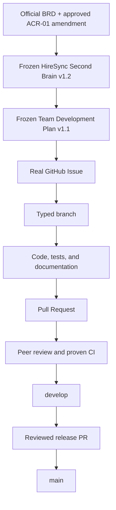
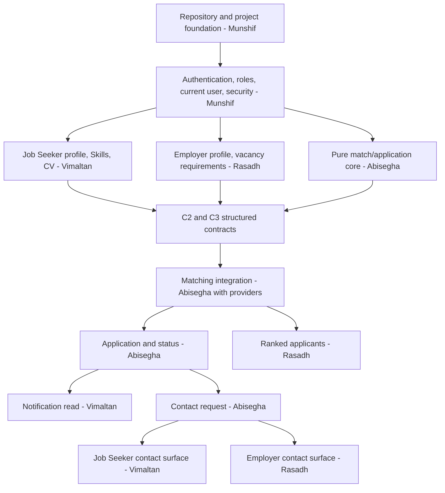
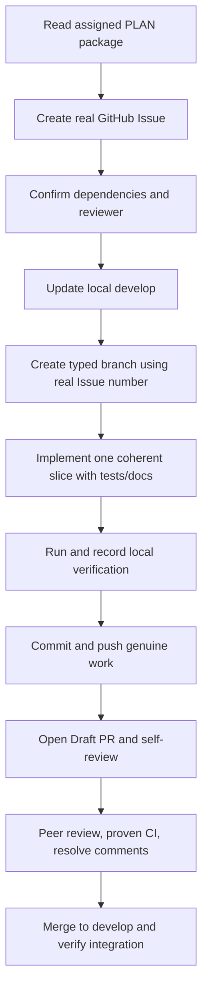
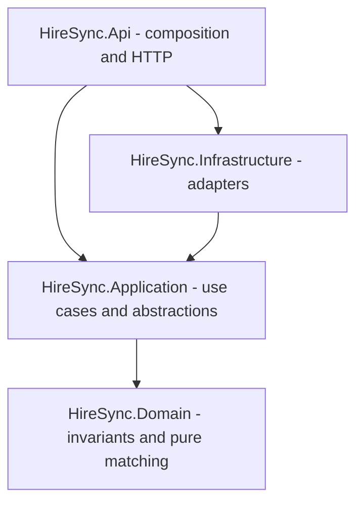

# HireSync – Smart Recruitment Matching Platform

## Four-Member Master Development and Execution Plan

**Status: v1.1 FROZEN TEAM EXECUTION BASELINE — approved allocation for implementation**

| Document field | Value |
|---|---|
| Purpose | One forward execution plan for implementation, testing, integration, documentation, GitHub evidence, demo preparation, and group viva |
| Project period | 29 August 2026 through 10 September 2026 |
| Demonstration | Localhost |
| Viva | Group viva, approximately 30–40 minutes |
| Team | Munshif, Vimaltan, Rasadh, Abisegha |
| Highest requirements authority | `SmartRecruitmentMatchingPlatform-BRD.pdf` |
| Canonical engineering authority | `HireSync-Project-Second-Brain-v1.2-FROZEN.md`, incorporating supervisor-approved ACR-01 |
| Evidence state | Planning only; this document claims no completed code, test, CI run, Issue, branch, commit, PR, review, contribution, or repository URL |
| Approved change input | `HireSync-Supervisor-Approved-Change-Record-2026-09-02.md` (one-time Employer/seeded-Admin OTP + Employer company verification) |

> **Canonical team-plan rule:** This frozen plan allocates execution responsibility beneath the official BRD and the frozen HireSync Second Brain. It cannot create or change product behavior. If an Issue, branch, code change, test, diagram, or PR conflicts with either higher source, stop work and correct the lower-level item before continuing.

## Document map

- [0. How to use this plan](#0-how-to-use-this-plan)
- [A. Source of truth and change control](#a-source-of-truth-and-change-control)
- [B. Standard monorepo structure](#b-standard-monorepo-structure)
- [C. Shared file and folder ownership](#c-shared-file-and-folder-ownership)
- [D. Data and entity ownership](#d-data-and-entity-ownership)
- [E. API ownership matrix](#e-api-ownership-matrix)
- [F. Cross-member contracts](#f-cross-member-contracts)
- [G. Planned GitHub work items](#g-planned-github-work-items)
- [H. Default review rotation](#h-default-review-rotation)
- [I. Munshif workflow](#i-munshif--foundation-authentication-and-administration)
- [J. Vimaltan workflow](#j-vimaltan--job-seeker-profile-cv-tracking-and-notifications)
- [K. Rasadh workflow](#k-rasadh--employer-profile-vacancies-search-and-ranked-applicants)
- [L. Abisegha workflow](#l-abisegha--matching-applications-status-and-contact-requests)
- [M. Cross-member dependency map](#m-cross-member-dependency-map)
- [N. Planned daily execution](#n-planned-daily-team-execution-29-august-to-10-september-2026)
- [O–T. GitHub and integration rules](#o-standard-github-execution-flow)
- [U. Test responsibility](#u-test-responsibility-matrix)
- [V. Integration checkpoints](#v-integration-checkpoints)
- [W–X. Ready and Done](#w-definition-of-ready)
- [Y. Viva ownership](#y-viva-ownership)
- [Z. Project-wide prohibitions](#z-project-wide-do-not-do-list)
- [Open items](#open-items)
- [Member quick-start pages](#member-quick-start-pages)
- [Final freeze validation](#final-team-plan-freeze-validation)

---

# 0. How to Use This Plan

## 0.1 What this document does

This document converts the frozen HireSync blueprint into coordinated, reviewable work for four real developers. It defines who leads each use case, where work belongs, which contracts must be agreed first, who reviews it, how it is tested, and how it reaches `develop` and eventually `main`.

It is deliberately a **forward plan**. A planned item becomes real evidence only after the named member genuinely performs the work using their own GitHub identity and the repository records it.

## 0.2 What this document does not do

This plan does not:

- rewrite the BRD or frozen Second Brain;
- redistribute the approved primary ownership;
- invent application behavior, screens, endpoints, entities, packages, or architecture beyond the official BRD, supervisor-approved ACR-01, and frozen Second Brain v1.2;
- claim any Issue number, branch, commit, PR, review, test result, CI result, completion date, or contribution already exists;
- make Munshif the permanent owner of every shared file, review, merge, or integration task.

## 0.3 Team and primary ownership

| Member | Team role | Frozen primary ownership | Owned use cases |
|---|---|---|---|
| **Munshif** | Team Leader / Main Coordinator | Repository and solution foundation; Identity/JWT/authorization; one-time email OTP; shared security; Administrator including Employer-verification exception review; integration and release coordination | UC-AUTH-01, UC-AUTH-02, UC-AUTH-03, UC-AUTH-04, UC-ADM-01, UC-ADM-02, UC-ADM-03 |
| **Vimaltan** | Team Member | Job Seeker structured profile and skills; CV; own application tracking; notification retrieval/read | UC-JS-01, UC-JS-02, UC-APP-02, UC-NOT-01 |
| **Rasadh** | Team Member | Employer account/company basics and company-verification surfaces/data; Employer profile; vacancies; job search/filter; ranked-applicant read workflow | UC-EMP-01, UC-EMP-04, UC-VAC-01, UC-VAC-02, UC-VAC-03, UC-JOB-01, UC-EMP-02 |
| **Abisegha** | Team Member | Deterministic matching; apply once; application status and notification creation; contact-request lifecycle | UC-MATCH-01, UC-APP-01, UC-EMP-03, UC-CON-01, UC-CON-02 |

All 23 current frozen use cases, including three ACR-01 additions, have exactly one primary owner. Shared UI, API, persistence, and integration work is coordinated through Sections C–F; shared participation does not erase primary accountability.

## 0.4 Fixed implementation baseline

| Area | Frozen choice |
|---|---|
| Frontend | Angular 22, TypeScript, Tailwind CSS 4, selective Angular Material, Lucide Angular, typed Reactive Forms, Signals + Services, standalone feature-based architecture |
| Backend | ASP.NET Core Web API, .NET 8, C#, Pragmatic Clean Architecture |
| Data | SQL Server 2022 Express, EF Core 8, SSMS, EF migrations |
| Security | ASP.NET Core Identity, JWT, roles `JobSeeker`, `Employer`, `Administrator`, role plus ownership authorization |
| API | REST/JSON under `/api/v1`, OpenAPI/Swagger, Problem Details |
| Testing | xUnit, Vitest, focused Playwright critical flows |
| Repository | GitHub monorepo; protected `main` and `develop`; typed branches; Issues, PRs, peer reviews, GitHub Actions |

The following behavioral anchors are never reinterpreted inside a work item:

- matching uses current structured profile and vacancy data only, with weights 50/25/15/10;
- CV is PDF/DOCX, 1–5,000,000 bytes, protected, owner-only, and never parsed or used for matching;
- application, contact, vacancy, and account state models are exactly those in the frozen Second Brain;
- only a genuine application-status change creates `ApplicationStatusChanged` atomically;
- contact acceptance is status-only and contact activity creates no notification;
- Employers and Administrators have no CV access;
- Administrator has no match-edit or unspecified settings capability.
- ACR-01: Employer registration and seeded-Administrator first activation use one-time email OTP; Job Seeker has no OTP requirement; OTP is not recurring MFA or a recruitment notification.
- ACR-01: Employer company verification is separate from AccountStatus, uses deterministic automatic checks first, and only `Approved` Employers may use vacancy/hiring workflows; Administrator reviews only `NeedsReview` exceptions.

## 0.5 Evidence language

Use these terms accurately:

| Term | Meaning in this plan |
|---|---|
| `PLAN-*` | Document-only work-package identifier; not a GitHub Issue number |
| Planned | Intended future work; no completion claim |
| Ready | Inputs and contracts satisfy Section W; coding may start |
| Done | Real evidence satisfies Section X |
| Validated in plan | Documentation was checked for internal consistency; no runtime PASS claim |

---

# A. Source of Truth and Change Control

## A.1 Authority chain



The Team Plan allocates execution responsibility. It cannot override the BRD or frozen Second Brain. A GitHub Issue cannot silently invent behavior, and source code cannot silently redefine a requirement.

## A.2 Required change path

After this freeze, a proposed behavior change follows:

1. Stop implementation of the disputed behavior.
2. Identify the BRD, approved decision, or genuine unresolved product question.
3. Obtain the required supervisor/product decision when the BRD is affected; ACR-01 is the recorded approved decision for the OTP/Employer-verification boundary.
4. Update canonical documentation through a reviewed documentation PR; v1.1 of this plan consumes Second Brain v1.2 rather than silently modifying old freezes.
5. Create or update the real GitHub Issue.
6. Implement in a typed branch.
7. Add or update tests and traceability.
8. Obtain genuine peer review and proven CI.
9. Merge to `develop`; release only through the reviewed `develop -> main` PR.

Ordinary low-risk implementation details that do not change behavior stay inside the existing Issue and PR. Genuine product ambiguity is never guessed silently.

## A.3 Contribution integrity

- Each member uses their own GitHub account, Git author identity, workstation/session, and branch.
- Work is credited to the person who genuinely performs it; reassignment does not transfer authorship.
- Reviews must contain evidence of real inspection when a concern exists; ceremonial approval is not contribution.
- There is no artificial minimum number of commits, Issues, or PRs.
- Integration, debugging, testing, documentation, and review are valid contributions when genuinely performed and evidenced.

---

# B. Standard Monorepo Structure

```text
HireSync/
|-- .github/
|   |-- ISSUE_TEMPLATE/
|   |   |-- feature.yml
|   |   |-- bug.yml
|   |   `-- documentation.yml
|   |-- PULL_REQUEST_TEMPLATE.md
|   `-- workflows/
|       |-- backend-ci.yml
|       |-- frontend-ci.yml
|       `-- e2e-ci.yml
|-- backend/
|   |-- HireSync.sln
|   |-- src/
|   |   |-- HireSync.Domain/
|   |   |   |-- Common/
|   |   |   |-- Entities/
|   |   |   |-- Enums/
|   |   |   |-- ValueObjects/
|   |   |   |-- Rules/
|   |   |   `-- Matching/
|   |   |-- HireSync.Application/
|   |   |   |-- Abstractions/
|   |   |   |   |-- Authentication/
|   |   |   |   |-- Persistence/
|   |   |   |   |-- Storage/
|   |   |   |   `-- Time/
|   |   |   |-- Features/
|   |   |   |   |-- Auth/
|   |   |   |   |-- EmployerVerification/
|   |   |   |   |-- JobSeekers/
|   |   |   |   |-- Employers/
|   |   |   |   |-- Vacancies/
|   |   |   |   |-- Matching/
|   |   |   |   |-- Applications/
|   |   |   |   |-- ContactRequests/
|   |   |   |   |-- Notifications/
|   |   |   |   `-- Administration/
|   |   |   |-- Contracts/
|   |   |   |-- Validation/
|   |   |   `-- Common/
|   |   |-- HireSync.Infrastructure/
|   |   |   |-- Persistence/
|   |   |   |   |-- Configurations/
|   |   |   |   |-- Migrations/
|   |   |   |   `-- Seed/
|   |   |   |-- Identity/
|   |   |   |-- Authentication/
|   |   |   |-- Email/
|   |   |   |-- EmployerVerification/
|   |   |   |-- Storage/
|   |   |   |-- Time/
|   |   |   `-- DependencyInjection/
|   |   `-- HireSync.Api/
|   |       |-- Controllers/V1/
|   |       |-- Middleware/
|   |       |-- Authorization/
|   |       |-- Contracts/
|   |       |-- OpenApi/
|   |       |-- Extensions/
|   |       |-- Properties/
|   |       `-- Program.cs
|   `-- tests/
|       |-- HireSync.Domain.Tests/
|       |-- HireSync.Application.Tests/
|       `-- HireSync.Api.IntegrationTests/
|-- frontend/
|   `-- hiresync-web/
|       |-- src/
|       |   `-- app/
|       |       |-- core/
|       |       |   |-- auth/
|       |       |   |-- guards/
|       |       |   |-- interceptors/
|       |       |   |-- http/
|       |       |   |-- layout/
|       |       |   |-- config/
|       |       |   `-- error-handling/
|       |       |-- shared/
|       |       |   |-- components/
|       |       |   |-- directives/
|       |       |   |-- pipes/
|       |       |   |-- models/
|       |       |   |-- validators/
|       |       |   `-- ui/
|       |       |-- features/
|       |       |   |-- auth/
|       |       |   |-- job-seeker-profile/
|       |       |   |-- cv/
|       |       |   |-- jobs/
|       |       |   |-- applications/
|       |       |   |-- employer-profile/
|       |       |   |-- employer-verification/
|       |       |   |-- vacancies/
|       |       |   |-- applicants/
|       |       |   |-- contact-requests/
|       |       |   |-- notifications/
|       |       |   `-- administration/
|       |       |-- app.config.ts
|       |       |-- app.routes.ts
|       |       `-- app.ts
|       |-- e2e/
|       |-- public/
|       |-- package.json
|       `-- package-lock.json
|-- docs/
|   |-- HireSync-Project-Second-Brain.md
|   |-- HireSync-Team-Development-Plan.md
|   |-- api/
|   |-- database/
|   |-- testing/
|   |-- viva/
|   `-- decisions/
|-- scripts/
|-- .editorconfig
|-- .gitignore
|-- global.json
|-- .nvmrc
|-- README.md
|-- CONTRIBUTING.md
`-- SECURITY.md
```

A frontend feature uses this internal shape when each folder is genuinely needed:

```text
feature-name/
|-- pages/
|-- components/
|-- data-access/
|-- models/
|-- validators/
|-- feature-name.routes.ts
`-- *.spec.ts beside the tested unit
```

Rules:

- There is one Git repository at the root and no nested repository.
- Do not create a generic frontend `services/` dumping folder.
- Do not create repositories per entity or a generic repository merely to forward EF CRUD.
- Generated/local data (`bin`, `obj`, `node_modules`, coverage, test results, `.local-storage`, CVs, database backups, secrets, environment files) is ignored.
- Exact .NET, Node, npm, NuGet, Angular, Material, Tailwind, Lucide, and Playwright versions come from committed pin/lock files after repository initialization.

---

# C. Shared File and Folder Ownership

## C.1 Backend shared/high-conflict areas

| Shared item | Initial owner | Regular contributors | Coordination rule | Primary reviewer |
|---|---|---|---|---|
| `HireSync.Api/Program.cs` | Munshif | Any feature author needing composition | Feature PR states the exact registration/pipeline change; no business logic; avoid parallel edits | Abisegha |
| `HireSync.Infrastructure/DependencyInjection/` and API registration extensions | Munshif | All module authors | Each author registers only their capability; shared registration change is called out in PR | Abisegha |
| `IHireSyncDbContext` or equivalent persistence capability | Munshif creates shell | Vimaltan, Rasadh, Abisegha add required sets/capabilities | Add only feature-required surface; no generic repository/UoW replacement | Abisegha |
| EF `HireSyncDbContext` | Munshif creates shell | Entity/configuration authors | One coordinated schema PR at a time where models overlap; entity owner supplies configuration | Current migration reviewer plus affected entity owner |
| `Persistence/Configurations/` | Relevant entity owner | Other entity owners | One configuration per entity/relationship; cross-feature FK reviewed by both owners | Default rotation reviewer |
| `Persistence/Migrations/` | Author of schema-changing feature | All members may generate their own approved feature migration | Follow Section R; never delete another migration to hide conflict | Member next in review rotation |
| Shared enums | Owner of the state machine | Consumers of the enum | Frozen numeric/string values cannot be reordered; any touch lists all consumers | Domain consumer outside author’s module |
| Problem Details, error codes, exception middleware | Munshif | All feature authors add documented codes/mappings | Reuse canonical codes/statuses; unknown invariant failures remain safe 500 | Abisegha |
| Authentication and authorization policies | Munshif | Feature authors request policies/ownership checks | Munshif owns common gates; feature owner owns resource predicate; no Admin bypass | Abisegha |
| Shared application contracts | Contract owner from Section F | All named consumers | Freeze DTO shape before dependent UI/API work; breaking changes require all consumers | Named contract participants |
| Common validation/normalization | First approved feature author | All consumers | One canonical implementation; no copied skill/location normalization | At least one other consumer |

## C.2 Frontend shared/high-conflict areas

| Shared item | Initial owner | Regular contributors | Coordination rule | Primary reviewer |
|---|---|---|---|---|
| `app.routes.ts` | Munshif | Every feature route owner | Feature routes stay lazy; author announces route edit before work and rebases/merges current `develop` | Abisegha |
| `app.config.ts` | Munshif | Authors needing providers | Add only approved global providers; feature providers remain feature-local | Abisegha |
| `core/auth/AuthStore` and session models | Munshif | Consumers read the frozen contract | One store only; no feature token storage or alternate role source | Abisegha |
| Auth interceptor | Munshif | None without auth-contract review | Token attaches only to configured API origin; never log token | Abisegha |
| Error/correlation interceptors | Munshif | Feature authors add typed handling only through shared contract | Preserve 401/403/404/409 meanings and trace IDs | Abisegha |
| Auth, guest, role, profile-complete, and Employer-verification guards | Munshif creates common security/session guards | Rasadh consumes Employer-verification/profile readiness guards; all consume role guard | Backend remains authoritative; non-Approved Employer may reach verification/status UI only; no guard-only security claim | Abisegha |
| `AppShell`, role navigation | Munshif creates shell | Feature authors add only in-scope route links | One coordinated navigation edit; no dead or role-inappropriate item | Vimaltan |
| `shared/ui` and reusable components | Munshif seeds essentials | All feature authors | Move to shared only after genuine reuse; preserve accessibility states | Reviewer for the contributing feature |
| Tailwind/global styles | Munshif seeds tokens/base | All feature authors use tokens and responsive rules | No feature-wide restyle in unrelated PR; test 375/768/1024/1440 widths | Vimaltan |
| API base/configuration | Munshif | All API consumers | One non-secret configured base URL; no hard-coded URLs in feature code | Abisegha |
| Canonical Skill input/model | Vimaltan after C2 agreement | Rasadh consumes; Abisegha consumes matching IDs | One model/data-access contract; no second Skill service | Rasadh and Abisegha |
| `features/jobs/` | Rasadh owns list/detail shell; Abisegha owns match/apply components | Vimaltan supplies readiness/profile link behavior | Split by component/data responsibility in Issue; coordinate same-file edits | Vimaltan |
| `features/applicants/` | Rasadh owns page/list | Abisegha supplies status/contact actions and match contract | Page never duplicates matcher or exposes CV/contact data | Vimaltan |
| `features/contact-requests/` | Abisegha owns lifecycle contract | Rasadh owns Employer surface; Vimaltan owns Job Seeker surface | Separate role components/data methods; one shared status model | Rasadh for backend/lifecycle; cross-review between UI owners |

## C.3 Repository and engineering files

| Shared item | Initial owner | Regular contributors | Coordination rule | Primary reviewer |
|---|---|---|---|---|
| `.gitignore`, `.editorconfig` | Munshif | Any member identifies a real need | No hiding source or evidence; ignore local/generated/sensitive files only | Abisegha |
| `global.json`, `.nvmrc`, manifests/locks | Munshif pins installed compatible versions | Dependency author updates relevant manifest/lock | No invented patch versions; dependency change is explicit in Issue/PR | Abisegha |
| Root `README.md` | Munshif creates setup shell | All members update verified feature/setup facts | Do not claim commands/results not executed | Rotating reviewer |
| `CONTRIBUTING.md` | Munshif creates | All four improve workflow after real use | Must remain aligned with Sections O–Q | Abisegha |
| `SECURITY.md` | Munshif creates | Vimaltan adds CV controls; feature owners add module concerns | Never publish secrets, exploit data, personal CV, or paths | Vimaltan |
| GitHub Actions workflows | Munshif establishes early build/unit checks | Test owner adds proven SQL/E2E stages | Only consistently reporting checks become protected requirements | Abisegha plus affected test owner |
| PR and Issue templates | Munshif creates | All four improve through reviewed docs PR | Preserve source IDs, evidence boundary, shared-file disclosure | Abisegha |
| Canonical docs and traceability | Relevant behavior owner | All four | Any behavior change updates the frozen authority first; this plan itself is not edited silently | At least one non-author |

## C.4 Shared-file conflict-prevention protocol

1. The Issue lists every anticipated shared file and the reason for touching it.
2. Before editing, check open PRs and tell the affected owner in the Issue/PR thread.
3. If two members need the same file, agree on sequence or split stable sections; do not race.
4. Sync latest `develop` before the shared edit and again before requesting review.
5. Keep the shared change minimal and separate from unrelated formatting.
6. The PR summary names the shared file, contract effect, and reviewers required.
7. A non-author reviews the shared change; affected feature owners re-review semantic conflicts.
8. If behavior or architecture differs from the frozen blueprint, stop and use Section A rather than resolving it inside code.

Initial ownership is coordination responsibility, not permanent exclusive permission.

---

# D. Data and Entity Ownership

| Data concept | Primary responsibility | Required collaborators | Frozen invariants the owner protects | Default reviewer |
|---|---|---|---|---|
| `ApplicationUser`, Identity tables, `EmailVerificationChallenge` | Munshif | All feature owners consume current user; Rasadh consumes Employer email-confirmed state | Exactly one role; normalized unique email; `AccountStatus`; `TokenVersion`; ACR-01 one-time OTP for Employer/seeded Admin only; OTP hash/expiry/attempt/resend/replay rules; Administrator has no business profile | Abisegha |
| `JobSeekerProfile` | Vimaltan | Abisegha consumes matching input | Nullable onboarding fields; explicit 0 months and `NoFormalQualification`; derived readiness; owner last-write-wins; one profile/user | Munshif |
| `EmployerProfile` | Rasadh | Munshif coordinates C1/verification gate; Abisegha consumes approved Employer through vacancy/application flows | Form 1 company basics; unique normalized BRN; verification-bound identity cannot silently bypass re-verification; one profile/user | Vimaltan |
| `EmployerVerification` | Rasadh owns Employer-side record/data shape; Munshif owns verification policy/Admin decision + common authorization | Both coordinate migration/API; all Employer business consumers use Approved gate | One verification/profile; `Unverified/Verifying/Approved/NeedsReview/Rejected`; deterministic factor outcome; RowVersion; only NeedsReview manually decided; no government scraping/AI | Abisegha for security + Vimaltan for data/profile review |
| `Skill` | Vimaltan is contract custodian | Rasadh and Abisegha must approve/use it; Munshif supports persistence shell | One canonical table and normalizer; unique `NormalizedName`; stable GUID ID; no synonym/fuzzy subsystem | Rasadh + Abisegha |
| `JobSeekerSkill` | Vimaltan | Abisegha | Composite `(JobSeekerProfileId, SkillId)`; distinct canonical IDs | Munshif |
| `Vacancy` | Rasadh | Abisegha consumes requirements | Owner Employer; required fields; 0–720 months; nullable education; Open/Closed; Closed terminal; RowVersion | Vimaltan |
| `VacancySkill` | Rasadh | Vimaltan Skill contract; Abisegha matcher | Composite `(VacancyId, SkillId)`; 1–50 distinct canonical required skills | Vimaltan + Abisegha |
| `CvDocument` | Vimaltan | Munshif reviews authorization/config | One current owner document; metadata only in SQL; 1–5,000,000 bytes; protected generated path; no Employer/Admin projection | Munshif |
| `JobApplication` | Abisegha | Rasadh reads applicants; Vimaltan tracks own | Unique `(VacancyId, JobSeekerProfileId)`; initial Applied; exact state machine; RowVersion; no score/CV snapshot | Rasadh |
| `ContactRequest` | Abisegha | Rasadh Employer UI; Vimaltan Job Seeker UI | Unique `JobApplicationId`; Pending to Accepted/Declined only; status/context only; no notification/data disclosure | Rasadh |
| `Notification` write path | Abisegha | Vimaltan owns read/UI contract | Only `ApplicationStatusChanged`; direct application FK; exactly one per genuine status change in same transaction | Rasadh |
| `Notification` query/read path | Vimaltan | Abisegha supplies created records | Recipient-only list/unread/read timestamps; mark one/all; no Employer/Admin or contact notice | Munshif |
| DbContext, configurations, migrations | Feature entity owner proposes | All affected owners | EF migrations are schema authority; constraints/indexes reflect frozen model; one coordinated migration sequence | Rotation reviewer + affected owner |

## D.1 Canonical Skill coordination protocol

1. **C2 freezes first.** Vimaltan, Rasadh, and Abisegha agree the Skill DTO, GUID ID, display name, normalized name behavior, and test vectors before profile/vacancy/matcher integration.
2. **One implementation.** Vimaltan leads the shared server normalizer and suggestion contract in the agreed shared location. Rasadh and Abisegha review it before consuming it.
3. **One table.** Candidate and vacancy selections use `Skill` through `JobSeekerSkill` and `VacancySkill`; no `CandidateSkill` definition table or duplicate vacancy skill identity exists.
4. **One normalization sequence.** Server applies NFKC, Unicode trim, repeated-whitespace collapse, invariant uppercase, then length validation. Punctuation remains meaningful; `.NET` and `DOTNET` are different.
5. **Save contract.** Profile/vacancy save input may carry `skillNames`; server resolves/creates the canonical records atomically and returns canonical summaries. Matching receives distinct Skill IDs only.
6. **Race defense.** The unique normalized-name index remains authoritative; a concurrent creation resolves to the existing canonical record rather than a duplicate subsystem.
7. **Change control.** Any later normalization or DTO change needs a documented contract comment/review from all three consumers and regression tests before dependent PRs merge.

---

# E. API Ownership Matrix

All routes below are literal baseline routes under `/api/v1`. “Reviewer” is the default; Section H may substitute a qualified non-author when needed.

## E.1 Authentication, profiles, and CV

| Method and route | Primary implementer | Primary frontend consumer | Role/security | Data and dependency | Required tests | Reviewer |
|---|---|---|---|---|---|---|
| `POST /api/v1/auth/register` | Munshif | Munshif auth feature + Rasadh Employer Form 1 | Anonymous; only JobSeeker/Employer; rate limit | JobSeeker: Identity+role/profile. Employer: Identity+role/EmployerProfile+Unverified verification+OTP challenge; C1 | Both roles, Employer Form 1, duplicate email/BRN, invalid/Admin role, password, rollback/sender failure | Abisegha |
| `POST /api/v1/auth/login` | Munshif | Munshif auth feature | Anonymous; generic credential failure; suspended 403; required Employer/Admin email confirmation before JWT | Identity, status, role, TokenVersion, EmailConfirmed; safe Employer verification status; C1 | Valid roles, wrong/unknown, unconfirmed Employer/Admin, no recurring OTP after confirmation, suspended, response claims | Abisegha |
| `GET /api/v1/auth/me` | Munshif | All feature shells through AuthStore | Any authenticated Active role | Safe current-user/session DTO; C1 | 401 invalid/expired/revoked, 403 suspended, each role | Abisegha |
| `POST /api/v1/auth/logout` | Munshif | AppShell/AuthStore | Any authenticated Active role | Increment TokenVersion; clear client state | Revocation, replay, network-safe client clearing | Abisegha |
| `POST /api/v1/auth/email-verification/verify` | Munshif | Munshif auth OTP page | Opaque user-bound Employer/Admin challenge; rate/attempt limit | OTP hash/expiry/consume + Identity EmailConfirmed; C1 | success, wrong/expired/replay/cross-user/fifth-attempt | Abisegha |
| `POST /api/v1/auth/email-verification/resend` | Munshif | Munshif auth OTP page | Eligible unconfirmed Employer/seeded Admin; cooldown/rate | Invalidate prior challenge, create/send new OTP; provider-neutral sender | cooldown, invalidation, already confirmed, sender unavailable | Abisegha |
| `GET /api/v1/job-seeker/profile` | Vimaltan | Job Seeker profile | Active JobSeeker, self | Profile, canonical skills, readiness, CV summary; C1/C2/C3 | Unset/ready, role denial, owner isolation, nullable semantics | Munshif |
| `PUT /api/v1/job-seeker/profile` | Vimaltan | Job Seeker profile | Active JobSeeker, self | Profile + skill join transaction; last-write-wins; C2/C3 | Bounds, explicit 0/NoFormalQualification, dedupe, rollback | Munshif |
| `GET /api/v1/skills?query=` | Vimaltan | Vimaltan and Rasadh Skill inputs | Active JobSeeker or Employer | Canonical Skill suggestions; C2 | Query bounds, normalization, ordering, role matrix | Munshif; C2 sign-off by Rasadh/Abisegha |
| `GET /api/v1/job-seeker/cv` | Vimaltan | CV card | Active JobSeeker, self only | Current metadata; no path/hash | Absent 404, owner success, Employer/Admin/foreign denial | Munshif |
| `POST /api/v1/job-seeker/cv` | Vimaltan | CV upload/replace | Active JobSeeker, self; upload rate limit | Protected staging/storage + one metadata row | PDF/DOCX, 0/exact/over size, spoof/ZIP bounds, compensation | Munshif |
| `GET /api/v1/job-seeker/cv/file` | Vimaltan | Own-download action | Active JobSeeker, self only | Authorized streamed attachment | Owner, absent, Employer/Admin/foreign denial, safe headers | Munshif |
| `GET /api/v1/employer/profile` | Rasadh | Employer profile | Active email-confirmed Employer, self | Employer profile/readiness + verification-aware identity fields; C1 | profile states, verification-bound fields, role/owner isolation | Vimaltan |
| `PUT /api/v1/employer/profile` | Rasadh | Employer profile | Active email-confirmed Employer, self; verification-bound identity changes must re-enter verification | Permitted profile updates + verification reset where applicable | Bounds, Approved->Verifying identity change, role denial, persistence failure | Vimaltan |
| `GET /api/v1/employer/verification` | Rasadh | Employer verification/status page | Active email-confirmed Employer, self | Safe verification factors/status; C1 + ACR-01 | every state, owner/role, no sensitive token/secret | Munshif |
| `POST /api/v1/employer/verification/submit` | Rasadh with Munshif policy review | Employer Company Verification Form 2 | Active email-confirmed Employer, self | Deterministic registry/domain/BRN evidence -> Approved/NeedsReview/Rejected | strong registry path, domain fallback, inconclusive, hard mismatch, duplicate BRN, resubmit | Munshif |
| `POST /api/v1/employer/verification/domain/verify` | Rasadh with Munshif infrastructure support | Employer verification page | Active email-confirmed Employer; bound own domain challenge | DNS TXT ownership factor; no registry scraping | success/missing/wrong token/DNS unavailable/cross-owner | Munshif |

## E.2 Vacancies, matching, applications, and applicants

| Method and route | Primary implementer | Primary frontend consumer | Role/security | Data and dependency | Required tests | Reviewer |
|---|---|---|---|---|---|---|
| `GET /api/v1/vacancies` | Rasadh | Jobs search page | Active JobSeeker | Open vacancies owned by Active, Approved Employers; optional match; C2/C3/C4 | Filters, paging, newest/match ties, closed/inactive exclusion, incomplete profile | Vimaltan |
| `GET /api/v1/vacancies/{vacancyId}` | Abisegha | Rasadh detail shell + Abisegha match/apply components | Active JobSeeker; Open vacancy owned by Active, Approved Employer | Rasadh vacancy projection + Vimaltan profile/CV-exists flag + C3/C4 matcher | Exact score/gaps, incomplete profile, CV independence, closed/missing 404 | Rasadh |
| `POST /api/v1/vacancies/{vacancyId}/applications` | Abisegha | Apply action | Active JobSeeker, self | Match-ready profile, current CV, Open vacancy, Active Approved Employer, unique application | First 201, sequential/concurrent duplicate, readiness, close race | Rasadh |
| `GET /api/v1/job-seeker/applications` | Vimaltan | Own application tracking | Active JobSeeker, self only | Applications + vacancy/company projection; ABI application contract | Status filter, page/order, closed history, owner isolation | Munshif |
| `GET /api/v1/employer/vacancies` | Rasadh | Employer vacancy list | Active **Approved** Employer, own | Vacancy query/page | Filters, ownership, empty, paging | Vimaltan |
| `POST /api/v1/employer/vacancies` | Rasadh | Vacancy create form | Active **Approved** Employer; complete own profile | Vacancy + canonical required skills transaction; C2/C3 | Fields, readiness, required skills, rollback, role denial | Vimaltan |
| `GET /api/v1/employer/vacancies/{vacancyId}` | Rasadh | Vacancy detail/edit | Active **Approved** Employer, owner; foreign 404 | Vacancy detail + RowVersion | Owner/foreign, Open/Closed detail | Vimaltan |
| `PUT /api/v1/employer/vacancies/{vacancyId}` | Rasadh | Vacancy edit | Active **Approved** owning Employer; Open only | Vacancy + skill replacement; RowVersion; C2/C3 | Update, validation, stale, foreign, Closed rejection | Vimaltan |
| `PATCH /api/v1/employer/vacancies/{vacancyId}/status` | Rasadh | Close confirmation | Active **Approved** owning Employer | Open to Closed only; RowVersion | Close, repeat/stale/foreign, apply/search after closure | Vimaltan |
| `GET /api/v1/employer/vacancies/{vacancyId}/applicants` | Rasadh | Ranked applicants page | Active **Approved** owning Employer; foreign 404 | Applications + current profiles + one vacancy input + C4 matcher; no CV/contact data | Rank/ties, filter-before-page, no N+1, repeated order, privacy | Vimaltan; matching review by Abisegha |
| `PATCH /api/v1/employer/applications/{applicationId}/status` | Abisegha | Rasadh applicant action | Active **Approved** owning Employer | JobApplication + one Notification atomically; C5; RowVersion | Every transition, terminal/stale/no-op, ownership, notification/rollback | Rasadh |

## E.3 Contact requests, notifications, administration, and health

| Method and route | Primary implementer | Primary frontend consumer | Role/security | Data and dependency | Required tests | Reviewer |
|---|---|---|---|---|---|---|
| `POST /api/v1/employer/applications/{applicationId}/contact-requests` | Abisegha | Rasadh applicant/contact surface | Active **Approved** owning Employer; both accounts Active; non-Rejected; one only | ContactRequest insert; C6; no notification/data | First/duplicate race, owner, inactive/rejected/closed behavior, privacy | Rasadh |
| `GET /api/v1/employer/contact-requests` | Abisegha | Rasadh Employer contact page | Active **Approved** Employer, own created requests | Status/context projection only; C6 | Isolation, filter/page, all states, schema privacy | Rasadh |
| `GET /api/v1/job-seeker/contact-requests` | Abisegha | Vimaltan Job Seeker contact page | Active target JobSeeker, own only | Company/vacancy context + status; C6 | Isolation, filters, closure/later rejection, no data/notification | Rasadh; UI cross-check by Vimaltan |
| `PATCH /api/v1/job-seeker/contact-requests/{requestId}/status` | Abisegha | Vimaltan Accept/Decline action | Active target JobSeeker | Pending to Accepted/Declined; RowVersion; C6 | Both terminal paths, wrong target, stale/repeat, suspended, privacy | Rasadh |
| `GET /api/v1/notifications` | Vimaltan | Notification page/badge | Active JobSeeker recipient | `ApplicationStatusChanged` list/unread count; C5 | Recipient isolation, filter/page, one type, no contact notice | Munshif |
| `PATCH /api/v1/notifications/{notificationId}/read` | Vimaltan | Notification item | Active JobSeeker recipient | Read timestamp/no-op | Owner/foreign 404, repeat no-op | Munshif |
| `PATCH /api/v1/notifications/read-all` | Vimaltan | Notification page/badge | Active JobSeeker | Own unread records only | Empty/multiple, other recipients unchanged | Munshif |
| `GET /api/v1/admin/dashboard` | Munshif | Admin dashboard | Active Administrator only | All-user/vacancy/application aggregates | `totalUsers` includes every role/status, role denial, dependency error | Abisegha |
| `GET /api/v1/admin/users` | Munshif | Admin user list | Active Administrator only | Safe Identity projection, filter/page | Search/filter/page, no secret/CV/business data | Abisegha |
| `PATCH /api/v1/admin/users/{userId}/status` | Munshif | Admin status action | Active Administrator; no self/Admin target | Account status + TokenVersion + RowVersion | Suspend/reactivate/no-op/stale/protected target/access effects | Abisegha |
| `GET /api/v1/admin/employer-verifications` | Munshif | Admin verification exception queue | Active Administrator only | NeedsReview-only paged safe projection | queue/filter/page/role/no auto-approved leakage | Abisegha |
| `GET /api/v1/admin/employer-verifications/{verificationId}` | Munshif | Admin verification detail | Active Administrator only | Safe company/factor/detail; no OTP/CV/secret | detail/404/role/privacy | Abisegha |
| `PATCH /api/v1/admin/employer-verifications/{verificationId}` | Munshif | Admin Approve/Reject action | Active Administrator; current NeedsReview only | Approve or Reject + reason + RowVersion | approve/reject/reason/stale/already-resolved/Employer access effect | Abisegha |
| `GET /health/live` | Munshif | Setup/CI/demo diagnostics | Anonymous, rate-limited, status only | API process | Healthy response shape; no secret/detail leakage | Abisegha |
| `GET /health/ready` | Munshif | Setup/CI/demo diagnostics | Anonymous, rate-limited, status only | Database reachable and CV root writable | 200/503 conditions; no SQL/path/secret detail | Abisegha |

No endpoint in this matrix exposes Employer/Admin CV access, editable/stored match results, contact details, chat/messages, recruitment/contact email/SMS notifications, Administrator settings, vacancy delete/reopen, or application withdrawal. The OTP sender is authentication-only under ACR-01.

---

# F. Cross-Member Contracts

| Contract | Participants and accountable owner | Frozen data/behavior | Lightweight agreement record | Unlocks | Must not change silently |
|---|---|---|---|---|---|
| **C1 – Authentication + Employer Trust Gate** | Owner: Munshif. Consumers: Vimaltan, Rasadh, Abisegha; Rasadh is Employer-verification data/UI provider | Safe current-user DTO; one role; JWT claims `sub`, `email`, `role`, `token_version`, `jti`; 30-minute access token; one-time Employer/seeded-Admin OTP; Job Seeker no OTP; provider-neutral OTP sender; safe Employer verification state; 401 invalid/revoked, 403 suspended/wrong-role/email-verification-required/employer-verification-required, 404 concealed ownership | Contract note in PLAN-MUN auth Issue plus DTO/OpenAPI diff approved by Abisegha; Rasadh explicitly signs Employer verification DTO/guard/status expectations; all consumers acknowledge | Every protected API, OTP flow, Employer verification/status UI, Employer Approved-only hiring policy, guard/interceptor, ownership query, role shell | Claim names, status/error meanings, role strings, OTP purpose/security limits, token storage, Administrator registration, Employer Approved gate, or bypass behavior |
| **C2 – Canonical Skill** | Owner/custodian: Vimaltan. Participants: Rasadh, Abisegha | GUID Skill ID, display `name`, unique `normalizedName`, suggestion DTO, exact normalizer, duplicate resolution, Skill-ID equality | Short `docs/decisions` contract note or shared Issue comment; review by Rasadh and Abisegha | Profile skills, vacancy skills, matching input, skill chips/suggestions | A second Skill table/service, alternative normalization, fuzzy aliases, punctuation loss, string-based matcher equality |
| **C3 – Matching Input** | Owner: Abisegha for immutable matcher records. Providers: Vimaltan and Rasadh | Candidate: distinct Skill IDs, 0–720 total months, education 0–8, normalized preferred location. Vacancy: distinct required Skill IDs, 0–720 minimum months, nullable education, normalized location. No CV fields | Typed-record/DTO PR reviewed by both providers with golden input fixture | Match engine, job detail, match sort, applicant ranking | CV/metadata, account role/time/randomness, extra score factor, unset-as-zero, copied normalization |
| **C4 – Matching Output** | Owner: Abisegha. Consumers: Rasadh and job UI contributors | Authoritative total; four contributions; ordered matched/missing `{id,name}`; `computedAtUtc`; current-data semantics; total rounded once to two decimals away from zero | OpenAPI/contract fixture and MAT golden vectors reviewed by Rasadh | Job detail, ranked applicants, MatchBreakdown, SkillGapList | Angular total recomputation, different rounding, missing components, editable score, score snapshot |
| **C5 – Application and Notification** | Owner: Abisegha for status/write. Consumer owner: Vimaltan for tracking/read | Exact ApplicationStatus graph; application DTO/RowVersion; NotificationType only `ApplicationStatusChanged`; direct application reference; genuine change creates one atomically; same-state/contact create none; recipient read state | Shared Issue comment or contract test PR reviewed by Vimaltan and Rasadh | Employer status action, own tracking, notification page/badge, atomic integration tests | New status/transition, no-op notification, contact notification, polymorphic contact event, partial transaction |
| **C6 – Contact Request** | Owner: Abisegha. UI consumers: Rasadh (Employer), Vimaltan (Job Seeker) | Request/application IDs; allowed company/vacancy/candidate display context; Pending/Accepted/Declined; RowVersion; one request/application; exact creator/target rules; no notification or contact data | DTO/OpenAPI schema and privacy assertion reviewed by Rasadh and Vimaltan | Employer send/status surface and Job Seeker list/response surface | Email, phone, message, note, attachment, external channel, second request, contact notification |

## F.1 Contract checkpoint procedure

1. Owner posts the proposed DTO/record/enum/example in the real Issue or small contract PR.
2. Named providers/consumers compare it to the frozen Second Brain.
3. Participants record agreement through a substantive comment or approval; no meeting transcript is required.
4. Owner marks dependent `PLAN-*` packages unblocked only after agreement.
5. A later breaking change pauses dependents, updates the contract and tests, and obtains the same consumer review.

This governance is intentionally lightweight. It prevents incompatible work without adding a separate architecture bureaucracy.

---

# G. Planned GitHub Work Items

`PLAN-*` identifiers are planning references only. When work begins, the owner creates a real GitHub Issue, records its actual number, and uses that real number in the branch. Nothing below claims that an Issue, branch, commit, or PR already exists.

Each package is a coherent vertical slice. If it becomes too large during implementation, split it in the real Issue before work begins without changing ownership or behavior merely to create activity.

## G.1 Munshif packages

| Planning ID and planned Issue title | Source and objective | Included scope / explicit exclusions | Dependencies and affected areas | Required verification and documentation | Completion condition and reviewer |
|---|---|---|---|---|---|
| **PLAN-MUN-01 – Establish reproducible HireSync monorepo foundation** | Frozen Sections 22–26, 38, 40, 44; enable every module to start in one consistent workspace | **Include:** root structure, four backend projects/references, approved test projects, Angular 22 standalone shell, pin/lock files, ignore/editor rules, basic configuration, health endpoints, early backend/frontend CI definitions.<br>**Exclude:** business feature implementation, speculative packages, claimed CI PASS | **Depends:** source freeze only.<br>**Backend:** solution/project shells, composition root.<br>**Frontend:** app shell/root config.<br>**DB:** context/config shell only.<br>**API:** health and shared middleware skeleton | Automated: clean restore/build commands when implementation exists; layer-reference check; health response/no-secret tests.<br>Manual: open in VS 2022/VS Code, verify pin restoration and Swagger/Angular startup plan.<br>Docs: README setup shell, CONTRIBUTING, SECURITY, workflow notes | Repository scaffold is reviewable, exact pins committed, both planned build paths documented, and no feature behavior added.<br>**Reviewer:** Abisegha |
| **PLAN-MUN-02 – Implement Identity roles, profiles, and secure seed foundation** | BRD-FR-01; UC-AUTH-01; frozen role/profile invariant | **Include:** `ApplicationUser`, AccountStatus, TokenVersion, exactly-one-role/profile registration support, roles, JobSeeker/Employer empty profile creation, idempotent Administrator seed/startup validation.<br>**Include ACR-01:** one-time OTP challenge foundation and seeded-Admin first-activation confirmation support. **Exclude:** public Admin registration, password reset, recurring MFA, Job Seeker email verification, business-profile ownership | **Depends:** PLAN-MUN-01 and C1 draft.<br>**Backend/DB:** Domain `AccountStatus`; Infrastructure `ApplicationUser`/Identity, seed, initial migration.<br>**API:** foundation only.<br>**Security:** user-secrets seed values | Automated: role/profile combinations, seed idempotence, malformed startup invariant, normalized email, hash not plaintext, registration rollback.<br>Manual: inspect safe schema/seed without revealing credentials.<br>Docs: seed/secrets and role invariant | Valid foundation enforces one role and correct profile atomically; Admin has neither business profile and is not registerable.<br>**Reviewer:** Abisegha |
| **PLAN-MUN-03 – Deliver registration, one-time email OTP, login, current session, and Angular auth** | BRD-FR-01; ACR-01; UC-AUTH-01/02/04; C1 | **Include:** register/login/me plus OTP verify/resend, Employer Form-1 auth handoff, seeded-Admin first activation, JWT issue, auth/OTP pages, AuthStore, guest/auth/role/verification routing, generic credential errors.<br>**Exclude:** refresh tokens, recurring MFA, password reset, Job Seeker OTP, alternate auth store | **Depends:** PLAN-MUN-02; updated C1 frozen.<br>**Backend:** Auth feature, Identity/token/email abstractions and OTP challenge service.<br>**Frontend:** `core/auth`, auth/OTP pages/guards.<br>**API:** register/login/me + OTP verify/resend | Automated: both roles; duplicate/invalid/Admin role; Employer/seeded-Admin OTP success/wrong/expired/replay/cross-user/five-attempt/resend cooldown/provider failure; no Job Seeker OTP; no recurring OTP after confirmation; credentials/claims/suspension/guard/store/interceptor behavior.<br>Manual: OTP/resend states, role/verification redirects and all eight UI states.<br>Docs: Swagger auth/OTP and sender setup | Consumers authenticate through one C1; OTP ownership is one-time and secret-safe; protected modules consume AuthStore without duplicating verification logic.<br>**Reviewer:** Abisegha |
| **PLAN-MUN-04 – Enforce logout, TokenVersion, authorization, and Problem Details** | BRD-SC-01, BRD-NFR-SEC, BRD-NFR-REL; ACR-01; UC-AUTH-03; updated C1 | **Include:** logout revocation, TokenVersion/status validation, exact role policies, server-authoritative Approved-Employer trust gate, current-user abstraction, ownership concealment, auth/error interceptors, security headers/CORS/rate/body controls, Problem Details.<br>**Exclude:** Admin bypass, cookie auth, refresh token, feature-specific ownership implementation | **Depends:** PLAN-MUN-03; feature owners provide resource predicates.<br>**Backend/API:** middleware, authorization, errors.<br>**Frontend:** interceptors/session routes.<br>**DB:** TokenVersion | Automated: expiry/tamper/revoke/logout, suspended 403, wrong-role 403, foreign 404 foundation, CORS/rate limits, safe 500.<br>Manual: session-expiry/suspended UI.<br>Docs: security/error code notes | Common pipeline has one tested meaning for 401/403/404 and every member can use it without duplicate auth code.<br>**Reviewer:** Abisegha |
| **PLAN-MUN-05 – Deliver Administrator dashboard, account status, and Employer-verification exception review** | BRD-FR-12; ACR-01; UC-ADM-01/02/03; OD-01 safe default | **Include:** aggregate dashboard; account list/filter/page; Active/Suspended mutation; RowVersion; TokenVersion invalidation; NeedsReview Employer-verification queue/detail/Approve/Reject with reason and concurrency; sparse Admin UI.<br>**Exclude:** reviewing every Employer, settings, CV, match, role/password, vacancy/application mutation, account delete | **Depends:** PLAN-MUN-04 and business tables available for counts.<br>**Backend/DB:** Administration features and Identity status.<br>**Frontend:** administration pages.<br>**API:** six Admin routes (dashboard/users/status + verification queue/detail/decision) | Automated: `totalUsers` all roles/statuses, counts, role denial, protected self/Admin, stale/no-op, suspension/reactivation and old-token effects; NeedsReview-only queue/detail/approve/reject/concurrency.<br>Manual: responsive cards/list and access effect.<br>Docs: Admin limitations/Swagger | All three BRD totals and allowed account actions work without an Admin superuser pathway; OD-01 remains unimplemented.<br>**Reviewer:** Abisegha |
| **PLAN-MUN-06 – Coordinate proven CI, localhost recovery, integration, and release** | Frozen Sections 38–49; supports all BRD/NFR evidence | **Include:** staged CI coordination, local secrets/runbook, migration/startup orchestration, release checklist, real contribution evidence structure, `develop -> main` release coordination, tag/release notes after evidence.<br>**Exclude:** fabricated PASS, fake URL, sole merge/review control, cloud deployment | **Depends:** all feature checkpoints; OD-02 after real repository creation.<br>**Areas:** workflows, docs, scripts, setup/release; no new product behavior | Automated/manual evidence only after execution: clean clone, restore/build/tests, health, migration, Swagger, Angular, demo flows.<br>Docs: setup, release, recovery, contribution evidence, real URL | Release PR is prepared only from integrated evidence; another member verifies/approves/merges as appropriate; no claim precedes evidence.<br>**Reviewer:** Abisegha with rotating release verifier |

## G.2 Vimaltan packages

| Planning ID and planned Issue title | Source and objective | Included scope / explicit exclusions | Dependencies and affected areas | Required verification and documentation | Completion condition and reviewer |
|---|---|---|---|---|---|
| **PLAN-VIM-01 – Freeze and implement the canonical Skill contract** | BRD-FR-02, BRD-FR-04, BRD-FR-05; UC-JS-01; C2 | **Include:** one Skill entity/configuration, exact normalizer, unique key/race handling, suggestion DTO/API/data access, shared Angular Skill model/input foundation.<br>**Exclude:** synonym/fuzzy taxonomy, duplicate Candidate/Vacancy Skill systems, scoring formula | **Depends:** PLAN-MUN-01/02 persistence shell; agreement by Rasadh and Abisegha.<br>**DB:** Skills and profile join support.<br>**API:** `/skills`.<br>**Frontend:** shared Skill input/model | Automated: NFKC/space/case/punctuation, `.NET` vs `DOTNET`, duplicate race/order/query bounds.<br>Manual: suggestions and chips.<br>Docs: C2 record and canonical examples | All three consumers approve one Skill identity/normalizer; no dependent PR introduces another implementation.<br>**Reviewer:** Munshif; C2 reviewers Rasadh/Abisegha |
| **PLAN-VIM-02 – Deliver match-ready Job Seeker profile** | BRD-FR-02; UC-JS-01; C2/C3 | **Include:** nullable onboarding profile, save/read, 0–720 months, explicit education, location, 1–50 skills, derived readiness, last-write-wins, complete responsive form.<br>**Exclude:** CV-derived fields, profile RowVersion, extra scoring attributes | **Depends:** PLAN-VIM-01 and C1.<br>**Backend/DB:** JobSeekers feature, profile/config/join migration.<br>**Frontend:** job-seeker-profile.<br>**API:** profile GET/PUT | Automated: unset vs explicit zero/enum zero, bounds, dedupe, readiness, role/ownership, rollback, last-write-wins.<br>Manual: onboarding/update and all UI states.<br>Docs: readiness/field rules | Profile round-trips canonical structured input and unlocks C3 without any CV or matcher duplication.<br>**Reviewer:** Munshif |
| **PLAN-VIM-03 – Deliver protected current-CV workflow** | BRD-FR-03, BRD-NFR-SEC, BRD-NFR-REL; UC-JS-02 | **Include:** `CvDocument`, `IFileStorage`, protected `.staging`/final storage, validation, bounded DOCX inspection, replacement compensation, 24-hour safe cleanup, metadata and owner download UI/API.<br>**Exclude:** preview, parsing/OCR/AI, antivirus, history/snapshot, Employer/Admin access | **Depends:** C1, PLAN-MUN-04 security/config.<br>**Backend/DB/storage:** CV feature/entity/config.<br>**Frontend:** cv.<br>**API:** three owner routes | Automated: valid/empty/exact/over, spoof/signature/MIME, malformed/encrypted/ZIP limits, traversal, faults/cleanup, all access denials.<br>Manual: upload/replace/download and failure retention.<br>**Docs:** storage/secrets/fixture rules | One current protected CV remains consistent across injected failures; prior CV survives failed replacement; no prohibited projection exists.<br>**Reviewer:** Munshif |
| **PLAN-VIM-04 – Deliver Job Seeker application tracking** | BRD-SC-10, BRD-FR-09, BRD-FR-10; UC-APP-02; C5 | **Include:** own paged/filterable application read API/UI, company/vacancy/status/timestamps, closed-vacancy history, all UI states.<br>**Exclude:** apply write, status mutation, withdrawal, score snapshot | **Depends:** Abisegha application DTO/records; Rasadh vacancy/company projection; C1/C5.<br>**Backend:** Applications read feature.<br>**Frontend:** applications.<br>**API:** own applications GET | Automated: status filter/page/order, ownership isolation, closed history, invalid query/role.<br>Manual: responsive cards/table and terminal labels.<br>Docs: tracking behavior | Job Seeker sees only own current status/history and no unsupported action.<br>**Reviewer:** Munshif |
| **PLAN-VIM-05 – Deliver application-status notification retrieval and read state** | BRD-FR-10, BRD-SC-13; UC-NOT-01; C5 | **Include:** recipient list/unread count, mark one/all, NotificationStore/badge, navigation/focus polling, plain safe content.<br>**Exclude:** notification creation rule, contact notifications, Employer/Admin inbox, sockets/email/SMS | **Depends:** Abisegha atomic notification creation and C5; Munshif auth shell.<br>**Backend/DB:** read/update queries.<br>**Frontend:** notifications/store.<br>**API:** three notification routes | Automated: recipient isolation, one type, valid application link, mark/no-op, page/count, no contact event.<br>Manual: badge/list/empty/error/closed navigation.<br>Docs: polling/read contract | Job Seeker reads only `ApplicationStatusChanged`; badge and read state reconcile with server truth.<br>**Reviewer:** Munshif |
| **PLAN-VIM-06 – Integrate and independently verify the candidate workflow** | UC-JS-01/02, UC-APP-02, UC-NOT-01; E2E-02 participation | **Include:** profile-to-match-input handoff, CV readiness versus score separation, tracking/notification integration, responsive/accessibility verification, Vitest and cross-module tests, candidate documentation/viva notes.<br>**Exclude:** owning matcher/apply/status writes or claiming their authorship | **Depends:** Rasadh job surfaces, Abisegha match/app/status, Munshif auth.<br>**Areas:** feature integration/tests/docs; shared routes only by protocol | Automated: profile readiness, CV independence, store states; co-author/cross-test E2E-02/03 as assigned.<br>Manual: full Job Seeker flow and keyboard/viewports.<br>Docs: candidate demo/viva | Candidate surfaces integrate through frozen contracts, and evidence names each real contributor accurately.<br>**Reviewer:** Munshif with affected module owners |

## G.3 Rasadh packages

| Planning ID and planned Issue title | Source and objective | Included scope / explicit exclusions | Dependencies and affected areas | Required verification and documentation | Completion condition and reviewer |
|---|---|---|---|---|---|
| **PLAN-RAS-01 – Deliver Employer Form 1, company profile, and company-verification vertical slice** | BRD-SC-04; ACR-01; UC-EMP-01/04; updated C1 | **Include:** Form 1 company/legal/contact/BRN/business-email/website basics; company profile read/update; Form 2 EmployerVerification; deterministic registry/domain/BRN factors; Approved/NeedsReview/Rejected status/resubmit UI; verification-bound identity reset; responsive onboarding/status pages.<br>**Exclude:** mandatory Admin review for every Employer, registry HTML scraping, AI/ML verification, multi-company accounts, CV access | **Depends:** I1; Munshif OTP/C1 and verification policy; migration coordination.<br>**Backend/DB:** EmployerProfile + EmployerVerification/configuration/BRN controls.<br>**Frontend:** employer-profile + employer-verification.<br>**API:** profile GET/PUT + verification GET/submit/domain-verify | Automated: field bounds; OTP prerequisite; BRN collision; registry strong path; registry-unavailable domain fallback; NeedsReview; hard mismatch Rejected; resubmit; identity-change re-verification; non-Approved hiring denial; role/ownership/concurrency.<br>Manual: two-form onboarding, factor/status/reason UX.<br>Docs: verification factors/status/security | Employer verification resolves automatically where evidence is sufficient; only NeedsReview reaches Admin; only Approved unlocks vacancy/hiring workflows.<br>**Reviewer:** Vimaltan; security review by Munshif/Abisegha |
| **PLAN-RAS-02 – Deliver Open vacancy creation with canonical requirements** | BRD-FR-04; UC-VAC-01; C2/C3 | **Include:** Vacancy/VacancySkill, title/description/location, 0–720 months, nullable education, 1–50 canonical skills, Open default, atomic create, form/list integration.<br>**Exclude:** AI recommendations, remote/geospatial fields, empty requirements | **Depends:** PLAN-RAS-01 Approved path, C1/C2/C3.<br>**Backend/DB:** Vacancies feature/config/migration.<br>**Frontend:** vacancy form/list.<br>**API:** create/list/detail | Automated: profile readiness, Approved Employer gate, fields, skills, normalization, transaction, role/ownership.<br>Manual: create and reload.<br>Docs: vacancy contract/Swagger | One valid Open vacancy with stable canonical requirements is available to search/matcher consumers.<br>**Reviewer:** Vimaltan |
| **PLAN-RAS-03 – Deliver vacancy update, concurrency, and terminal closure** | BRD-FR-04; UC-VAC-02/03 | **Include:** Open update and skill replacement, RowVersion, Open-to-Closed, confirmation/read-only UI, post-closure visibility rules.<br>**Exclude:** delete, reopen, edit Closed | **Depends:** PLAN-RAS-02; Abisegha consumes stable requirements.<br>**Backend/DB:** vacancy state/config.<br>**Frontend:** edit/close.<br>**API:** PUT and status PATCH | Automated: update, stale/foreign, every close edge, no edit/reopen/delete, existing application/contact behavior.<br>Manual: consequence dialog/read-only state.<br>Docs: lifecycle | Closed is terminal and excluded from new Job Seeker activity while retained workflow data stays available.<br>**Reviewer:** Vimaltan |
| **PLAN-RAS-04 – Deliver basic vacancy search and deterministic list ordering** | BRD-FR-08; UC-JOB-01 | **Include:** keyword/location, newest and match sort when ready, page 1–50, Open/Active-and-Approved-employer filter, jobs list states and URL query state.<br>**Exclude:** advanced recommendation, full-text engine, geospatial match, AI search | **Depends:** C1/C2/C3/C4; PLAN-RAS-02; Vimaltan profile; Abisegha matcher for match sort.<br>**API/UI:** vacancies list/jobs | Automated: filters/combinations, invalid query, closed/inactive/non-Approved, paging, newest/match ties, incomplete profile.<br>Manual: mobile filter drawer/empty/retry.<br>Docs: search versus scoring distinction | Basic search is bounded/stable and never changes exact location scoring semantics.<br>**Reviewer:** Vimaltan |
| **PLAN-RAS-05 – Integrate vacancy detail shell with authoritative match/apply components** | BRD-FR-05, BRD-FR-07; UC-MATCH-01 consumer | **Include:** vacancy/company/requirements detail, loading/errors, integration slots for Abisegha MatchBreakdown/Apply and Vimaltan readiness guidance.<br>**Exclude:** copied score formula, CV display, storing score | **Depends:** PLAN-RAS-02/03, C3/C4, PLAN-ABI-01/02.<br>**Frontend:** `features/jobs` page shell.<br>**API:** consumes GET detail owned by Abisegha orchestration | Automated: state rendering, requirement display, closed 404, no local score calculation.<br>Manual: score-before-CV explanation and responsive detail.<br>Docs: current-data wording | One coherent detail page renders server truth and delegates match/apply behavior through agreed components/contracts.<br>**Reviewer:** Vimaltan; integration review by Abisegha |
| **PLAN-RAS-06 – Deliver ranked applicant read workflow and Employer surfaces** | BRD-FR-05, BRD-FR-06; UC-EMP-02 | **Include:** owned vacancy applicant query, one vacancy input/request, bounded candidate projection, authoritative ordering/paging, structured applicant UI, status/contact action hosts.<br>**Exclude:** matcher copy, CV/metadata, email/phone, score edit, N+1 | **Depends:** C1 Approved-Employer gate + C3/C4/C5/C6; applications from Abisegha; profiles from Vimaltan.<br>**Backend/API:** applicant GET.<br>**Frontend:** applicants and Employer contact/status surfaces | Automated: Approved gate, owner/foreign, rank/ties/filter-before-page, repeated order, no N+1, current data, safe 500, privacy schema.<br>Manual: 0/many applicants, cards/table/actions.<br>Docs: ranking/current-data | Highest-first stable page exposes only authorized structured data and consumes one canonical matcher.<br>**Reviewer:** Vimaltan; matcher review by Abisegha |

## G.4 Abisegha packages

| Planning ID and planned Issue title | Source and objective | Included scope / explicit exclusions | Dependencies and affected areas | Required verification and documentation | Completion condition and reviewer |
|---|---|---|---|---|---|
| **PLAN-ABI-01 – Implement pure deterministic matching engine and contracts** | BRD-FR-05, BRD-FR-07, BRD-NFR-MATCH; UC-MATCH-01; C3/C4 | **Include:** immutable inputs/outputs, exact normalization assumptions, 50/25/15/10 decimal formulas, final-only two-decimal away-from-zero rounding, matched/missing order, ties, MAT-001–020.<br>**Exclude:** I/O, CV, AI, cache, editable/stored MatchScore, Angular formula | **Depends:** C2/C3 provider agreement; can develop against fixed fixtures.<br>**Backend:** Domain/Matching, Application contracts.<br>**DB/API:** none in pure engine | Automated: all golden/edge/repeat/tie/CV-independence tests, 1,000 repeats.<br>Manual: independently calculate M-01–M-04.<br>Docs: formula/contract fixture | Pure engine returns byte/equality-equivalent output for identical inputs and contains no external dependency.<br>**Reviewer:** Rasadh; C3 input review Vimaltan |
| **PLAN-ABI-02 – Integrate match detail and reusable explanation UI** | BRD-FR-05, BRD-FR-07; UC-MATCH-01; C3/C4 | **Include:** coherent current input load, profile-incomplete state, `canApply`, match response, MatchBreakdown/SkillGapList/Apply host components, computedAtUtc/current-data wording.<br>**Exclude:** score persistence, Angular recomputation, closed Job Seeker scoring, CV as input | **Depends:** PLAN-ABI-01, Vimaltan profile/CV-exists flag, Rasadh vacancy/detail shell.<br>**Backend/API:** GET vacancy detail orchestration.<br>**Frontend:** match components | Automated: exact API result, incomplete/no-CV states, repeated unchanged result, CV changes no score effect, no score row.<br>Manual: accessible explanation.<br>Docs: OpenAPI/current-data limitation | Job detail receives one authoritative score/gap result; UI formats rather than recalculates it.<br>**Reviewer:** Rasadh |
| **PLAN-ABI-03 – Deliver apply-once workflow and database race defense** | BRD-FR-09; UC-APP-01 | **Include:** readiness recheck, Applied insert, unique vacancy/profile index, known conflict translation, Apply UI state/reconciliation.<br>**Exclude:** withdrawal, score/profile/vacancy/CV snapshots | **Depends:** C1/C3; PLAN-ABI-02; current profile/CV/vacancy contracts.<br>**Backend/DB:** Applications entity/config/migration.<br>**API/UI:** application POST/Apply action | Automated: first 201, sequential/concurrent duplicate on SQL Server, incomplete/missing CV, closed/inactive/role, close race.<br>Manual: confirm/disable/reconcile.<br>Docs: duplicate constraint | Every race leaves exactly one application and the UI reflects server truth without a retry loop.<br>**Reviewer:** Rasadh |
| **PLAN-ABI-04 – Deliver application status machine and atomic notification creation** | BRD-FR-10; UC-EMP-03; C5 | **Include:** exact transition graph, RowVersion, owner predicate, same-state early no-op, status+one Notification transaction, safe DTO/errors, Employer action integration.<br>**Exclude:** Job Seeker notification read UI, contact notification, undo/extra statuses | **Depends:** PLAN-ABI-03; C1/C5; Rasadh applicant surface; Vimaltan notification consumer.<br>**Backend/DB/API:** status PATCH and Notification write | Automated: every allowed/disallowed edge, terminal/stale/no-op current/stale version, concurrent same transition, ownership, rollback/one notice.<br>Manual: allowed menus/terminal confirm.<br>Docs: state table/Swagger | Genuine transition and exactly one notice commit together; no-op and failure commit neither/none as specified.<br>**Reviewer:** Rasadh; consumer check Vimaltan |
| **PLAN-ABI-05 – Deliver status-only contact request lifecycle** | BRD-FR-11; UC-CON-01/02; C6 | **Include:** one request/application, create eligibility/owner/active checks, lists, target response, RowVersion, terminal states, role UI actions through consumers.<br>**Exclude:** email/phone, notes/messages/attachments/chat, second request, contact notification | **Depends:** application/vacancy/profile/auth; C6 agreed with Rasadh/Vimaltan.<br>**Backend/DB/API:** ContactRequest and four routes.<br>**Frontend:** contract/actions shared with role surfaces | Automated: first/duplicate race, non-Rejected/active/owner/target, both terminal paths, stale/repeat, closure/later rejection, no data/notification.<br>Manual: context/status-only screens.<br>Docs: privacy contract | Only Pending-to-terminal status is stored/returned; schema and transaction produce no contact data or notification.<br>**Reviewer:** Rasadh; Job Seeker UI check Vimaltan |
| **PLAN-ABI-06 – Verify integrated matching/application/contact workflow** | UC-MATCH-01, UC-APP-01, UC-EMP-03, UC-CON-01/02; E2E-03/04 | **Include:** SQL/current-data repeatability, ranking contract assistance, concurrency/atomicity/privacy regression, focused Playwright ownership, docs/viva vectors.<br>**Exclude:** owning other members’ modules or claiming their work | **Depends:** all C2–C6 and role surfaces.<br>**Areas:** tests, E2E, integration docs, no new behavior | Automated: MAT-020, APP/CON races, E2E-03 primary and E2E-04 primary with cross-testers.<br>Manual: golden vectors/full workflow/privacy inventory.<br>Docs: demo/viva and test evidence template | Integrated flow respects every state/privacy/determinism rule and evidence credits real authors/reviewers.<br>**Reviewer:** Rasadh with Vimaltan/Rasadh cross-testers |

---

# H. Default Review Rotation

| PR author | Default reviewer | Author also normally reviews |
|---|---|---|
| Munshif | Abisegha | Vimaltan |
| Vimaltan | Munshif | Rasadh |
| Rasadh | Vimaltan | Abisegha |
| Abisegha | Rasadh | Munshif |

The rotation is a default, not a reason to accept a conflict. Change the reviewer when they are unavailable, authored overlapping code, lack the required security/matching context, or workload makes another non-author more effective. Cross-contract PRs may require a second consumer review.

Every review must inspect requirement fit, architecture, API/data contracts, validation/errors, role/ownership, security/privacy, tests, responsive UI states, documentation, and migration impact. No self-approval and no ceremonial “LGTM” solely for evidence. At least one genuine peer approval is required before merge.

---

# I. MUNSHIF — FOUNDATION, AUTHENTICATION AND ADMINISTRATION

## I.1 Mission

Establish the reproducible platform foundation, Identity/JWT/security infrastructure, ACR-01 one-time email OTP, the shared Approved-Employer authorization gate, and limited Administrator capabilities including `NeedsReview` Employer-verification exception review. Coordinate integration and release while ensuring another member can review, merge, recover, and explain the system; Munshif is not the sole integrator or Git expert.

## I.2 Owned use cases and source

| Use case | BRD source | Outcome owned |
|---|---|---|
| UC-AUTH-01 | BRD-FR-01 + ACR-01 | Register JobSeeker/Employer; Employer registration includes Form-1 company basics and OTP challenge creation atomically |
| UC-AUTH-04 | ACR-01 | Verify one-time Employer registration / seeded-Administrator activation email OTP |
| UC-AUTH-02 | BRD-FR-01 | Validate credentials and issue approved JWT/session DTO |
| UC-AUTH-03 | BRD-SC-01 | Logout and revoke current TokenVersion |
| UC-ADM-01 | BRD-FR-12 | Show total users, vacancies, and applications |
| UC-ADM-02 | BRD-FR-12 | Suspend/reactivate eligible accounts securely |
| UC-ADM-03 | ACR-01 | Review and decide `NeedsReview` Employer verification exceptions |

## I.3 Exact working folders

```text
backend/src/HireSync.Application/Features/Auth/
backend/src/HireSync.Application/Features/Administration/
backend/src/HireSync.Application/Abstractions/Authentication/
backend/src/HireSync.Application/Abstractions/Persistence/
backend/src/HireSync.Domain/Enums/
backend/src/HireSync.Infrastructure/Identity/
backend/src/HireSync.Infrastructure/Authentication/
backend/src/HireSync.Infrastructure/Email/
backend/src/HireSync.Infrastructure/EmployerVerification/
backend/src/HireSync.Infrastructure/Persistence/Seed/
backend/src/HireSync.Infrastructure/DependencyInjection/
backend/src/HireSync.Api/Controllers/V1/
backend/src/HireSync.Api/Authorization/
backend/src/HireSync.Api/Middleware/
backend/src/HireSync.Api/Extensions/
backend/tests/HireSync.Application.Tests/
backend/tests/HireSync.Api.IntegrationTests/
frontend/hiresync-web/src/app/core/auth/
frontend/hiresync-web/src/app/core/guards/
frontend/hiresync-web/src/app/core/interceptors/
frontend/hiresync-web/src/app/core/layout/
frontend/hiresync-web/src/app/features/auth/
frontend/hiresync-web/src/app/features/administration/employer-verification/
frontend/hiresync-web/src/app/features/administration/
```

Shared/root files follow Section C and are never treated as Munshif-only forever.

## I.4 Planned implementation names

These are **planned names, not existing files**; align them with repository conventions during the real Issue.

- Domain enum: `backend/src/HireSync.Domain/Enums/AccountStatus.cs`.
- Infrastructure Identity type: `backend/src/HireSync.Infrastructure/Identity/ApplicationUser.cs`.
- Application: `IIdentityService.cs`, `ITokenService.cs`, `ICurrentUser.cs`, `IEmailSender.cs`, OTP challenge/verification services and auth request/response records, registration/login/logout services, Employer-verification authorization policy, dashboard/user-list/status and Admin exception-review services.
- Infrastructure: `IdentityService.cs`, `JwtTokenService.cs`, transactional OTP email sender adapter, OTP challenge persistence/configuration, company-registry/DNS capability adapters where configured, current-user adapter, role/Admin initializer, Identity/DbContext configurations.
- API: `AuthController.cs` including OTP verify/resend, `AdminController.cs`/Admin EmployerVerification endpoints, `HealthController.cs`, account/TokenVersion/EmployerVerification middleware or policies, Problem Details/error-code mapping.
- Angular: `auth.store.ts`, `auth-api.service.ts`, `auth.guard.ts`, `guest.guard.ts`, `role.guard.ts`, `auth.interceptor.ts`, `error.interceptor.ts`, `login-page.*`, `register-page.*`, `admin-dashboard-page.*`, `admin-users-page.*`.

## I.5 Prerequisites and contracts

- Begin PLAN-MUN-01 after the BRD, frozen Second Brain, and this plan are available.
- Freeze C1 before other members integrate protected routes.
- Obtain actual compatible SDK/package versions before writing pin files; do not invent patch versions.
- Administrator seed secrets and local connection/JWT values must be available through user-secrets/environment, never committed.
- Feature owners must provide their own resource ownership predicates; common auth does not replace feature authorization.

## I.6 Development order

1. Create repository/solution/Angular/testing/documentation shells and dependency references.
2. Pin exact installed SDK/Node/packages and add safe ignore/editor rules.
3. Create Identity user fields, roles, matching profile shells, OTP challenge foundation, persistence abstraction, secure Administrator seed, and migration/startup validation.
4. Implement registration transaction and role allow-list; Employer Form 1 creates the OTP challenge and no JWT is issued before required email confirmation.
5. Implement one-time Employer/seeded-Administrator OTP verify/resend, credential verification, login, JWT issue, `/auth/me`, and updated C1.
6. Implement TokenVersion validation, logout, status checks, Approved-only Employer business policy, Problem Details, CORS/rate/security controls.
7. Implement Angular AuthStore, auth/OTP pages, interceptors, guards, verification-status routing, and role shell/navigation.
8. Implement Admin aggregates, account status, and NeedsReview Employer-verification exception review after Rasadh verification contract is available.
9. Add xUnit/API/Vitest coverage including OTP and Employer trust-gate cases; verify Swagger contracts.
10. Update setup/security/integration docs including transactional-email configuration; self-review; open PR; resolve Abisegha’s review; integrate through `develop`.

## I.7 Validation, security, and Administrator rules

- Registration role is exactly JobSeeker or Employer; Administrator is seed-only.
- Normalized email is unique; password policy is 8–128 with upper/lower/digit/non-alphanumeric; Identity performs hashing.
- Every user has exactly one HireSync role and the matching profile invariant; startup rejects malformed state.
- JWT is 30 minutes, HMAC SHA-256, and carries only approved safe claims. Browser uses memory/sessionStorage, never localStorage.
- Invalid/expired/revoked JWT is 401; valid Suspended identity is 403 `ACCOUNT_SUSPENDED`; wrong role is 403 `FORBIDDEN`; concealed foreign ownership is 404.
- `totalUsers` includes JobSeekers, Employers, Administrators, Active accounts, and Suspended accounts. Principal cards are totalUsers, totalVacancies, totalApplications.
- Account status is Active ↔ Suspended. Baseline route cannot target self/Administrator; genuine changes increment TokenVersion. Same state is safe no-op.
- Administrator never receives CV, match, role-change, password-inspection, vacancy/application edit, or settings capability.
- OD-01 default is no settings screen, API, table, navigation, or matching setting.

## I.8 Test responsibility

Primary areas: AUTH, ADM, and common SEC. Required evidence includes registration both roles, duplicate identity, invalid/Admin role, password/rollback, seeded Admin/invariant, valid/generic-invalid login, tamper/expiry, logout/revocation, suspended/wrong-role/foreign semantics, total-user counting, suspend/reactivate/no-op/stale/protected target, access effects, safe health/error responses, and no Admin CV/match/settings route.

Additional ACR-01 evidence: Employer one-time OTP and seeded-Admin first-activation OTP hash/expiry/attempt/resend/replay/cross-user/provider-failure; no Job Seeker OTP and no recurring OTP after success; non-Approved Employer restriction versus Approved unlock; verification-bound identity change re-verification; Admin NeedsReview queue/detail/approve/reject/concurrency; and no mandatory Admin review for auto-resolved Employer records.

Munshif also owns the first implementation of authorization-matrix fixtures, but every feature author supplies their route cases.

## I.9 Dependencies and handoffs

| Direction | Contract/handoff |
|---|---|
| **Dependency in** | Frozen sources; compatible local tool versions; SQL Express/SSMS; secure local secrets; entity needs from feature owners |
| **Dependency out to all** | C1 current user/JWT/roles; auth pipeline; Problem Details; persistence/composition shell; role shell and API config |
| **Dependency out to Vimaltan** | JobSeeker identity/profile creation, owner identity, CV/auth configuration |
| **Dependency out to Rasadh** | Employer identity/profile creation, role/ownership foundation, profile-complete guard shell |
| **Dependency out to Abisegha** | Current-user abstraction, role/ownership outcomes, transaction/persistence capability |

## I.10 Planned GitHub packages and PR expectations

Execute PLAN-MUN-01 through PLAN-MUN-06. Create a real Issue for each package only when it is Ready. Branch from current `develop` using its real Issue number. PRs identify shared files, C1/API changes, migration/config/secrets impact, exact commands actually run, and the evidence boundary. Abisegha is the default reviewer; another approved non-author may merge Munshif’s PR after genuine approval/required CI.

## I.11 Completion checklist

- [ ] All seven Munshif-owned use cases meet the frozen main, error, security, OTP, Employer-trust-gate, and UI contracts.
- [ ] C1 is accepted by all consumers.
- [ ] Identity/profile/role seed invariant and JWT lifecycle have real tests.
- [ ] Admin totals/status rules and OD-01 boundary are verified.
- [ ] No secret or private data is in source/logs/screenshots.
- [ ] Shared files and migrations followed Sections C/R.
- [ ] Swagger/setup/security/traceability documents are updated.
- [ ] Real PR has non-author review and only proven checks are reported.
- [ ] At least one peer can start/recover/integrate without Munshif controlling their account.

## I.12 Integration checkpoint and viva ownership

Lead I1, I2, and I7; coordinate rather than solely execute I9. Deep-dive topics: client-server architecture, four backend layers, monorepo/pins, Identity hashing, one-time OTP challenge security, JWT claims/TokenVersion, verification-aware 401/403 rules, role/ownership, Approved-Employer trust gate, seeded Administrator activation, NeedsReview exception review, total counts, account suspension, staged CI, and release governance.

Likely viva questions:

| Question | Answer topics |
|---|---|
| Why Identity and JWT? | Identity hashes/manages credentials; signed short-lived JWT carries server-owned identity/role; API rechecks status/version |
| How does logout revoke a stateless token? | Increment TokenVersion; request validation compares claim with current user value |
| Why 403 for suspension but 401 for revoked token? | Suspended identity is valid but policy-denied; invalid/expired/revoked credential is not accepted |
| Can Admin change scores or see CVs? | No route/service/DTO permission exists; Admin handles counts and eligible account status only |
| How are four members integrated safely? | Frozen contracts, real Issues/branches, shared-file protocol, non-author review, proven CI, `develop -> main` release PR |

Cross-module topic to understand: how C3/C4 matching and C5 status notification use auth/current-user and transaction capabilities. Never claim another member’s feature implementation; explain coordination and genuine review/integration only.

## I.13 Must not do

- Do not become the sole reviewer, merger, release operator, or Git expert.
- Do not use another member’s identity or fabricate activity/results.
- Do not hard-code secrets, demo credentials, connection strings, or repository URL.
- Do not grant Administrator superuser, CV, match-edit, or settings access.
- Do not alter matching formulas, role names, status models, or feature ownership.
- Do not place business logic in `Program.cs`, controllers, middleware, or Angular.

---

# J. VIMALTAN — JOB SEEKER PROFILE, CV, TRACKING AND NOTIFICATIONS

## J.1 Mission

Deliver the Job Seeker’s explicit structured matching profile, canonical candidate skills, protected current CV, own application tracking, and notification read experience. Keep CV security and match readiness separate: structured profile data drives matching, while a valid current CV is required only to apply.

## J.2 Owned use cases and source

| Use case | BRD source | Outcome owned |
|---|---|---|
| UC-JS-01 | BRD-FR-02 | Save/update structured match-ready Job Seeker profile |
| UC-JS-02 | BRD-FR-03 | Validate/store/replace/download own protected current CV |
| UC-APP-02 | BRD-SC-10; supports FR-09/10 | Track own applications and statuses |
| UC-NOT-01 | BRD-FR-10, BRD-SC-13 | List/unread/mark application-status notifications |

## J.3 Exact working folders

```text
backend/src/HireSync.Domain/Entities/                 # owned profile/CV/skill types only
backend/src/HireSync.Application/Features/JobSeekers/
backend/src/HireSync.Application/Features/Notifications/
backend/src/HireSync.Application/Abstractions/Storage/
backend/src/HireSync.Infrastructure/Storage/
backend/src/HireSync.Infrastructure/Persistence/Configurations/
backend/src/HireSync.Api/Controllers/V1/
backend/tests/HireSync.Application.Tests/
backend/tests/HireSync.Api.IntegrationTests/
frontend/hiresync-web/src/app/shared/                 # canonical Skill UI by Section C
frontend/hiresync-web/src/app/features/job-seeker-profile/
frontend/hiresync-web/src/app/features/cv/
frontend/hiresync-web/src/app/features/applications/
frontend/hiresync-web/src/app/features/notifications/
frontend/hiresync-web/e2e/
```

## J.4 Planned implementation names

These are **planned names, not existing files**.

- Domain/data: `JobSeekerProfile.cs`, `Skill.cs`, `JobSeekerSkill.cs`, `CvDocument.cs` and their EF configurations.
- Application: profile request/response/readiness records, profile service/use case, Skill normalizer/suggestion contract, `IFileStorage.cs`, CV validation/storage orchestration, application-tracking query, notification query/read services.
- Infrastructure/API: `LocalFileStorage.cs`, protected cleanup/maintenance component, `JobSeekerProfileController.cs`, `SkillsController.cs`, `JobSeekerCvController.cs`, `NotificationsController.cs` and applicable application tracking action/controller.
- Angular: `job-seeker-profile-page.*`, `skill-input.*`, `cv-upload.*`, `cv-card.*`, `my-applications-page.*`, `notification.store.ts`, `notification-list-page.*`.

## J.5 Prerequisites and contracts

- C1 current user/role/error contract from Munshif.
- C2 must be agreed with Rasadh and Abisegha before either profile or vacancy skill implementation diverges.
- C3 provider fields must match Abisegha’s immutable matcher input exactly.
- C5 application DTO/notification creation contract must be agreed before tracking/notification integration.
- The protected storage root and exact limits come from frozen configuration, not a user-provided path.

## J.6 Development order

1. Freeze C2; implement/test one canonical Skill model, normalizer, unique key, and suggestion contract.
2. Implement nullable onboarding profile, profile/skill persistence, validation/readiness, API, and form.
3. Confirm C3 candidate input fixtures with Abisegha.
4. Implement protected storage abstraction/adapter, CV metadata/configuration, validation, replacement/recovery, owner API, and UI.
5. Integrate application tracking after Abisegha freezes application DTO/status contract.
6. Implement JobSeeker-only notification list/count/read and NotificationStore after atomic creation is available.
7. Add application/API/Vitest/file-security tests and cross-module verification.
8. Update profile/CV/notification/setup/viva documentation; self-review; PR; resolve Munshif’s review; integrate.

## J.7 Profile and Skill rules

- Before explicit completion, experience, education, and location may be null/unset and skills may be empty.
- A valid saved matching profile has explicit 0–720 months, explicit education 0–8 including `NoFormalQualification`, normalized location 2–100, and 1–50 distinct canonical skills.
- `0` months and enum value `0` are legitimate explicit values, never “unset.”
- `isMatchReady` is derived; it is not a stored editable flag.
- Owner updates are last-write-wins and have no profile RowVersion/409 contract.
- Matching input uses canonical Skill IDs. Do not implement a second normalizer, CandidateSkill definition table, or formula.
- Explain in the form that CV text is not analyzed and profile edits affect future current-data match results.

## J.8 CV rules

- Accept one `.pdf` or `.docx`, greater than 0 and at most 5,000,000 bytes.
- Store outside `wwwroot` using `.staging`, generated names, canonical-root containment, one current metadata record, and download through authorized API only.
- Validate extension, exact approved MIME, PDF signature, and bounded streaming DOCX package; never extract arbitrary paths.
- DOCX limits are frozen: at most 1,000 entries, 10,000,000 actual/declared bytes per entry, 25,000,000 total actual/declared uncompressed bytes, 100:1 per-entry compression ratio; reject malformed/encrypted/unreadable containers and missing expected entries.
- Successful replacement changes only the owner’s current CV. Old file remains until new state is durable; fault/reconciliation logic never deletes a referenced file and uses the 24-hour grace rule.
- Original filename is display-only. Never expose stored name, relative/absolute path, hash, or inline preview.
- Employer, Administrator, foreign Job Seeker, static URL, and applicant DTO access do not exist.
- No parsing, OCR, NLP, AI, skill extraction, match input, score effect, CV history, or application snapshot.

## J.9 Tracking and notification rules

- Tracking is read-only for the Job Seeker; there is no withdrawal.
- Closed-vacancy applications remain visible with current application status.
- Notifications are JobSeeker-only `ApplicationStatusChanged` records linked to the application.
- Support list, unread count, mark one, and mark all. Marking read changes no business workflow.
- Refresh by login/navigation/focus/manual HTTP; no WebSocket, email, or SMS.
- Contact request creation/response creates no notification. The Contact Requests screen is separate.

## J.10 Test responsibility

Primary areas: PROF, CV, NOT, and Job Seeker tracking. Cover nullable onboarding, explicit zero/minimum values, Skill normalization/race/dedupe, readiness, owner/role/last-write-wins, every CV boundary/spoof/container/fault/access case, tracking isolation/filter/order/closed history, notification recipient/type/read/no-contact-event behavior, and Angular’s eight UI states/accessibility.

Vimaltan is primary for E2E-02 candidate flow and a cross-tester for the Job Seeker half of E2E-03.

## J.11 Dependencies and handoffs

| Direction | Contract/handoff |
|---|---|
| **Dependency in from Munshif** | C1 auth/current user, storage configuration/secrets rules, API errors, role shell |
| **Dependency in from Abisegha** | Application/status DTO, atomic notification creation, match input/output, apply/contact states |
| **Dependency in from Rasadh** | Vacancy/company projections and job surfaces |
| **Dependency out to Abisegha** | C2 Skill IDs and C3 match-ready candidate inputs; reliable CV-exists flag for `canApply` only |
| **Dependency out to Rasadh** | Shared Skill model/input, profile readiness behavior, structured applicant fields |
| **Dependency out to team** | Owner-only CV controls, candidate tracking, notification read surfaces |

## J.12 Planned packages, PR, and completion

Execute PLAN-VIM-01 through PLAN-VIM-06. Munshif is the default reviewer; Rasadh and Abisegha must also approve C2 semantics. Every PR states protected-storage/config/migration impact, uses safe synthetic CV fixtures, supplies screenshots for meaningful states, and never uploads personal CV or storage paths.

- [ ] All four owned use cases match their frozen contracts.
- [ ] C2 is accepted and no duplicate Skill implementation exists.
- [ ] C3 candidate input exactly matches the agreed matcher record.
- [ ] CV replacement and denial cases have real tests/evidence.
- [ ] Tracking and notification queries are owner/recipient isolated.
- [ ] Contact operations demonstrably create no notification.
- [ ] Responsive/loading/empty/error/conflict/success states exist.
- [ ] Docs/Swagger/traceability are updated and real non-author review is complete.

## J.13 Integration checkpoint and viva ownership

Coordinate I3 with Rasadh/Abisegha, contribute to I5, and verify the Job Seeker side of I6. Deep-dive topics: nullable onboarding, canonical Skill identity, match readiness, current-data profile effects, protected CV storage/5 MB boundary, replacement recovery, owner-only access, why CV never affects matching, own tracking, and notification read/polling.

Likely viva questions:

| Question | Answer topics |
|---|---|
| How is unset education different from NoFormalQualification? | Nullable onboarding value versus explicit enum value 0 after valid save |
| Why use one Skill table? | Stable ID equality, deduplication, shared candidate/vacancy vocabulary, deterministic matching |
| Why is a CV required to apply but not to score? | Frozen readiness rule; CV is a protected document, while structured profile fields are matcher inputs |
| How is replacement safe when SQL and files cannot share a transaction? | Stage/validate/promote, metadata commit, old deletion, compensation and 24-hour reference-first cleanup |
| Why are there no contact notifications? | Baseline notification requirement is only a genuine application-status change; contact requests have their own screen |

Cross-module topic to understand: application status write/notification atomicity and how Rasadh/Abisegha consume structured profile data. Never claim authorship of the matcher, vacancy, or status state machine unless the repository shows genuine contribution.

## J.14 Must not do

- Do not parse, preview, OCR, index, AI-analyze, or infer skills from CVs.
- Do not expose any CV route/field/action to Employer or Administrator.
- Do not create a duplicate Skill subsystem, normalizer, or match formula.
- Do not coerce unset experience/education to valid zero values.
- Do not add contact notifications, withdrawal, sockets, email, or SMS.
- Do not put sensitive file paths, hashes, names, tokens, or personal documents in logs/repository/evidence.

---

# K. RASADH — EMPLOYER PROFILE, VACANCIES, SEARCH AND RANKED APPLICANTS

## K.1 Mission

Deliver Employer Form 1/company profile and the Employer-side ACR-01 company-verification vertical slice, then the complete Approved-only Open-to-Closed vacancy lifecycle, basic Job Seeker vacancy discovery, and the owned ranked-applicant read experience. Provide stable structured vacancy requirements to the matcher and consume Munshif’s C1 trust gate and Abisegha’s authoritative match output without duplicating either contract.

## K.2 Owned use cases and source

| Use case | BRD source | Outcome owned |
|---|---|---|
| UC-EMP-01 | BRD-SC-04 and Employer role | Save/update one owned company profile |
| UC-EMP-04 | ACR-01 | Submit/view/resubmit Employer company verification |
| UC-VAC-01 | BRD-FR-04 | Post Open vacancy with structured requirements |
| UC-VAC-02 | BRD-FR-04 | Update owned Open vacancy safely |
| UC-VAC-03 | BRD-FR-04 | Close owned vacancy terminally |
| UC-JOB-01 | BRD-FR-08 | Search/filter/page eligible Open vacancies |
| UC-EMP-02 | BRD-FR-05, BRD-FR-06 | View owned applicants in deterministic highest-first order |

## K.3 Exact working folders

```text
backend/src/HireSync.Domain/Entities/                 # Employer/Vacancy owned types
backend/src/HireSync.Domain/Enums/                    # VacancyStatus only
backend/src/HireSync.Application/Features/Employers/
backend/src/HireSync.Application/Features/EmployerVerification/
backend/src/HireSync.Application/Features/Vacancies/
backend/src/HireSync.Infrastructure/Persistence/Configurations/
backend/src/HireSync.Api/Controllers/V1/
backend/tests/HireSync.Application.Tests/
backend/tests/HireSync.Api.IntegrationTests/
frontend/hiresync-web/src/app/features/employer-profile/
frontend/hiresync-web/src/app/features/employer-verification/
frontend/hiresync-web/src/app/features/vacancies/
frontend/hiresync-web/src/app/features/jobs/
frontend/hiresync-web/src/app/features/applicants/
frontend/hiresync-web/src/app/features/contact-requests/  # Employer surface by C6
frontend/hiresync-web/e2e/
```

## K.4 Planned implementation names

These are **planned names, not existing files**.

- Domain/data: `EmployerProfile.cs`, `EmployerVerification.cs`, `EmployerVerificationStatus.cs`, `Vacancy.cs`, `VacancySkill.cs`, `VacancyStatus.cs`, and their EF configurations. Munshif owns common OTP/security policy; Rasadh owns Employer verification data/UI behavior under the frozen contract.
- Application: Employer profile request/response/readiness records; vacancy create/update/close contracts and services; vacancy search request/page; owned applicant query/projection.
- API: `EmployerProfileController.cs`, `EmployerVacanciesController.cs`, Job Seeker `VacanciesController.cs`, ranked-applicant action/controller arrangement consistent with routes.
- Angular: `employer-profile-page.*`, `employer-vacancy-list-page.*`, `vacancy-form.*`, `vacancy-detail-page.*`, `job-search-page.*`, `job-detail-page.*`, `applicant-list-page.*`, `applicant-card.*`, Employer contact-request page/components.

## K.5 Prerequisites and contracts

- C1 auth/current-user/ownership/error behavior from Munshif.
- C2 Skill contract from Vimaltan; vacancy requirements cannot define another Skill identity.
- C3 vacancy input must be approved with Abisegha before matching integration.
- C4 output/tie contract must be stable before match sort or applicant pagination.
- C5/C6 define status/contact actions hosted by the applicant page; Rasadh does not redefine their rules.

## K.6 Development order

1. Implement Employer Form 1/profile plus Form 2 company-verification entity/configuration/API/UI/status/resubmit flow; consume Munshif’s OTP/C1 and prove Approved/NeedsReview/Rejected behavior.
2. Approve C2 and C3; implement Vacancy/VacancySkill Open creation only behind the server-authoritative Approved Employer gate.
3. Implement Open update/skill replacement, RowVersion conflict handling, terminal close/read-only UI, retaining the Approved gate.
4. Implement Job Seeker basic search/filter/newest ordering/pagination over Open vacancies from Active, Approved Employers.
5. Build vacancy detail shell and integrate Abisegha’s match/apply contract without formula duplication.
6. Implement owned ranked-applicant query: load one vacancy input, bounded candidate profiles, call `IMatchEngine`, order/filter/page, project authorized data.
7. Host Abisegha’s status/contact actions only for Approved Employers and observe server-returned RowVersion/state.
8. Add EMPVERIFY/VAC/SEARCH/applicant API/Vitest/E2E coverage, update docs/Swagger, self-review, PR, resolve Vimaltan review, integrate.

## K.7 Employer profile and vacancy rules

- Employer registration/company onboarding is two-stage: Form 1 + Munshif-owned one-time email OTP, then Rasadh-owned Form 2 company verification.
- `AccountStatus` and `EmployerVerificationStatus` are separate; only Active + Approved Employers use vacancy/hiring business routes.
- Automatic deterministic verification runs before any Admin review. Admin handles only `NeedsReview`; do not build a mandatory approval queue for every Employer.
- Do not scrape government registry pages. A reliable supported registry provider may be consumed through the frozen abstraction; otherwise use the approved domain-ownership/business-email fallback or NeedsReview.
- Verification-bound legal identity changes after approval re-enter verification; ordinary profile edit must not preserve approval silently.
- Employer owns one profile. Company name is 2–150, description 20–2,000, location 2–100; owner updates are last-write-wins.
- Complete profile is required before vacancy creation.
- Vacancy requires title 3–150, description 20–5,000, normalized location 2–100, minimum experience 0–720 months, nullable education 0–8, and 1–50 distinct canonical required Skill IDs.
- New vacancy is Open. Only its Active owning Employer may read/manage it through Employer routes.
- Only Open vacancies may be updated. RowVersion protects update/close. Closed is terminal: no edit, reopen, or delete route.
- Closing blocks new search/detail/application but preserves applications; Active owner may continue allowed existing application statuses. An existing Pending contact request remains answerable.
- Never accept owner ID, EmployerProfileId, status, score, or timestamps from an untrusted client when the route/use case derives them.

## K.8 Search and ranking rules

- Basic search only: optional keyword, optional normalized location filter, `newest` or `match` sort, page >=1, pageSize 1–50.
- Results include only Open vacancies owned by Active, `Approved` Employers.
- Keyword may match title, company name, and description case-insensitively; location filter may use normalized contains. **Matching location score remains exact normalized equality for 10 or 0.**
- Match sort requires a match-ready profile. Incomplete profile receives jobs without score and guidance; missing CV does not suppress score.
- Ranked applicants are only for the owning Employer. Load current vacancy requirements once, project current structured applicant inputs without N+1, call Abisegha’s pure matcher, then order before pagination.
- Applicant order: total descending, AppliedAtUtc ascending, canonical lowercase application GUID string ordinal ascending.
- Applicant response has display identity, structured skills/experience/education/location, score/components, matched/missing skills, application status, and contact-request status only.
- Never return CV bytes/metadata/link/path or personal email/phone/contact data. Never persist/edit the match score.

## K.9 Test responsibility

- Employer verification: unique BRN, Form 2 validation, strong registry-match auto-Approved path, registry-unavailable verified-domain fallback, NeedsReview path, hard mismatch Rejected, resubmit, identity-change re-verification, non-Approved vacancy denial, no scraping/AI.
Primary areas: VAC, SEARCH, and ranked-applicant read integration. Cover Employer profile readiness/ownership/last-write-wins; vacancy create/update/close, required skills, stale/foreign/Closed rules, inactive visibility and retained applications; filters/paging/newest/match ties; incomplete/no-CV scoring state; owned applicant ranking, filter-before-page, repeated unchanged order, current-data updates, one vacancy load/no N+1, safe corrupt-data 500, and schema privacy.

Rasadh is primary for E2E-01 and a cross-tester for E2E-03/04 Employer/vacancy behavior.

## K.10 Dependencies and handoffs

| Direction | Contract/handoff |
|---|---|
| **Dependency in from Munshif** | Updated C1, Employer OTP/email-confirmed handoff, Approved-only authorization/errors, Admin exception decision policy, persistence/composition |
| **Dependency in from Vimaltan** | C2 canonical Skill model/normalizer and structured profile fields |
| **Dependency in from Abisegha** | C3/C4 matcher, applications/status/contact contracts |
| **Dependency out to Abisegha** | Stable current vacancy requirements, owned application/vacancy relationships, job detail projection |
| **Dependency out to Vimaltan** | Vacancy/company data for tracking/notifications and Job Seeker surfaces |
| **Dependency out to team** | EmployerVerification status/factor DTO under C1 coordination; Approved-only Open vacancy APIs, terminal closure behavior, ranked read/query and Employer UI hosts |

## K.11 Planned packages, PR, and completion

Execute PLAN-RAS-01 through PLAN-RAS-06. Vimaltan is the default reviewer; Abisegha additionally reviews matcher-input/output integration. State every shared `features/jobs`, applicants, controller, Skill, migration, and route edit in the Issue/PR before touching it.

- [ ] All seven Rasadh-owned use cases satisfy the frozen API/data/UI/Employer-verification/authorization contracts.
- [ ] C2/C3 vacancy requirement fields are agreed and canonical.
- [ ] Open/Closed behavior and RowVersion conflicts have real tests.
- [ ] Search and ranking apply all stable tie keys before pagination.
- [ ] Applicant query avoids N+1 and contains no CV/contact-data projection.
- [ ] Match values are consumed from `IMatchEngine`; no duplicate formula exists.
- [ ] Responsive UI states, docs/Swagger/traceability, review, and integration evidence are complete.

## K.12 Integration checkpoint and viva ownership

Co-lead I3, provide vacancy inputs for I4, participate in I5, coordinate I6’s Employer surface, and help lead I8 responsive/E2E review. Deep-dive topics: company readiness, vacancy model/skills, Open-to-Closed lifecycle, search versus scoring location rules, ownership/404, current-data applicant projection, deterministic ties, pagination/no N+1, and Employer privacy limits.

Likely viva questions:

| Question | Answer topics |
|---|---|
| Why can’t a Closed vacancy reopen or be edited? | Frozen one-way lifecycle; no route; protects final stored requirements while retained workflows continue |
| How do search and location scoring differ? | Search may filter normalized text; score uses exact normalized equality only |
| Why load vacancy requirements once for ranking? | Coherent immutable input for the response, efficiency, no N+1 or per-candidate requirement drift |
| How are equal applicants ordered? | Score DESC, AppliedAtUtc ASC, canonical application-ID string ASC before paging |
| What can an Employer see about an applicant? | Authorized structured profile/match/application/contact status only; no CV or personal contact data |

Cross-module topic to understand: Abisegha’s pure matcher and application/contact states, plus Vimaltan’s canonical Skill/profile contract. Never claim authorship of those modules unless real repository evidence supports it.

## K.13 Must not do

- Do not expose CV or contact details, or add a CV button/link/DTO field.
- Do not copy/recalculate matching in query code or Angular.
- Do not add vacancy delete/reopen/edit-after-close.
- Do not add advanced recommendations, geocoding, remote inference, AI search, or full-text infrastructure without approved change.
- Do not create a second Skill system or silently change C2/C3/C4.
- Do not paginate applicants before authoritative filter/order.

---

# L. ABISEGHA — MATCHING, APPLICATIONS, STATUS AND CONTACT REQUESTS

## L.1 Mission

Own HireSync’s pure deterministic compatibility logic and the state-changing recruitment workflows: apply once, Employer application-status transitions with atomic notification creation, and one status-only contact request per application. Supply stable contracts to both role surfaces without adding AI, CV analysis, communication, or score storage.

## L.2 Owned use cases and source

| Use case | BRD source | Outcome owned |
|---|---|---|
| UC-MATCH-01 | BRD-FR-05, BRD-FR-07, BRD-NFR-MATCH | Authoritative score, components, matched/missing skills |
| UC-APP-01 | BRD-FR-09 | Create exactly one eligible application |
| UC-EMP-03 | BRD-FR-10 | Enforce status graph and atomically create one status notification |
| UC-CON-01 | BRD-FR-11 | Create one eligible Pending contact request |
| UC-CON-02 | BRD-FR-11 | Target Job Seeker accepts/declines status only |

## L.3 Exact working folders

```text
backend/src/HireSync.Domain/Matching/
backend/src/HireSync.Domain/Rules/
backend/src/HireSync.Domain/Entities/                 # Application/Contact/Notification-write types
backend/src/HireSync.Domain/Enums/                    # Application/Contact/Notification enums
backend/src/HireSync.Application/Features/Matching/
backend/src/HireSync.Application/Features/Applications/
backend/src/HireSync.Application/Features/ContactRequests/
backend/src/HireSync.Api/Controllers/V1/
backend/tests/HireSync.Domain.Tests/
backend/tests/HireSync.Application.Tests/
backend/tests/HireSync.Api.IntegrationTests/
frontend/hiresync-web/src/app/features/jobs/          # match/apply components by Section C
frontend/hiresync-web/src/app/features/applications/  # mutation components/contracts
frontend/hiresync-web/src/app/features/contact-requests/
frontend/hiresync-web/e2e/
```

## L.4 Planned implementation names

These are **planned names, not existing files**.

- Matching: `IMatchEngine.cs`, `MatchInput.cs` or separate immutable candidate/vacancy records, `MatchResult.cs`, `MatchEngine.cs`, matching validation/normalization assumptions, `MatchEngineTests.cs`.
- Domain/data: `JobApplication.cs`, `ApplicationStatus.cs`, `ContactRequest.cs`, `ContactRequestStatus.cs`, `Notification.cs`/`NotificationType.cs` where shared with Vimaltan, EF configurations.
- Application/API: apply service/use case, match projection/orchestration, status transition service, contact services, application/contact controllers/actions and DTOs.
- Angular: `match-breakdown.*`, `skill-gap-list.*`, `apply-action.*`, status action model/component, contact request actions and shared status models. Role-specific pages remain with Rasadh/Vimaltan as Section C defines.

## L.5 Prerequisites and contracts

- C1 current user/role/ownership outcomes from Munshif.
- C2 canonical Skill identity from Vimaltan and Rasadh.
- C3 candidate/vacancy immutable input accepted by both providers.
- C4 output accepted by Rasadh/job UI before integration.
- C5 agreed with Vimaltan/Rasadh before application-status and notification consumers diverge.
- C6 agreed with both role UI owners before contact DTO/API work.

## L.6 Development order

1. Freeze C3/C4 and implement the pure matcher independently with all MAT golden/edge tests.
2. Integrate coherent current profile/vacancy input loading and the job-detail match response/components.
3. Implement JobApplication/configuration/unique index and apply-readiness service/API/UI action.
4. Freeze C5; implement exact status transitions, concurrency/no-op, owner query, atomic notification write, and Employer action contract.
5. Freeze C6; implement ContactRequest/configuration/unique index, create/list/response contracts, terminal states, and role UI actions.
6. Add SQL concurrency/transaction/privacy/repeatability tests and support Rasadh’s ranking integration.
7. Own assigned E2E-03/04 work with real cross-testers; update formulas/state/privacy/demo/viva documentation.
8. Self-review; PR; resolve Rasadh’s review and consumer comments; integrate through checkpoints.

## L.7 Deterministic matching rules

Matcher input is immutable structured data only. Let `R` be distinct required Skill IDs and `C` distinct candidate Skill IDs.

| Component | Frozen formula and rules |
|---|---|
| Skills, max 50 | `(|C ∩ R| / |R|) × 50`; `R` cannot be empty; extras give no bonus or penalty; matched=`C ∩ R`; missing=`R − C` |
| Experience, max 25 | If required months is 0, contribution is 25; otherwise `min(candidateMonths / requiredMonths, 1) × 25`; decimal arithmetic; no bonus over requirement |
| Education, max 15 | Order: NoFormalQualification, OrdinaryLevel, AdvancedLevel, Certificate, Diploma, Bachelor, PostgraduateDiploma, Master, Doctorate. No vacancy requirement or candidate >= minimum gives 15; otherwise 0 |
| Location, max 10 | Exact equality of frozen server-normalized values gives 10; otherwise 0; no GPS/district/distance/partial/remote inference |

Calculate raw decimal components without rounding, sum them, and round the final raw total once to exactly two decimals using midpoint away from zero. Display components may be rounded separately, but Angular receives and displays the authoritative total and never reconstructs it.

Return total, four contributions, canonical ordered matched skills, canonical ordered missing skills, and `computedAtUtc` where the frozen API defines it. Scores are current read-time compatibility, not application-time snapshots. The engine performs no database, file, network, clock, random, cache, or role operation; identical loaded inputs always produce identical output. No authoritative MatchScore row exists.

## L.8 Apply-once rules

Application requires Active JobSeeker, match-ready structured profile, current valid CV, Open vacancy, Active `Approved` Employer, and no prior candidate/vacancy pair. The API derives identity, rechecks every condition, inserts status `Applied`, and relies on unique `(VacancyId, JobSeekerProfileId)` as the race-safe authority. First success is 201; known duplicate is 409 and UI reconciles to Applied. Store no score, profile, vacancy-requirement, or CV snapshot. There is no withdrawal.

## L.9 Application status rules

| Current | Allowed target |
|---|---|
| Applied | UnderReview, Shortlisted, Selected, Rejected |
| UnderReview | Shortlisted, Selected, Rejected |
| Shortlisted | Selected, Rejected |
| Selected | None; terminal |
| Rejected | None; terminal |

- Only the Active `Approved` Employer owning the application’s vacancy changes it, including valid existing workflows after vacancy closure.
- After ownership is established, requested=current returns 200 current DTO/RowVersion even with stale submitted version; no write or notification occurs.
- A different genuine transition requires current RowVersion. Status update and exactly one `ApplicationStatusChanged` Notification commit in one EF transaction.
- Invalid transition is 400; foreign is concealed 404; stale/terminal race is 409. Transaction failure leaves both status and notification unchanged.

## L.10 Contact request rules

- One `ContactRequest` per JobApplication; unique `JobApplicationId` is authoritative.
- New request requires existing application, Active owning Employer, Active target JobSeeker, application not Rejected, and no existing request. Selected remains eligible if none exists.
- Initial state is Pending. Only the Active target JobSeeker may change Pending to Accepted or Declined; both are terminal and RowVersion protected.
- Already-created Pending survives vacancy closure, later application rejection, and later Employer suspension; Suspended target must wait for reactivation.
- Acceptance/decline returns status and permitted company/vacancy/display context only.
- No email, phone, contact detail, message, note, attachment, chat, external channel, second request, or notification is created, revealed, or implied.

## L.11 Test responsibility

Primary areas: MAT, APP, CON, application-status transitions, and notification atomic creation. Implement MAT-001–MAT-020 exactly; SQL first/duplicate/race and unique constraints; every allowed/disallowed/terminal/no-op/stale/concurrent status case; exactly-one/zero notification and rollback; every contact eligibility/owner/target/terminal/closure/rejection/suspension/privacy/no-notification case; API role/ownership/error matrix; Angular components display server values/states without formula duplication.

Abisegha is primary for E2E-03 and E2E-04, with Vimaltan and Rasadh as real cross-testers for their role surfaces.

## L.12 Dependencies and handoffs

| Direction | Contract/handoff |
|---|---|
| **Dependency in from Munshif** | C1 current user/auth/transactions/persistence/errors |
| **Dependency in from Vimaltan** | C2 Skill IDs, C3 candidate profile, CV-exists readiness, Notification read consumer |
| **Dependency in from Rasadh** | C2/C3 vacancy requirements, ownership relationships, job/applicant shells |
| **Dependency out to Rasadh** | C4 matcher, ranked calculation support, application status/contact contracts/actions |
| **Dependency out to Vimaltan** | Application DTO/status, created Notification rows, contact target/status contracts, match result components |
| **Dependency out to team** | Deterministic golden vectors, state machines, race/atomicity/privacy guarantees |

## L.13 Planned packages, PR, and completion

Execute PLAN-ABI-01 through PLAN-ABI-06. Rasadh is the default reviewer; Vimaltan reviews C3 candidate/C5/C6 consumer semantics. Keep pure matcher PRs small and independent of persistence. State shared entity/enum/controller/jobs/contact files and migrations before editing.

- [ ] All five owned use cases satisfy frozen formulas, states, API, security, and UI contracts.
- [ ] C3–C6 have real consumer agreement.
- [ ] MAT-001–020 and deterministic tie/repeatability obligations have evidence.
- [ ] Duplicate applications and contacts are protected by SQL uniqueness under races.
- [ ] Status and Notification atomicity/no-op behavior have rollback/concurrency evidence.
- [ ] Contact schemas/storage/UI contain no data disclosure or notification.
- [ ] No MatchScore/snapshot/CV/AI dependency or Angular formula exists.
- [ ] Docs/Swagger/traceability, real non-author review, and integration are complete.

## L.14 Integration checkpoint and viva ownership

Lead I4, contribute core behavior to I5, participate in/technically support I6, and lead assigned E2E workflow verification. Deep-dive topics: all four formulas, exact normalizer assumptions, decimal/final-only rounding, matched/missing sets, stable ties, current-data semantics, no CV/AI, duplicate database protection, status transaction, and contact privacy.

Likely viva questions:

| Question | Answer topics |
|---|---|
| Why is the matcher deterministic? | Pure immutable inputs; fixed Skill IDs/normalization/formulas/decimal rounding/ties; no time/random/I/O/CV/AI |
| Why not round each component before total? | Frozen rule requires authoritative raw sum then one final two-decimal rounding; early rounding can change result |
| How does concurrent Apply stay unique? | Service precheck for message plus unique SQL pair; one 201, remaining known conflicts 409 |
| How is partial status/notification prevented? | Both writes occur in one EF transaction; no-op exits before write; rollback test verifies neither partial side effect |
| What does Accepted reveal? | Only terminal consent status and allowed context; no email, phone, messaging, or notification |

Cross-module topic to understand: how Vimaltan/Rasadh provide one coherent current input and how Munshif’s ownership/auth contract controls access without affecting arithmetic. Never claim ownership of their UI/data modules unless real evidence supports it.

## L.15 Must not do

- Do not add AI, CV parsing, extra score factors, changed weights, partial education/location, random/time input, or score cache/snapshot/table.
- Do not round components before authoritative total or let Angular calculate it.
- Do not add statuses/transitions, withdrawal, contact re-request, or notification for same-state/contact activity.
- Do not disclose contact information or create communication features.
- Do not bypass owner/target/Active checks or replace SQL uniqueness with UI-only checks.
- Do not add CQRS, MediatR, repositories/UoW ceremony, or event infrastructure.

---

# M. Cross-Member Dependency Map

| Dependency | Provider | Consumers | Contract / handoff | Blocking rule |
|---|---|---|---|---|
| ACR-01 Email OTP | Munshif | Rasadh Employer onboarding; all auth consumers observe C1 | OTP DTO/error/EmailConfirmed/session contract | Employer Form 2 cannot start until Employer email is confirmed; Admin activation cannot bypass OTP |
| ACR-01 Employer Verification | Rasadh data/UI + Munshif policy/Admin review | Rasadh vacancy/applicant surfaces; Abisegha Employer actions; shared guards | EmployerVerificationStatus/factor DTO + Approved policy + NeedsReview decision | Employer hiring actions cannot merge without server Approved gate; no member duplicates verification rules |


## M.1 Dependency delivery table

| Provider | Deliverable | Consumers | Blocks | Contract/checkpoint |
|---|---|---|---|---|
| Munshif | Repository/project shells and pins | All | All code placement/build | I1 |
| Munshif | C1 auth/current-user/error/policy foundation | Vimaltan, Rasadh, Abisegha | Protected API/UI integration | C1, I2 |
| Vimaltan | One Skill contract/normalizer | Rasadh, Abisegha | Vacancy skill and matcher equality | C2, I3 |
| Vimaltan | Match-ready candidate input | Abisegha, Rasadh | Match detail/ranking | C3, I3 |
| Rasadh | Stable vacancy requirement input | Abisegha, Vimaltan job flow | Match detail/ranking/apply | C3, I3 |
| Abisegha | Pure matcher/output/golden fixtures | Rasadh, Vimaltan/job UI | Match sort/ranked list/detail | C4, I4 |
| Abisegha | JobApplication/status DTO and write rules | Rasadh, Vimaltan | Applicant actions/tracking/notification | C5, I5 |
| Abisegha | Notification creation transaction | Vimaltan | Notification read integration | C5, I5 |
| Abisegha | Contact lifecycle/DTO | Rasadh, Vimaltan | Both contact surfaces | C6, I6 |
| Rasadh | Ranked applicant page/query | Abisegha action components; Employer demo | Employer core workflow | I5/I6 |
| Vimaltan | Candidate tracking/notification/contact surfaces | Abisegha workflow; Job Seeker demo | Candidate core workflow | I5/I6 |
| All | Real reviewed integrations/tests/docs | Release coordinator and verifier | Release PR | I8/I9 |

Blocked work does not get bypassed with local duplicate DTOs or temporary formulas. Develop pure/local components against the frozen contract fixture, or switch to an independent Ready package.

---

# N. Planned Daily Team Execution: 29 August to 10 September 2026

Every entry is **PLANNED** until real repository evidence exists.

| Date | Munshif | Vimaltan | Rasadh | Abisegha | Contract/dependency checkpoint | Integration target | Expected evidence |
|---|---|---|---|---|---|---|---|
| **29 Aug** | PLANNED: confirm sources/allocation; prepare PLAN-MUN Issues and repository decisions | PLANNED: inspect profile/CV/Skill rules; draft C2 examples | PLANNED: inspect Employer/vacancy/search/ranking; review C2 needs | PLANNED: independently calculate golden vectors; draft C3/C4 | PLANNED: source hierarchy, C1–C4 draft, review rotation, migration queue | PLANNED: frozen planning baseline only | PLANNED: reviewed plan notes and real Issue drafts after repository exists; no completion claim |
| **30 Aug** | PLANNED: PLAN-MUN-01 scaffold/pins/root CI shell; sole initial editor of root/app config for the day | PLANNED: C2 contract/tests and feature-folder preparation without root edits | PLANNED: Employer/vacancy DTO sketches and C2/C3 review without root edits | PLANNED: pure matcher records/tests in owned Domain folders after scaffold | PLANNED: C1/C2/C3/C4 agreement; initial shared-file log | PLANNED: I1 repository foundation | PLANNED: scaffold PR/build command evidence only if actually run; contract comments |
| **31 Aug** | PLANNED: PLAN-MUN-02 Identity/roles/profile shells; initial Identity migration; C1 foundation | PLANNED: finalize Skill/profile model/config against merged persistence shell | PLANNED: Employer/Vacancy model/config review, no migration until queue opens | PLANNED: PLAN-ABI-01 pure formulas/MAT tests independent of DB | PLANNED: I2 C1 draft; migration slot = Munshif only | PLANNED: Auth/data foundation and pure matcher compile together | PLANNED: real tests/PRs only when executed; migration review record |
| **1 Sep** | PLANNED: PLAN-MUN-03 registration/login/me and auth UI | PLANNED: PLAN-VIM-01/02 Skill+profile vertical slice and coordinated profile/Skill/CV-metadata migration | PLANNED: PLAN-RAS-01 Employer profile application/UI against current schema | PLANNED: finish MAT-001–020 and C4 output fixture | PLANNED: C1/C2/C3 provider checkpoint; migration slot = Vimaltan | PLANNED: JobSeeker profile input + auth integration | PLANNED: profile/auth API/Vitest/xUnit evidence and C2 approval if real |
| **2 Sep** | PLANNED: incorporate ACR-01 into C1; OTP challenge/email abstraction + logout/TokenVersion/policies/errors | PLANNED: PLAN-VIM-03 protected CV storage/API/UI (schema already coordinated) | PLANNED: PLAN-RAS-01 Employer Form 1 + EmployerVerification model/Form 2; coordinate migration with Munshif; vacancy create only after Approved gate | PLANNED: PLAN-ABI-02 current-data match detail and components | PLANNED: C3/C4 frozen; migration slot = Rasadh after sync | PLANNED: profile + vacancy -> match-detail I3/I4 path | PLANNED: contract fixtures, migration/API/UI test evidence when executed |
| **3 Sep** | PLANNED: OTP auth/security tests, Approved-only policy, begin Admin NeedsReview query contracts | PLANNED: CV fault/access tests and candidate readiness integration | PLANNED: finish deterministic Employer verification states/fallbacks; then PLAN-RAS-02/03 approved-only vacancy create/update/close | PLANNED: PLAN-ABI-03 JobApplication/apply; applications/contact/notification schema migration after Rasadh merge | PLANNED: C5 draft; migration slot = Abisegha | PLANNED: Open vacancy search/detail/apply core | PLANNED: duplicate/closure/profile/CV readiness evidence only from real runs |
| **4 Sep** | PLANNED: PLAN-MUN-05 Admin dashboard/users/status + NeedsReview Employer-verification exception review | PLANNED: PLAN-VIM-04 tracking and PLAN-VIM-05 notification read against C5 | PLANNED: PLAN-RAS-04 search/detail shell and applicant page skeleton; verify Approved gate across Employer routes | PLANNED: PLAN-ABI-04 status machine + atomic Notification creation | PLANNED: C5 accepted; I5 workflow checkpoint | PLANNED: Apply -> ranked applicant -> status -> notification | PLANNED: transition/atomicity/tracking integration evidence if executed |
| **5 Sep** | PLANNED: Admin/auth/security tests; review Vimaltan package | PLANNED: notification/CV/profile regression; review Rasadh package | PLANNED: PLAN-RAS-06 ranked applicant query/UI; review Abisegha package | PLANNED: PLAN-ABI-05 contact lifecycle and privacy tests | PLANNED: C6 accepted; I4 matching golden check and I6 contact checkpoint | PLANNED: deterministic ranking + complete application/contact flow | PLANNED: MAT/ranking/contact/privacy evidence only from real tests |
| **6 Sep** | PLANNED: API auth/status/error/seed SQL integration; Swagger coordination | PLANNED: CV file/storage/recipient SQL integration and cross-role denials | PLANNED: vacancy/search/ranking SQL integration, no-N+1/ownership | PLANNED: APP/CON concurrency and status rollback SQL integration | PLANNED: migration reconciliation; API/schema inventory; authorization matrix | PLANNED: security/API/SQL/file integration | PLANNED: commands, test logs, Swagger screenshots, defect Issues—only if real |
| **7 Sep** | PLANNED: E2E-05/Admin + OTP/Admin exception-review and auth responsive/security cross-test | PLANNED: E2E-02 candidate flow and E2E-03 Job Seeker cross-test; accessibility | PLANNED: E2E-01 Employer Form1 -> OTP -> verification -> Approved vacancy plus NeedsReview restricted path; E2E-03/04 Employer cross-test | PLANNED: E2E-03/04 primary; determinism/privacy assertions | PLANNED: I8 rotating coordination led by Rasadh with all members | PLANNED: responsive/accessibility/critical E2E | PLANNED: traces/screenshots/findings only from actual runs; no assumed PASS |
| **8 Sep** | PLANNED: setup/security/architecture/release docs and evidence index | PLANNED: profile/CV/tracking/notification docs and viva notes | PLANNED: Employer/vacancy/search/ranking docs and viva notes | PLANNED: formulas/state/privacy/test docs and viva vectors | PLANNED: traceability/API/database/doc cross-review; all four review another member | PLANNED: documentation/test report/viva material | PLANNED: reviewed docs PRs and real evidence links; no fabricated results |
| **9 Sep** | PLANNED: coordinate I9 release checklist and `develop -> main` PR only after evidence | PLANNED: fresh-clone candidate-flow verifier and demo-data check | PLANNED: fresh-clone Employer-flow verifier and migration/SSMS check | PLANNED: fresh-clone matcher/application verifier; deputy release verifier | PLANNED: clean-clone/recovery/demo rehearsal; release approval independent of author | PLANNED: release candidate, tag only after verified merge | PLANNED: actual clone/build/test/demo/PR/tag evidence or honest blockers |
| **10 Sep** | PLANNED: verify final URL/access/submission package with peer | PLANNED: recheck candidate demo and contribution evidence | PLANNED: recheck Employer demo and repository visibility | PLANNED: recheck matcher/state demo and release integrity | PLANNED: all-four sign-off; OD-02 real URL inserted and verified | PLANNED: submission buffer; no new scope | PLANNED: final repository URL, release commit/tag, backup/demo readiness—only if real |

## N.1 Collision controls

- On 30 August, Munshif is the sole initial editor of root composition files; others work in feature folders/contracts and review the scaffold.
- Schema changes use this planned queue: Munshif Identity foundation -> Vimaltan profile/Skill/CV metadata -> Rasadh Employer/Vacancy -> Abisegha Application/Contact/Notification. Each slot starts from latest `develop` and follows Section R.
- `app.routes.ts`, navigation, shared Skill UI, `features/jobs`, applicants, and contact surfaces use the Section C announcement/sequence protocol.
- If a prerequisite slips, a member switches to pure unit tests, UI against frozen fixtures, documentation, or an independent Ready package. They do not create a substitute contract.
- If time becomes constrained, reduce only derived visual polish/future work. Do not drop a BRD requirement, authorization/privacy control, deterministic test, database uniqueness, genuine review, or migration integrity.

---

# O. Standard GitHub Execution Flow



## O.1 Real Issue preparation

The real Issue must include source BRD/use-case IDs, objective, included and excluded scope, API/data/security/UI impact, dependencies/contracts, acceptance criteria, tests, owner, reviewer, and Definition of Done. Replace the document-only `PLAN-*` reference with the actual Issue link; never convert `PLAN-MUN-01` into a fake GitHub number.

## O.2 Safe command sequence

Use placeholders until the real repository and Issue exist:

```bash
git checkout develop
git pull origin develop
git checkout -b feature/<issue-number>-<short-slug>

git status
git diff
git add .
git status
git commit -m "feat(<scope>): <meaningful description>"
git push -u origin feature/<issue-number>-<short-slug>
```

For defects, tests, or documentation, use `fix/`, `test/`, or `docs/` with the actual Issue number. Before `git add .`, inspect `git status`/`git diff` so secrets, local CVs, database files, logs, build output, and unrelated changes are not staged.

## O.3 Pull request and integration sequence

1. Open a Draft PR to `develop`; link the real Issue and source IDs.
2. Continue with small meaningful commits; do not force-push a branch already under shared review unless explicitly agreed.
3. Run appropriate local checks and record exact commands/results honestly.
4. Self-review the complete diff, migration, contracts, screenshots, tests, and documentation.
5. Mark Ready and request the default/qualified reviewer.
6. Address every thread through new commits or a clearly agreed follow-up Issue; ask for re-review after material changes.
7. Merge only after genuine approval and all checks that are actually required and reporting consistently succeed.
8. Squash-merge the feature PR to `develop` with a meaningful subject; delete the feature branch.
9. Pull `develop` and perform the named integration checkpoint with participants.
10. Release only through a reviewed `develop -> main` PR; tag only the verified release commit.

Never push directly to protected `main`/`develop`, bypass protection routinely, use another person’s credentials, or invent a repository URL.

---

# P. Member-Specific Commit Examples

These are examples only; they are not completed commits and create no minimum count.

| Member | Example subjects |
|---|---|
| Munshif | `chore(repo): establish HireSync monorepo structure`<br>`feat(auth): register role-scoped user accounts`<br>`feat(auth): issue role-aware access tokens`<br>`feat(admin): manage account suspension`<br>`test(auth): cover revoked-token access`<br>`docs(setup): document local authentication secrets` |
| Vimaltan | `feat(profile): save structured job-seeker profile`<br>`feat(profile): canonicalize candidate skills`<br>`feat(cv): validate protected document uploads`<br>`fix(cv): preserve current file after failed replacement`<br>`test(cv): deny employer document access`<br>`docs(profile): describe match-readiness rules` |
| Rasadh | `feat(employer): save company profile`<br>`feat(vacancies): create structured vacancy requirements`<br>`feat(vacancies): enforce open-to-closed lifecycle`<br>`feat(search): add bounded vacancy filtering`<br>`feat(applicants): display deterministic ranked applicants`<br>`test(vacancies): reject updates after closure` |
| Abisegha | `feat(matching): implement deterministic weighted score`<br>`test(matching): cover final-only rounding`<br>`feat(applications): create apply-once workflow`<br>`fix(applications): translate duplicate application conflict`<br>`feat(contact): enforce terminal consent states`<br>`test(contact): prevent duplicate requests` |

## P.1 Allowed commit types

| Type | Use | Example |
|---|---|---|
| `feat` | New approved behavior | `feat(notifications): mark recipient notices as read` |
| `fix` | Correct a demonstrated defect | `fix(search): exclude suspended-employer vacancies` |
| `test` | Test-only coverage/fixtures | `test(security): cover foreign-resource concealment` |
| `docs` | Documentation only | `docs(api): record contact privacy contract` |
| `refactor` | Internal structure with no behavior change | `refactor(auth): centralize current-user access` |
| `chore` | Repository/tooling maintenance | `chore(repo): pin local EF tool version` |
| `ci` | Workflow change | `ci(backend): run domain and application tests` |

Subjects are imperative and explain intent. Avoid `update`, `changes`, `final`, `my work`, or a member’s name as the message.

---

# Q. Shared Pull Request Checklist

Copy this checklist into the real PR and mark only evidence-backed items:

- [ ] Real GitHub Issue is linked; no `PLAN-*` ID is presented as its Issue number.
- [ ] BRD, use-case, frozen Second Brain, and work-package sources are listed.
- [ ] Included scope and explicit out-of-scope behavior are stated.
- [ ] Changed files are summarized; shared/high-conflict files are identified.
- [ ] API route/request/response/status/error changes are documented.
- [ ] Database entity/configuration/index/migration impact is documented.
- [ ] Validation and business state rules are covered.
- [ ] Authentication, role, ownership/target, suspension, and foreign-ID behavior are covered.
- [ ] Loading, loaded, empty, validation, conflict, session/auth, network/system, and success UI states are covered where applicable.
- [ ] Responsive behavior is checked for meaningful desktop/tablet/mobile states.
- [ ] Screenshots are attached for meaningful UI changes and contain no secrets/personal data.
- [ ] Automated tests appropriate to the change were added or the non-applicability is justified.
- [ ] Exact local commands actually run and their real result are recorded.
- [ ] Swagger/OpenAPI, traceability, setup, decision, testing, or viva documentation is updated where relevant.
- [ ] No secret, JWT, connection string, seed password, real CV, path, hash, or private data is committed/exposed.
- [ ] No Employer/Admin CV access regression exists.
- [ ] No contact-data disclosure, communication feature, or contact notification exists.
- [ ] No duplicate matcher/Skill/auth service or unapproved scoring change exists.
- [ ] No out-of-scope feature, speculative package, or architecture layer was added.
- [ ] Migration applies to the intended clean/local test database where relevant.
- [ ] Reviewer checked requirement, architecture, security, tests, and docs—not formatting only.
- [ ] CI status is stated only when a real run for this commit exists.
- [ ] All review threads are resolved or linked to an agreed real follow-up Issue.

> Never write “all tests pass,” “CI passed,” or “feature complete” unless the named commands/checks actually ran against the referenced commit and evidence exists.

---

# R. Database Migration Coordination

## R.1 Standard process

1. Feature author updates only the relevant entity and EF configuration after the data contract is agreed.
2. Check open PRs and confirm no overlapping migration is about to merge.
3. Sync latest `develop` and resolve model intent before generation.
4. Generate a migration with a meaningful schema-intent name, such as `AddVacancyAndMatchingRequirements`; do not use a person’s name or `FinalMigration`.
5. Review model, configuration, migration, constraints/indexes, and integration test as one unit.
6. Apply all migrations to the intended clean/local test database and run relevant SQL/API tests; record only actual results.
7. Include the migration in the feature PR. Never rely on a manually changed shared database.
8. After merge, every member updates `develop` and applies the new migration before continuing schema work.

## R.2 Overlap and conflict procedure

If migrations overlap:

1. Stop generating/merging more migrations.
2. Sync `develop` and compare the two intended domain changes with source contracts.
3. Agree the final model with both authors and the reviewer.
4. On the unmerged feature branch, regenerate/rebase the pending migration from the current model when safe, or add a reviewed forward repair after already-shared migrations.
5. Never delete another member’s migration merely to remove a Git conflict; never edit a shared database as a substitute.
6. Reapply the full sequence to a clean database and re-run affected tests before review.

Prefer one migration-producing PR at a time when schema areas overlap. The planned initial order appears in Section N, but actual order follows real merged state.

---

# S. Frontend Integration Rules

## S.1 Ownership and architecture

- Munshif creates the common Angular shell, AuthStore, interceptors, guards, API config, layout, and initial style tokens.
- Each feature author owns their feature folder and its pages, components, data-access, models, validators, and tests.
- Use standalone feature routes, strict TypeScript/templates, typed Reactive Forms, Signals + Services, Tailwind as the main styling foundation, selective Material primitives, and Lucide icons.
- Backend responses remain authoritative for security, ownership, matching, transitions, and conflicts. Hiding/disabling UI is helpful UX, never authorization.
- No NgRx, duplicate AuthStore/interceptor/Skill service/matcher, direct unsafe HTML, hard-coded API URL, or global `services/` dumping folder.

## S.2 Safe route integration

1. Feature author defines a lazy `feature-name.routes.ts` inside the owned feature.
2. Real Issue lists the new route, guard, navigation item, and `app.routes.ts` shared edit.
3. Check open route/nav PRs and agree edit order.
4. Sync `develop`, add the smallest route entry, and avoid unrelated formatting.
5. Test direct/deep link, refresh, correct role, wrong role, invalid/revoked session, suspended session, and not-found behavior.
6. Add only in-scope navigation for the permitted role; no dead buttons/screens.
7. PR names the shared edits and includes route screenshots/tests; reviewer checks backend authorization still exists.

## S.3 Common screen contract

Every data-bearing route/component has initial/loading, loaded, empty, validation error, business conflict, authorization/session, network/system error, and success behavior. Preserve accessible labels, focus/error summary, keyboard operation, non-color status meaning, and responsive information/actions at 375, 768, 1024, and 1440 px representative widths.

`features/jobs`, applicants, and contact requests use the split ownership in Section C. Same-file work is sequenced; one member never copies another contract to avoid coordination.

---

# T. Backend Integration Rules

## T.1 Dependency direction



- Domain has no project dependency.
- Application references Domain.
- Infrastructure implements Application abstractions and references Application/Domain.
- API references/composes Application and Infrastructure.
- Tests reference only the layers they test; reverse references are forbidden.

## T.2 Implementation rules

- Controllers are thin: HTTP shape, policy, mapping, one application use case, response.
- Domain/Application owns matching, state, validation, ownership orchestration, and transaction decisions. Angular/controller/EF configuration never becomes a second business-rule source.
- Use capability-focused abstractions: `IHireSyncDbContext` or equivalent, `IMatchEngine`, `IFileStorage`, `IIdentityService`, `ITokenService`, `ICurrentUser`, `IClock`.
- No generic repository, repository per aggregate, mandatory custom UnitOfWork, CQRS, MediatR, AutoMapper requirement, event bus, service locator, or speculative abstraction.
- Map DTOs explicitly and project bounded read responses; never serialize EF entities or perform unbounded list materialization.
- All async I/O takes cancellation tokens; use `IClock` UTC; matcher uses decimal and no I/O/time/randomness.
- Use EF transactions for genuine multi-write operations: registration+role+profile, vacancy+skills, status+notification. Contact operations create no notification.
- Use Problem Details and canonical status/error meanings. Known business/constraint conflicts are 409; unexpected persisted invariant corruption is safe 500 with traceId/log and no internal detail.
- Resource queries include current owner/target. Loading by ID then forgetting ownership is prohibited. Administrator is never a bypass role.

---

# U. Test Responsibility Matrix

## U.1 Module-level ownership

| Test area | Primary author | Secondary reviewer / cross-tester | Minimum frozen focus |
|---|---|---|---|
| AUTH | Munshif | Abisegha | Registration/role/profile/Employer-verification-shell atomicity; one-time Employer + seeded-Admin OTP hash/expiry/attempt/resend/replay; credentials; JWT claims/tamper/expiry/revocation; suspension; no recurring OTP |
| PROF | Vimaltan | Rasadh | Nullable onboarding; explicit zero/minimum; canonical Skill; readiness; owner last-write-wins |
| EMPVERIFY | Rasadh (data/UI/rules consumption) + Munshif (policy/Admin/OTP) | Abisegha security cross-test; Vimaltan profile/data review | Unique BRN; registry/domain deterministic paths; Approved/NeedsReview/Rejected/resubmit; Approved-only Employer routes; exception-only Admin review; no scraping/AI |
| CV | Vimaltan | Munshif | Format/size/signature/DOCX bounds; storage compensation/cleanup; owner-only; no score effect |
| VAC | Rasadh | Vimaltan | Create/update/close; skills; ownership; RowVersion; terminal Closed; retained workflows |
| SEARCH | Rasadh | Abisegha | Basic filters; Open/Active+Approved Employer visibility; paging; newest/match stable ties; incomplete profile |
| MAT | Abisegha | Rasadh, input review by Vimaltan | MAT-001–020; formulas/rounding/gaps/repeats/ties/current data/no CV |
| APP | Abisegha | Vimaltan | Apply readiness; SQL duplicate race; tracking contract; all status transitions; notification atomicity |
| CON | Abisegha | Rasadh + Vimaltan | One request; eligibility; owner/target; terminals/races; closure/rejection; no data/notification |
| NOT | Vimaltan (read); Abisegha (creation) | Munshif | One notification/genuine status; zero no-op/contact; recipient list/count/read/FK |
| ADM | Munshif | Rasadh | All-account totals; filters; status/concurrency; protected target; token effect; NeedsReview verification queue/detail/decision; no mandatory all-Employer review; no match/CV/settings |
| SEC | Munshif coordinates common matrix; each feature owner writes own route cases | Default reviewer plus privacy owner | 401/403/404, ID tampering, role/ownership, XSS/SQL strings, logs/secrets, prohibited routes/schema |

The feature author writes tests with the feature. A reviewer/cross-tester adds independent scenarios where useful; this does not replace the author’s responsibility.

## U.2 Critical Playwright flow distribution

| Flow | Primary author | Cross-tester(s) | Required assertions |
|---|---|---|---|
| **E2E-01** Employer Form 1 -> one-time email OTP -> Company Verification Form 2 -> auto-Approved -> full workspace -> create/update vacancy; plus NeedsReview restricted/status + Admin exception decision | Rasadh | Munshif | OTP only once; deterministic verification outcome; Approved gate; NeedsReview restriction; role route, persisted Open requirements, responsive primary path |
| **E2E-02** Job Seeker registers -> match-ready profile -> score/gaps -> CV -> apply | Vimaltan | Abisegha | Score exists before CV; CV has no score effect; exact result/gaps; one Applied record |
| **E2E-03** Ranked applicant -> status -> contact -> status notification -> Job Seeker accepts | Abisegha | Rasadh (Employer), Vimaltan (Job Seeker) | Stable rank; one status notice; separate Pending/Accepted contact; no CV/contact data/communication |
| **E2E-04** Duplicate application and vacancy closure safety | Abisegha | Rasadh | Second apply reconciles conflict; Closed blocks/disappears; historical application remains |
| **E2E-05** Admin counts -> suspend -> access effect -> reactivate | Munshif | Vimaltan | Known all-account totals; token/access/visibility effects; restored correct access; protected Admin |

E2E runs are integration/release evidence until proven reliable. A named flow in this plan is not a PASS. Use isolated synthetic accounts/data/files and preserve failure traces without tokens/passwords/personal CVs.

## U.3 Cross-member manual verification

- Each member manually verifies at least one teammate-owned happy path and one security/error path.
- Reviewers reproduce the most important changed behavior or inspect the exact automated assertion where reproduction is costly.
- Matching vectors are independently calculated by at least Abisegha and one provider consumer.
- CV denial is cross-tested by a non-owner role; contact privacy is inspected from both role UIs and API schema.
- Final evidence records actual commands, environment, commit, result, and person; it never backfills a planned name as the executor.

---

# V. Integration Checkpoints

No checkpoint below is complete until its real completion condition and evidence exist.

| Checkpoint | Prerequisite | Participants / coordination owner | Demonstration | Required test/evidence | Typical blockers | Completion condition |
|---|---|---|---|---|---|---|
| **I1 – Repository Foundation** | Frozen sources and local tool versions | All; **Munshif initially coordinates**, Abisegha verifies | Open monorepo; backend solution and Angular app restore/build plan; folders/pins/workflows visible | Actual clean restore/build outputs when run; project-reference/lock/pin inspection | Missing compatible version, broken reference, unignored secret/local data | All four can clone/open intended structure; real build evidence exists; no feature behavior claim |
| **I2 – Authentication Foundation** | I1; Identity DB/secrets + configured OTP email sender | All; **Munshif owns**, Abisegha verifies; Rasadh consumes Employer onboarding handoff | Register permitted roles, Employer/seeded-Admin one-time OTP, login, `/me`, logout/replay, protected sample route | AUTH tests; OTP expiry/replay/resend/provider failure; role/profile seed; JWT tamper/expiry/TokenVersion/suspension; updated C1 record | Seed/email config, role/profile mismatch, OTP delivery/challenge bug, inconsistent status semantics | Every module can consume one proven C1; Employer email confirmation and seeded-Admin activation work once; exact 401/403/verification error contract demonstrated |
| **I3 – Employer Verification + Structured Matching Inputs** | I2; ACR-01 verification contract; C2/C3 | Munshif, Vimaltan, Rasadh, Abisegha; **Rasadh coordinates Employer verification, Vimaltan coordinates C2 inputs** | Employer Form 2 auto-Approved and NeedsReview paths; non-Approved vacancy denial; save match-ready candidate profile and Approved-Employer Open vacancy using same canonical Skill records | EMPVERIFY/PROF/VAC/Skill tests; DB inspection of BRN/verification status/joins/uniqueness; C1/C2/C3 fixtures | Registry/DNS fallback misunderstanding, duplicate BRN, mandatory manual queue, migration overlap, unset/default confusion | Employer verification gate is proven and candidate/vacancy immutable inputs load with canonical IDs and no CV field |
| **I4 – Deterministic Matching** | I3; C4; pure engine | Abisegha, Vimaltan, Rasadh; **Abisegha coordinates** | M-01–M-04 and job detail; repeat unchanged input; show no CV effect | MAT-001–020; API repeat/tie/current-data checks; code dependency review | Early rounding, string equality, copied frontend/query formula, I/O dependency | Exact total/components/gaps/ties repeat; only one pure matcher/output contract exists |
| **I5 – Application + Notification** | I4; application schema/C5; applicant/tracking surfaces | Abisegha, Rasadh, Vimaltan; **Vimaltan coordinates consumer integration** | Apply -> ranked applicant -> genuine status -> tracking + one Job Seeker notice | APP duplicate/transition/concurrency/rollback and NOT recipient tests | DTO mismatch, missing ownership, partial transaction, no-op notice | One application; allowed status; exactly one genuine-change notice; all surfaces agree |
| **I6 – Contact Request** | I5; C6 and role surfaces | Abisegha, Vimaltan, Rasadh; **Rasadh coordinates UI integration** | Employer creates Pending -> Job Seeker Accepts/Declines -> Employer sees terminal status | CON first/race/owner/target/state/privacy/no-notification tests and schema inventory | Hidden contact field, second request, contact notification, role UI mismatch | Both terminal paths work status-only; no contact data/communication/notification exists |
| **I7 – Administrator Security** | I2; business counts available | Munshif + at least one peer; **Munshif coordinates**, peer executes denial checks | Dashboard totals; suspend/reactivate; NeedsReview Employer exception approve/reject; old token/access/visibility effects | ADM/auth/EMPVERIFY matrix; total reconciliation; protected target; NeedsReview-only queue/concurrency; route inventory for no CV/match/settings | Wrong total definition, token not invalidated, Admin bypass | Counts and eligible status action work; prohibited routes remain absent; peer evidence exists |
| **I8 – Security, Responsive, E2E** | I3–I7 feature integration | All; **Rasadh coordinates schedule**, owners execute tests | Critical flows at representative widths; keyboard/errors/authorization | Required API/Vitest/Playwright/manual matrices and real defect records | Flaky environment, missing seed, dead UI state, unproven CI job | Critical behaviors/errors/widths are evidenced or blockers honestly resolved; no fake PASS |
| **I9 – Release Candidate** | I8; docs/runbook/evidence | All; **Munshif coordinates release**, Abisegha deputy/verifier, non-author approval | Clean clone, secrets, migrations, API/Angular, Swagger, demo data, critical flows, release PR | Actual commands/results, real PR/reviews/CI, verified GitHub URL, tag only after merge | Machine/setup drift, missing URL/evidence, failing gate, unreviewed change | Reviewed release commit is reproducible and demonstrable; all four sign off from real evidence |

If a checkpoint fails, create a real defect/blocker Issue, assign owner/reviewer, and return to the affected checkpoint. Never mark downstream work complete to conceal the failure.

---

# W. Definition of Ready

A work item is Ready only when all applicable answers are known:

- [ ] BRD requirement, scope item, use-case ID, and frozen Second Brain sections are linked.
- [ ] User/engineering objective and acceptance criteria are clear.
- [ ] Included and explicit out-of-scope behavior are written.
- [ ] Backend, frontend, API, data/migration, documentation, and configuration impact are known.
- [ ] Role, ownership/target, suspension, privacy, and sensitive-data rules are known.
- [ ] Field, cross-field, state, error/Problem Details, pagination/concurrency rules are known.
- [ ] Shared files and conflict protocol are identified.
- [ ] C1–C6 or other dependencies are available; blocked work is not bypassed.
- [ ] Required automated, manual, responsive, security, and integration tests are named.
- [ ] Real assignee and non-author reviewer are selected.
- [ ] Branch type/slug can be chosen after the real Issue number exists.

If a critical business decision is unknown, do not code by guessing. Use Section A and record the blocker.

---

# X. Definition of Done

A feature is Done only when applicable real evidence exists for all of the following:

- [ ] Implementation covers main, alternate, validation, error, conflict, and authorization paths.
- [ ] Backend/API/database/frontend agree on names, DTOs, status, ownership, and behavior.
- [ ] Loading, loaded, empty, validation-error, business-conflict, auth/session, network/system-error, and success UI states exist.
- [ ] Responsive and accessibility behavior is verified for the relevant screens.
- [ ] Unit tests and relevant API/SQL/Vitest/E2E tests actually ran and assert business outcomes.
- [ ] Unique/concurrency/transaction/file compensation controls are verified where applicable.
- [ ] Swagger/OpenAPI, migration/config, traceability, setup, testing, decision, demo, and viva docs are updated where applicable.
- [ ] No secret/private CV/path/token/contact data or prohibited route/field/package was introduced.
- [ ] Real PR links the Issue and contains honest command/results/screenshots/evidence.
- [ ] A genuine non-author review approved the final material changes.
- [ ] All required, reliably reporting CI checks passed for the referenced commit.
- [ ] PR is merged to `develop`, branch is cleaned up, and the named integration checkpoint is verified without regression.

UI rendering alone, Swagger returning one 200, or code existing only on one laptop is not Done.

---

# Y. Viva Ownership

## Y.1 Shared knowledge expected from all four

Every member must explain HireSync’s purpose, the three roles, the Angular-to-REST-to-.NET-to-SQL/file architecture, structured deterministic matching overview, JWT/role/ownership basics, current-data behavior, CV non-involvement, GitHub Issue/branch/PR/review/CI flow, their dependencies, and one real technical challenge/lesson.

## Y.2 Deep ownership and demonstration

| Member | Deep technical ownership | Demo area | Required cross-module topic | Must not falsely claim |
|---|---|---|---|---|
| Munshif | Architecture/stack/monorepo, Identity, one-time OTP, JWT/TokenVersion, authorization/Approved-Employer gate/status codes, Admin exception review, integration/release | Register/OTP/login/logout; Admin counts/suspension/NeedsReview decision; architecture/repo evidence | How matcher/status/file modules consume auth/persistence | Teammates’ feature code/tests/reviews not genuinely performed by Munshif |
| Vimaltan | Job Seeker profile/readiness/Skills, CV security/replacement, tracking, notification read | Complete profile; score-before-CV explanation; CV; tracking/notification | Application-status notification creation and vacancy/match consumers | Matcher, vacancy, application state machine unless evidenced |
| Rasadh | Employer Form 1/company profile, Form 2 deterministic company verification surfaces/data, vacancy requirements/lifecycle, search, ranked applicant query/privacy | Employer verification Approved/NeedsReview experience; company/vacancy/search/ranked list | Matcher output and application/contact actions hosted in Employer UI | Matcher/status/contact business rules unless evidenced |
| Abisegha | Formulas/rounding/gaps/ties/current data, apply uniqueness, status atomicity, contact privacy | Exact score; apply; status/notification; status-only contact | Candidate/vacancy inputs and auth/ownership providers | Profile/CV/vacancy/auth modules unless evidenced |

Individual likely questions and answer topics are in Sections I–L.

## Y.3 Planned 30–40 minute rehearsal

| Time | Speaker(s) | Planned content |
|---|---|---|
| 0–3 min | Munshif | Problem, BRD scope, roles, authority hierarchy, architecture overview |
| 3–9 min | Vimaltan | Job Seeker profile/Skill readiness, protected CV, tracking/notification read |
| 9–16 min | Rasadh | Employer Form 1/company verification, Approved-only gate, vacancy lifecycle, search, ranked applicants/privacy |
| 16–23 min | Abisegha | Exact matching vectors, apply/state/notification/contact behavior |
| 23–28 min | Munshif with one peer | OTP/JWT/security/Admin exception review, Clean Architecture, integration/CI/release evidence |
| 28–33 min | All four | Each shows their own real Issue/PR/review/test/doc/integration evidence and lesson |
| 33–40 min | All four | Assessor questions, limitations, out-of-scope boundary, recovery buffer |

This is rehearsal timing, not contribution history. Adjust speaking based on real evidence without changing approved module ownership. If asked about work by another member, explain the contract/integration and identify the real author.

---

# Z. Project-Wide Do-Not-Do List

- Do not add AI/ML matching, CV parsing, OCR, NLP, embeddings, or semantic matching.
- Do not give Employer or Administrator CV metadata, URL, preview, download, bytes, or storage fields.
- Do not disclose email, phone, or other personal contact data after contact acceptance.
- Do not add chat, messages, notes, attachments, recruitment/status/contact email/SMS notifications, or real-time sockets. ACR-01 permits only the isolated transactional one-time OTP email sender for Employer registration and seeded-Administrator first activation.
- Do not add payments, paid posts, video interviews, assessments, external job-board integration, native mobile app, or cloud architecture.
- Do not change weights, formulas, education order, exact location score, final rounding, matched/missing definitions, or deterministic ties.
- Do not add extra scoring factors, editable/stored authoritative MatchScore rows, snapshots, or Angular score calculation.
- Do not allow Administrator to modify match results, access CVs, change roles/passwords/business data, or manage invented settings.
- Do not implement mandatory Admin approval for every Employer; automated deterministic company verification runs first and Admin handles only `NeedsReview` exceptions.
- Do not let email OTP alone approve a company, trust client-supplied verification status, scrape registry HTML, or use AI/ML company verification.
- Do not let non-Approved Employers create/publish vacancies or use Employer hiring workflows, and do not let ordinary profile edits silently retain approval after verification-bound identity changes.
- Do not scrape government/company-registry websites, call Employer verification AI/ML, or claim verification guarantees the absence of all fraud.
- Do not require OTP on every Employer/Admin login; it is one-time ownership verification only, and do not add Job Seeker OTP without a new approved change.
- Do not add statuses/transitions, application withdrawal, vacancy reopen/delete, contact re-request, or contact notification.
- Do not create duplicate Skill, auth, status, normalizer, matcher, or API contract implementations.
- Do not bypass backend validation/authorization because a UI button is hidden.
- Do not add microservices, CQRS, MediatR, event buses, Kafka, RabbitMQ, generic/per-aggregate repositories, mandatory custom UnitOfWork, AutoMapper requirement, NgRx, Redis, or Elasticsearch.
- Do not put business logic in Angular, controllers, middleware, `Program.cs`, migrations, or UI guards.
- Do not work directly on protected `main`/`develop`, force-push them, delete another member’s migration, or share GitHub accounts/identities.
- Do not fabricate Issue numbers, branches, commits, PRs, reviews, tests, CI, dates, authorship, contribution history, repository URL, performance, or accessibility results.
- Do not commit secrets, tokens, credentials, connection strings, local databases/storage, personal CVs, logs, or generated output.
- Do not silently modify the BRD, frozen Second Brain, this allocation, or cross-member contracts.

---

# Open Items

## OD-01 — Administrator Basic Settings

The BRD mentions “basic application settings” but defines no concrete setting, field, screen, entity, or workflow.

**Safe frozen default:** no settings screen, API, table, navigation, configuration editor, matching setting, or weight editor unless the supervisor explicitly specifies and approves concrete settings. This is non-blocking.

## OD-02 — GitHub Repository URL

The real repository URL is not present in the current planning sources.

**Safe frozen rule:** create the repository first, record the actual URL afterward, verify access before submission, and never use a fake/placeholding URL as if real. This is non-blocking for implementation and required before final submission.

No other product behavior is open in this Team Plan. ACR-01 OTP/Employer verification is approved rather than open; provider choice and reliable official-registry integration availability are implementation/configuration details that must not be faked or replaced by scraping. An implementation detail handled inside the frozen rules does not become a new OPEN DECISION.

---

# Member Quick-Start Pages

Use only your named page for the first orientation, then follow its links to the authoritative detail before implementing a work item.

---

# START HERE — MUNSHIF

This page is Munshif's shortest safe path into the project. The detailed authority remains in Sections A–I and M–Z.

| Question | Practical answer |
|---|---|
| **What do I own?** | Repository and four-project backend/Angular foundation; Identity roles/profile invariant; one-time Employer + seeded-Admin email OTP; registration/login/current session/logout/TokenVersion; Approved-only Employer authorization; Administrator dashboard/account status and NeedsReview Employer-verification exception review; integration/release coordination. Primary use cases: `UC-AUTH-01`, `UC-AUTH-02`, `UC-AUTH-03`, `UC-AUTH-04`, `UC-ADM-01`, `UC-ADM-02`, `UC-ADM-03`. |
| **What should I do first?** | Reconfirm the three authority documents, create the real repository when authorized, configure branch protection, then prepare the foundation Issue from `PLAN-MUN-01`. Keep the initial root/project scaffold in one reviewed change so every member starts from the same pins and structure. |
| **What must exist before I continue?** | For the foundation: only the frozen sources and agreed monorepo location. Before protected feature integration: C1 must be reviewed. Before Admin totals: the relevant business tables must exist. Before release: I1–I8 and real build/test/review evidence must exist. |
| **What is my first planned GitHub Issue?** | `PLAN-MUN-01 – Establish reproducible HireSync monorepo foundation`. This is a planning reference, not an Issue number. Create a real Issue and use its actual number. |
| **What branch pattern do I use?** | `feature/<real-issue-number>-repository-foundation`, replacing the placeholder only after GitHub assigns the real Issue. Use `fix/*`, `test/*`, `docs/*` only when that real Issue type fits. |
| **Which folders do I work in?** | Root solution, pin/lock/config/CI/docs files under the shared-edit protocol; `backend/src/HireSync.Api`; authentication, administration and common application abstractions in `HireSync.Application`; Identity/auth/configuration in `HireSync.Infrastructure`; approved auth/account domain types in `HireSync.Domain`; `frontend/src/app/core/auth`, auth pages, administration feature, shell/guards/interceptors. Exact boundaries: Section I.3. |
| **What is my coding sequence?** | (1) Foundation/pins/projects; (2) Identity roles/profile invariant + secure Admin seed + OTP challenge; (3) register/email-verify/login/me + Angular auth; (4) logout/TokenVersion/role/status/Approved-Employer/error conventions; (5) Admin totals/users/status + NeedsReview verification exceptions after Rasadh contract; (6) CI/setup/integration/release evidence. |
| **What tests do I own?** | AUTH, ADM and common SEC coverage; E2E-05 primary and Munshif cross-tests E2E-01. Test OTP hash/expiry/attempt/resend/replay/provider failure, no recurring OTP, role/profile atomicity, JWT claims/tamper/expiry/revocation, Approved-only Employer gate, exact auth errors, suspended access, Admin totals/status, NeedsReview decisions, concurrency, and absence of Admin CV/match/settings access. |
| **Who reviews me?** | Abisegha by default; choose another qualified non-author if conflict or availability requires. A release change also needs an independent verifier/approver. |
| **Who do I review?** | Vimaltan by default, especially authentication consumption, profile/CV authorization and notification recipient isolation. Review real behavior and tests—not just formatting. |
| **What contracts do I need to freeze?** | Own updated C1 Authentication + Employer Trust Gate: claims, OTP challenge/security/error semantics, current-user DTO, Employer verification status exposure, Approved-only server policy, AuthStore/session behavior and exact 401/403/404 meanings. Rasadh supplies Employer verification data/UI contract under C1 coordination. Participate in C5 only where auth affects it. |
| **What is my integration checkpoint?** | First I1 Foundation Gate; then I2 Authentication Gate. Coordinate I7 common security and I9 release, but do not become the sole merger, reviewer or verifier. |
| **How do I know I am Done?** | Every applicable Section X item has real evidence: correct layers/contracts, automated and manual checks actually run, docs/Swagger/setup updated, no secrets, substantive non-author approval, reliable required CI for the commit, merge to `develop`, and checkpoint verification. A working login on one laptop is not Done. |
| **What do I prepare for viva?** | Architecture and source hierarchy; one-role/profile invariant; Identity hashing; JWT/TokenVersion; exact auth status codes; Admin total-user rule and restrictions; Clean Architecture dependency direction; reproducible setup; ethical Issue/PR/review/CI evidence; one real challenge and lesson. |

**First-day handoff:** publish the planned C1 draft and scaffold edit window so Vimaltan, Rasadh and Abisegha know exactly when protected feature work may begin.

---

# START HERE — VIMALTAN

This page is Vimaltan's shortest safe path into the project. The detailed authority remains in Sections A–H, J and M–Z.

| Question | Practical answer |
|---|---|
| **What do I own?** | Canonical Skill contract and suggestions; Job Seeker structured matching profile/readiness; protected current-CV upload/replace/own metadata/own download; own application tracking; application-status notification list/count/read behavior; candidate workflow integration. Primary use cases: `UC-JS-01`, `UC-JS-02`, `UC-APP-02`, `UC-NOT-01`. |
| **What should I do first?** | Read C1–C3, then draft exact Skill normalization/identity examples with Rasadh and Abisegha. Prepare `PLAN-VIM-01`; do not create profile/vacancy-specific Skill implementations while the shared contract is unsettled. |
| **What must exist before I continue?** | Munshif's I1 foundation/persistence shell. C1 before protected profile/CV routes. C2 before profile Skill persistence. Abisegha's C5 application/notification contract before tracking and notification integration. |
| **What is my first planned GitHub Issue?** | `PLAN-VIM-01 – Freeze and implement the canonical Skill contract`. It is not a real Issue number. Create the Issue first, then record its actual number. |
| **What branch pattern do I use?** | `feature/<real-issue-number>-canonical-skill-contract`, replacing the placeholder only after GitHub assigns the real Issue. Never use a `PLAN-*` ID as the branch number. |
| **Which folders do I work in?** | Job Seeker, Skill, CV and notification-read areas in the four backend projects; `frontend/src/app/features/job-seeker-profile`, `cv`, `applications`, `notifications`; shared Skill model/input only through the Section C edit protocol; relevant test folders and module documentation. Exact boundaries: Section J.3. |
| **What is my coding sequence?** | (1) C2 Skill identity/normalizer/suggestion API and tests; (2) nullable-onboarding profile/readiness; (3) protected CV staging/validation/replacement/cleanup; (4) own application tracking; (5) notification read/count/mark state; (6) candidate workflow, responsive/accessibility and cross-module verification. |
| **What tests do I own?** | PROF, CV, NOT read, candidate-facing parts of APP, and E2E-02 primary. Cover unset versus explicit zero/minimum, Skill races/normalization, 5,000,000-byte boundary, PDF/DOCX/container/path/fault controls, owner-only CV, CV score independence, own tracking, recipient isolation, unread reconciliation, and absence of contact notifications. |
| **Who reviews me?** | Munshif by default. Rasadh and Abisegha also review C2; consumers review C3/C5/C6 portions that affect their contracts. |
| **Who do I review?** | Rasadh by default, especially canonical Skill reuse, vacancy/profile fields, Employer ownership and search/ranking projections. |
| **What contracts do I need to freeze?** | Own C2 Canonical Skill. Provide candidate half of C3. Agree with Abisegha and Rasadh on C5 application/notification and C6 contact DTOs before building read surfaces. Do not alter matcher formulas or create notification events. |
| **What is my integration checkpoint?** | Co-lead I3 Contract and Structured-Data Gate; contribute candidate/profile/CV readiness to I5 and verify the Job Seeker side of I6. |
| **How do I know I am Done?** | C2 has real consumer approval; profile supplies valid C3 input; CV replacement/denials survive fault tests; tracking and notifications are isolated; contact creates no notice; all relevant UI states/accessibility/responsiveness exist; Section X evidence, review, merge and checkpoint are complete. |
| **What do I prepare for viva?** | Nullable onboarding versus explicit values; one canonical Skill table; match readiness; why score can exist without CV; why CV is required to apply but never parsed/scored; secure current-file replacement and cleanup; owner-only access; tracking and notification polling/read state; real Issue/PR/test/review evidence. |

**First-day handoff:** send C2 examples to Rasadh and Abisegha and obtain recorded agreement before either side persists or compares Skills.

---

# START HERE — RASADH

This page is Rasadh's shortest safe path into the project. The detailed authority remains in Sections A–H, K and M–Z.

| Question | Practical answer |
|---|---|
| **What do I own?** | Employer Form 1 company fields and Form 2 company-verification data/UI/status/resubmit workflow under Munshif C1 security; Employer company profile; Approved-only Vacancy/VacancySkill lifecycle; job search/detail; ranked-applicant query/surfaces; hosting approved status/contact actions. Primary use cases: `UC-EMP-01`, `UC-EMP-04`, `UC-VAC-01`, `UC-VAC-02`, `UC-VAC-03`, `UC-JOB-01`, `UC-EMP-02`. |
| **What should I do first?** | Read updated C1/ACR-01 and C2–C4. Coordinate Employer Form 1 fields/OTP handoff with Munshif, then prepare `PLAN-RAS-01` for company profile + Form 2 verification while C2/C3 settle; do not create Vacancy Skill identity independently. |
| **What must exist before I continue?** | I1 foundation and updated C1/OTP contract. Form 2 verification must exist and Approved gate be proven before vacancy creation. C2 before VacancySkill; C3 before matcher input; C4 before match sort/ranked response; C5/C6 before status/contact actions. |
| **What is my first planned GitHub Issue?** | `PLAN-RAS-01 – Deliver Employer Form 1, company profile, and company-verification vertical slice`. It becomes executable only after a real GitHub Issue is created and assigned. |
| **What branch pattern do I use?** | `feature/<real-issue-number>-employer-verification`, replacing the placeholder only after GitHub assigns the real Issue. Never present a planned branch as existing evidence. |
| **Which folders do I work in?** | Employer and vacancy/search/ranked-applicant areas across Domain/Application/Infrastructure/Api; `frontend/src/app/features/employer-profile`, `vacancies`, `jobs`, `applicants` and Employer contact/status host surfaces; relevant tests/docs. Shared routes, Skill UI, applicants and migrations follow Section C. Exact boundaries: Section K.3. |
| **What is my coding sequence?** | (1) Employer Form 1/profile + Form 2 verification and status UI, consuming Munshif OTP/C1; (2) prove Approved/NeedsReview/Rejected and Approved-only gate; (3) Open vacancy create; (4) update/close; (5) search/detail; (6) match output; (7) ranked applicants; (8) host status/contact; (9) tests/docs/integration. |
| **What tests do I own?** | EMPVERIFY, VAC, SEARCH, ranked-applicant read and Employer-facing integration; E2E-01 primary. Cover Form 2 factors, BRN collisions, Approved/NeedsReview/Rejected/resubmit, non-Approved hiring denial, verification-bound edits, vacancy ownership/requirements/Open-Closed/RowVersion, search visibility, ranking/no-N+1/current-data/privacy. |
| **Who reviews me?** | Vimaltan by default; Abisegha also reviews C3/C4 and matcher/ranking integration. |
| **Who do I review?** | Abisegha by default, especially matching output consumption, application/contact states, privacy, uniqueness and notification atomicity. |
| **What contracts do I need to freeze?** | With Munshif, freeze the Employer-verification data/status handoff inside updated C1 (do not invent C7). Agree to C2. Provide the vacancy half of C3. Consume C4 without Angular arithmetic. Agree to C5/C6 DTO/state contracts before adding Employer actions. Never expose CV/contact data or invent status transitions. |
| **What is my integration checkpoint?** | Coordinate the Employer-verification half of I3, then supply Approved-Employer vacancy input to I4, participate in I5, and coordinate Employer surfaces in I6. Rasadh coordinates I8 scheduling, with all members executing their own tests. |
| **How do I know I am Done?** | All seven owned use cases match frozen routes/states; automatic verification and NeedsReview exception paths have evidence; Approved-only authorization is proven; Open/Closed and concurrency tests have evidence; ranking orders before page and avoids N+1; no CV/contact fields or duplicate formula exist; UI states/docs/Swagger/review/merge/checkpoints meet Section X. |
| **What do I prepare for viva?** | Company readiness; Vacancy/VacancySkill model; why Closed is terminal; search-location filtering versus exact location scoring; ownership concealment; current-data ranked projection; deterministic ties and pagination; no-N+1 approach; exact Employer applicant privacy boundary; real contribution evidence. |

**First-day handoff:** first confirm Employer Form 1/OTP/C1 and EmployerVerification fields/statuses with Munshif; then confirm with Vimaltan and Abisegha that the same Skill IDs and C3 vacancy fields will be used before creating the first Vacancy migration.

---

# START HERE — ABISEGHA

This page is Abisegha's shortest safe path into the project. The detailed authority remains in Sections A–H, L and M–Z.

| Question | Practical answer |
|---|---|
| **What do I own?** | Pure deterministic matching engine and output contract; current-data match orchestration; apply-once behavior and SQL uniqueness; exact application-status state machine plus atomic `ApplicationStatusChanged` creation; one-per-application status-only contact lifecycle; related action components/contracts and cross-layer tests. Primary use cases: `UC-MATCH-01`, `UC-APP-01`, `UC-EMP-03`, `UC-CON-01`, `UC-CON-02`. |
| **What should I do first?** | Independently calculate golden vectors from the frozen formulas, then draft C3/C4 immutable input/output with Vimaltan and Rasadh. Prepare `PLAN-ABI-01`; keep the first matcher implementation pure and independent of EF, files, HTTP, time and Angular. |
| **What must exist before I continue?** | I1 project shell for committed work; C2 plus both providers' C3 fields before data integration; C1 before protected endpoints; Rasadh vacancy data and Vimaltan profile/CV-readiness data before apply; C5/C6 agreement before role-specific consumers build their surfaces. |
| **What is my first planned GitHub Issue?** | `PLAN-ABI-01 – Implement and prove the pure deterministic matcher`. The `PLAN-*` identifier is not an Issue number; create a real Issue first. |
| **What branch pattern do I use?** | `feature/<real-issue-number>-deterministic-matcher`, replacing the placeholder only after GitHub assigns the real Issue. Never claim a planned branch, commit or PR exists. |
| **Which folders do I work in?** | Matching, Applications and Contact Requests across Domain/Application/Infrastructure/Api; shared Notification creation entity/configuration with Vimaltan's read consumer; pure matcher and SQL/API/component tests; reusable match/status/contact action components. Role page shells remain with Rasadh/Vimaltan. Exact boundaries: Section L.3. |
| **What is my coding sequence?** | (1) C3/C4 and pure MAT-001–020 matcher tests; (2) coherent current-data load and job-detail result; (3) JobApplication/unique index/apply readiness; (4) C5 transitions, RowVersion/no-op and atomic notification; (5) C6 unique contact create/list/respond/terminal privacy; (6) concurrency/rollback/ranking integration; (7) E2E/docs/viva evidence. |
| **What tests do I own?** | MAT and APP/CON writes, status transitions and Notification creation; E2E-03 and E2E-04 primary. Cover every formula/edge/rounding/repeat/tie/current-data/no-CV case; sequential/concurrent duplicates; every allowed/disallowed/no-op/stale transition; exactly one or zero notification and rollback; contact eligibility/uniqueness/target/terminal/closure/rejection/suspension/privacy/no-notification. |
| **Who reviews me?** | Rasadh by default; Vimaltan also reviews C3 candidate input and C5/C6 consumer behavior. |
| **Who do I review?** | Munshif by default, especially auth/status-code assumptions, transaction/configuration behavior, Admin restrictions and release integrity. |
| **What contracts do I need to freeze?** | Own C3 immutable matcher input, C4 output, C5 application/notification and C6 contact contracts. C3 needs both data providers; C4 needs Rasadh consumer review; C5/C6 need both role UI consumers. Do not change C1 or C2 locally. |
| **What is my integration checkpoint?** | Lead I4 Deterministic Matching Gate, provide core behavior to I5, and technically support/participate in I6. Lead the assigned E2E-03/04 verification with real cross-testers. |
| **How do I know I am Done?** | Identical loaded inputs repeat exactly; all formulas/rounding/gaps/ties match frozen vectors; SQL uniqueness handles races; status and notification are atomic; no-op/contact create no notification; contact reveals status/context only; no score/snapshot/CV/AI dependency exists; Section X review/merge/checkpoint evidence is complete. |
| **What do I prepare for viva?** | Exact 50/25/15/10 formulas; decimal/final-only midpoint-away-from-zero rounding; matched/missing Skills; pure immutable inputs and current-data behavior; stable ties; SQL uniqueness; status transaction/rollback; what Accepted means and does not reveal; why CV/AI never enters matching; real technical evidence. |

**First-day handoff:** publish C3/C4 examples and independently calculated expected outputs so the two input providers and ranked-list consumer can verify one contract.

---

# Final Team Plan Freeze Validation

This validation reports **planning and documentation consistency only**. It does not claim that implementation exists, tests passed, CI passed, a repository/Issue/branch/commit/PR/review exists, or any member has completed work.

## Validation method

The plan was checked against the official BRD, supervisor-approved ACR-01, frozen canonical Second Brain v1.2, and the attached master development-plan instructions. The audit compared member ownership, use cases, folders/layers, all frozen API routes, data ownership, cross-member contracts, status machines, deterministic matching, CV/contact/notification boundaries, tests, Git/GitHub evidence ethics, schedule labels, open items, integration and viva allocation. Conflicts found during drafting were corrected only in this Team Plan; neither authoritative source was rewritten.

## Use-case allocation audit

| Primary owner | Baseline use cases | Count | Allocation result |
|---|---|---:|---|
| Munshif | `UC-AUTH-01`, `UC-AUTH-02`, `UC-AUTH-03`, `UC-AUTH-04`, `UC-ADM-01`, `UC-ADM-02`, `UC-ADM-03` | 7 | One primary owner each |
| Vimaltan | `UC-JS-01`, `UC-JS-02`, `UC-APP-02`, `UC-NOT-01` | 4 | One primary owner each |
| Rasadh | `UC-EMP-01`, `UC-EMP-04`, `UC-VAC-01`, `UC-VAC-02`, `UC-VAC-03`, `UC-JOB-01`, `UC-EMP-02` | 7 | One primary owner each |
| Abisegha | `UC-MATCH-01`, `UC-APP-01`, `UC-EMP-03`, `UC-CON-01`, `UC-CON-02` | 5 | One primary owner each |
| **Total** | **All v1.2 frozen use cases including ACR-01 additions** | **23** | **23/23 allocated once** |

## Required consistency results

| Audit check | Status | Evidence in this plan |
|---|---|---|
| 4/4 members have meaningful implementation ownership; none has cosmetic-only work | **VALIDATED IN PLAN** | Sections G and I–L: six coherent vertical packages per member |
| 4/4 members have testing responsibilities | **VALIDATED IN PLAN** | Sections I–L and U; every member owns module tests and a primary E2E flow |
| 4/4 members have documentation responsibilities | **VALIDATED IN PLAN** | Every Section G package plus Sections I–L completion and N schedule |
| 4/4 use real Git/GitHub workflow | **VALIDATED IN PLAN** | Sections O–Q and every quick-start page |
| 4/4 participate in substantive peer review | **VALIDATED IN PLAN** | Section H rotation and Q checklist; no self-approval |
| 4/4 participate in integration | **VALIDATED IN PLAN** | Sections M, V and member checkpoint rows |
| 4/4 have viva ownership | **VALIDATED IN PLAN** | Section Y and four quick-start pages |
| Munshif is not the sole integration bottleneck | **VALIDATED IN PLAN** | I3 co-led by Vimaltan/Rasadh; I4 led by Abisegha; I6 coordinated by Rasadh; I8 coordinated by Rasadh; I9 has independent verifier |
| Every baseline use case has exactly one primary owner | **VALIDATED IN PLAN** | Allocation audit above: 23/23 |
| Shared responsibilities and shared Skill ownership are coordinated | **VALIDATED IN PLAN** | Sections C, D and C2/F.1; Vimaltan is custodian with Rasadh/Abisegha consumer approval |
| Folder structure matches the frozen monorepo | **VALIDATED IN PLAN** | Section B plus exact member folders in I.3/J.3/K.3/L.3; I.3/I.4 place `ApplicationUser.cs` in Infrastructure/Identity and `AccountStatus.cs` in Domain/Enums |
| Backend and Angular architectures remain frozen | **VALIDATED IN PLAN** | Sections A, B, S and T preserve four Clean Architecture projects and standalone feature-based Angular |
| Frozen API paths have accountable ownership | **VALIDATED IN PLAN** | Section E maps 43/43 routes after ACR-01 additions (41 `/api/v1` routes plus two health routes); no Employer/Admin CV, Admin match or settings route; OTP sender is authentication-only |
| Entity and migration ownership is explicit | **VALIDATED IN PLAN** | Sections D and R; serialized queue and cross-owner review prevent migration deletion/collision |
| Cross-member contracts are mapped | **VALIDATED IN PLAN** | C1–C6 remain the six contracts; C1 is expanded for OTP + Employer Trust Gate with Rasadh as Employer-verification provider/consumer, preventing a silent C7 fork |
| Existing status models remain unchanged and ACR-01 adds a separate approved verification model | **VALIDATED IN PLAN** | Account remains Active/Suspended; Vacancy/Application/Contact unchanged; separate EmployerVerificationStatus is Unverified/Verifying/Approved/NeedsReview/Rejected |
| Matching weights, formulas, rounding, gaps and deterministic behavior are unchanged | **VALIDATED IN PLAN** | C3/C4, Section L.7, MAT allocation and project prohibitions |
| CV never affects matching; Employer/Admin have no CV access | **VALIDATED IN PLAN** | Sections J.8, L.7, U and Z; CV endpoints/ownership remain JobSeeker-only |
| Contact remains status-only and creates no notification | **VALIDATED IN PLAN** | C6, Section L.10, test matrix, E2E assertions and prohibitions |
| Genuine application status change and one notification remain atomic | **VALIDATED IN PLAN** | C5, Section L.9, APP/NOT tests and I5 |
| Duplicate application and contact protection remain database-authoritative | **VALIDATED IN PLAN** | Unique constraint ownership in D, L and required concurrent tests |
| No unapproved feature or overengineering was added | **VALIDATED IN PLAN** | ACR-01 is explicitly supervisor-approved; Sections A and Z preserve its narrow OTP exception and all unrelated scope/out-of-scope boundaries |
| GitHub planned work avoids fabricated Issue numbers or evidence | **VALIDATED IN PLAN** | 24 `PLAN-*` references explicitly non-numeric; Sections G and O–Q require real GitHub-assigned numbers/evidence |
| No fake branches, commits, PRs, reviews, tests, CI results, contribution history or repository URL are claimed | **VALIDATED IN PLAN** | Evidence boundary, Sections N/O/P/Q/X/Z and this validation disclaimer |
| Dates are presented as PLANNED until evidence exists | **VALIDATED IN PLAN** | All 13 schedule rows in Section N are explicitly PLANNED |
| Test and integration responsibilities are complete | **VALIDATED IN PLAN** | 12 module/security test areas, five critical E2E flows and I1–I9 checkpoints |
| Deadline execution schedule is mapped | **VALIDATED IN PLAN** | Section N covers every date from 29 August through 10 September 2026 |
| Definition of Ready and Definition of Done are defined | **VALIDATED IN PLAN** | Sections W and X |
| OD-01 is preserved as non-blocking | **VALIDATED IN PLAN** | Open Items: no Administrator settings module unless supervisor supplies concrete approved settings |
| OD-02 is preserved as non-blocking for implementation and required before submission | **VALIDATED IN PLAN** | Open Items: insert and verify the real GitHub repository URL only after creation |
| Official BRD behavior is preserved except the explicitly supervisor-approved ACR-01 amendment | **VALIDATED IN PLAN** | Authority/change controls identify the narrow transactional OTP/Employer-verification change; unrelated BRD behavior remains unchanged |
| Frozen Second Brain v1.2 behavior is not redefined by this plan | **VALIDATED IN PLAN** | This plan allocates the v1.2 OTP/Employer-verification behavior and preserves all other canonical requirements |
| No implementation completion is claimed | **VALIDATED IN PLAN** | Status/evidence boundary and PLANNED language throughout |
| No test PASS or CI PASS is claimed | **VALIDATED IN PLAN** | Tests and CI are obligations/gates only; actual results must be attached after execution |
| No contribution history is fabricated | **VALIDATED IN PLAN** | Ownership is explicitly forward allocation; future evidence must identify real authors/reviewers |

## Coverage totals

| Planning dimension | Validated coverage |
|---|---:|
| Members with implementation, tests, docs, GitHub, review, integration and viva duties | **4/4** |
| Frozen v1.2 use cases with one primary owner | **23/23** |
| Frozen v1.2 API routes with one accountable owner | **43/43** |
| Coherent planned work packages | **24/24 — 6 per member** |
| Cross-member contracts | **6/6** |
| Module/security test areas | **12/12** |
| Critical E2E flows with primary and cross-tester allocation | **5/5** |
| Integration checkpoints | **9/9** |
| Planned execution dates | **13/13** |
| Preserved known open items | **2/2 — OD-01 and OD-02 only** |

## Freeze outcome

**Result: VALIDATED AS THE v1.1 FROZEN TEAM EXECUTION BASELINE.**

This result means the allocation and execution instructions are internally consistent with the supplied authoritative documents. It is not evidence that HireSync has been implemented, tested, integrated, reviewed, passed CI, released or submitted. Those claims become valid only when the team produces the real repository evidence required by this plan.

**End of HireSync Team Development Plan — v1.1 FROZEN TEAM EXECUTION BASELINE**
